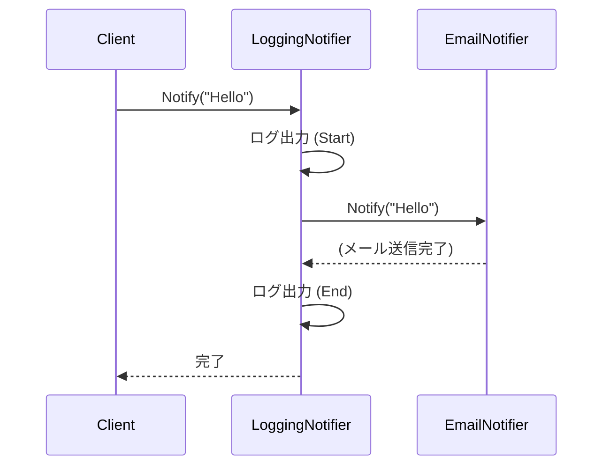

# 第06章：委譲（Delegation）：自分でやらずに頼る💁‍♀️📦

## 今日のゴール🎯✨

* 「委譲＝自分でやらずに“部品にお願いする”」を体で覚える🧩
* “薄いクラス”を作って、変更を1か所に寄せる感覚をつかむ🎯
* 既存クラスを**包んで（Wrapper）**ログだけ足すミニ実装ができる📝📦

---

## 1) 委譲ってなに？🧠💡（ざっくりでOK）


委譲はめちゃ一言でいうと……

**「この仕事、あなた（部品）お願い！」って別オブジェクトに任せること**です😊🔁

* 自分のクラスが全部やる → 太って壊れやすい😵‍💫
* **委譲**する → 自分は“司令塔”、部品が“実作業”🧠🛠️

### よくある委譲の例🌸

* ログ出力は Logger に任せる📝
* リトライは Retry 部品に任せる🔁
* 送信は Notifier（通知部品）に任せる📩
* 計算は Calculator に任せる🧮

---

## 2) 「継承」じゃだめなの？😳➡️🙂


継承で機能追加しようとすると、だいたいこうなることが多いです👇

* そもそも override できない（virtual じゃない等）😇
* 例外的な派生が増えてツリーが地獄🌲👻
* “親”の変更が“子”に波及して事故りやすい💥

そこで、**「包んで委譲」**が効いてきます📦✨
これ、次の章以降（Decoratorとか）にもつながる“基本の型”です🍰🧁

---

## 3) ここ注意⚠️：「デリゲート(delegate)」と「委譲(delegation)」は別モノだよ💦

C#の `delegate`（イベントとかのアレ）と、設計の「委譲」は名前が似てて混乱しがち🥺
この章で扱うのは **設計の委譲（オブジェクトに仕事を任せる）** のほうだよ〜🙆‍♀️✨

---

## 4) ハンズオン🧪：既存クラスを包んで「ログだけ足す」📦📝（超ミニ版）

### お題：通知（Notify）にログを足したい！

* 元の通知部品はそのまま使いたい（壊したくない）😇
* でも「開始ログ」「終了ログ」だけ追加したい📝✨
* 継承じゃなくて、**包んで委譲**でやる📦➡️📦

---

### Step A：まずは“通知部品”を用意📩

```csharp
public interface INotifier
{
    void Notify(string message);
}

public sealed class EmailNotifier : INotifier
{
    public void Notify(string message)
    {
        // 本物はメール送信…のつもり（今回は雰囲気でOK）
        Console.WriteLine($"📧 Email: {message}");
    }
}
```

---

### Step B：ログ付きにしたい…でも EmailNotifier は触りたくない😵‍💫


そこで「包むクラス」を作ります📦✨
ポイントはこれ👇

* **中に本物（INotifier）を持つ**
* **自分は前後処理だけして**
* **本体の仕事は inner に丸投げ（委譲）**💁‍♀️

```csharp
public sealed class LoggingNotifier : INotifier
{
    private readonly INotifier _inner;

    public LoggingNotifier(INotifier inner)
    {
        _inner = inner;
    }

    public void Notify(string message)
    {
        Console.WriteLine("📝 Notify start");
        _inner.Notify(message);               // ← ここが委譲（Delegation）✨
        Console.WriteLine("✅ Notify end");
    }
}
```

---

### Step C：組み立てて使う（合成）🧩


```csharp
var notifier = new LoggingNotifier(new EmailNotifier());
notifier.Notify("お支払い完了しました！");
```


```

✅ 出力イメージ：

* 📝 Notify start
* 📧 Email: お支払い完了しました！
* ✅ Notify end

---

## 5) この形が嬉しい理由🍬✨（超重要）

### ✅ 変更点が“1か所”に寄る🎯

ログの形式を変える？→ `LoggingNotifier` だけ見ればOK📝
メール送信の実装を変える？→ `EmailNotifier` だけ見ればOK📧

### ✅ 元の部品を壊さない🛡️

既存クラスに手を入れずに機能追加できるの、めっちゃ強い💪✨

### ✅ 後で差し替えしやすい🔁

`EmailNotifier` を `SlackNotifier` に変えても、ログ付きはそのまま使える🙆‍♀️

---

## 6) よくある落とし穴🐣💥（初心者がハマりやすい）

### ⚠️ 落とし穴1：ラッパーが“何でも屋”になる


ログだけのつもりが、例外処理・変換・保存…って増えると太る😵‍💫
👉 **目的は1つ**（ログならログだけ）に寄せよう🎯

### ⚠️ 落とし穴2：委譲先がバラバラで追えない

「new があちこち」だと構造が見えなくなる🙃
👉 次章の **Composition Root（組み立て場所）** で解決するよ🌳🧩

### ⚠️ 落とし穴3：インターフェース無しで始めてしまう

ラッパー作るのに型が揃わずグダる😭
👉 まず `INotifier` みたいな**契約（interface）**を作るのが安定🔌

---

## 7) AI活用🤖💬（Copilot/Codexにこう頼むと強い！）

そのままコピペで使える系いくね🫶✨

### 🔍 委譲ポイント発見

* 「このクラス、責務が多すぎる箇所を3つ指摘して。委譲で分けるなら分割案も出して」

### 🔧 委譲版にリライト

* 「このメソッドの前後にログを入れたい。継承を使わず、Wrapperで委譲する形に書き換えて」

### 🧪 テスト案も出させる

* 「LoggingNotifier のテスト観点を列挙して。Fake の inner を使う前提で」

---

## 8) ミニ練習問題🧩📝（5〜8分）

### 問題1✅


`LoggingNotifier` に「処理時間（ミリ秒）」も出す機能を追加してみて⌛✨
ヒント：開始時刻を取って、最後に差分出すだけ🙂

### 問題2✅

`EmailNotifier` の代わりに `ConsoleNotifier` を作って差し替えてみて🔁
「ログ付き」がそのまま使えるのを体感しよう💖

---

## 9) まとめ🌈✨

* 委譲は **「自分でやらずに部品に任せる」** こと💁‍♀️
* **Wrapper（包む）＋委譲**で「ログだけ追加」みたいな改造が安全にできる📦📝
* 変更が来ても、直す場所がスッと決まる🎯
* 次章は「どこで new するの？」問題をスッキリさせる **Composition Root** へ進むよ🌳🧩

---

### ちょい最新メモ🆕（さらっと）

今のC#は **C# 14** が最新で、.NET 10対応だよ〜✨（Visual Studio 2026 でも試せる）([Microsoft Learn][1])
Visual Studio 2026 は 2026/1/13 にアップデート（18.2.0）が出てるよ🆙([Microsoft Learn][2])

---

次は第7章（Composition Root）に進めるように、今の `new LoggingNotifier(new EmailNotifier())` を「組み立て場所」に寄せる形へ育てていこうね🌳✨

[1]: https://learn.microsoft.com/en-us/dotnet/csharp/whats-new/csharp-14?utm_source=chatgpt.com "What's new in C# 14"
[2]: https://learn.microsoft.com/en-us/visualstudio/releases/2026/release-notes?utm_source=chatgpt.com "Visual Studio 2026 Release Notes"
