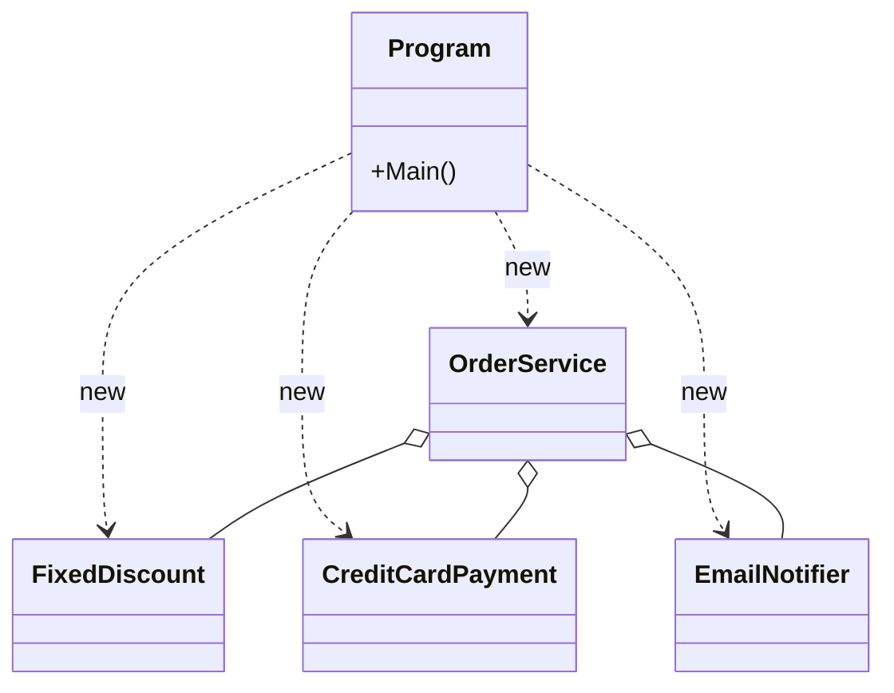

# 第07章：合成の“組み立て場所”：Composition Root🌳🧩

（テーマ：**「どこで new するの問題」**をスッキリ解決✨）

---

## 1) まず悩みあるある😵‍💫「new が散らばってカオス…」


こういうコード、よく見ます👇

* クラスの中で `new` しまくり
* 依存が増えるほど、修正があちこちに飛び火💥
* テストで差し替えたいのに差し替えられない🥲

ここで登場するのが **Composition Root** だよ〜！🌱

---

## 2) Composition Root ってなに？🧠✨


一言でいうと👇

**「アプリの入口付近に、部品の組み立て（依存関係の配線）をまとめる場所」**だよ🌳🧩
Mark Seemann も「Composition Root は入口（entry point）の近く」って整理してるよ。 ([Ploeh Blog][1])

そして大事ポイント👇

* **組み立てはここでやる**（`new` はなるべくここ）
* **それ以外のクラスは “部品を受け取って使うだけ”**（= 合成が効く✨）



---

## 3) なにが嬉しいの？🍬✨（超重要）

Composition Root を作ると、こうなる👇

* 変更が来ても **差し替えが1か所**で済む🔁
* 依存関係が見える化されて **設計が読みやすい**👀
* テスト時に **Fake に差し替えやすい**✅
* DIコンテナを使う場合も **漏らさない設計**にできる（コンテナは Composition Root の中だけ！） ([InfoQ][2])

---

## 4) ハンズオン🧪：通知＋割引＋支払い を“合成”で組み立てる🎁

ここでは「注文を確定したら、支払いして、割引して、通知する」みたいなミニ題材でいくよ🛒📩

---

## 4-1) まず “散らばり new” の悪い例😇（つらくなるやつ）


```
csharp
public class OrderService
{
    public void PlaceOrder(decimal price)
    {
        var discount = new FixedDiscount(500);       // ← new がここ
        var payment  = new CreditCardPayment();      // ← new がここ
        var notifier = new EmailNotifier();          // ← new がここ

        var discounted = discount.Apply(price);
        payment.Pay(discounted);
        notifier.Notify($"注文OK！金額={discounted}");
    }
}
```

この形だと「SMS通知にしたい」「割引ルール追加したい」ってなった瞬間、**OrderService を毎回いじる**ことになる😱

---

## 4-2) 合成できる形に整える🧩（受け取って使うだけにする）


まずは “契約（interface）” を用意するよ🔌🙂

```
csharp
public interface IDiscountPolicy
{
    decimal Apply(decimal originalPrice);
}

public interface IPayment
{
    void Pay(decimal amount);
}

public interface INotifier
{
    void Notify(string message);
}
```

実装はふつうに作る👇

```
csharp
public sealed class FixedDiscount : IDiscountPolicy
{
    private readonly decimal _amount;
    public FixedDiscount(decimal amount) => _amount = amount;

    public decimal Apply(decimal originalPrice)
        => Math.Max(0, originalPrice - _amount);
}

public sealed class CreditCardPayment : IPayment
{
    public void Pay(decimal amount)
    {
        Console.WriteLine($"[PAY] クレカ決済: {amount}円");
    }
}

public sealed class EmailNotifier : INotifier
{
    public void Notify(string message)
    {
        Console.WriteLine($"[MAIL] {message}");
    }
}
```

そして主役（ユースケース側）は **コンストラクタで受け取る**💝
（ここが「合成」！✨）


```
csharp
public sealed class OrderService
{
    private readonly IDiscountPolicy _discount;
    private readonly IPayment _payment;
    private readonly INotifier _notifier;

    public OrderService(


        IDiscountPolicy discount,
        IPayment payment,
        INotifier notifier)
    {
        _discount = discount;
        _payment = payment;
        _notifier = notifier;
    }

    public void PlaceOrder(decimal price)
    {
        var discounted = _discount.Apply(price);
        _payment.Pay(discounted);
        _notifier.Notify($"注文OK！金額={discounted}");
    }
}
```

ここまで来たら、OrderService は超素直🙂✨
**「何を使うか」は知らない**（＝差し替え可能💪）

---

## 5) いよいよ Composition Root🌳🧩（組み立ては入口で！）


では「どこで new するの？」の答え👇
👉 **Program.cs（アプリの入口）**でやる！🚀

```
csharp
public static class Program
{
    public static void Main()
    {
        // 🌳 Composition Root：依存関係の“組み立て場所”
        IDiscountPolicy discount = new FixedDiscount(500);
        IPayment payment = new CreditCardPayment();
        INotifier notifier = new EmailNotifier();

        var orderService = new OrderService(discount, payment, notifier);

        // 実行
        orderService.PlaceOrder(3000m);
    }
}
```

これが **“手動DI（Poor Man’s DI）”** って呼ばれたりするやつだよ🙂
InfoQでも「コンテナでも手動でもOK、ただし Composition Root を守るのが大事」みたいに整理されてるよ。 ([InfoQ][2])

---

## 5-1) 変更に強いのを一発で体験しよ🔁✨（差し替え）


例えば「通知を SMS に変えたい！」📱ってなったら…

```
csharp
public sealed class SmsNotifier : INotifier
{
    public void Notify(string message)
    {
        Console.WriteLine($"[SMS] {message}");
    }
}
```

変えるのは **Composition Root だけ**👇（超気持ちいいやつ😆）

```
csharp
INotifier notifier = new SmsNotifier(); // ← ここだけ差し替え
```

OrderService は一切いじらない！🎉

---

## 6) Composition Root の設計ルール（初心者でも外さないやつ）🧭✨

## ✅ ルール1：new は基本ここ（入口）に寄せる🌳

* 例：Consoleなら `Program.Main`
* ASP.NET Core なら `Program.cs` が入口になりやすいよ（DIの説明もMS公式にあるよ） ([Microsoft Learn][3])

## ✅ ルール2：コンテナを漏らさない🫧❌

もし DI コンテナを使っても、**IServiceProvider とかをアプリの奥に持ち込まない**のがキレイ✨
（コンテナは Composition Root の中に封じるのが王道） ([InfoQ][2])

## ✅ ルール3：依存の順番は「葉っぱ→幹→根っこ」🌿➡️🌳


* “末端の部品” を先に作って
* “それを使う部品” を後から作る
  これで組み立て順が迷いにくいよ🙂

---

## 7) よくある事故💥（ここだけ注意！）

* ❌ クラスの中で `new` が復活してくる（いつの間にか戻る😇）
* ❌ 「便利だから」と `IServiceProvider` を奥へ持ち込む（Service Locator化）
* ❌ 何でもかんでもインターフェース化して疲れる（変わりやすい所からでOK👌）

---

## 8) AI活用🤖💬（Copilot / Codex に投げると強いプロンプト）

そのままコピペで使えるよ✨

* 🤖「このコードの依存関係グラフ（誰が誰を使ってるか）を箇条書きで出して」
* 🤖「new が散らばってる箇所を列挙して、Composition Root に寄せる手順を提案して」
* 🤖「差し替え候補（interface化すべき所）を“変更が入りやすい順”にランキングして」
* 🤖「Composition Root を Program.cs に作るとして、組み立て順を提案して」
* 🤖「Service Locator っぽい匂いがあるかレビューして」

---

## 9) まとめ🧁✨

* Composition Root は **部品を組み立てる“唯一の場所”**🌳🧩 ([Ploeh Blog][4])
* `new` を入口に寄せると、差し替えもテストも一気にラクになる🎉
* DIコンテナを使う場合も「漏らさない」が王道✨ ([InfoQ][2])

次の章（第8章）は、この流れを **コンストラクタ注入（DI）として普段使い**にしていくよ🎁🔌😊

---

## （おまけ：2026年の“今”の前提としての最新情報メモ🗓️）

* **.NET 10 は 2025/11/11 にリリースされた LTS**で、サポートは **2028/11/14**までだよ。 ([Microsoft Learn][5])
* **C# 14 の “What’s new” は 2025/11/19 更新**になってるよ。 ([Microsoft Learn][6])

[1]: https://blog.ploeh.dk/2019/06/17/composition-root-location/?utm_source=chatgpt.com "Composition Root location by Mark Seemann - ploeh blog"
[2]: https://www.infoq.com/articles/DI-Mark-Seemann/?utm_source=chatgpt.com "Dependency Injection with Mark Seemann"
[3]: https://learn.microsoft.com/en-us/aspnet/core/fundamentals/dependency-injection?view=aspnetcore-10.0&utm_source=chatgpt.com "Dependency injection in ASP.NET Core"
[4]: https://blog.ploeh.dk/2011/07/28/CompositionRoot/?utm_source=chatgpt.com "Composition Root - ploeh blog"
[5]: https://learn.microsoft.com/ja-jp/lifecycle/products/microsoft-net-and-net-core?utm_source=chatgpt.com "Microsoft .NET および .NET Core - Microsoft Lifecycle"
[6]: https://learn.microsoft.com/en-us/dotnet/csharp/whats-new/csharp-14?utm_source=chatgpt.com "What's new in C# 14"
