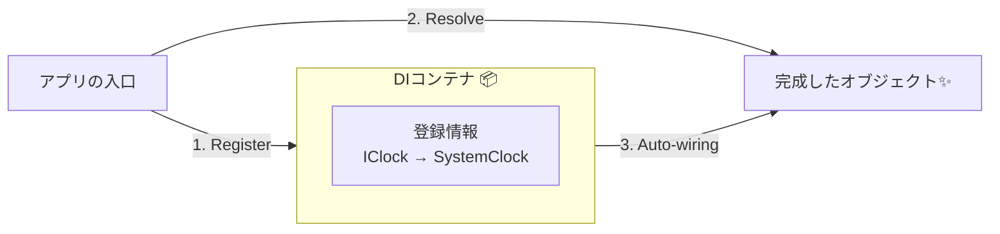

# 第09章：（軽め）DIコンテナは“便利な自動組み立て機”🤖🧰

（目安：25〜35分くらい⏱️）

---

## 0. 今日のゴール🎯😊

* 「DIコンテナ＝自動で部品を組み立ててくれる箱📦」って感覚をつかむ
* **登録（Register）→ 解決（Resolve）** の超ミニ操作だけできるようになる✨
* “魔法🪄”にしないための注意点も、最低限だけ覚える⚠️

.NET のDIはフレームワークに組み込まれていて、設定・ログ・Optionsなどと一緒に使われる前提の仕組みだよ〜という立ち位置です😊 ([Microsoft Learn][1])

---

## 1. まずイメージ！DIコンテナって何？🧠🧩


第8章では「newしないで、外から渡す（コンストラクタ注入）🎁」をやったよね。

でも現実のアプリは、部品が増えるほどこうなる👇😵‍💫

* newがあちこちに散らばる
* 組み立て順がややこしい
* 「このクラス、何が必要なの？」が追いづらい

そこで登場するのが **DIコンテナ**！🤖✨
やってくれることは超シンプルで、

* ✅「このインターフェースは、この実装で作ってね」って**登録**しておく
* ✅「これちょうだい」って言われたら、依存も含めて**自動でnew**して渡す
* ✅ 必要なら破棄（Dispose）も面倒みる

.NETでは、サービスは「IServiceCollection」に登録して、最終的に「IServiceProvider（コンテナ）」として動きます😊 ([Microsoft Learn][1])



---

## 2. “2つだけ”覚えればOK✌️😺


### 2-1. 登録（Register）📝

「サービス（使われる側）」をコンテナに追加すること。

よく見るやつ👇

* AddTransient（毎回new）
* AddScoped（スコープごと）
* AddSingleton（ずっと同じ1個）

この3つの意味は公式の定義もこの通りだよ✅ ([Microsoft Learn][2])

### 2-2. 解決（Resolve）🎁

「必要なものをください！」って取り出すこと。
アプリの入口（Programとか）で、**最初の1個**だけ取り出して動かすのがイメージしやすいよ😊

---

## 3. ハンズオン🧪：最小DIコンテナ（コンソール）で体験しよ！🎮✨

「登録して、勝手に組み立ててもらう」を体感する回です🧩

### 3-1. プロジェクト作成（Visual Studio）🪟✨

* 「コンソールアプリ」を作成
* TargetFramework は net10.0 でOK（Microsoft LearnのDIチュートリアル例も net10.0 で説明されてるよ） ([Microsoft Learn][3])

※ .NET 10 は 2025-11-11 にリリース、2026-01-13 時点の最新パッチは 10.0.2 になってます📌 ([Microsoft][4])

---

## 4. コードを書こう✍️😊（“自動組み立て”を体験）


### 4-1. 部品（サービス）を用意する🧩

```csharp
using System;

public interface IClock
{
    DateTimeOffset Now { get; }
}

public sealed class SystemClock : IClock
{
    public DateTimeOffset Now => DateTimeOffset.Now;
}

public interface IGreeter
{
    void Greet();
}

public sealed class Greeter(IClock clock) : IGreeter
{
    public void Greet()
        => Console.WriteLine($"やっほー！今は {clock.Now} だよ〜⏰✨");
}
```

### 4-2. コンテナに登録して、動かす🚀

Microsoft Learn のチュートリアルでも「Host.CreateApplicationBuilder」「builder.Services.AddTransient/AddScoped/AddSingleton」みたいに書いていきます😊 ([Microsoft Learn][3])

```csharp
using Microsoft.Extensions.DependencyInjection;
using Microsoft.Extensions.Hosting;

// ① “組み立て係”を用意
var builder = Host.CreateApplicationBuilder(args);

// ② 登録（Register）
builder.Services.AddSingleton<IClock, SystemClock>(); // 時計は1個で十分⏰
builder.Services.AddTransient<IGreeter, Greeter>();   // 挨拶係はその都度作ってOK😊

// ③ コンテナを完成させる
using var host = builder.Build();

// ④ 入口で1回だけ取り出してスタート（Resolve）
using var scope = host.Services.CreateScope();
var greeter = scope.ServiceProvider.GetRequiredService<IGreeter>();
greeter.Greet();
```

はい、これで「GreeterがIClock必要？じゃあSystemClock作って渡すね！」をコンテナが自動でやってくれます🤖🧩✨

---

## 5. 3つの寿命（Lifetime）ざっくり覚えよ😊🧠


**結論：迷ったら “だいたい Transient” からでOK**（最初はね！）

* Transient：呼ばれるたびに新しく作る🆕
* Scoped：スコープごと（Webだと「1リクエスト＝1スコープ」が基本）🌐

  * ASP.NET Coreの説明でも「AddScoped＝1リクエストの寿命」って書かれてるよ📌 ([Microsoft Learn][5])
* Singleton：アプリ中ずっと同じ1個♾️

  * ただし雑にSingletonにすると、テストや状態管理が難しくなるので注意ってガイドにあります⚠️ ([Microsoft Learn][6])

---

## 6. “やりすぎ注意”ポイントだけ先に知っとこ⚠️🪄❌


DIコンテナは便利なんだけど、**魔法にすると事故る**😂

Microsoftのガイドラインで特に大事なやつを、初心者向けに翻訳するとこんな感じ👇

* ❌ サービスロケータ（GetServiceで取り出しまくる）を避けてね
* ❌ 登録中に BuildServiceProvider して無理やり解決しないでね
* ❌ コンテナに「データ置き場」みたいに色々入れないでね
  …って注意されています📌 ([Microsoft Learn][6])

### じゃあ GetRequiredService はダメなの？😳


**アプリの入口（Program / Composition Root）で “最初の1個” を起動するために使うのはOK**、って理解で大丈夫🙆‍♀️✨
（中のクラスがそれをやり始めると、依存が見えなくなって辛い…ってやつ！）

---

## 7. ありがちな“良くないDIコンテナ化”あるある😇💥


* 「何でもかんでも登録」して、どこで何が使われてるか不明👻
* DIのためだけのクラスが増えすぎる📈
* 依存グラフが深くなって、起動時にドーンと壊れる💣
* interfaceが“差し替え予定もないのに”増殖する🔌😵‍💫

この章は軽めなので、**合図だけ**覚えよう👇
✅「差し替える可能性が高い」「外部I/O」「重い生成」「テストでFakeにしたい」
このへんだけ登録対象にすると、気持ちよく回ることが多いよ😊✨

---

## 8. AI活用🤖💬（コピペ用プロンプト）


* 「このProgram.csのDI登録、やりすぎポイントある？1〜3個で指摘して✅」
* 「このクラスの依存（コンストラクタ引数）を見て、責務が混ざってないかチェックして🔍」
* 「Transient/Scoped/Singleton、どれが自然か理由付きで提案して🧠」

---

## 9. ミニ課題（5分）🎒✨

1. IGreeter を2種類作ってみよ（FriendlyGreeter / FormalGreeter）😊🎩
2. 登録を差し替えて、出力が変わるのを確認🔁
3. 「これが合成の気持ちよさか〜！」ってなったら勝ち🏆✨

---

## まとめ🌈

* DIコンテナは **登録→解決** の自動組み立て機🤖🧩
* ライフタイムは **Transient/Scoped/Singleton** の3つだけまず覚える😊 ([Microsoft Learn][2])
* 便利だけど、**魔法化🪄❌**（取り出しまくり・登録しすぎ）に注意⚠️ ([Microsoft Learn][6])

次の第10章（Strategy）で「ロジック差し替え🎭🔁」をやると、DIコンテナが一気に“実戦の武器”になります💪✨

[1]: https://learn.microsoft.com/en-us/dotnet/core/extensions/dependency-injection "Dependency injection - .NET | Microsoft Learn"
[2]: https://learn.microsoft.com/en-us/dotnet/api/microsoft.extensions.dependencyinjection.servicelifetime?view=net-10.0-pp "ServiceLifetime Enum (Microsoft.Extensions.DependencyInjection) | Microsoft Learn"
[3]: https://learn.microsoft.com/ja-jp/dotnet/core/extensions/dependency-injection-usage "依存関係の挿入を使用する - .NET | Microsoft Learn"
[4]: https://dotnet.microsoft.com/en-us/platform/support/policy/dotnet-core ".NET and .NET Core official support policy | .NET"
[5]: https://learn.microsoft.com/en-us/aspnet/core/fundamentals/dependency-injection?view=aspnetcore-10.0 "Dependency injection in ASP.NET Core | Microsoft Learn"
[6]: https://learn.microsoft.com/en-us/dotnet/core/extensions/dependency-injection-guidelines "Dependency injection guidelines - .NET | Microsoft Learn"
