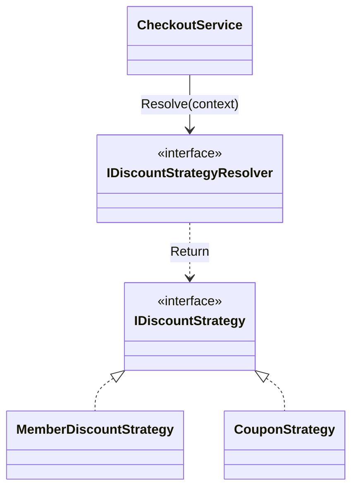

# 第10章：Strategy：ふるまいを部品化して差し替え🎭🔁

※2026/1/15時点だと、.NET 10（LTS）は 2025/11/11 リリースで、最新パッチは 10.0.2（2026/1/13）です。([Microsoft][1])
また C# 14 は 2025/11 にリリース済みです。([Microsoft Learn][2])（C# 14 の新機能一覧も Microsoft Learn にあります）([Microsoft Learn][3])
C# 14 をVSで使うなら、だいたい VS 2022 17.13 以降が目安です。([Microsoft Learn][4])

---

## 0. この章のゴール🎯✨

この章が終わると、こんなことができるようになります😊

* 「巨大な if/switch 地獄😵‍💫」を、**差し替え可能な部品🧩**に分解できる
* 新しいルール（割引・手数料・通知など）が増えても、**既存コードを壊しにくい🛡️**形にできる
* 「継承で増やす」じゃなくて、**合成（Composition）で増やす**感覚がつく🎉

---

## 1. Strategyって何？ひとことで言うと🧠🎭


**「やり方（アルゴリズム）を部品にして、入れ替えできるようにする」**パターンだよ〜🔁✨

* ✅ “やり方”を **インターフェース**で表す
* ✅ “使う側”は **インターフェースだけ知ってればOK**
* ✅ “どのやり方を使うか”は **外から差し替え**（合成！）

---

## 2. まずは「つらいコード」を体験😱（Before）

題材：**割引ルール**（例：会員・クーポン・まとめ買い…）🛒💸
こういうの、最初はこう書きがち👇

```csharp
public enum DiscountType
{
    None,
    Member,
    Coupon,
    Bulk
}

public sealed class CheckoutService
{
    public decimal CalcTotal(decimal subtotal, DiscountType type, string? couponCode, int itemCount)
    {
        decimal discount = 0m;

        if (type == DiscountType.Member)
        {
            discount = subtotal * 0.05m;
        }
        else if (type == DiscountType.Coupon)
        {
            discount = couponCode == "WELCOME10" ? 10m : 0m;
        }
        else if (type == DiscountType.Bulk)
        {
            discount = itemCount >= 10 ? subtotal * 0.08m : 0m;
        }

        return Math.Max(0m, subtotal - discount);
    }
}
```

### これ、何がつらいの？🥲

* ルール追加のたびに **CheckoutService を編集**することになる✍️💥
* if/switch が増えるほど、**テストも修正も怖い**😨
* 「割引の種類」が増えると、**影響範囲が爆発**💣

ここで Strategy の出番！🎭✨

---

## 3. Strategy化の基本形🧩🔌（構造をイメージ）

登場人物はこれだけ👇

* **Strategy（戦略）**：やり方の部品（例：割引計算のやり方）
* **Context（利用側）**：部品を使う側（例：精算サービス）
* **差し替え（合成）**：Context は Strategy を “持つ”（has-a）

---

## 4. ハンズオン🧪：割引を Strategy 化しよう！🛒✨

### 4-1. まず「契約」を作る📜（インターフェース）

ポイントは **“やり方”を表すメソッド**だけを置くこと🙂

```csharp
public interface IDiscountStrategy
{
    decimal CalcDiscount(decimal subtotal, DiscountContext context);
}

public sealed record DiscountContext(
    bool IsMember,
    string? CouponCode,
    int ItemCount
);
```

* `DiscountContext` は「割引判断に必要な情報のまとめ」📦✨
* record が苦手なら class でもOKだよ🙂（ここは好み！）

---

### 4-2. “やり方”を部品として実装する🧩🎭

#### ① 割引なし😊

```csharp
public sealed class NoDiscountStrategy : IDiscountStrategy
{
    public decimal CalcDiscount(decimal subtotal, DiscountContext context) => 0m;
}
```

#### ② 会員割引👑

```csharp
public sealed class MemberDiscountStrategy : IDiscountStrategy
{
    public decimal CalcDiscount(decimal subtotal, DiscountContext context)
        => context.IsMember ? subtotal * 0.05m : 0m;
}
```

#### ③ クーポン割引🎫

```csharp
public sealed class CouponDiscountStrategy : IDiscountStrategy
{
    public decimal CalcDiscount(decimal subtotal, DiscountContext context)
        => context.CouponCode == "WELCOME10" ? 10m : 0m;
}
```

#### ④ まとめ買い割引📦📦📦

```csharp
public sealed class BulkDiscountStrategy : IDiscountStrategy
{
    public decimal CalcDiscount(decimal subtotal, DiscountContext context)
        => context.ItemCount >= 10 ? subtotal * 0.08m : 0m;
}
```

---

### 4-3. 使う側（Context）を “差し替え可能” にする🔁✨

ここが Strategy の気持ちいいところ😍
CheckoutService は **割引の中身を知らない**！

```csharp
public sealed class CheckoutService
{
    private readonly IDiscountStrategy _discountStrategy;

    public CheckoutService(IDiscountStrategy discountStrategy)
    {
        _discountStrategy = discountStrategy;
    }

    public decimal CalcTotal(decimal subtotal, DiscountContext context)
    {
        var discount = _discountStrategy.CalcDiscount(subtotal, context);
        return Math.Max(0m, subtotal - discount);
    }
}
```

---

### 4-4. 組み立て（合成）して動かす🧩🚀（超シンプル版）

```csharp
var subtotal = 120m;
var context = new DiscountContext(
    IsMember: true,
    CouponCode: null,
    ItemCount: 3
);

// 差し替えポイント🎭
IDiscountStrategy strategy = new MemberDiscountStrategy();

var checkout = new CheckoutService(strategy);
var total = checkout.CalcTotal(subtotal, context);

Console.WriteLine($"Total = {total}");
```

✅ “差し替え”ってこういうこと！
`strategy` を変えるだけで挙動が変わるよ〜🔁✨

---

## 5. 「でも実際は、状況で自動選択したい😅」→ Resolver を足そう🔎🧠


現場あるある：
「会員なら会員割引、クーポンがあればクーポン割引…」みたいに、**状況で戦略を選びたい**よね🙂

そこで **Strategy を選ぶ専用クラス**を作るよ！✨
（CheckoutService を if 地獄に戻さないための工夫🛡️）

### 5-1. “選ぶ係”の契約📜

```csharp
public interface IDiscountStrategyResolver
{
    IDiscountStrategy Resolve(DiscountContext context);
}
```

### 5-2. まずは素朴に if で選ぶ（※ここに隔離する！）🧺

```csharp
public sealed class DiscountStrategyResolver : IDiscountStrategyResolver
{
    private readonly IDiscountStrategy _no;
    private readonly IDiscountStrategy _member;
    private readonly IDiscountStrategy _coupon;
    private readonly IDiscountStrategy _bulk;

    public DiscountStrategyResolver(
        NoDiscountStrategy no,
        MemberDiscountStrategy member,
        CouponDiscountStrategy coupon,
        BulkDiscountStrategy bulk)
    {
        _no = no;
        _member = member;
        _coupon = coupon;
        _bulk = bulk;
    }

    public IDiscountStrategy Resolve(DiscountContext context)
    {
        if (context.CouponCode is not null) return _coupon;
        if (context.ItemCount >= 10) return _bulk;
        if (context.IsMember) return _member;
        return _no;
    }
}
```

* if は **ゼロにしなくてOK**🙆‍♀️
* 大事なのは、**増殖しそうなifを “1か所に閉じ込める”**こと🧺✨

### 5-3. CheckoutService はスッキリのまま😍

```csharp
public sealed class CheckoutService
{
    private readonly IDiscountStrategyResolver _resolver;

    public CheckoutService(IDiscountStrategyResolver resolver)
    {
        _resolver = resolver;
    }

    public decimal CalcTotal(decimal subtotal, DiscountContext context)
    {
        var strategy = _resolver.Resolve(context);
        var discount = strategy.CalcDiscount(subtotal, context);
        return Math.Max(0m, subtotal - discount);
    }
}
```



---

## 6. DIコンテナと相性よすぎ問題🤝🤖（最小だけ）

「部品が増えてきたら、組み立てを自動化したい」ってなるよね🙂
ここでは **最小だけ**やるね（深入りしない！）🧰✨

```csharp
using Microsoft.Extensions.DependencyInjection;

var services = new ServiceCollection();

// Strategy 登録🎭
services.AddSingleton<NoDiscountStrategy>();
services.AddSingleton<MemberDiscountStrategy>();
services.AddSingleton<CouponDiscountStrategy>();
services.AddSingleton<BulkDiscountStrategy>();

// Resolver / Service 登録🧩
services.AddSingleton<IDiscountStrategyResolver, DiscountStrategyResolver>();
services.AddSingleton<CheckoutService>();

var sp = services.BuildServiceProvider();

var checkout = sp.GetRequiredService<CheckoutService>();
var total = checkout.CalcTotal(
    subtotal: 120m,
    context: new DiscountContext(IsMember: true, CouponCode: null, ItemCount: 3)
);

Console.WriteLine(total);
```

---

## 7. よくある失敗あるある⚠️😵‍💫（先に潰す！）

### 失敗①：Strategy を「何でも屋」にする🧙‍♂️💥

* `CalcDiscount()` の中でDBアクセスしたり、ログ出したり、通知したり…
  → それ、責務モリモリで後で泣く😭

✅ コツ：Strategy は **“やり方（計算/判断）だけ”**に寄せる🧮✨
外部I/Oは別部品に逃がす（第15章でさらに嬉しくなるやつ！）✅

### 失敗②：Context がデカすぎる📦📦📦

* なんでも `DiscountContext` に入れちゃうと、設計がぼやける😶‍🌫️

✅ コツ：**「この戦略を選ぶのに必要な情報だけ」**に絞る✂️✨

### 失敗③：Resolver の if が増えてまた地獄😱

* ルールが100個になったら…Resolverが肥大化💣

✅ コツ：増えてきたら次の段階へ（例）

* 優先順位テーブル化📋
* “適用できるか” を Strategy 側に持たせる（`CanApply()`）
* `Dictionary` でキー検索（O(1)）📌

（このへんは第16章の「安全移行」と相性よいよ🙂）

---

## 8. AI活用コーナー🤖🫶（写経じゃなく“相棒”にする）

### 使いどころ①：Strategy候補の洗い出し🔍

例プロンプト💬

* 「割引仕様がこれ。Strategy に分ける候補を列挙して。責務も一言で」
* 「将来追加されそうなルールを3つ予想して、それに強い設計にしたい」

### 使いどころ②：命名相談📝✨

* 「`IDiscountStrategy` と `DiscountContext` の命名もっと良くして」
* 「このメソッド名、女子大生が読んでも分かるように変えて🥹」

### 使いどころ③：レビュー🕵️‍♀️✅

* 「CheckoutService が Strategy に依存できてる？変更に弱い点は？」
* 「責務が混ざってるクラスがあれば指摘して」

⚠️ 注意：AIの出力は“提案”なので、**最終判断は自分**でね🙂✨

---

## 9. ミニ課題（宿題でもOK）📮✨

### 課題A：新しい割引を1個追加🎁

例：

* 「誕生日割引🎂」
* 「初回購入割引🌱」
* 「曜日割引📅」

✅ 条件：**CheckoutService は修正しない**（できたら勝ち！🏆）

### 課題B：優先順位を変える🔁

「クーポンがあっても、まとめ買いの方を優先したい」みたいな変更を、
**Resolver の1か所だけ**で対応できるようにしてみてね🙂

---

## 10. まとめ🌈🎉（今日覚えたこと）

* Strategy は **“やり方”を部品化して差し替える**パターン🎭🔁
* 巨大 if/switch を **部品（クラス）に逃がす**と、追加に強くなる🛡️
* “選ぶ処理”が必要なら、Resolver に **隔離**して合成を守る🧺✨
* DI と相性よくて、部品が増えても運用しやすい🤝🤖

---

次の章（State）に行くと、「状態による if 地獄🚦😵‍💫」も同じノリで救えるようになるよ〜！✨

[1]: https://dotnet.microsoft.com/ja-jp/platform/support/policy/dotnet-core?utm_source=chatgpt.com ".NET および .NET Core の公式サポート ポリシー"
[2]: https://learn.microsoft.com/en-us/dotnet/csharp/whats-new/csharp-version-history?utm_source=chatgpt.com "The history of C# | Microsoft Learn"
[3]: https://learn.microsoft.com/en-us/dotnet/csharp/whats-new/csharp-14?utm_source=chatgpt.com "What's new in C# 14"
[4]: https://learn.microsoft.com/en-us/dotnet/csharp/whats-new/breaking-changes/compiler%20breaking%20changes%20-%20dotnet%2010?utm_source=chatgpt.com "C# compiler breaking changes since C# 13"
