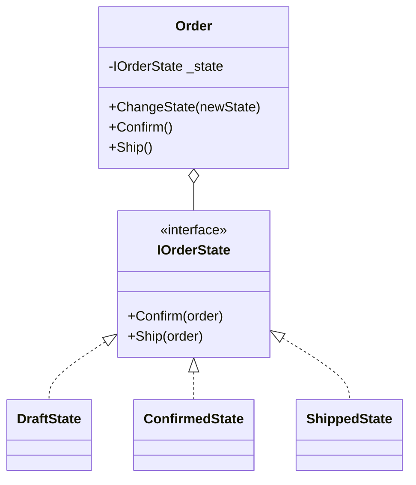

# 第11章：State（状態）と合成：if地獄を減らす🚦🙂

この章は「**状態が増えるほど、if/switch が増えてツラくなる問題**」を、**合成（Composition）でスッキリ解決**する入口だよ〜🧩💡
State パターンは「**オブジェクトの状態によって振る舞いが変わる**」のを、**クラス分割で扱いやすくする**考え方だよ（まるで“クラスが変わった”みたいに見える、って説明されることが多い✨） ([リファクタリング・グル ][1])

---

## 今日のゴール🎯✨

* ✅ if/switch が増える理由を、体験でわかる
* ✅ 「状態」「イベント」「遷移（せんい）」を、表で整理できる🗺️
* ✅ State（状態オブジェクト）に分けて、**合成で差し替える**形にできる🧩
* ✅ **禁止遷移（ありえない操作）**をコードで守れる🛑
* ✅ テストがラクになる感覚もつかむ✅⚡

---

## 題材：注文（Order）の状態📦🛒

よくあるやつ！注文って状態が増えがちだよね〜🙂

* 下書き（Draft）📝
* 確定（Confirmed）✅
* 発送（Shipped）🚚
* 配達完了（Delivered）📬
* キャンセル（Cancelled）❌

---

## まずは “if/switch 地獄” の例😇🔥（わざとツラくする）

「enum + switch」で始めると、最初はラク。…でも状態が増えると急にキツい😵‍💫

```csharp
public enum OrderStatus
{
    Draft,
    Confirmed,
    Shipped,
    Delivered,
    Cancelled
}

public sealed class Order
{
    public OrderStatus Status { get; private set; } = OrderStatus.Draft;

    public void Confirm()
    {
        switch (Status)
        {
            case OrderStatus.Draft:
                Status = OrderStatus.Confirmed;
                return;
            default:
                throw new InvalidOperationException($"Confirmできない状態: {Status}");
        }
    }

    public void Ship()
    {
        switch (Status)
        {
            case OrderStatus.Confirmed:
                Status = OrderStatus.Shipped;
                return;
            default:
                throw new InvalidOperationException($"Shipできない状態: {Status}");
        }
    }

    public void Deliver()
    {
        switch (Status)
        {
            case OrderStatus.Shipped:
                Status = OrderStatus.Delivered;
                return;
            default:
                throw new InvalidOperationException($"Deliverできない状態: {Status}");
        }
    }

    public void Cancel()
    {
        switch (Status)
        {
            case OrderStatus.Draft:
            case OrderStatus.Confirmed:
                Status = OrderStatus.Cancelled;
                return;
            default:
                throw new InvalidOperationException($"Cancelできない状態: {Status}");
        }
    }
}
```

### ここがツラくなるポイント😵‍💫💥

* 😭 **操作ごとに switch が散らばる**（Confirm/Ship/Cancel…全部）
* 😭 新しい状態を追加すると、**あちこちの switch を修正**
* 😭 ルール（禁止遷移）が増えるほど、例外・分岐が増殖🌱➡️🌳
* 😭 状態別の処理（通知、課金、在庫…）が混ざってくる🧨

---

## 状態遷移を “表” で整理🗺️✨（ここ超大事！）


まず設計をラクにするコツはこれ👇
**「状態（State）」「イベント（操作）」「次の状態」**を表にしちゃう😊

| 今の状態         | Confirm ✅ | Ship 🚚 | Deliver 📬 | Cancel ❌  |
| ------------ | --------- | ------- | ---------- | --------- |
| Draft 📝     | Confirmed | ✖       | ✖          | Cancelled |
| Confirmed ✅  | ✖         | Shipped | ✖          | Cancelled |
| Shipped 🚚   | ✖         | ✖       | Delivered  | ✖         |
| Delivered 📬 | ✖         | ✖       | ✖          | ✖         |
| Cancelled ❌  | ✖         | ✖       | ✖          | ✖         |

✖ は「禁止遷移」🛑（ここをコードで守りたい！）

> 🤖AI活用：この表、AIに作らせると速いよ！
> 例：「注文の状態を Draft/Confirmed/Shipped/Delivered/Cancelled として、Confirm/Ship/Deliver/Cancel の遷移表を作って。禁止遷移も明記して」

---

## 解決方針：状態を “クラス” にする🚦➡️🧩


State パターンの超ざっくりイメージ👇

* Order は「いまの状態オブジェクト」を **持つ（合成）** 🧩
* Order の操作は「状態オブジェクトに委譲」💁‍♀️
* 状態ごとに「できる/できない」「次の状態」を閉じ込める📦

---

## 実装してみよう🛠️✨（Stateオブジェクト版）

### 1) 状態インターフェースを作る🔌🙂

```csharp
public interface IOrderState
{
    string Name { get; }
    void Confirm(Order order);
    void Ship(Order order);
    void Deliver(Order order);
    void Cancel(Order order);
}
```

### 2) Order（本体）は “委譲するだけ” に寄せる🧩✨

```csharp
public sealed class Order
{
    private IOrderState _state;

    public Order()
    {
        _state = new DraftState();
    }

    public string StatusName => _state.Name;

    // 状態変更はここだけに集約🎯
    internal void ChangeState(IOrderState newState)
        => _state = newState;

    public void Confirm() => _state.Confirm(this);
    public void Ship() => _state.Ship(this);
    public void Deliver() => _state.Deliver(this);
    public void Cancel() => _state.Cancel(this);
}
```



ポイント🎯

* Order は「状態を持つ」だけ（合成）🧩
* 「どう振る舞うか」は状態クラス側へ🚦✨
* `ChangeState` を `internal` にして、勝手に外から変えにくくする🛡️

---

## 3) 状態クラスを作る🚦✨（禁止遷移もここ！）

### Draft 📝

```csharp
public sealed class DraftState : IOrderState
{
    public string Name => "Draft";

    public void Confirm(Order order) => order.ChangeState(new ConfirmedState());

    public void Cancel(Order order) => order.ChangeState(new CancelledState());

    public void Ship(Order order) => throw new InvalidOperationException("Draftでは発送できません🛑");
    public void Deliver(Order order) => throw new InvalidOperationException("Draftでは配達完了にできません🛑");
}
```

### Confirmed ✅

```csharp
public sealed class ConfirmedState : IOrderState
{
    public string Name => "Confirmed";

    public void Ship(Order order) => order.ChangeState(new ShippedState());

    public void Cancel(Order order) => order.ChangeState(new CancelledState());

    public void Confirm(Order order) => throw new InvalidOperationException("すでに確定済みです🛑");
    public void Deliver(Order order) => throw new InvalidOperationException("Confirmedでは配達完了にできません🛑");
}
```

### Shipped 🚚

```csharp
public sealed class ShippedState : IOrderState
{
    public string Name => "Shipped";

    public void Deliver(Order order) => order.ChangeState(new DeliveredState());

    public void Confirm(Order order) => throw new InvalidOperationException("発送後に確定はできません🛑");
    public void Ship(Order order) => throw new InvalidOperationException("すでに発送済みです🛑");
    public void Cancel(Order order) => throw new InvalidOperationException("発送後のキャンセルは不可です🛑");
}
```

### Delivered / Cancelled（終端）🏁

```csharp
public sealed class DeliveredState : IOrderState
{
    public string Name => "Delivered";

    public void Confirm(Order order) => throw new InvalidOperationException("配達完了後は操作できません🛑");
    public void Ship(Order order) => throw new InvalidOperationException("配達完了後は操作できません🛑");
    public void Deliver(Order order) => throw new InvalidOperationException("配達完了後は操作できません🛑");
    public void Cancel(Order order) => throw new InvalidOperationException("配達完了後は操作できません🛑");
}

public sealed class CancelledState : IOrderState
{
    public string Name => "Cancelled";

    public void Confirm(Order order) => throw new InvalidOperationException("キャンセル後は操作できません🛑");
    public void Ship(Order order) => throw new InvalidOperationException("キャンセル後は操作できません🛑");
    public void Deliver(Order order) => throw new InvalidOperationException("キャンセル後は操作できません🛑");
    public void Cancel(Order order) => throw new InvalidOperationException("すでにキャンセル済みです🛑");
}
```

---

## 使ってみる🧪✨

```csharp
var order = new Order();
Console.WriteLine(order.StatusName); // Draft

order.Confirm();
Console.WriteLine(order.StatusName); // Confirmed

order.Ship();
Console.WriteLine(order.StatusName); // Shipped

order.Deliver();
Console.WriteLine(order.StatusName); // Delivered
```

---

## これで何が嬉しいの？🥳🎁

* ✅ 状態ごとのルールが **そのクラスに閉じる**（散らばらない）📦
* ✅ ある状態を直しても、他の状態への影響が小さい🛡️
* ✅ 「新しい状態の追加」がやりやすい（クラス追加が中心）🧩
* ✅ Order 本体がスッキリ（合成して委譲するだけ）🧼✨

---

## よくある落とし穴⚠️😵‍💫（回避しよ！）

### 落とし穴1：状態クラスが“便利屋”になる🧰💥

→ 状態に入れるのは「状態によって変わる振る舞い」だけ！
（DB保存とか、通知の送信とか、別の部品に任せるのが基本だよ🧩）

### 落とし穴2：遷移がどこで起きるか分からなくなる🌀

→ `ChangeState` は Order に集約🎯
→ 状態クラスは「いつ・どれに変えるか」だけ責任を持つ🚦

---

## ちょい実践：状態で “副作用” が起きる例📣💳（超ミニ）

「Confirmed になったら通知したい」みたいなやつね🙂
これは **状態が依存する部品**（通知）を注入して使う形がキレイ🧩🎁
（第8〜10章のDI/Strategyの流れがここで効くよ〜！）

イメージだけ置いとくね👇（説明は軽め）

```csharp
public interface INotifier { void Notify(string message); }

public sealed class ConfirmedState : IOrderState
{
    private readonly INotifier _notifier;
    public ConfirmedState(INotifier notifier) => _notifier = notifier;

    public string Name => "Confirmed";

    public void Ship(Order order) => order.ChangeState(new ShippedState());

    public void Cancel(Order order) => order.ChangeState(new CancelledState());

    public void Confirm(Order order) => throw new InvalidOperationException("すでに確定済みです🛑");
    public void Deliver(Order order) => throw new InvalidOperationException("Confirmedでは配達完了にできません🛑");
}
```

---

## テストがラクになるご褒美🍬✅（ミニ体験）

Stateパターンだと「この状態でこの操作したらこうなる」が **素直にテストできる**よ🙂✨

```csharp
using Xunit;

public class OrderStateTests
{
    [Fact]
    public void Draft_can_confirm()
    {
        var order = new Order();
        order.Confirm();
        Assert.Equal("Confirmed", order.StatusName);
    }

    [Fact]
    public void Shipped_cannot_cancel()
    {
        var order = new Order();
        order.Confirm();
        order.Ship();

        Assert.Throws<InvalidOperationException>(() => order.Cancel());
    }
}
```

> 🤖AI活用：
> 「この状態遷移のテストケースを10個出して。境界（禁止遷移）多めで！」って頼むと捗るよ🧪✨

---

## 🤖AI活用プロンプト集（コピペOK）🧠💬

* 「注文の状態遷移表を作って。禁止遷移も入れて、表形式で」
* 「Stateパターンで、Order/Stateインターフェース/各Stateクラスの雛形を出して」
* 「この設計で“責務が混ざってる臭い”がする場所を指摘して」
* 「テストケース案を列挙して。正常系と禁止遷移を半々で」
* 「例外メッセージをユーザー向けに分かりやすくして（短め＆日本語）」

---

## いつ State を使う？判断のコツ🎯🙂

### State が効くサイン✅

* 状態が増えた/増えそう🌱
* if/switch が増殖してきた🔥
* 「この状態ではこの操作禁止」が多い🛑
* 状態によって同じ操作の意味が変わる🔁

### 逆に、やりすぎ注意のサイン⚠️

* 状態が2〜3個で固定っぽい🙂
* ルールがほぼ増えない
  → その場合は enum + switch のままでも全然OKだよ🙆‍♀️

---

## おまけ：C# 14 で “読みやすさ” をちょい足し🍬✨

C# 14 は .NET 10 と一緒に来ていて、**extension members（拡張メンバー）**みたいな新機能も入ってるよ（拡張プロパティも書ける！） ([Microsoft Learn][2])
これを使うと、状態チェックを自然な名前で書けたりする🙂

例（超ミニ）👇

```csharp
public static class OrderExtensions
{
    extension(Order order)
    {
        public bool IsFinished => order.StatusName is "Delivered" or "Cancelled";
    }
}

// 使い方:
var order = new Order();
if (!order.IsFinished) { /* まだ処理できる */ }
```

---

## まとめ🌈✨

* 「状態が増える」＝ if/switch が増えやすい😇🔥
* State は **状態ごとのルールをクラスに閉じ込める**🚦📦
* Order は **状態オブジェクトを合成して委譲**する🧩💁‍♀️
* 禁止遷移をコードで守れるから、事故が減る🛑✨
* テストも気持ちよくなる🍬✅

---

## ミニ宿題📮🙂

「返品（Returned）↩️」を追加してみて！

* Delivered → Returned はOK
* Returned → Refund（返金）💴 を追加してもOK
* それ以外は基本禁止🛑
  最後に「遷移表」を更新して、Stateクラスに反映してね🗺️✨

[1]: https://refactoring.guru/design-patterns/state?utm_source=chatgpt.com "State"
[2]: https://learn.microsoft.com/en-us/dotnet/csharp/whats-new/csharp-14 "What's new in C# 14 | Microsoft Learn"
