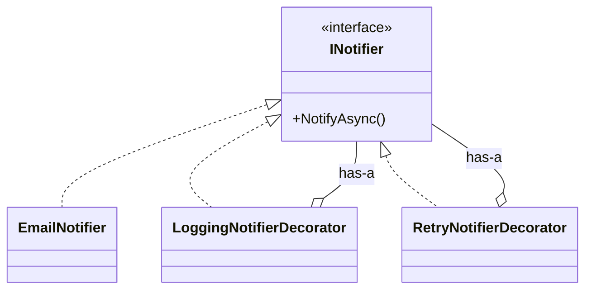

# 第12章：Decorator：機能を“重ねる”合成テク🎂✨

この章のゴールはシンプルだよ😊
**「元のクラスをいじらずに、ログ・リトライ・計測みたいな機能を“外側から”足せる」**を体験すること！🧁🧁

---

## 1) Decoratorってなに？一言でいうと…🎁


**「同じインターフェースの“包み紙”で、機能を足しながらくるむ」**パターンだよ🎀

* ✅ 元のクラス（本体）を変更しない
* ✅ 機能を“レイヤー”として積める（ログ→リトライ→計測…）
* ✅ 継承で「Logging版」「Retry版」みたいに派生を増やさない🌳❌

イメージ図👇（レイヤー重ね）
`RetryDecorator( LoggingDecorator( CoreService ) )` 🎂✨

---

## 2) 今日の題材：通知送信サービス📩✨

今回は「通知を送る」だけのサービスに、**ログ**📝 と **リトライ**🔁 を“重ねる”よ！

### Step0：まずは素のサービス（本体）🧱


```csharp
public interface INotifier
{
    Task NotifyAsync(string userId, string message, CancellationToken ct = default);
}

public sealed class EmailNotifier : INotifier
{
    public async Task NotifyAsync(string userId, string message, CancellationToken ct = default)
    {
        // 例：実際はSMTPや外部APIなど
        await Task.Delay(50, ct);

        // たまに失敗する想定（デモ用）
        if (Random.Shared.Next(1, 5) == 1)
            throw new HttpRequestException("Mail gateway temporary failure");

        Console.WriteLine($"[EMAIL] to={userId} msg={message}");
    }
}
```

---

## 3) Decoratorの基本形：同じIFを実装して“中身”を持つ🧩


Decoratorはだいたいこの形👇

* 自分も `INotifier` を実装する（利用側から見たら同じ）
* 中に `INotifier`（本体orさらに内側のDecorator）を持つ
* 前後に処理を挟んで、中身へ委譲する



---

## 4) ログDecorator：触らずにログだけ足す📝✨


```csharp
public sealed class LoggingNotifierDecorator : INotifier
{
    private readonly INotifier _inner;

    public LoggingNotifierDecorator(INotifier inner)
        => _inner = inner;

    public async Task NotifyAsync(string userId, string message, CancellationToken ct = default)
    {
        Console.WriteLine($"[LOG] Notify start user={userId}");
        try
        {
            await _inner.NotifyAsync(userId, message, ct);
            Console.WriteLine($"[LOG] Notify success user={userId}");
        }
        catch (Exception ex)
        {
            Console.WriteLine($"[LOG] Notify failed user={userId} ex={ex.GetType().Name}: {ex.Message}");
            throw;
        }
    }
}
```

✅ ポイント

* 本体 `EmailNotifier` は一切変更なし！🧼
* “前後”に処理を足せた！🎉

---

## 5) リトライDecorator：失敗したらもう一回！🔁🔥


ここは超大事⚠️
**何でもリトライして良いわけじゃない**よ（後でまとめるね）🙂

まずは「一時的な失敗」っぽい例外だけ、最大3回までリトライにする！

```csharp
public sealed class RetryNotifierDecorator : INotifier
{
    private readonly INotifier _inner;
    private readonly int _maxRetries;
    private readonly TimeSpan _baseDelay;

    public RetryNotifierDecorator(INotifier inner, int maxRetries = 3, TimeSpan? baseDelay = null)
    {
        _inner = inner;
        _maxRetries = maxRetries;
        _baseDelay = baseDelay ?? TimeSpan.FromMilliseconds(200);
    }

    public async Task NotifyAsync(string userId, string message, CancellationToken ct = default)
    {
        int attempt = 0;

        while (true)
        {
            attempt++;
            try
            {
                await _inner.NotifyAsync(userId, message, ct);
                return;
            }
            catch (HttpRequestException) when (attempt <= _maxRetries)
            {
                // ざっくり指数バックオフ（200ms, 400ms, 800ms…）
                var delay = TimeSpan.FromMilliseconds(_baseDelay.TotalMilliseconds * Math.Pow(2, attempt - 1));

                Console.WriteLine($"[RETRY] attempt={attempt}/{_maxRetries} delay={delay.TotalMilliseconds:0}ms");
                await Task.Delay(delay, ct);
                continue;
            }
        }
    }
}
```

---

## 6) 2段重ね：ログ → リトライ（または逆）🧁🧁


「順番」めっちゃ大事！🎯
どっちが正しいかは目的によるよ🙂

### パターンA：外がログ、内がリトライ（ログがスッキリ）✨

* ログは「最終結果」中心になりやすい
* リトライの細かい試行ログは別途出すならOK

```csharp
INotifier core = new EmailNotifier();
INotifier notifier = new LoggingNotifierDecorator(
                        new RetryNotifierDecorator(core));

await notifier.NotifyAsync("user-1", "Hello!", CancellationToken.None);
```

### パターンB：外がリトライ、内がログ（試行ごとにログが出る）📝📝📝

* “各試行”がログに出る（監視したい時はこっち）

```csharp
INotifier core = new EmailNotifier();
INotifier notifier = new RetryNotifierDecorator(
                        new LoggingNotifierDecorator(core));

await notifier.NotifyAsync("user-1", "Hello!", CancellationToken.None);
```

---

## 7) よくある使いどころ（現場っぽいやつ）🏢✨


Decoratorが刺さるのは、こういう**横断関心**（どこでも欲しいやつ）！

* ログ📝
* リトライ🔁（一時障害だけ）
* タイムアウト⏳
* 計測（時間/回数）⏱️
* キャッシュ🗃️
* 権限チェック🔐

---

## 8) “リトライしていい？”の判断メモ🧠⚠️

リトライは便利だけど、雑にやると事故る😇

* ✅ GET的な「読取」や、**同じ操作を繰り返しても安全（冪等）**な処理は比較的OK
* ⚠️ 「課金」「注文確定」みたいな**二重実行が致命傷**な処理は要注意

  * 対策：**冪等キー**、重複防止、サーバ側の一意制約など（第16章にも繋がるよ）🧷

---

## 9) 依存の組み立て（Composition Root）でやるのがキレイ🌳🧩

Decoratorは「newの順番」が命なので、**組み立て場所を1か所**に集めるのが相性◎

---

## 10) DIでDecoratorを扱うときの現実解🧰

標準DIは素直で良いけど、**“Decorate”の専用APIは標準では用意されてない**（追加提案は昔から議論されてる）📝 ([GitHub][1])
なので現場ではだいたい👇のどれか！

### A) 手動で組む（小規模なら最強に分かりやすい）💪

（さっきの `new` 連結）

### B) Scrutorを使う（定番）🧩


Scrutorは `IServiceCollection` に `Decorate` を足してくれるよ🧁 ([GitHub][2])

```csharp
using Microsoft.Extensions.DependencyInjection;
using Scrutor;

var services = new ServiceCollection();

services.AddSingleton<INotifier, EmailNotifier>();
services.Decorate<INotifier, LoggingNotifierDecorator>();
services.Decorate<INotifier>(inner => new RetryNotifierDecorator(inner, maxRetries: 3));

var provider = services.BuildServiceProvider();

var notifier = provider.GetRequiredService<INotifier>();
await notifier.NotifyAsync("user-1", "Hello!", CancellationToken.None);
```

💡注意：**Decorateは「先に登録されたサービス」を包む**ので、登録順が大事だよ🧠 ([GitHub][2])

---

## 11) .NETの世界にも“Decoratorっぽい鎖”は普通にあるよ🔗

「あ、これDecoratorと同じ発想だ！」って気づけると強い✨

* **ASP.NET Coreのミドルウェア**：リクエストが順番に流れるパイプライン🚰 ([Microsoft Learn][3])
* **IHttpClientFactory の DelegatingHandler**：外向きHTTPに“外側から機能を足す”仕組み（DIでHandlerを解決する話もあるよ）🌐 ([Microsoft Learn][4])
* さらに最近は **Microsoft.Extensions.Http.Resilience** で、HttpClientに回復性（リトライ等）を組み込みやすくなってる📦✨ ([Microsoft Learn][5])

（.NET 10はLTSで、2026-01-13時点の最新パッチは10.0.2、サポートは2028-11-14までだよ）📅 ([Microsoft][6])

---

## 12) ハンズオン課題（15〜25分）🧪✨

### 課題A：計測Decoratorを追加しよう⏱️

* `Stopwatch` で `NotifyAsync` の時間を測ってログに出す
* 例：`[TIME] 37ms`

### 課題B：3段重ねを試そう🎂🎂🎂

* 計測 → ログ → リトライ（順番を変えて、出力がどう変わるか観察👀）

### 課題C：例外の種類でリトライ対象を絞ろう🎯

* `HttpRequestException` はリトライ
* `ArgumentException` は即失敗（バグっぽいから）💥

---

## 13) AI活用（コピペでOK）🤖💬

* 「`INotifier` のDecorator雛形を3種類（Logging/Retry/Timing）で作って。各Decoratorは“責務が混ざらない”ようにして」
* 「リトライの“対象にしてはいけない操作”の判断基準を、C#の例つきで短くまとめて」
* 「このDecoratorの順番（A→B→C）だとログはどう出る？目的別におすすめ順を提案して」

---

## まとめ🎀

Decoratorは、合成優先の中でも特に強い武器だよ🧁✨
**「機能を足したい。でも本体は触りたくない」**ってときに、迷わず候補にできるようになると一気に設計が楽になる😊

次の章（Adapter）では「外部の都合を中に入れない」方向で、また“包む”を別の角度からやっていくよ🔧🧼

[1]: https://github.com/dotnet/runtime/issues/36021?utm_source=chatgpt.com "Add decorator extension methods to IServiceCollection"
[2]: https://github.com/khellang/Scrutor?utm_source=chatgpt.com "khellang/Scrutor: Assembly scanning and decoration ..."
[3]: https://learn.microsoft.com/en-us/aspnet/core/fundamentals/middleware/?view=aspnetcore-10.0&utm_source=chatgpt.com "ASP.NET Core Middleware"
[4]: https://learn.microsoft.com/en-us/aspnet/core/fundamentals/http-requests?view=aspnetcore-10.0 "Make HTTP requests using IHttpClientFactory in ASP.NET Core | Microsoft Learn"
[5]: https://learn.microsoft.com/en-us/dotnet/core/resilience/http-resilience?utm_source=chatgpt.com "Build resilient HTTP apps: Key development patterns - .NET"
[6]: https://dotnet.microsoft.com/en-us/platform/support/policy/dotnet-core ".NET and .NET Core official support policy | .NET"
