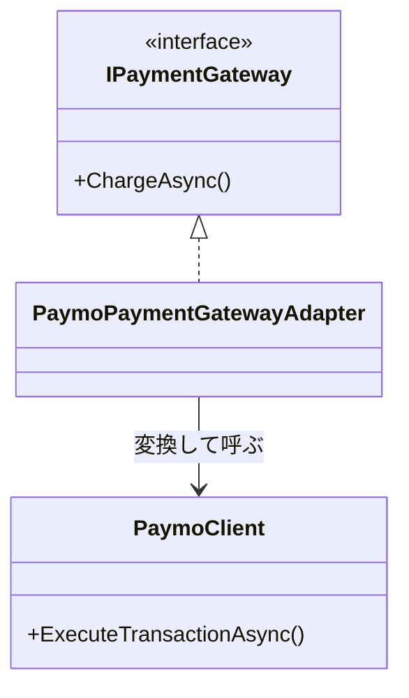

# 第13章：Adapter：外部の都合を中に入れない🔧🧼

> キーワード：**翻訳係（Adapter）**／**外部APIのクセを隔離**／**自分たちの世界（ドメイン）を守る**🛡️✨

---

## 0. 今日のゴール🎯✨

この章が終わると…👇

* 外部ライブラリ・外部APIの「変な命名」「変なDTO」「変な例外」を **自分のコードに漏らさない**ようにできる🧼
* もし外部が仕様変更しても、**直す場所を“1か所”に閉じ込められる**🧯
* 「外部に依存してベタ書き」→「Adapterで包む」に自然に移行できる🙂🔁

---

## 1. Adapterってなに？一言でいうと🗣️💡


**Adapter = 外部の“話し方”を、自分のアプリの“話し方”に翻訳する係**📘➡️📗

* 外部：「`DoPayment(token, amount)`」「`ResultCode=200`」「例外が独特💥」
* 自分たち：「`ChargeAsync(request)`」「`PaymentResult.Success`」「例外は自分の型で統一✨」

この“翻訳”をやるのが **Adapter** だよ〜🔧🧼

---

## 2. なぜ必要？（直接外部APIを呼ぶと起きる地獄😱）


### ありがちなダメ例💥（外部が漏れてる）

* いろんなクラスで外部SDKの型（DTO）を直接使う📦📦📦
* いろんな場所で外部例外を catch して、似たような変換を繰り返す🌀
* 外部の命名がそのままアプリに混ざって読みにくい🤯
* 外部仕様が変わったら修正箇所が爆増💣

👉 だから **「外部の都合」を“中”に入れない**のが超大事🧼✨
（この「隔離」の気持ち、設計の最初の一歩としてめちゃ強いよ🫶）

---

## 3. Adapterの登場人物（これだけ覚えればOK）🎭


* **Target（ターゲット）**：アプリが欲しい形（自分の interface）🎯
* **Adaptee（アダプティ）**：外部の実体（SDKやAPIクライアント）📦
* **Adapter（アダプター）**：翻訳係（Targetを実装してAdapteeに橋渡し）🌉



---

## 4. ハンズオン🧪：支払いSDKを“自分の世界”に合わせる💳🔧

### お題📌

外部SDK「Paymo」がある（という設定）

* メソッド名が独特
* 返り値が独特
* 例外も独特

それを、自分のアプリ側は「`IPaymentGateway`」として使いたい✨

---

### 4-1. まず「自分の世界（Target）」を作る🎯🧩


* アプリ側が欲しいのはこれ👇（**外部の名前を一切出さない**のがポイント🧼）

```csharp
namespace MyApp.Payments;

public interface IPaymentGateway
{
    Task<PaymentResult> ChargeAsync(PaymentRequest request, CancellationToken ct = default);
}

public sealed record PaymentRequest(
    string CustomerId,
    int AmountYen,
    string PaymentToken
);

public sealed record PaymentResult(
    bool Success,
    string? PaymentId,
    string? FailureReason
)
{
    public static PaymentResult Ok(string paymentId) => new(true, paymentId, null);
    public static PaymentResult Fail(string reason) => new(false, null, reason);
}
```

💡ここが**アプリの“言葉”**だよ〜📗✨
外部が変わっても、ここはできるだけ安定させたい🛡️

---

### 4-2. 「外部SDK（Adaptee）」を想定する📦（※触れない前提）


（本当はNuGetなどで入ってくる想定ね🙂）

```csharp
namespace PaymoSdk;

// 外部が提供する独特な例外
public sealed class PaymoException : Exception
{
    public string ErrorCode { get; }
    public PaymoException(string errorCode, string message) : base(message) => ErrorCode = errorCode;
}

// 外部が返してくる独特なレスポンス
public sealed record PaymoResponse(int StatusCode, string? TransactionId, string? ErrorMessage);

// 外部SDKクライアント（命名も独特）
public sealed class PaymoClient
{
    public Task<PaymoResponse> ExecuteTransactionAsync(string token, int amountYen, CancellationToken ct)
    {
        // ここは外部の中身という想定（ダミー実装）
        if (token == "NG") throw new PaymoException("InvalidToken", "Token is invalid");
        return Task.FromResult(new PaymoResponse(200, Guid.NewGuid().ToString("N"), null));
    }
}
```

---

### 4-3. Adapter（翻訳係）を作る🌉🔧✨


ここが今日の主役だよ〜！🧁

✅ ルール

* アプリは **IPaymentGateway** だけを見て生きる
* 外部SDKの型・例外は **Adapterの外に漏らさない**🧼

```csharp
using MyApp.Payments;
using PaymoSdk;

namespace MyApp.Infrastructure.Payments;

// Adapter = Target(IPaymentGateway) を実装して、外部(PaymoClient)に橋渡しする
public sealed class PaymoPaymentGatewayAdapter : IPaymentGateway
{
    private readonly PaymoClient _client;

    public PaymoPaymentGatewayAdapter(PaymoClient client)
        => _client = client;

    public async Task<PaymentResult> ChargeAsync(PaymentRequest request, CancellationToken ct = default)
    {
        try
        {
            // ✅ 翻訳：自分の request → 外部SDKの呼び方へ
            var response = await _client.ExecuteTransactionAsync(
                token: request.PaymentToken,
                amountYen: request.AmountYen,
                ct: ct
            );

            // ✅ 翻訳：外部の戻り値 → 自分の結果へ
            return response.StatusCode == 200 && response.TransactionId is not null
                ? PaymentResult.Ok(response.TransactionId)
                : PaymentResult.Fail(response.ErrorMessage ?? "Payment failed (unknown)");
        }
        catch (PaymoException ex)
        {
            // ✅ 翻訳：外部例外 → 自分の結果/理由へ（外部のErrorCodeは外に出さない）

            var reason = ex.ErrorCode switch
            {
                "InvalidToken" => "支払いトークンが無効でした🙅‍♀️",
                "Timeout"      => "支払いサービスが混み合っています⏳",
                _              => "支払いでエラーが発生しました💥"
            };
            return PaymentResult.Fail(reason);
        }
    }
}
```


ここで超大事なのは👇💡
**“外部語”はこのクラスで止める**🧼🧱
だから将来Paymo側が変わっても、基本ここだけ直せばOKになりやすい✨

---

## 5. どこで組み立てる？（合成の作法🧩）

Adapterは「部品」だから、アプリの組み立て地点で合成するよね🙂
.NETはDIが標準的に使える（ログ/設定と並んでDIが組み込み）ので、登録して使うのが自然だよ〜🧰✨ ([Microsoft Learn][1])

例（コンソールでもWebでも同じ感覚）👇

```csharp
using Microsoft.Extensions.DependencyInjection;
using MyApp.Payments;
using MyApp.Infrastructure.Payments;
using PaymoSdk;

var services = new ServiceCollection();

// 外部SDK
services.AddSingleton<PaymoClient>();

// Adapter（IPaymentGatewayとして公開）
services.AddSingleton<IPaymentGateway, PaymoPaymentGatewayAdapter>();

var provider = services.BuildServiceProvider();

var gateway = provider.GetRequiredService<IPaymentGateway>();

var result = await gateway.ChargeAsync(
    new MyApp.Payments.PaymentRequest("C001", 1200, "OK"),
    CancellationToken.None
);

Console.WriteLine(result.Success ? $"OK: {result.PaymentId}" : $"NG: {result.FailureReason}");
```

---

## 6. “外部が漏れてない？”チェックリスト✅🧼

Adapterを作ったら、これを見てセルフチェック✨

* [ ] アプリ側の層（ドメイン/ユースケース）に **外部SDKの型が登場してない**？📦❌
* [ ] アプリ側で **外部例外を catch してない**？（してたら漏れてる）🧯❌
* [ ] 外部の命名（`ExecuteTransactionAsync`みたいなの）がアプリのあちこちに出てない？📝❌
* [ ] 外部の戻り値（StatusCodeなど）を見てるのがAdapterだけになってる？👀✅

---

## 7. よくある落とし穴⚠️（初心者がハマりやすい…！）

### 落とし穴1：Adapterの外に外部DTOを返しちゃう😇


「便利だから `PaymoResponse` を返すね！」
→ それ、**隔離が崩壊**する合図🧟‍♀️
👉 必ず **自分の型**に変換しよ🧼

### 落とし穴2：Adapterが“ビジネスロジック”まで持ち始める🍱

Adapterは基本「翻訳」担当。
「割引計算」「在庫判断」みたいな中核ロジックは中に入れない🙂
👉 迷ったら：**外部のクセ対策だけ**に留める🧽

### 落とし穴3：例外の変換が雑すぎる🌀

全部「エラーでした」で潰すと、利用側が困る😢
👉 “ユーザーに出していい理由” と “内部ログ用” を分ける意識があると強い✨

---

## 8. Facade / Decorator と何が違うの？🪟🎂🔧

* **Adapter🔧**：外部の形を“翻訳”して、こちらの形に合わせる（型・命名・例外・DTOの変換）
* **Facade🪟**：複数の手順をまとめて「使う側をラクにする窓口」
* **Decorator🎂**：同じインターフェースのまま“機能を重ねる”（ログ・リトライなど）

👉 もし「外部の形がイヤ！」なら Adapter が第一候補🔧✨

---

## 9. AI活用🤖💬（コピペで使える！）

### 9-1. Adapterの骨組みを出してもらう🦴

* 「`IPaymentGateway` と `PaymoClient` がある。外部型を漏らさないAdapter雛形を書いて」

### 9-2. “漏れてる箇所”のレビューをさせる👀

* 「このプロジェクトで外部SDKの型がドメイン層に漏れてる箇所を指摘して。修正方針もセットで」

### 9-3. 例外変換の方針を相談する🧯

* 「PaymoExceptionのErrorCode一覧（仮）を渡すので、ユーザー向け文言とログ向け情報の分け方を提案して」

---

## 10. ミニ課題（15〜20分）📮✨

### 課題A：支払いをもう1社追加する💳💳

* `OtherPayClient`（別SDK想定）を用意して
* `OtherPayPaymentGatewayAdapter : IPaymentGateway` を作る
* DI登録を差し替えて、アプリ側を一切変えずに動かす🔁✨

### 課題B：Adapterの外側にDecoratorを重ねる🎂

* `IPaymentGateway` に対してログDecoratorを作って
* `PaymoPaymentGatewayAdapter` を包む（第12章の復習にもなる🧁🧁）

---

## 11. まとめ🌈🧠✨

* Adapterは **外部の都合を“翻訳して隔離”**するパターン🔧🧼
* 外部SDKの型・例外・命名を **アプリ内部に漏らさない**のが勝ち筋🛡️
* 直す場所が1か所になると、未来の自分が泣いて喜ぶ😭✨

---

## おまけ（ちょい最新トピック）🌟

C# 14 は **拡張メンバー（extension members）** などが入り、型を拡張する表現力が増えてるよ〜✨（ただし「外部を拡張できる＝Adapter不要」ではなく、依存を隔離する目的では今もAdapterが強い！） ([Microsoft Learn][2])
また .NET 10 は 2025年11月リリースとして “最新世代” の前提で進めてOKだよ🙂🚀 ([Microsoft Learn][3])

[1]: https://learn.microsoft.com/en-us/dotnet/core/extensions/dependency-injection?utm_source=chatgpt.com "Dependency injection - .NET"
[2]: https://learn.microsoft.com/en-us/dotnet/csharp/whats-new/csharp-14?utm_source=chatgpt.com "What's new in C# 14"
[3]: https://learn.microsoft.com/en-us/dotnet/core/whats-new/dotnet-10/overview?utm_source=chatgpt.com "What's new in .NET 10"
