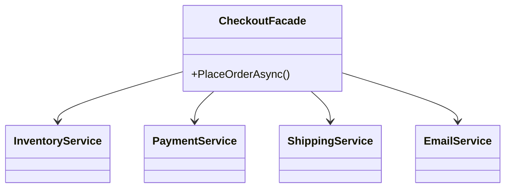

# 第14章：Facade：利用側をラクにする窓口🪟😊

## 今日のゴール🎯

* 「呼び出し順がややこしい処理」を、**1つの窓口（Facade）**にまとめてスッキリさせる🧼✨
* 合成（has-a）で、**部品を組み合わせて使いやすさを上げる**感覚をつかむ🧩💕

---

## 1) まず“困りごと”を体験しよ😵‍💫💥


たとえば「注文確定」って、だいたいこうなるよね👇

* 在庫を確保する📦
* 決済する💳
* 配送を作る🚚
* メール送る📧

利用側（UI/Controller/画面側）がこの順番を毎回やると…

* 手順ミスる（決済してから在庫確保してしまう等）😱
* 同じ手順があちこちにコピペで増殖🌱
* 仕様変更で全部修正になって地獄🔥

ここを救うのが **Facade** だよ🪟✨

---

## 2) Facadeってなに？🪟🙂


Facadeは、複雑なサブシステムに対して **「使う側がラクになる、簡単な窓口」**を提供するデザインだよ✨
“中の部品はそのまま”で、**入口だけ整える**イメージ！🚪🧩

* 「複雑なものを、簡単に使えるようにする」＝Facadeの意図💡 ([refactoring.guru][1])

---

## 3) いつFacadeが効く？✅🌈


次のサインが出たら、Facadeの出番！🚨✨

* 利用側が「A→B→Cの順に呼べ」みたいな**儀式**を覚えてる🧙‍♀️
* 使う側がサブシステムの型をいっぱい知ってる（依存が多い）🧱
* “とりあえず動かす入口”が欲しい（新規画面追加のたびに同じ配線）🔌🔁

---

## 4) ハンズオン🧪：3ステップを1メソッドにまとめる🧵✨

題材：注文確定（在庫→決済→配送→メール）🛒📦💳🚚📧

### 4-1) ぐちゃぐちゃ版（利用側が全部知ってる）😵‍💫


```csharp
using System;
using System.Threading.Tasks;

public record Order(string OrderId, decimal Amount, string Email);

public interface IInventoryService
{
    Task ReserveAsync(Order order);
    Task ReleaseAsync(Order order);
}

public interface IPaymentService
{
    Task<bool> ChargeAsync(Order order);
    Task RefundAsync(Order order);
}

public interface IShippingService
{
    Task<string> CreateShipmentAsync(Order order);
    Task CancelShipmentAsync(string trackingNo);
}

public interface IEmailService
{
    Task SendOrderConfirmedAsync(Order order, string trackingNo);
}

public sealed class InventoryService : IInventoryService
{
    public Task ReserveAsync(Order order)
    {
        Console.WriteLine($"📦 在庫確保: {order.OrderId}");
        return Task.CompletedTask;
    }
    public Task ReleaseAsync(Order order)
    {
        Console.WriteLine($"📦 在庫解放: {order.OrderId}");
        return Task.CompletedTask;
    }
}

public sealed class PaymentService : IPaymentService
{
    public Task<bool> ChargeAsync(Order order)
    {
        Console.WriteLine($"💳 決済: {order.OrderId} / {order.Amount}円");
        return Task.FromResult(true); // 今回は成功にしとく🙂
    }
    public Task RefundAsync(Order order)
    {
        Console.WriteLine($"💳 返金: {order.OrderId}");
        return Task.CompletedTask;
    }
}

public sealed class ShippingService : IShippingService
{
    public Task<string> CreateShipmentAsync(Order order)
    {
        var tracking = "TRK-" + order.OrderId;
        Console.WriteLine($"🚚 配送作成: {tracking}");
        return Task.FromResult(tracking);
    }
    public Task CancelShipmentAsync(string trackingNo)
    {
        Console.WriteLine($"🚚 配送キャンセル: {trackingNo}");
        return Task.CompletedTask;
    }
}

public sealed class EmailService : IEmailService
{
    public Task SendOrderConfirmedAsync(Order order, string trackingNo)
    {
        Console.WriteLine($"📧 メール送信: {order.Email} / {trackingNo}");
        return Task.CompletedTask;
    }
}

public static class Program
{
    public static async Task Main()
    {
        var order = new Order("1001", 4980m, "hanako@example.com");

        // 利用側が全部わかってないといけない😵‍💫
        IInventoryService inventory = new InventoryService();
        IPaymentService payment = new PaymentService();
        IShippingService shipping = new ShippingService();
        IEmailService email = new EmailService();

        await inventory.ReserveAsync(order);
        var paid = await payment.ChargeAsync(order);
        if (!paid)
        {
            await inventory.ReleaseAsync(order);
            return;
        }

        var trackingNo = await shipping.CreateShipmentAsync(order);
        await email.SendOrderConfirmedAsync(order, trackingNo);

        Console.WriteLine("✅ 注文確定おわり！");
    }
}
```

「動くけど、利用側が知りすぎ」なのがポイント😵‍💫
この手順が画面A/画面B/バッチ…で増えると、すぐ崩壊しがち🔥

---

### 4-2) Facade版（入口を1つにする）🪟😊✨

**CheckoutFacade**を作って、利用側は「注文確定して〜！」だけにする💕

```csharp
using System;
using System.Threading.Tasks;

public sealed class CheckoutFacade
{
    private readonly IInventoryService _inventory;
    private readonly IPaymentService _payment;
    private readonly IShippingService _shipping;
    private readonly IEmailService _email;

    public CheckoutFacade(
        IInventoryService inventory,
        IPaymentService payment,
        IShippingService shipping,
        IEmailService email)
    {
        _inventory = inventory;
        _payment = payment;
        _shipping = shipping;
        _email = email;
    }

    public async Task<bool> PlaceOrderAsync(Order order)
    {
        // ✅ ここが「呼び出し順の正解」を知ってる場所🧠✨
        await _inventory.ReserveAsync(order);

        try
        {
            var paid = await _payment.ChargeAsync(order);
            if (!paid)
            {
                await _inventory.ReleaseAsync(order);
                return false;
            }

            var trackingNo = await _shipping.CreateShipmentAsync(order);
            await _email.SendOrderConfirmedAsync(order, trackingNo);

            return true;
        }
        catch
        {
            // 💡 失敗時の“後片付け”も入口でまとめる🧹✨
            await _payment.RefundAsync(order);
            await _inventory.ReleaseAsync(order);
            throw;
        }
    }
}
```



利用側（Program）はこうなる👇めちゃラク！🥳✨

```csharp
using System;
using System.Threading.Tasks;

public static class Program
{
    public static async Task Main()
    {
        var order = new Order("1001", 4980m, "hanako@example.com");

        var facade = new CheckoutFacade(
            new InventoryService(),
            new PaymentService(),
            new ShippingService(),
            new EmailService());

        var ok = await facade.PlaceOrderAsync(order);
        Console.WriteLine(ok ? "🎉 注文確定できたよ！" : "😢 注文確定できなかったよ…");
    }
}
```

---

## 5) Facadeの“ちょうどいい”設計コツ🧁✨

### コツA：Facadeは「手順」と「ちょい整形」まで🪄

Facadeは **新しいドメインロジックを盛る場所**じゃなくて、
「使う手順・つなぎ方」をまとめる場所にすると綺麗だよ🧼✨

### コツB：“全部入りFacade”は避ける⚠️🐘


* `SystemFacade.DoEverything()` みたいになると、逆に巨大化して死ぬ😇
* おすすめは **ユースケース単位**（例：注文確定Facade、返品Facade）で分ける🎯

### コツC：サブシステムは interface にして差し替えやすく🔌


合成の気持ちよさが出るポイント！🧩✨
テストもラクになるよ（第15章のご褒美回につながる🍬）

---

## 6) Adapter / Facade / Decorator の違い（超ざっくり）🧠✨


* Adapter：外部のクセを**翻訳**する🔧（第13章）
* Decorator：機能を**重ねる**🎂（第12章）
* Facade：使い方を**簡単にする窓口**🪟（第14章）

Facadeは「難しい中身を隠して使いやすく」って役割だよ🪟 ([ウィキペディア][2])

---

## 7) AI活用（Copilot/Codex）プロンプト例🤖💬✨

そのまま貼ってOK系を置いとくね🫶

* 「この処理（在庫→決済→配送→通知）をFacadeにまとめたい。公開メソッド名候補を10個、意図が分かる名前で」📝
* 「Facadeが肥大化しそう。責務をユースケース単位に分割する案を3パターン出して」🧩
* 「例外時の補償（ロールバック/返金/在庫解放）を、読みやすい順番で提案して」🧹
* 「Facadeのユニットテスト観点を箇条書きで。モックすべき依存と、しない方が良い依存も」✅

（Visual StudioのCopilot統合体験は、最近のバージョンでより統合されてきてるよ🤖✨） ([Microsoft Learn][3])

---

## 8) まとめ🧠🌸（今日の持ち帰り）

* Facadeは「複雑な部品たち」をそのままに、**使う入口だけ簡単にする**🪟✨ ([refactoring.guru][1])
* 利用側の依存が減って、手順ミス・コピペ増殖が減る🧼
* “全部入り”にせず、**ユースケース単位**で小さく作ると強い🎯

---

## ミニクイズ🎓💡（5問）

1. Facadeが隠すのは「機能」？それとも「使い方の複雑さ」？🪟
2. Facadeが巨大化し始めたときの分割軸は？🐘✂️
3. AdapterとFacadeの違いを一言で言うと？🔧🪟
4. Facadeのコンストラクタにinterfaceを使うと嬉しいことは？🔌
5. 利用側が手順を知ってる状態の“怖さ”を1つ挙げてみて😱

---

※ちなみに言語・ランタイム周りは、C# 14 / .NET 10 の情報がMicrosoft Learnで更新されてるよ（2025年11月更新）📚✨ ([Microsoft Learn][4])

[1]: https://refactoring.guru/design-patterns/facade?utm_source=chatgpt.com "Facade"
[2]: https://en.wikipedia.org/wiki/Facade_pattern?utm_source=chatgpt.com "Facade pattern"
[3]: https://learn.microsoft.com/en-us/visualstudio/releases/2022/release-notes-v17.10?utm_source=chatgpt.com "Visual Studio 2022 version 17.10 Release Notes"
[4]: https://learn.microsoft.com/ja-jp/dotnet/csharp/whats-new/csharp-14?utm_source=chatgpt.com "C# 14 の新機能"
