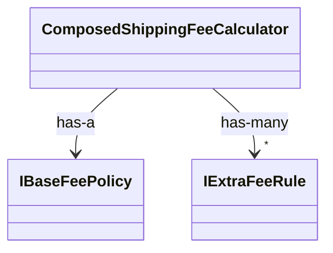

# 第16章：リファクタ手順：継承→合成へ安全に移行する🛠️🙂

この章は「既に動いてる継承コード」を、**壊さずに**合成へ寄せる手順を、手を動かしながら覚える回だよ〜！🧩💗
「全部いっぺんに直す」は事故りやすいので、**小さく安全に**いくよ🚶‍♀️💨

---

## 0. この章のゴール🎯✨

終わる頃にこうなってるのが目標だよ👇😊

* 継承ツリーを見て「どこが変わりやすいか」を見抜ける👀💡
* **テスト→抽出→委譲→差し替え**の“安全階段”で進められる🪜🧯
* 1か所だけでも、**Strategy か Decorator に置換**して成功体験できる🎉🎭🍰
* AI（Copilot/Codex系）を「案出し・レビュー役」にして、移行を加速できる🤖⚡ ([Visual Studio][1])

---

## 1. まず大事：安全に移行する“3つの約束”🧯✅✅✅

### 約束①：動作を固定してから触る🔒

* 「本番で起きる挙動」を先にテストで固定するよ🧪
* これを **キャラクタリゼーションテスト（現状把握テスト）** って呼んだりするよ🙂

### 約束②：変更は“1回に1テーマ”🎯

* 「抽出だけ」「差し替えだけ」みたいに分ける✂️
* 1コミットで全部やると、戻れなくなる😵‍💫

### 約束③：置換は“最小1点突破”🔥

* ツリー全部を倒すんじゃなくて、まず**痛い1か所**だけ置換するのが勝ち💪✨

---

## 2. 全体像：安全階段（おすすめ順）🪜🙂

合成への移行は、だいたいこの順が事故りにくいよ👇

1. テストを足す🧪
2. 変化点を見つける（分岐・override・例外クラス）👀
3. 抽出する（小さい部品に分ける）✂️
4. 委譲にする（中身を部品へ丸投げ）📦➡️📦
5. 差し替える（Strategy/Decorator等）🔁🎭🍰
6. 使われなくなった継承を削る🧹

---

## 3. ハンズオン題材：送料計算の“危ない継承”を合成へ🛒📦💥

「例外的な子」が増えてきて、継承がつらくなるパターンを作るよ😇

### 3-1. まずは“継承版”の現状コード（Before）🧟‍♀️🌳

```csharp
public sealed record Order(
    bool IsRemoteIsland,
    bool IsExpress,
    decimal WeightKg
);

public abstract class ShippingFeeCalculator
{
    public decimal Calc(Order order)
    {
        var baseFee = GetBaseFee(order);
        var extra = GetExtraFee(order);      // ← 例外が増えると override 地獄
        return baseFee + extra;
    }

    protected abstract decimal GetBaseFee(Order order);

    protected virtual decimal GetExtraFee(Order order) => 0m;
}

public sealed class StandardShipping : ShippingFeeCalculator
{
    protected override decimal GetBaseFee(Order order) => 500m;
}

public sealed class ExpressShipping : ShippingFeeCalculator
{
    protected override decimal GetBaseFee(Order order) => 800m;
}

public sealed class RemoteIslandExpressShipping : ShippingFeeCalculator
{
    protected override decimal GetBaseFee(Order order) => 800m;

    protected override decimal GetExtraFee(Order order) => 1200m; // 離島追加
}
```

この時点で嫌な予感しない？😇
「離島 × 速達 × 重量 × クール便…」ってなった瞬間、派生クラス爆発🌋

---

## 4. Step1：現状を固定するテスト🧪🔒（最重要！）

まずは「今の挙動はこうです」をテストにするよ🙂✨

```csharp
using Xunit;

public sealed class ShippingFeeCalculatorTests
{
    [Fact]
    public void Standard_is_500()
    {
        var sut = new StandardShipping();
        var fee = sut.Calc(new Order(IsRemoteIsland: false, IsExpress: false, WeightKg: 1.0m));
        Assert.Equal(500m, fee);
    }

    [Fact]
    public void Express_is_800()
    {
        var sut = new ExpressShipping();
        var fee = sut.Calc(new Order(IsRemoteIsland: false, IsExpress: true, WeightKg: 1.0m));
        Assert.Equal(800m, fee);
    }

    [Fact]
    public void RemoteIsland_Express_has_extra()
    {
        var sut = new RemoteIslandExpressShipping();
        var fee = sut.Calc(new Order(IsRemoteIsland: true, IsExpress: true, WeightKg: 1.0m));
        Assert.Equal(2000m, fee);
    }
}
```

### 🤖AIの使いどころ（ここ超相性いい）

* 「このクラスの現状挙動を守るテストケースを追加で10個案出しして」
* 「境界値（0kg/重い/離島/速達）を漏れなく洗い出して」

AIはテスト案出しが得意だよ🧠✨（ただし採用は人間が判断ね🙂）

---

## 5. Step2：“変化点”を部品にする（Strategy化の下準備）🔍🧩

ここで方針を変えるよ😊
「送料＝基本料金＋追加料金（複数）」にすると、合成がめっちゃ自然になる✨

* 基本料金：いつも必要
* 追加料金：条件に合う分だけ足す（離島、速達、重量…）

---

## 6. Step3：合成版（After）を作る🧩📦✨

### 6-1. まず契約（interface）を用意する📜🔌

```csharp
public interface IShippingFeeCalculator
{
    decimal Calc(Order order);
}

public interface IBaseFeePolicy
{
    decimal CalcBase(Order order);
}

public interface IExtraFeeRule
{
    bool IsMatch(Order order);
    decimal CalcExtra(Order order);
}
```

### 6-2. 合成で組み立てる本体🧩🧺

```csharp
public sealed class ComposedShippingFeeCalculator : IShippingFeeCalculator
{
    private readonly IBaseFeePolicy _baseFee;
    private readonly IReadOnlyList<IExtraFeeRule> _rules;

    public ComposedShippingFeeCalculator(IBaseFeePolicy baseFee, IReadOnlyList<IExtraFeeRule> rules)
    {
        _baseFee = baseFee;
        _rules = rules;
    }

    public decimal Calc(Order order)
    {
        var fee = _baseFee.CalcBase(order);

        foreach (var rule in _rules)
        {
            if (rule.IsMatch(order))
                fee += rule.CalcExtra(order);
        }

        return fee;
    }
}
```



### 6-3. 部品たち（ルール）🎭✨

```csharp
public sealed class StandardBaseFee : IBaseFeePolicy
{
    public decimal CalcBase(Order order) => 500m;
}

public sealed class ExpressBaseFee : IBaseFeePolicy
{
    public decimal CalcBase(Order order) => 800m;
}

public sealed class RemoteIslandExtra : IExtraFeeRule
{
    public bool IsMatch(Order order) => order.IsRemoteIsland;

    public decimal CalcExtra(Order order) => 1200m;
}
```

ここまでで、追加ルールが増えても「クラス1個追加」で済むよ🎉
継承ツリー増殖が止まる🌳🛑✨

---

## 7. Step4：安全な差し替え（“二重実行”で同値確認）🔁👀🧯


いきなり本番差し替えが怖い時は、**旧と新を両方計算して比べる**のが超強い💪✨

```csharp
public sealed class DualRunShippingFeeCalculator : IShippingFeeCalculator
{
    private readonly IShippingFeeCalculator _legacy;
    private readonly IShippingFeeCalculator _next;

    public DualRunShippingFeeCalculator(IShippingFeeCalculator legacy, IShippingFeeCalculator next)
    {
        _legacy = legacy;
        _next = next;
    }

    public decimal Calc(Order order)
    {
        var a = _legacy.Calc(order);
        var b = _next.Calc(order);

        if (a != b)
            throw new InvalidOperationException($"Mismatch! legacy={a}, next={b}");

        return b;
    }
}
```

* まず開発・検証環境でこれを挟む🙂
* 差分が出たら、テスト追加 or ルール修正で一致させる🧪🔧
* 一致し続けるようになったら、旧を外す🧹✨

---

## 8. 置換の“最小1点突破”はどれがいい？🎯🙂

### ✅Strategyが向く

* 分岐（if/switch）が増えそう
* ルールが増えそう（割引、送料、通知、手数料…）
* 「どれを選ぶか」を切替したい

### ✅Decoratorが向く

* “中身はそのまま”で機能を足したい（ログ、リトライ、計測…）
* 既存コードを触るのが怖い
* 横断的な関心ごとを外に出したい

---

## 9. よくある事故ポイント😵‍💫⚠️（先に避けよ！）

* **テストなしで分割開始** → だいたい壊す🧨
* 「抽出」と「仕様変更」を混ぜる → 何が原因かわからなくなる🌀
* 置換範囲がデカすぎ → レビュー不能😇
* “共通化したくて”基底に寄せ始める → 逆戻り🌳💦

---

## 10. 🤖AI活用テンプレ（コピペで使える）💬✨

* 「この継承ツリーで、変更に弱いポイントを3つ指摘して」
* 「このメソッドのキャラクタリゼーションテストを追加して。境界値も含めて」
* 「継承→合成へ移す最小手順を、コミット単位で箇条書きして」
* 「新旧の同値性を確認するDualRunラッパーを書いて」
* 「このPRをレビューして。互換性リスクと取りこぼしテストを挙げて」

Copilot を Visual Studio で使う導線は Microsoft 側にもまとまってるよ🧑‍💻🤝🤖 ([Visual Studio][1])

---

## 11. ちょこっと“最新メモ”🗓️✨（教材としての鮮度）

* .NET 10 は 2025年11月11日リリースの LTS で、最新パッチ 10.0.2 は 2026年1月13日、サポートは 2028年11月14日までだよ📌 ([Microsoft][2])
* Visual Studio 2022 の Current は 2026年1月13日に 17.14.24 が出てるよ🧰✨ ([Microsoft Learn][3])
* C# 14 は「拡張メンバー（拡張プロパティ等）」みたいな新要素も入ってきてるよ🧩 ([Microsoft Learn][4])
* Visual Studio 2026 のリリースノートも公開されていて、VS2022（v17.0〜17.14）からの移行も意識されてるよ📦➡️🧰 ([Microsoft Learn][5])

---

## 12. まとめ：この章の“勝ち筋”🏆😊✨

* **最初にテスト**（ここで勝負の8割決まる🧪）
* 変化点を **部品（Strategy/Rule）に抽出**🧩
* 合成版を作って **DualRunで同値確認**🔁👀
* 一致が続いたら **差し替えて掃除**🧹✨

---

もし次の一歩として、「あなたの手元の実コード（継承ツリーの一部）」を小さめに貼ってくれたら、**“最小の安全ステップ（コミット単位）”**で、どこから合成に寄せるのがいいか一緒に作るよ🧠🧩💗

[1]: https://visualstudio.microsoft.com/github-copilot/?utm_source=chatgpt.com "Visual Studio With GitHub Copilot - AI Pair Programming"
[2]: https://dotnet.microsoft.com/ja-jp/platform/support/policy/dotnet-core?utm_source=chatgpt.com ".NET および .NET Core の公式サポート ポリシー"
[3]: https://learn.microsoft.com/ja-jp/visualstudio/releases/2022/release-history?utm_source=chatgpt.com "Visual Studio 2022 リリース履歴"
[4]: https://learn.microsoft.com/en-us/dotnet/csharp/whats-new/csharp-14?utm_source=chatgpt.com "What's new in C# 14"
[5]: https://learn.microsoft.com/en-us/visualstudio/releases/2026/release-notes "Visual Studio 2026 Release Notes | Microsoft Learn"
