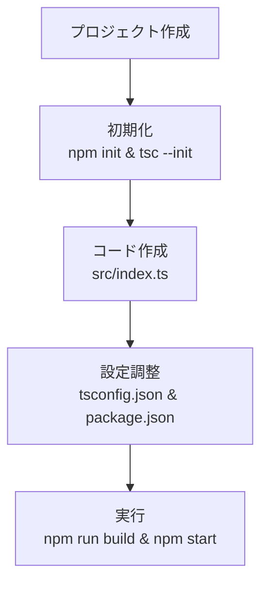
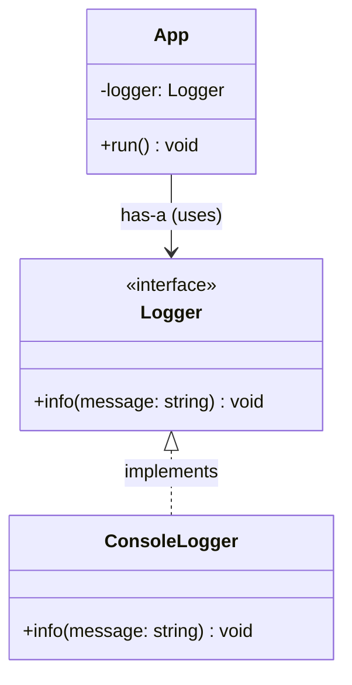

# 第01章：✨「合成優先」って何を目指すの？🤔🧩

ようこそ〜！🎉
この章は「合成優先（継承よりComposition）」の“入口”だよ🚪✨
まだ設計をちゃんと学んでなくても大丈夫👌 ここから一緒に育てていこ〜🌱💕

---

## 1. この講座でできるようになること🎯✨


この講座を最後までやると、ざっくりこんな力がつきます💪😆

* 継承で書いちゃったコードを「部品の組み合わせ」に直せる🧩🔧
* “差し替えできる”設計（変更に強い）を作れる🔁✨
* テストしやすい形にしやすくなる🧪💡
* 「あとで機能が増えても地獄になりにくい」書き方がわかる😇🌈

---

## 2. 今日からの合言葉🪄✨


### ✅ is-a より has-a

* **is-a（〜は〜である）** → 継承っぽい考え方
  例：`Cat is an Animal` 🐱➡️🐾
* **has-a（〜を持つ）** → 合成っぽい考え方
  例：`Car has an Engine` 🚗🧩

> 合成優先は「自分で全部やらないで、部品にお願いする」発想だよ🙏✨

---

## 3. 継承と合成を、超ざっくり比較🆚


### 継承：親子関係👨‍👧

* 良い点：共通処理をまとめやすい✨
* つらい点：親の変更が子に波及しやすい😱（壊れやすい）

### 合成：チーム編成🤝

* 良い点：部品を交換できる🔁✨（変更に強い）
* つらい点：最初は「部品分け」がちょい慣れ必要🙃

---

## 4. まず“感覚”で掴もう！ミニたとえ話🍔🧩


あなたが「ハンバーガー屋さん🍔」だとして…

### 継承で増やすと…🍔➡️🍔🍟🥤

* `Burger`
* `CheeseBurger extends Burger`
* `BaconCheeseBurger extends CheeseBurger`
* `BaconCheeseBurgerWithEgg extends BaconCheeseBurger`
  …みたいに増えがちで、**種類が増えるほどツリー爆発🌳💥**しやすい

### 合成だと…🧩✨

* バンズ🥯
* パティ🥩
* チーズ🧀
* ベーコン🥓
* 卵🍳
  を**組み合わせるだけ**で無限に作れる🎉

> 「組み合わせが増える世界」は、合成がめっちゃ強いよ💪🧩

---

## 5. TypeScriptの“最新感”だけ押さえとこ🧠✨（2026-01-15時点）

* TypeScriptの安定版は **5.9.3** が “Latest” になってるよ📦✨ ([npm][1])
* TypeScriptは今後 **6.0（橋渡し）→ 7.0（ネイティブ移行）** へ進む計画が公式に説明されてるよ🚀 ([Microsoft for Developers][2])
* Node.js は **v24 が Active LTS** で、v22/v20 は Maintenance LTS って扱いだよ📌 ([Node.js][3])
  （最近もセキュリティリリースが出てるから、LTS追従が安心🛡️） ([Node.js][4])

この講座では「今の安定版で気持ちよく動く」方向でいくね😊✨

---

## 6. “動く”が最強🔥 まずは最小TSプロジェクトを作ろう🪟💻


ここは「設計の話」をする前に、**サッと動かして気分を上げるパート**だよ😆🎵
（※難しい設定はしない！まず走ればOK🏃‍♀️💨）

### 6-1. フォルダ作って、ターミナル開く📁✨

例：`composition-ch01` みたいな名前でOK🙆‍♀️

### 6-2. 最小セット（Nodeで動かす）🧩

```bash
mkdir composition-ch01
cd composition-ch01

npm init -y
npm i -D typescript
npx tsc --init
```

> TypeScript 5.9 では `tsc --init` の生成内容が“見やすく整理”されてきてるよ✨ ([TypeScript][5])

### 6-3. `src/index.ts` を作る📝

```bash
mkdir src
```

```ts
// src/index.ts
console.log("Hello Composition! 🧩✨");
```

### 6-4. `tsconfig.json` をちょいだけ整える⚙️✨

`tsconfig.json` の中に、最低限こんな感じを足してOK！（既に似た項目があれば合わせてね）

```json
{
  "compilerOptions": {
    "outDir": "dist",
    "rootDir": "src",
    "target": "ES2023",
    "module": "NodeNext"
  }
}
```

### 6-5. `package.json` に scripts を追加🏃‍♀️💨

```json
{
  "scripts": {
    "build": "tsc",
    "start": "node dist/index.js"
  }
}
```

### 6-6. 動かす！🎉

```bash
npm run build
npm start
```

`Hello Composition! 🧩✨` が出たら勝ち〜！！🏆🥳



---

## 7. ここで“合成の最小体験”だけしてみよ🧩✨


いきなり難しい設計はしないよ！
まずは「部品を持って、お願いする」だけ🤝✨

### 7-1. “部品” を作る（Logger）🧰

```ts
// src/logger.ts
export interface Logger {
  info(message: string): void;
}

export class ConsoleLogger implements Logger {
  info(message: string): void {
    console.log("INFO:", message);
  }
}
```

### 7-2. “本体” が部品を持つ（has-a）📦✨

```ts
// src/app.ts
import type { Logger } from "./logger.js";

export class App {
  constructor(private readonly logger: Logger) {}

  run(): void {
    this.logger.info("App started! 🚀");
  }
}
```

### 7-3. 組み立てて動かす🧩🎬

```ts
// src/index.ts
import { App } from "./app.js";
import { ConsoleLogger } from "./logger.js";

const logger = new ConsoleLogger();
const app = new App(logger);

app.run();
```

#### 💡ここが今日のキモ！

* `App` は `ConsoleLogger` を **newしてない**
* 代わりに `Logger` を **受け取って使ってる**
* つまり `ConsoleLogger` を **別のLoggerに差し替え可能**🔁✨

これが「合成の入口」だよ〜！🧩💕



---

## 8. AI拡張の使いどころ🤖✨（今日から雑に使ってOK）


“丸投げ”じゃなくて、**相棒にする**感じがちょうどいいよ😆🤝

### 例：お願いのしかた🗣️✨

* 「この `Logger` を `FileLogger` にも差し替えられるようにしたい。実装案出して！」📝
* 「`ConsoleLogger` のテスト用ダミー（メモリに保存するやつ）作って」🧪
* 「今のコードを、初心者にもわかるコメント付きにして」💬

### チェックだけは人間がやる✅👀

* 部品（Logger）に依存してる？それとも具体クラスにベタ依存してる？
* 差し替えできそう？🔁
* 名前がわかりやすい？📝

---

## 9. 章末まとめ🎁✨


今日持ち帰るのはこれだけでOK！💯

* 合成優先の合言葉は **has-a** 🧩
* 本体が部品にお願いする＝**委譲（delegate）** の入口🙏✨
* TypeScriptで差し替えやすくする第一歩は **interface** 📘
* 最小プロジェクトが動いたら、もう半分勝ち🏆🎉

---

## 10. ミニテスト（超かんたん）📝✨

Q1. 「has-a」ってどんな発想？（一言で）🤔
Q2. `App` が `ConsoleLogger` を `new` しないのはなぜ？🔁
Q3. `Logger` を `interface` にする嬉しさは？📘

（答えは次章の冒頭でサラッと復習するね😉✨）

---

## 11. 宿題（5分でOK）⏳🧩

`ConsoleLogger` の代わりに、こういう “テスト用Logger” を作ってみてね🧪✨

* `MemoryLogger`：呼ばれたメッセージを配列に貯めるだけ📦
* `app.run()` のあとに、その配列を `console.log` で表示してみる🎀

---

次の第2章では、いよいよ「継承で起きがちな事故あるある💥」を、TypeScriptの例で“わかる〜！”ってなる感じでいくよ😆🌪️

[1]: https://www.npmjs.com/package/typescript?activeTab=versions&utm_source=chatgpt.com "typescript"
[2]: https://devblogs.microsoft.com/typescript/progress-on-typescript-7-december-2025/?utm_source=chatgpt.com "Progress on TypeScript 7 - December 2025"
[3]: https://nodejs.org/en/about/previous-releases?utm_source=chatgpt.com "Node.js Releases"
[4]: https://nodejs.org/en/blog/release/v22.22.0?utm_source=chatgpt.com "Node.js 22.22.0 (LTS)"
[5]: https://www.typescriptlang.org/docs/handbook/release-notes/typescript-5-9.html?utm_source=chatgpt.com "Documentation - TypeScript 5.9"
