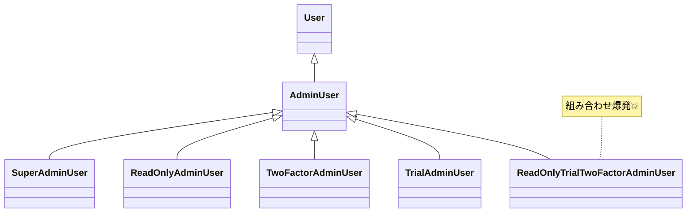

# 第02章：まずは敵を知る😇 継承で起きがちな事故あるある💥

## この章のゴール🎯✨

この章では、「継承って便利そうなのに、なんで急に地獄になるの？😇」を体感します💥
結論だけ先に言うと…👇

* 継承は **“共通化の道具”** に見えるけど、実態は **“強い結びつき（依存）の契約”** になりやすい🪢😵‍💫
* 「ちょい違い」を増やすと **ツリーが爆発🌳💣**
* 親の変更が **子に伝染して壊れる🤒**（有名な “Fragile Base Class” 問題）📌 ([ウィキペディア][1])
* 機能の組み合わせが必要になると **継承では詰みやすい🧩🧩😇**

（ちなみに本日時点だと TypeScript は 5.9 系が “latest” として案内されてます🧁） ([TypeScript][2])

---

## 2-1. 事故あるある①：「ちょい違い派生」でツリー爆発🌳💣


「管理者ユーザー欲しいな〜」→「スーパー管理者も」→「閲覧だけ管理者も」→「お試し期間付きも」…
ってやっていくと、クラスが **増殖** します😇

### まずは地獄の入口サンプル👻

```ts
// src/users.ts
export class User {
  constructor(public name: string) {}
  canRead(): boolean { return true; }
  canWrite(): boolean { return false; }
}

export class AdminUser extends User {
  canWrite(): boolean { return true; }
}

export class SuperAdminUser extends AdminUser {
  canDelete(): boolean { return true; }
}
```

ここまでは「ふーん？」で済むんだけど…次にこう言われます👇

* 「Admin でも **閲覧専用** がほしい👀」
* 「Admin でも **2段階認証必須** にしたい🔐」
* 「Admin でも **お試し期間** がある⏳」

…はい、組み合わせ開始です🧩🧩🧩

### 継承でやるとこうなる（増殖）😇

* ReadOnlyAdminUser
* TwoFactorAdminUser
* TrialAdminUser
* ReadOnlyTwoFactorAdminUser
* TrialTwoFactorAdminUser
* ReadOnlyTrialTwoFactorAdminUser
  …って **組み合わせの数だけクラスが必要** になりがち💥



📌ここが学び：
継承は「縦に伸ばす」のは得意だけど、**機能を横に組み合わせる** のが苦手😵‍💫

---

## 2-2. 事故あるある②：親の変更が子に伝染して壊れる🤒💥（Fragile Base Class）


これが継承のいちばん怖いところの一つ😱
親クラスを「ちょっと改善しただけ」のつもりでも、子が **暗黙に依存してた挙動** が変わって壊れます。
この現象は “Fragile Base Class Problem” としてよく知られてます📌 ([ウィキペディア][1])

### ありがちな壊れ方（例）💣

「親がログイン判定の順番を変えた」だけで、子の追加ロジックがズレて事故る…みたいなやつ😇

```ts
// src/auth.ts
export class BaseAuth {
  protected isLocked = false;

  login(password: string): boolean {
    if (this.isLocked) return false;

    // 親の都合で順序を変えた/内部処理を変えた、とする
    const ok = this.checkPassword(password);
    if (!ok) this.isLocked = true; // 例：連続失敗でロック
    return ok;
  }

  protected checkPassword(password: string): boolean {
    return password === "secret";
  }
}

export class PartnerAuth extends BaseAuth {
  // 子が「親はロックしない前提」で何かしてた…とかで壊れるパターンが起きがち
  protected checkPassword(password: string): boolean {
    // 外部連携の都合で例外を投げたり、別の条件にしたり…
    if (password === "") throw new Error("empty!");
    return super.checkPassword(password);
  }
}
```

📌ここが学び：
継承って「親の中身」を **子が“なんとなく前提にしちゃう”** から危ない😇
親の作者は「安全な変更」のつもりでも、子の作者からすると **地雷** になり得る💥

---

## 2-3. 事故あるある③：「Aの機能もBの機能も…」で詰む🧩🧩😵‍💫


継承で「役割」と「機能」を混ぜると、だいたい破綻します💥

たとえば👇

* 役割：User / Admin / Staff
* 機能：ログ追加📝、キャッシュ🧊、リトライ🔁、計測⏱️、権限制御🔐

これを継承で表現しようとすると、設計がこう叫びます：

> 「それ、無理では？😇」

📌ここが学び：
“組み合わせ” が必要な世界は、だいたい **合成の得意分野**（後の章で救う🚑🧩）

---

## 2-4. 事故あるある④：「is-a」じゃないのに継承しちゃう問題🙅‍♀️


継承は本来「**置き換え可能**」が超大事です。
つまり「子は親として扱っても同じように動くべき」ってこと。

でも現場で起きるのは👇

* 「ちょっと似てるから」で継承しちゃう
* でも “親として扱う” と破綻する💥

例（超あるある）：

* 「Bird（鳥）」を継承した「Penguin（ペンギン）」に fly() があると…？🐧💦
  → “鳥なら飛べるはず” 前提が崩壊😇

📌ここが学び：
継承は「共通点がある」じゃ足りない。**置き換え可能（振る舞いの契約）** が必要🧾✨

---

## 2-5. 事故あるある⑤：protected で内臓むき出し🍖😱


親が `protected` フィールドや内部メソッドをいっぱい公開すると、子がそこに依存してしまう…🫠
すると親の内部変更ができなくなる＝保守性が死ぬ💀

📌ここが学び：
継承は “仲良く見えて距離感ゼロ” になりやすい😇（あとで「部品として渡す」に変える🧩）

---

## 2-6. 事故あるある⑥：テストしづらい🧪😵


継承が深くなると…

* 生成するだけで重い（親の都合が乗る）🐘
* どこが原因か追いづらい（オーバーライド地獄）🌀
* 差し替えが難しい（new が固定）🔒

📌ここが学び：
“テストが書きにくい設計” は、だいたい “変更もしにくい” 🥲

---

## 2-7. ミニ演習✍️✨「継承地獄の芽」を自分で見つける🕵️‍♀️


## 演習A：組み合わせ要求を3つ足してみる🧩🧩🧩

上の User/Admin の例に、次の要求を追加したいとします👇

1. Admin の閲覧専用👀
2. Admin の2段階認証🔐
3. Admin のお試し期間⏳

✅やること：
「継承だけ」で頑張る場合、必要になるクラス名を **紙に列挙** してみてね📝
（たぶん途中で笑う😇）

---

## 演習B：親の変更で子が壊れる“想像テスト”🤯

✅やること：
BaseAuth の `login()` の中を、次のどれかに変えたら「子が壊れそう？」を考えてみてね👇

* 失敗時ロックの条件を変更🔐
* checkPassword を2回呼ぶように変更🔁
* 例外を握りつぶすように変更🧯

💡ポイント：
「親の変更は安全か？」を **親だけ見て判断できない** のが怖さ😱 ([ウィキペディア][1])

---

## 2-8. AI拡張（Copilot/Codex等）での学びブースト🤖✨


この章は「レビュー係」として AI が超便利💕

## そのまま使えるお願い例🗣️💡

* 「この継承コードで、将来事故りそうな点を箇条書きで教えて」📝
* 「要求が増えたとき、クラス爆発が起きる理由を説明して」🌳💣
* 「この設計の依存関係の強さ（変更の伝染）を指摘して」🪢

## AIの答えをチェックする観点👀✅

* “組み合わせ” が出てきてない？🧩
* 親の内部に子が依存してない？🍖
* 「置き換え可能」壊してない？🙅‍♀️

---

## 2-9. まとめ📌✨（この章で覚える合言葉）

* 継承は **共通化** というより **強い結びつき（契約）** になりがち🪢
* 変更は伝染する🤒（Fragile Base Class） ([ウィキペディア][1])
* 組み合わせが必要になった瞬間、継承ツリーは爆発しやすい🌳💣
* 「似てるから継承」は危険⚠️（置き換え可能が必要）

---

## 次章チラ見せ👀✨

次の第3章では、ここまでの地獄をぜんぶ救う基本ムーブ👇
**「部品を持って、部品にお願いする（委譲）」🧩🙏**
を、TypeScriptで気持ちよくやっていきます〜！🚑✨

（ちなみに TypeScript は今 “ネイティブ化（Project Corsa）” を進めていて、将来の 6.0/7.0 の話も公式に出てます📣） ([devblogs.microsoft.com][3])

[1]: https://en.wikipedia.org/wiki/Fragile_base_class?utm_source=chatgpt.com "Fragile base class"
[2]: https://www.typescriptlang.org/download/?utm_source=chatgpt.com "How to set up TypeScript"
[3]: https://devblogs.microsoft.com/typescript/progress-on-typescript-7-december-2025/?utm_source=chatgpt.com "Progress on TypeScript 7 - December 2025"
