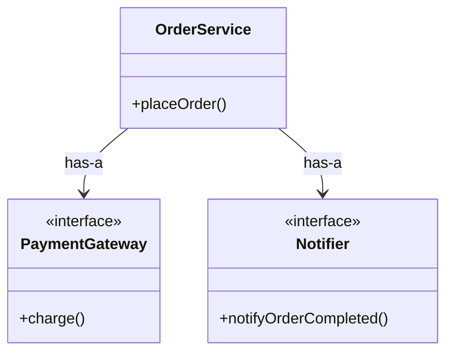

# 第03章：🧩✨ 合成優先の超基本「部品を持って委譲する」🚚💨

## まず“今日の最新スナップショット”🗞️✨

* TypeScriptは **5.9.3 が最新安定版**（GitHub Releasesで “Latest” 表示）だよ📌 ([GitHub][1])
* Node.js は **v24 が Active LTS**、v22/v20 が Maintenance LTS（公式のリリース表）だよ🧷 ([Node.js][2])
* VS Code は **1.108（December 2025）が 2026/01/08 リリース**になってるよ🧊 ([Visual Studio Code][3])
* TypeScriptは **6.0が「5.9→7.0への橋渡し」**になる、という方針も公開されてるよ🌉 ([Microsoft for Developers][4])
* Nodeはサポート中の複数ラインに **セキュリティ更新が定期的に出る**から、アップデート意識が大事🛡️ ([Node.js][5])

---

## 1) 今日のゴール🎯💖

この章でできるようになることは、たったこれだけ✨

* **「自分で全部やらない」**で、部品に仕事をお願いできる🙏🧩
* **has-a（〜を持つ）**で考えられるようになる👜
* “差し替えやすい未来”の土台をつくれる🌱🔁

合成優先の最小コアは一言でいうと👇
**「部品を持つ → 部品に委譲する」**🧩➡️🤝

---

## 2) has-a で考える練習🚗🔧（超イメージ！）

継承（is-a）は「〜は〜である」
合成（has-a）は「〜を持っている」

たとえば…

* 車🚗は **エンジンを持つ**（has-a）
* 注文サービス📦は **決済部品を持つ**（has-a）
* 画面🖥️は **ロガーを持つ**（has-a）

ポイントはね👇
**“自分の中に機能を詰め込む”んじゃなくて、“外の部品を呼ぶ”**って感じ✨

---

## 3) 委譲（delegate）ってなに？🪄💬


委譲はむずかしく聞こえるけど、やってることは超シンプル！

> 「その仕事、あなた（部品）お願い！」🙏✨

たとえば `OrderService` が「支払い処理」を自分で書かずに、`PaymentGateway` にお願いする感じだよ💳📦

---

## 4) まずは “悪いけどありがち” な例😇💥

「とりあえず動く」から、1クラスに全部詰めがち…あるある🥲

```ts
// なんでもやっちゃう OrderService（例）
export class OrderService {
  async placeOrder(userId: string, amount: number) {
    // 1) 検証
    if (amount <= 0) throw new Error("amount must be > 0");

    // 2) 決済（外部っぽい処理）
    // 本当はAPI呼ぶとかだけど、ここにベタ書き…
    console.log("charge start...");
    await new Promise((r) => setTimeout(r, 200));
    console.log(`charged: ${amount}`);

    // 3) 通知
    console.log(`email sent to user=${userId}`);

    // 4) ログや計測も足されがち…
    return { ok: true };
  }
}
```

これのつらさ😵‍💫💦

* 決済の仕様が変わる💳 → OrderServiceを直す
* 通知の仕様が変わる📧 → OrderServiceを直す
* テストしたい🧪 → 外部っぽい処理が混ざってて面倒

つまり **「変更理由が多すぎる」** のがしんどいポイントだよ〜😣

---

## 5) 合成の最小形🧩✨「部品を持って、部品にお願いする」

じゃあ“部品化”して、お願いする形にしよっか😊

## 5-1) まず「部品の約束」を作る📜

```ts
export interface PaymentGateway {
  charge(amount: number): Promise<void>;
}

export interface Notifier {
  notifyOrderCompleted(userId: string): Promise<void>;
}
```

## 5-2) 部品を実装する（仮のやつでOK）🔧

```ts
export class FakePaymentGateway implements PaymentGateway {
  async charge(amount: number) {
    console.log(`(fake) charged: ${amount}`);
  }
}

export class ConsoleNotifier implements Notifier {
  async notifyOrderCompleted(userId: string) {
    console.log(`(console) email sent to user=${userId}`);
  }
}
```

## 5-3) OrderService は「持って、呼ぶ」だけにする📦➡️📞

```ts
import { PaymentGateway, Notifier } from "./parts";

export class OrderService {
  constructor(
    private readonly payment: PaymentGateway,
    private readonly notifier: Notifier
  ) {}

  async placeOrder(userId: string, amount: number) {
    if (amount <= 0) throw new Error("amount must be > 0");

    // ✅ ここが“委譲”！：自分で決済しない
    await this.payment.charge(amount);

    // ✅ ここも“委譲”！：自分で通知しない
    await this.notifier.notifyOrderCompleted(userId);

    return { ok: true };
  }
}
```

はい完成〜！🎉🧩
OrderServiceは「手順の司令塔」っぽくなって、**細かい仕事は部品に任せる**形になるよ✨

---

## 6) “図”で見ると一瞬でわかる🧠✨

```text
[OrderService] 
   | has-a
   +--> [PaymentGateway]  (支払い担当💳)
   +--> [Notifier]        (通知担当📧)

OrderService は「流れ」だけ。
実作業は部品がやる！
```



---

## 7) チェックポイント✅「このクラス、全部やってない？」🕵️‍♀️

次のサインが出たら、合成の出番かも👀✨

* メソッドが **長い**（スクロールつらい📜😵）
* `if` が増えまくる（条件地獄🌪️）
* `console.log` や計測や外部呼び出しが混ざる（ごちゃまぜ🍲）
* 「変更理由」が複数ある（決済も通知も…みたいな）🔁🔁

“いい分け方”のコツは👇
**「それ、別の担当にできない？」**って聞くこと😊💡

---

## 8) ミニ演習✍️💖（5〜10分）

## 演習A：車🚗を合成で作ってみよ！

* `Car` は `Engine` を **持つ**
* `Car.run()` は `engine.start()` を **呼ぶだけ**

ヒントコード👇

```ts
interface Engine {
  start(): void;
}

class GasEngine implements Engine {
  start() { console.log("gas engine start!"); }
}

class Car {
  constructor(private readonly engine: Engine) {}
  run() {
    this.engine.start();   // ✅ 委譲
    console.log("car is running!");
  }
}
```

---

## 9) “合成するとテストがラク”をチラ見せ🧪✨

合成の最高のご褒美のひとつがこれ😍
**テスト用の部品（Fake/Mock）を差し替えられる**こと！

```ts
class SpyNotifier implements Notifier {
  public called = false;
  async notifyOrderCompleted(_: string) {
    this.called = true;
  }
}

// テストっぽい使い方
const notifier = new SpyNotifier();
const service = new OrderService(new FakePaymentGateway(), notifier);

await service.placeOrder("u1", 100);
console.log(notifier.called); // true になってたらOK✅
```

この「差し替えできる感じ」🔁が、次の章以降でどんどん強くなるよ〜🌱✨

---

## 10) AI拡張にお願いするなら（この章向け）🤖🪄

Copilot/Codexに投げるなら、こんな感じが当たりやすいよ🎯

* 「このクラスの責務を分けて、**部品（interface）**にして、**委譲**する形にリファクタして」🧩
* 「決済処理を `PaymentGateway` に抽出して、`OrderService` は流れだけにして」💳➡️📦
* 「テスト用に `FakePaymentGateway` と `SpyNotifier` を作って」🧪✨

出てきたコードは、最後にこれだけチェックしてね✅

* `OrderService` が **具体クラスにベタ依存**しすぎてない？
* “部品”の名前が **やること**になってる？（例：PaymentGateway/Notifier）
* 1メソッドが「手順」だけになってる？（作業を抱えてない？）

---

## まとめ🎀✨（この章の合言葉）

* **has-a で考える**👜
* **部品を持って、部品に委譲する**🧩➡️🤝
* “司令塔”と“作業員”を分けると、変更に強くなる🔁💪

次の章では、合成に必須な「差し替えの約束」＝ `interface/type` をもっと上手に使う練習に入っていくよ📘✨

[1]: https://github.com/microsoft/typescript/releases "Releases · microsoft/TypeScript · GitHub"
[2]: https://nodejs.org/en/about/previous-releases "Node.js — Node.js Releases"
[3]: https://code.visualstudio.com/updates "December 2025 (version 1.108)"
[4]: https://devblogs.microsoft.com/typescript/progress-on-typescript-7-december-2025/ "Progress on TypeScript 7 - December 2025 - TypeScript"
[5]: https://nodejs.org/en/blog/vulnerability/december-2025-security-releases?utm_source=chatgpt.com "Tuesday, January 13, 2026 Security Releases"
