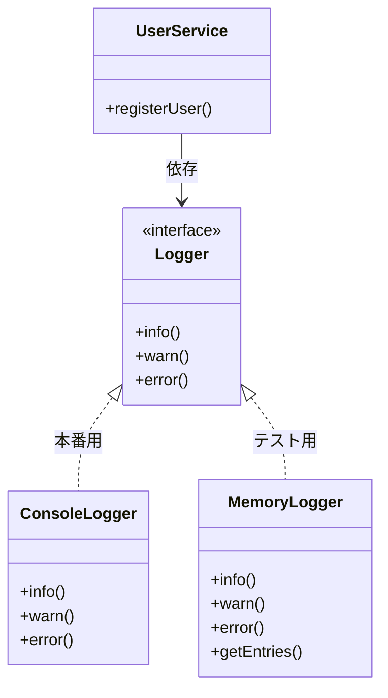

# 第04章：TypeScriptで合成するための道具箱① `interface` / `type` 📘✨

（テーマ：**「差し替え可能」にするための“約束”を作れるようになる**🧩🔁）

---

## 0) 今日のゴール🎯💖

この章が終わったら、こんなことができるようになります👇✨

* 「部品」を**入れ替えられる形**（差し替え可能）で設計できる🔁🧩
* `interface` と `type` を「迷いにくい基準」で使い分けできる🧠✨
* “同じ形ならOK”な TypeScript の性質（構造的型付け）を味方にできる🦆✅
* `Logger` を例に、**本番用とテスト用**をスイッと切り替えられる💡🧪

※ちなみに2026年1月時点だと、TypeScript の安定版は 5.9 系が配布されています📦✨（GitHub Releases） ([GitHub][1])

---

## 1) なんで `interface` / `type` が合成で超大事なの？🤔🧩

合成って「部品を組み合わせる」設計なんだけど、そこで一番困るのがコレ👇

> 部品を差し替えたいのに、**呼び出し側が“特定の実装”にベタ依存**してる😵‍💫💥

たとえば、サービスの中でいきなり `new ConsoleLogger()` しちゃうと…

* テストでログを「メモリにためる版」に変えたいのに変えられない😢
* 本番でログの出し方を変えたいのに、コード改造が必要になる😱

そこで登場するのが **「約束（契約）」** 📜✨
呼び出し側は「この約束を守ってる部品なら誰でもOK！」って考えると、差し替えが一気に楽になります🔁💖

---

## 2) まずは結論：`interface` と `type` の“迷わない”使い分け🧠✨

最初はこのルールでOKです👇（慣れたら例外も使う！）

* **オブジェクトの形（プロパティ/メソッドの集合）を表したい** → `interface` が気持ちいい🧩
* **合体（&）/どれか（|）/関数型/ユニオン系** → `type` が強い💪✨

ざっくり表にすると👇

* `interface`：

  * ✅ “部品の接続口”を作るのに向く（差し替え設計がしやすい）
  * ✅ `extends` で拡張しやすい
  * ✅ 同名宣言の“マージ”がある（便利だけど、初心者は知らなくてもOK）

* `type`：

  * ✅ `A | B`（どっちか）や `A & B`（合体）が得意
  * ✅ 関数型 `type Fn = (x: number) => number` が自然
  * ✅ Utility Types（`Omit` / `Pick` / `Partial` など）と相性よい

---

## 3) いちばん大事：TypeScript は「形が同じならOK」🦆✅（構造的型付け）

TypeScript は、クラス名や継承関係よりも **“中身の形”** を見ます👀✨
つまり…

* `Logger` という名前の型を実装してなくても
* **同じメソッドを持ってれば** `Logger` として扱えることが多いです🧩💖

この性質が、合成（部品の差し替え）と相性バツグン！🔁✨

---

## 4) 「差し替え可能」にする最低条件🔁📜

差し替えできるってことはつまり…

✅ **同じメソッド名**
✅ **同じ引数**
✅ **同じ戻り値**

この3点が揃ってることです🎀✨
これが “約束（契約）” だよ〜ってイメージです📘💕

---

## 5) ミニ題材：`Logger` を差し替えできるようにする📝🔁

ここからは「合成のための型の作り方」を、めっちゃ手を動かして理解します✋✨

### 5-1) `interface` で “接続口” を作る🧩🔌


```ts
export interface Logger {
  info(message: string): void;
  warn(message: string): void;
  error(message: string, err?: unknown): void;
}
```

ポイント💡

* `error` の `err` は `unknown` がおすすめ✨（なんでも来る世界に強い🛡️）
* 戻り値は `void`（ログは基本「何かを返す」より「記録する」だよね📝）

---

### 5-2) 本番用：`ConsoleLogger`（普通に出す）🖥️✨


```ts
import { Logger } from "./Logger";

export class ConsoleLogger implements Logger {
  info(message: string): void {
    console.log(`INFO: ${message}`);
  }
  warn(message: string): void {
    console.warn(`WARN: ${message}`);
  }
  error(message: string, err?: unknown): void {
    console.error(`ERROR: ${message}`, err);
  }
}
```

---

### 5-3) テスト用：`MemoryLogger`（メモリにためる）🧪🫙


```ts
import { Logger } from "./Logger";

type LogLevel = "info" | "warn" | "error";

export type LogEntry = {
  level: LogLevel;
  message: string;
  err?: unknown;
  at: Date;
};

export class MemoryLogger implements Logger {
  private readonly entries: LogEntry[] = [];

  info(message: string): void {
    this.entries.push({ level: "info", message, at: new Date() });
  }
  warn(message: string): void {
    this.entries.push({ level: "warn", message, at: new Date() });
  }
  error(message: string, err?: unknown): void {
    this.entries.push({ level: "error", message, err, at: new Date() });
  }

  // テストで中身を確認できるようにする💖
  getEntries(): readonly LogEntry[] {
    return this.entries;
  }
}
```

ここで `type` も活躍してるよね✨

* `LogLevel = "info" | "warn" | "error"` ← **ユニオン**は `type` が得意🎛️
* `LogEntry` みたいな「データの形」も `type` でOK👌💕

---

## 6) 合成っぽくする：呼び出し側は `Logger` だけ知ってればOK🧩🔁

```ts
import { Logger } from "./Logger";

export class UserService {
  constructor(private readonly logger: Logger) {}

  registerUser(name: string): void {
    if (name.trim().length === 0) {
      this.logger.warn("名前が空っぽだよ〜😢");
      return;
    }
    // 何か登録処理がある想定✨
    this.logger.info(`ユーザー登録したよ🎉 name=${name}`);
  }
}
```

### ここが合成の気持ちよさ😍✨


* `UserService` は `ConsoleLogger` を知らない
* `Logger` という“約束”だけ見てる
* だから差し替えが簡単🔁💖



---

## 7) 使い分けデモ：本番とテストで差し替え🪄🔁

### 本番っぽい使い方🖥️

```ts
import { UserService } from "./UserService";
import { ConsoleLogger } from "./ConsoleLogger";

const service = new UserService(new ConsoleLogger());
service.registerUser("こみやんま");
```

### テストっぽい使い方🧪

```ts
import { UserService } from "./UserService";
import { MemoryLogger } from "./MemoryLogger";

const logger = new MemoryLogger();
const service = new UserService(logger);

service.registerUser(""); // わざと失敗させる

console.log(logger.getEntries());
// → warn が入ってるはず！🎯
```

---

## 8) `type` が輝く場面：合体（&）と “どれか”（|）🧠✨


### 8-1) 「基本ログ + 追跡ID」みたいに合体したい🧩➕

```ts
type WithTrace = { traceId: string };

type TracedLogEntry = LogEntry & WithTrace;
```

### 8-2) 「成功 or 失敗」のどっちかを表したい🎲

```ts
type Ok<T> = { ok: true; value: T };
type Ng = { ok: false; reason: string };

type Result<T> = Ok<T> | Ng;
```

こういうのは `type` がめっちゃ読みやすいです💖

---

## 9) “約束”設計のコツ：interface は小さく、鋭く🔪✨


合成をしやすくするための、超ありがちな黄金ルール🌟

### ✅ ルール1：メソッドを増やしすぎない

`Logger` に「ファイル保存」「DB保存」「Slack通知」…とか入れ始めると、
差し替えたいのに **全部実装しなきゃ** になって地獄です👻💥

👉 解決：用途ごとに分ける✨

* `Logger`（ログ）
* `Notifier`（通知）
* `AuditTrail`（監査）
  みたいにね🧩💕

### ✅ ルール2：戻り値・例外の方針をそろえる

* 「失敗したら throw？」
* 「Result で返す？」
* 「void で黙る？」

ここがバラバラだと差し替えできなくなる😱
最初はシンプルに、ログは `void` でOK👌✨

### ✅ ルール3：引数は “狭い型” より “受け止める型” を意識

`err?: unknown` みたいにしておくと、現実の混沌に強い🌀🛡️

---

## 10) AI拡張に頼むときのコツ🤖✨（第4章バージョン）

この章の範囲で、AIに頼むならこんな感じが強いです💖

* 「このクラスが `new` で依存を作ってる。`interface` を作って差し替え可能にして」🧩🔁
* 「`type` を使って `Result<T>` を作って、成功/失敗をユニオンで表して」🎲✨
* 「`Logger` のテスト用実装（MemoryLogger）を作って」🧪🫙

出てきたコードは、最後にここだけチェック✅

* `interface` がデカすぎない？（神インターフェース化してない？）😇
* 依存が “具体クラス” じゃなく “約束” になってる？🔁
* テスト用が作りやすい形？🧪✨

---

## 11) ミニ演習✍️💖（手を動かすゾ！）

### 演習A：`Logger` に `debug` を足してみよう🐛✨

* `Logger` に `debug(message: string): void` を追加
* `ConsoleLogger` と `MemoryLogger` も追従
* `UserService` で、成功時に `debug` も呼ぶ

✅できたら：`MemoryLogger` の entries に debug が入るように拡張してみよ〜🫶

---

### 演習B：「約束を小さくする」練習✂️🧩

`Logger` をこう分けてみて✨

* `InfoLogger`：`info` だけ
* `ErrorLogger`：`error` だけ

そして `UserService` は「必要な方だけ」受け取るようにしてみよう🎯
👉 “必要な約束だけ依存する” の感覚が育つよ🌱💖

---

## 12) 章末ミニテスト📝✨（答えは下にあるよ👇）

1. 合成で `interface` が大事な理由は？
   A. 継承を強くするため
   B. 部品を差し替え可能にするため
   C. クラス数を増やすため

2. `type` が特に得意なのは？
   A. 同名マージ
   B. ユニオン（`A | B`）
   C. クラス継承

3. TypeScript が型を判定するとき、強く見るのは？
   A. クラス名
   B. 継承関係
   C. 形（構造）

4. `err: any` より `err: unknown` が嬉しい理由は？
   A. なんでも安全に使えるから
   B. 使う前に確認を促せるから
   C. 速くなるから

5. “差し替え可能”の最低条件は？
   A. メソッド名だけ同じ
   B. 引数だけ同じ
   C. メソッド名・引数・戻り値が同じ

### 答え🎀

1. B / 2) B / 3) C / 4) B / 5) C ✅🎉

---

## 13) まとめ🎁✨

* 合成で強いのは「部品の差し替え」🔁🧩
* 差し替えの鍵は「約束（契約）」＝ `interface` / `type` 📜✨
* `interface` は“接続口”にピッタリ、`type` はユニオンや合体に強い💪💕
* TypeScript は“形が同じならOK”だから、合成と相性最高🦆✅

---

次の第5章では、この「約束で差し替え可能にする」をさらに進めて、**依存を外から渡す（newしない）** をやっていきます🚚💨✨

[1]: https://github.com/microsoft/typescript/releases?utm_source=chatgpt.com "Releases · microsoft/TypeScript"
