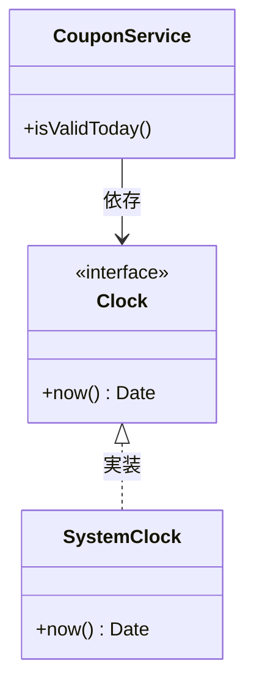
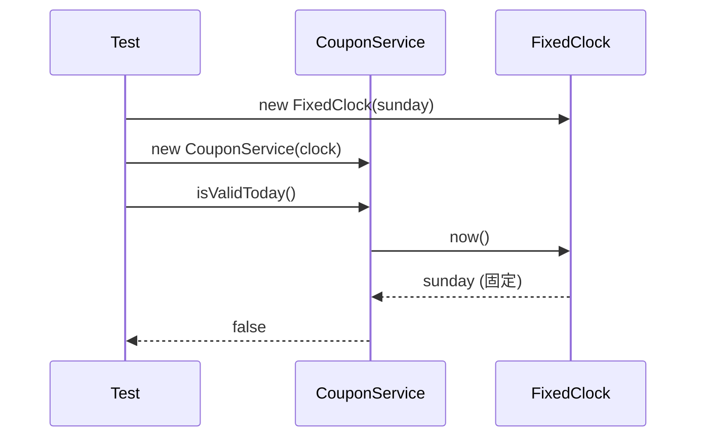

# 第05章：依存を「外から渡す」🚚💨（＝差し替えできる設計の入口）🧩✨

## この章でできるようになること🎯😊

* 「クラスの中で `new` しちゃう問題」を説明できる🧠💡
* 依存（Dependency）を **外から渡して**、差し替え可能にできる🔁✨
* テストで「時間」「乱数」「通信」みたいな厄介ポイントをラクに扱える🧪⌚🎲🌐

---

## 1) そもそも「依存」ってなに？🤔🧩

**依存**は、ざっくり言うと「そのクラスが仕事をするために頼ってる部品」のことだよ〜😊🧩

たとえば👇

* 時間：`Date` / `Date.now()` ⌚
* 乱数：`Math.random()` 🎲
* ログ：`console.log` 📝
* 通信：`fetch` 🌐
* 保存：DB・ファイル・localStorage など💾

こういうのって **現実世界（外部）に触れる** から、テストや仕様変更のときにややこしくなりがち😵‍💫💦

---

## 2) 「中で new」すると何が困るの？😇💥

### ダメな例：クラスが自分で部品を作っちゃう🧨

```ts
class CouponService {
  private logger = console; // 直接依存（差し替えづらい）
  
  isValidToday(): boolean {
    const today = new Date(); // 時間に直結（テストつらい）
    this.logger.log("checking...");
    return today.getDay() !== 0; // 日曜は無効、とか
  }
}
```

これ、ぱっと見は普通なんだけど…👇😇

* **テストで「日曜日」を再現したい** → 無理〜！😱⌚
* ログを「テスト用の静かなやつ」にしたい → 変えにくい😵
* 将来「別の時計（サーバ時刻/モック）にしたい」→ クラスを直す羽目🔧💦

> つまり、**差し替えができない**＝変更に弱い…ってことだね🥺

---

## 3) 解決：依存を「外から渡す」🚚📦✨（DIの超基本）


### ✅ いちばん基本：コンストラクタで受け取る（おすすめNo.1）🥇✨

「あなた（クラス）が使う部品は、外から渡すね〜」って感じ😊

---

## 4) 例：`Clock` を渡して「時間依存」を外に出す⌚🔁

### Step A：まず “約束” を作る（interface）📜✨

```ts
export interface Clock {
  now(): Date;
}
```

### Step B：本番用の実装（SystemClock）🖥️⌚

```ts
export class SystemClock implements Clock {
  now(): Date {
    return new Date();
  }
}
```

### Step C：サービスは “Clock を受け取るだけ” にする📦🧩

```ts
import type { Clock } from "./Clock";

export class CouponService {
  constructor(private readonly clock: Clock) {}

  isValidToday(): boolean {
    const today = this.clock.now();
    return today.getDay() !== 0;
  }
}
```

🌟ポイント🌟

* `CouponService` は **「時間の取り方」を知らない**
* ただ `clock.now()` を呼ぶだけ
* だから、時計を差し替えできる🔁✨



---

## 5) テストが一気にラクになる🧪🥳（固定の時計を渡す）

### テスト用の時計（FixedClock）⌚🧊

```ts
import type { Clock } from "./Clock";

export class FixedClock implements Clock {
  constructor(private readonly fixed: Date) {}
  now(): Date {
    return this.fixed;
  }
}
```

### Vitestでの超シンプル例🧪✨

（VitestはVite系でよく使われていて、最新版は v4 系が大きな区切りだよ〜）([vitest.dev][1])

```ts
import { describe, it, expect } from "vitest";
import { CouponService } from "./CouponService";
import { FixedClock } from "./FixedClock";

describe("CouponService", () => {
  it("日曜は無効", () => {
    const sunday = new Date("2026-01-11T12:00:00+09:00"); // 日曜
    const service = new CouponService(new FixedClock(sunday));
    expect(service.isValidToday()).toBe(false);
  });

  it("月曜は有効", () => {
    const monday = new Date("2026-01-12T12:00:00+09:00"); // 月曜
    const service = new CouponService(new FixedClock(monday));
    expect(service.isValidToday()).toBe(true);
  });
});
```

「日曜日を作る」→「時計を渡す」だけで再現できた！🥳🎉
これが **依存を外に出す強さ** だよ〜💪✨



---

## 6) 依存の渡し方いろいろ（でも迷ったらコレ！）🧭😊

### 🥇(1) コンストラクタ注入（基本の王道）👑

* 依存が必須ならこれ！
* 作る瞬間に必要な部品が全部そろう📦✨

### 🥈(2) 引数で注入（その呼び出しだけ変えたい時）📞

```ts
type Logger = { log: (...args: any[]) => void };

function doSomething(logger: Logger) {
  logger.log("hi");
}
```

### 🥉(3) Factoryを注入（作るタイミングを遅らせたい）🏭

「必要になったら作る」系に便利🔧

### ⚠️(4) プロパティ注入（初心者は避けがち推奨）🙅‍♀️

* セットし忘れで事故りやすい😇💥
* 「いつ入るの？」が追いにくい

---

## 7) 「じゃあ `new` はどこでやるの？」🏠🧩

**答え：組み立て担当の場所でやる！**（入口・起動コード）🚪✨

```ts
import { CouponService } from "./CouponService";
import { SystemClock } from "./SystemClock";

// ここは“組み立て係”
const service = new CouponService(new SystemClock());

console.log(service.isValidToday());
```

サービス本体は「組み立て」しない。
**組み立て担当に任せる**と、差し替えが超簡単になるよ🔁🥰

---

## 8) よくある「差し替え候補」ランキング🏆✨

今後すぐ効くやつだけ覚えよう〜😊🫶

1. **時間**：`Date.now()` → `Clock` ⌚
2. **乱数**：`Math.random()` → `Random` 🎲
3. **通信**：`fetch()` → `HttpClient` 🌐
4. **保存**：DB/Storage → `Repository` / `Storage` 💾
5. **ログ**：`console` → `Logger` 📝

---

## 9) AI拡張に頼むと爆速🤖⚡（でも最後は人間チェック👀✅）

### 依頼文テンプレ（そのまま投げてOK）💬✨

* 「このクラス内で `new` している依存を、コンストラクタ注入に直して。`interface` も作って。」🧩
* 「`Date.now()` を `Clock` に置き換えて、テスト用の `FixedClock` も作って。」⌚🧪
* 「この `fetch` 直書きを `HttpClient` 経由にして差し替え可能にして。」🌐🔁

### チェック項目（ここだけ見ればOK）✅👀

* 依存の型（interface）が “小さすぎ/大きすぎ” になってない？📏
* クラスが “組み立て係” をやってない？（newしてない？）🏗️
* テストで差し替えできる？🧪✨

---

## 10) ミニ演習✍️😊（10分でOK）

次のコードを「外から渡す」形に直してみよう〜🧩💨

### お題：`Math.random()` と `Date` を外に出す🎲⌚

* `Random`（`next()`）と `Clock`（`now()`）を作る
* `LuckyService` にコンストラクタで渡す
* テストでは固定値を返すFakeを渡す

---

## 章末ミニテスト📝💯（サクッと！）

1. 「クラス内で `new` すると困る」最大の理由は？
   A. コードが長くなるから
   B. 差し替えができず、変更やテストがつらくなるから
   C. TypeScriptのコンパイルが遅くなるから

2. 依存を渡す方法で、基本のおすすめは？
   A. プロパティ注入
   B. コンストラクタ注入
   C. グローバル変数

（答え：1=B、2=B 🎉）

---

## 最新事情ちょいメモ📌✨（2026-01時点）

* TypeScriptは **5.9 系（5.9.3 が Latest 表示）**で進化中だよ🧠✨ ([GitHub][2])
* Node.jsはセキュリティ更新が頻繁なので、**LTSの更新チェック**は習慣にすると安心🔒（例：22.22.0 LTS のセキュリティリリースなど）([Node.js][3])
* Vite系ツールは Node の最低バージョン条件があるので、そこだけ注意だよ〜⚙️ ([vitejs][4])
* さらに先の話だけど、TypeScriptは **高速化（ネイティブ化）方向**の動きも進んでるよ🚀 ([Microsoft Developer][5])

---

## 次章の予告🎀➡️

次は「小さな責務に分けるコツ」✂️✨
依存を外に出せるようになった今、**クラスを小さく分ける**と合成が一気に気持ちよくなるよ〜🥰🧩💕

必要なら、この第5章に「完成プロジェクト一式の構成（フォルダ/ファイル案）」も付けて、コピペで動く形にして出すね😊💖

[1]: https://vitest.dev/blog/vitest-4?utm_source=chatgpt.com "Vitest 4.0 is out!"
[2]: https://github.com/microsoft/typescript/releases "Releases · microsoft/TypeScript · GitHub"
[3]: https://nodejs.org/en/blog/release/v22.22.0?utm_source=chatgpt.com "Node.js 22.22.0 (LTS)"
[4]: https://vite.dev/guide/?utm_source=chatgpt.com "Getting Started"
[5]: https://developer.microsoft.com/blog/typescript-7-native-preview-in-visual-studio-2026?utm_source=chatgpt.com "TypeScript 7 native preview in Visual Studio 2026"
