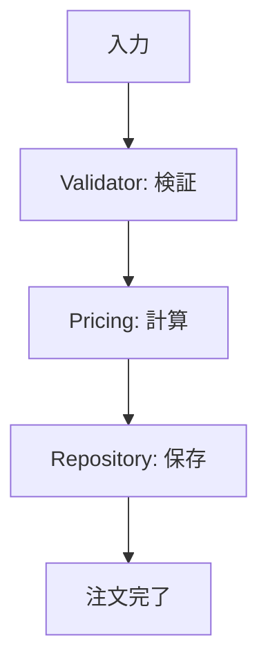

# 第06章：合成の第一歩🧩「小さな責務」に分けるコツ✂️✨

この章はね、「合成（Composition）」に入るための**超・大事な準備運動**だよ〜！🏃‍♀️💨
いきなりStrategyとかDecoratorとかに行く前に、まずは **“分けられる”** って力を付けるのが最強です💪✨

---

## 6.0 この章でできるようになること🎯✨

* 「この関数、でかすぎ…😇」を **分ける判断**ができるようになる
* 「検証✅」「計算🧮」「保存💾」みたいに、**役割ごと**に切り分けられる
* 分けた部品を **あとで合成しやすい形**にできる（＝継承より強い🔥）

---

## 6.1 「責務」ってなに？🤔🧠


「責務」って、むずかしい言葉に見えるけど、超ざっくり言うと👇

> **そのコードが“何のために存在してるか”**
> **そして、何が起きたら変更されるか（＝変更理由）**

たとえば `createOrder()` がこんなこと全部やってたら…😵‍💫

* 入力のチェック（検証✅）
* 価格計算（計算🧮）
* DB保存（保存💾）
* メール送信（通知📧）
* ログ出力（監視📝）

これ、変更理由がバラバラだよね？

* 「バリデーション仕様が変わった」
* 「割引ルールが変わった」
* 「DBが変わった」
* 「通知方法が変わった」

👉 **変更理由が多い＝責務が混ざってる**サインだよ🚨

---

## 6.2 分割のコツ3つ🍀（この3つだけ覚えてOK！）

### コツ①：名前に **and**（〜と〜）が入ってたら分割候補✂️🧩

例：

* `validateAndSaveUser()`
* `calculateAndPersistInvoice()`
* `createOrderAndSendEmail()`

「やること2つ書いてある」＝ **責務2つ以上**の可能性大！😇

---

### コツ②：`if` が増えてきたら分割候補🌳💥

`if` が増える理由ってだいたい👇

* ルールが増えた（例：会員/非会員、国内/海外、クーポン種類…）
* 例外パターンが増えた（例：在庫なし、上限超え…）

最初は小さくても、放置すると **分岐ジャングル**になります🌴🧟‍♀️
👉 「分岐の塊」は、Strategyとかに進化させやすい✨（7章につながるよ！）

---

### コツ③：テストが書きにくかったら分割候補🧪😵

テストしづらい理由の代表👇

* DBや外部APIに触ってる（遅い・不安定）
* 時間や乱数に依存してる（毎回結果が違う）
* 1回のテストで確認したいことが多すぎる

👉 **テストしづらい＝責務が混ざってる**が多いよ〜！

（ちなみに、TypeScript自体の最新版は 5.9.3 が “latest” として公開されてるよ📦✨） ([npm][1])
（テストフレームワークは Vitest 4 系が主流に進んでる流れだよ🧪✨） ([vitest.dev][2])

---

## 6.3 ミニ演習✍️：でかい関数を「検証」「計算」「保存」に割ろう✅🧮💾

ここからが本番！🔥
まずは「ありがちな地獄コード」からスタートします😇

---

### 6.3.1 まずは “分ける前” のコード（でかい関数）💥

```ts
// order.ts
type Item = { sku: string; price: number; qty: number };
type CreateOrderInput = {
  userId: string;
  items: Item[];
  couponCode?: string;
};

type Order = {
  id: string;
  userId: string;
  items: Item[];
  subtotal: number;
  discount: number;
  total: number;
  createdAt: Date;
};

export async function createOrder(input: CreateOrderInput): Promise<Order> {
  // ① 検証（バリデーション）
  if (!input.userId) throw new Error("userId is required");
  if (!input.items || input.items.length === 0) throw new Error("items is required");
  for (const item of input.items) {
    if (!item.sku) throw new Error("sku is required");
    if (item.price <= 0) throw new Error("price must be > 0");
    if (item.qty <= 0) throw new Error("qty must be > 0");
  }

  // ② 計算（価格・割引）
  const subtotal = input.items.reduce((sum, x) => sum + x.price * x.qty, 0);

  let discount = 0;
  if (input.couponCode) {
    if (input.couponCode === "WELCOME10") discount = Math.floor(subtotal * 0.1);
    else if (input.couponCode === "VIP20") discount = Math.floor(subtotal * 0.2);
    else throw new Error("invalid coupon");
  }

  const total = subtotal - discount;

  // ③ 保存（DBのつもり）
  // 本当はDBだけど、ここでは擬似的に保存したことにする
  const order: Order = {
    id: "ord_" + Math.random().toString(16).slice(2),
    userId: input.userId,
    items: input.items,
    subtotal,
    discount,
    total,
    createdAt: new Date(),
  };

  // await db.orders.insert(order) 的なことをしたい気持ち
  return order;
}
```

うん、ありがち！😂
でもこれ、将来つらいポイントがいっぱい👇

* クーポン増えたら `if/else` が地獄👻
* 保存先が変わったら、計算まで触りがち😇
* 検証だけテストしたいのに、全部動かす羽目になる🧪💦

---

## 6.4 ステップ1：まず「検証✅」を外に出す✂️✨

「検証」は変更理由が独立してることが多いよね。
だから最初に抜くと効果がデカい！💪

```ts
// validator.ts
import type { CreateOrderInput } from "./types";

export function validateCreateOrderInput(input: CreateOrderInput): void {
  if (!input.userId) throw new Error("userId is required");
  if (!input.items || input.items.length === 0) throw new Error("items is required");

  for (const item of input.items) {
    if (!item.sku) throw new Error("sku is required");
    if (item.price <= 0) throw new Error("price must be > 0");
    if (item.qty <= 0) throw new Error("qty must be > 0");
  }
}
```

---

## 6.5 ステップ2：「計算🧮」を外に出す✂️✨

計算も、仕様変更が入りやすいゾーン！
（割引、税、送料…ぜったい増える😂）

```ts
// pricing.ts
import type { CreateOrderInput } from "./types";

export type PricingResult = {
  subtotal: number;
  discount: number;
  total: number;
};

export function calculatePricing(input: CreateOrderInput): PricingResult {
  const subtotal = input.items.reduce((sum, x) => sum + x.price * x.qty, 0);

  let discount = 0;
  if (input.couponCode) {
    if (input.couponCode === "WELCOME10") discount = Math.floor(subtotal * 0.1);
    else if (input.couponCode === "VIP20") discount = Math.floor(subtotal * 0.2);
    else throw new Error("invalid coupon");
  }

  return {
    subtotal,
    discount,
    total: subtotal - discount,
  };
}
```

---

## 6.6 ステップ3：「保存💾」を外に出す（Repositoryにする）📦✨

保存は、DB・API・ファイル…変わりやすい！
なので **“保存専用の部品”** にしちゃおう🧩

```ts
// repository.ts
import type { Order } from "./types";

export interface OrderRepository {
  save(order: Order): Promise<void>;
}

// いまはメモリ保存（あとでDB版に差し替えやすい✨）
export class InMemoryOrderRepository implements OrderRepository {
  private readonly orders: Order[] = [];

  async save(order: Order): Promise<void> {
    this.orders.push(order);
  }

  // デバッグ用（本番ではなくてもOK）
  list(): Order[] {
    return [...this.orders];
  }
}
```

---

## 6.7 最後に「合成」する🧩✨（部品を組み立ててサービスにする）


ここが **合成優先の気持ちよさ**ポイント！🥳
分けた部品を “持って” 使うだけ！

```ts
// types.ts
export type Item = { sku: string; price: number; qty: number };

export type CreateOrderInput = {
  userId: string;
  items: Item[];
  couponCode?: string;
};

export type Order = {
  id: string;
  userId: string;
  items: Item[];
  subtotal: number;
  discount: number;
  total: number;
  createdAt: Date;
};
```

```ts
// orderService.ts
import type { CreateOrderInput, Order } from "./types";
import { validateCreateOrderInput } from "./validator";
import { calculatePricing } from "./pricing";
import type { OrderRepository } from "./repository";

export class OrderService {
  constructor(private readonly repo: OrderRepository) {}

  async create(input: CreateOrderInput): Promise<Order> {
    // ✅検証
    validateCreateOrderInput(input);

    // 🧮計算
    const pricing = calculatePricing(input);

    // 💾保存
    const order: Order = {
      id: "ord_" + Math.random().toString(16).slice(2),
      userId: input.userId,
      items: input.items,
      subtotal: pricing.subtotal,
      discount: pricing.discount,
      total: pricing.total,
      createdAt: new Date(),
    };

    await this.repo.save(order);
    return order;
  }
}
```



🎉できた！
これでもう、将来こういうことが超やりやすい👇

* 「保存だけDBにしたい」→ Repository差し替え🔁
* 「クーポン増やしたい」→ pricing だけ触る🧮
* 「検証ルール変えたい」→ validator だけ触る✅

---

## 6.8 テストが一気にラクになる🧪✨（ここがご褒美！）

分けると、テストが “細く” 書ける！😆
たとえば pricing だけテストしたいなら👇

```ts
// pricing.test.ts（例：Vitest）
import { describe, it, expect } from "vitest";
import { calculatePricing } from "./pricing";

describe("calculatePricing", () => {
  it("WELCOME10で10%割引になる", () => {
    const result = calculatePricing({
      userId: "u1",
      items: [{ sku: "A", price: 1000, qty: 2 }],
      couponCode: "WELCOME10",
    });

    expect(result.subtotal).toBe(2000);
    expect(result.discount).toBe(200);
    expect(result.total).toBe(1800);
  });
});
```

（Vitest は4系が大きく進んでいて、現代TS開発での採用が増えてるよ🧪✨） ([vitest.dev][2])

---

## 6.9 よくある失敗あるある😇🕳️（回避しよ！）

* **分けすぎて迷子**：ファイルが増えすぎて「どこ？」ってなる
  👉 まずはこの章みたいに **3分割（検証/計算/保存）**で十分◎
* **“万能utils”に突っ込む**：`utils.ts` がブラックホール化🕳️
  👉 `validator.ts` / `pricing.ts` みたいに **責務名で分ける**のが正義✨
* **データ構造がグチャる**：あちこちで `{ subtotal, discount... }` がバラバラ
  👉 `PricingResult` みたいに型を作って揃える🧩

---

## 6.10 AI拡張の使いどころ🤖✨（丸投げじゃなく“分割支援”に！）

### おすすめプロンプト例🗣️💡

* 「この関数を **検証 / 計算 / 保存** に分割して。ファイル分割案も出して」
* 「責務が混ざってる箇所を指摘して、**変更理由**ごとに切って」
* 「テストが書きやすい形にしたい。**外部依存**を分けて」

### AIの出力をチェックする観点👀✅

* 分けたあと、**それぞれの役割が1行で説明できる？**
* 変更が入ったとき、**触るファイルが最小になった？**
* 余計な抽象（interface乱立）になってない？😇

---

## 章末ミニ問題🎮✨

### Q1️⃣：分割候補はどれ？

* A. `parseUserName()`
* B. `validateAndSaveUser()`
* C. `getUser()`

👉 答え：**B**（and が入ってる＝2責務っぽい✂️）

### Q2️⃣：「ifが増えた」って、次の章（Strategy）でどう活きそう？

👉 ヒント：**“やり方だけ差し替える”** に進化できるよ🔁✨

---

## まとめ🧩✨

この章の結論はこれ👇

* **責務＝変更理由のまとまり**
* 「and」「if増殖」「テストしづらい」は分割サイン🚨
* まず **検証✅ / 計算🧮 / 保存💾** の3分割で勝てる🏆
* 分けたら、合成（部品を持って組み立てる）が自然にできる🧩✨

---

次の章（第7章）は、今日の「if増殖」を救う **Strategy（戦略）** に行けるよ〜！🚚🔁💖

[1]: https://www.npmjs.com/package/typescript?utm_source=chatgpt.com "TypeScript"
[2]: https://vitest.dev/blog/vitest-4?utm_source=chatgpt.com "Vitest 4.0 is out!"
