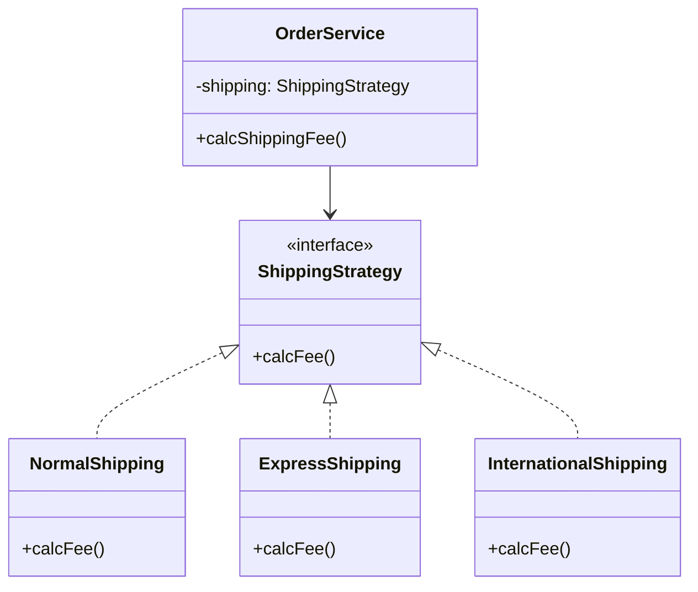

# 第07章：合成の型① Strategy（戦略）で差し替える🧠🔁🚚✨

## この章でできるようになること🎯

* 「**やり方だけ**変えたい」を、継承なしでスッと差し替えできるようになる🧩✨
* `if/switch` 地獄を「部品（Strategy）」に分けて、追加変更に強くする🔧💪
* テストで「この戦略はこの結果」をサクッと保証できる✅🧪

---

## まずは“あるある地獄”を見よう😇💥


送料って、だんだん増えがちだよね…🚚✈️🌍
「通常」「速達」「海外」「クール便」「会員無料」…みたいに。

こんなコード、見たことない？👀

```ts
type ShippingType = "normal" | "express" | "international";

type Order = {
  subtotal: number;
  weightKg: number;
  countryCode: string; // "JP" とか "US" とか
  shippingType: ShippingType;
};

export function calcShippingFee(order: Order): number {
  switch (order.shippingType) {
    case "normal":
      return Math.ceil(order.weightKg) * 500;

    case "express":
      return Math.ceil(order.weightKg) * 900 + 300;

    case "international":
      if (order.countryCode === "US") return 2500 + order.weightKg * 1200;
      return 3200 + order.weightKg * 1400;

    default: {
      const _exhaustive: never = order.shippingType;
      return _exhaustive;
    }
  }
}
```

### これ、何がツラいの？🥲

* 送料ルールが増えるたびに `calcShippingFee` が肥大化🐷
* 「海外の計算だけ変えたい」でも、関数全体に手を入れることになる😵
* テストが「パターン×条件」で爆発しやすい💣🧪

ここで **Strategy（戦略）** の出番！🎉

---

## Strategyってなに？🧠✨（超ざっくり）


**Strategyパターン＝「カートリッジ式」🎮✨**

**「同じ目的（送料計算）だけど、やり方が複数ある」**ときに
**やり方を“部品”として外に出して、差し替え可能にする**パターンだよ🔁🧩

イメージ👇

* `OrderService`（注文の流れ）

  * 「送料は…ShippingStrategyさんお願い🙏」
* `NormalShipping` / `ExpressShipping` / `InternationalShipping`

  * 「はい！私が計算します💪」

---

## 例題：ShippingStrategy を作って差し替える🚚✈️🌍


### Step 1) “戦略が受け取る情報”を整える📦✨

戦略に `Order` を丸ごと渡すと、戦略が注文全体に依存しがちで後で重くなることあるよ🙃
今回は送料に必要な情報だけに絞って、`ShippingContext` にするね🧠🍀

```ts
export type ShippingContext = {
  weightKg: number;
  countryCode: string;
  subtotal: number;
};
```

### Step 2) Strategy の interface を作る📜✨


「送料を計算できるならOK」という約束！

```ts
import type { ShippingContext } from "./ShippingContext";

export interface ShippingStrategy {
  calcFee(ctx: ShippingContext): number;
  readonly name: string; // ログや画面表示に便利✨
}
```

### Step 3) 戦略（実装）を3つ作る🧩🧩🧩

```ts
import type { ShippingContext } from "./ShippingContext";
import type { ShippingStrategy } from "./ShippingStrategy";

export class NormalShipping implements ShippingStrategy {
  readonly name = "normal";
  calcFee(ctx: ShippingContext): number {
    return Math.ceil(ctx.weightKg) * 500;
  }
}

export class ExpressShipping implements ShippingStrategy {
  readonly name = "express";
  calcFee(ctx: ShippingContext): number {
    return Math.ceil(ctx.weightKg) * 900 + 300;
  }
}

export class InternationalShipping implements ShippingStrategy {
  readonly name = "international";
  calcFee(ctx: ShippingContext): number {
    if (ctx.countryCode === "US") return 2500 + ctx.weightKg * 1200;
    return 3200 + ctx.weightKg * 1400;
  }
}
```

### Step 4) “使う側”は委譲するだけ🙏✨


`OrderService` は「送料の計算の中身」を知らなくてOKになる👍

```ts
import type { ShippingStrategy } from "./ShippingStrategy";
import type { ShippingContext } from "./ShippingContext";

export class OrderService {
  constructor(private readonly shipping: ShippingStrategy) {}

  calcShippingFee(ctx: ShippingContext): number {
    return this.shipping.calcFee(ctx); // ← ここが委譲✨
  }
}
```



---

## Step 5) “どの戦略を使うか”を決める場所を作る🧭✨


ここが超大事ポイント！
**戦略を選ぶ判断（if/switch）は“1か所に閉じ込める”**と運用がラクになるよ🧠🔒

```ts
import type { ShippingStrategy } from "./ShippingStrategy";
import { NormalShipping, ExpressShipping, InternationalShipping } from "./Strategies";

export type ShippingType = "normal" | "express" | "international";

export function createShippingStrategy(type: ShippingType): ShippingStrategy {
  switch (type) {
    case "normal":
      return new NormalShipping();
    case "express":
      return new ExpressShipping();
    case "international":
      return new InternationalShipping();
    default: {
      const _exhaustive: never = type;
      return _exhaustive;
    }
  }
}
```

> 💡「結局 switch あるじゃん！」って思った？
> うん、ある！でも **“選ぶ場所”がここだけ** になったのが勝ち🏆✨
> 送料ロジックの増減で、注文処理が壊れにくいよ💪

---

## ここで “継承でやると” 何が起きる？😇💣


例えば `Order` を継承で分け始めると…

* `NormalOrder`
* `ExpressOrder`
* `InternationalOrder`
* `InternationalExpressOrder`（ん？）
* `InternationalExpressMemberOrder`（え？）

みたいに組み合わせで増殖しがち🧟‍♀️🧟‍♂️
Strategyだと **「やり方の部品」だけ増える**から、爆発しにくい🧩✨

---

## テストして「差し替え」を安心にする🧪✅

Strategy はテストが超やりやすいよ〜！🎉
戦略単体で「入力→出力」を確認するだけでOK。

最近の定番として **Vitest 4 系**が使われがち（2026-01-15時点でも4系のリリースが継続）。([GitHub][1])

```ts
import { describe, it, expect } from "vitest";
import { NormalShipping, ExpressShipping, InternationalShipping } from "./Strategies";

describe("Shipping strategies", () => {
  it("normal", () => {
    const s = new NormalShipping();
    expect(s.calcFee({ weightKg: 1.2, countryCode: "JP", subtotal: 5000 })).toBe(1000);
  });

  it("express", () => {
    const s = new ExpressShipping();
    expect(s.calcFee({ weightKg: 1.2, countryCode: "JP", subtotal: 5000 })).toBe(2100);
  });

  it("international US", () => {
    const s = new InternationalShipping();
    expect(s.calcFee({ weightKg: 2, countryCode: "US", subtotal: 5000 })).toBe(2500 + 2 * 1200);
  });
});
```

---

## Strategy設計のコツ3つ🍀✨（超重要）

### ① Strategyの入力は「必要最小限」にする📦

`Order` 全部渡すより、`ShippingContext` みたいに絞ると
あとで注文周りの変更が起きても巻き込まれにくいよ🔒✨

### ② 戦略の“粒度”を揃える🎚️

* 粒度がデカすぎ：戦略が何でも屋になって混乱😵‍💫
* 粒度が小さすぎ：戦略が細切れで追えない🫠

「送料計算」みたいに **目的がはっきり1つ**だと成功しやすいよ🎯✨

### ③ “選ぶロジック”を1か所に閉じ込める🧭

`createShippingStrategy` みたいな場所を作ると
「追加・変更」がそこだけで済むことが増えるよ🔁✨

---

## ミニ演習✍️🎀（この章のコア練習！）

### 演習A：if/switch送料計算をStrategy化しよう🔧

1. 既存の `calcShippingFee` を残したまま、Strategy版を追加
2. テストが通ることを確認
3. 最後に古い `switch` 版を消す（消す前にGitで差分見てね👀✨）

### 演習B：新しい送料「無料(FreeShipping)」を追加しよう🎁

条件例：`subtotal >= 10000` なら送料0円💰✨
ヒント：戦略を増やす？それとも「選ぶ側」に条件を入れる？
（答え：まずは**選ぶ側**に条件入れるのがシンプルだよ👍）

### 演習C：AIに手伝ってもらう🤖✨（でも主導権はあなた！）

Copilot/Codexにこう頼むと速いよ👇

* 「`ShippingStrategy` を導入して、既存の送料switchをStrategyに分離して」
* 「`ShippingContext` を作って、Order全体への依存を減らして」
* 「Vitestで戦略ごとの単体テストも追加して」

✅ チェックするところ（人間の仕事）

* 戦略が `Order` にベタ依存してない？
* `createShippingStrategy` が“巨大if”になってない？
* テストが「戦略単体」になってる？（OrderService全体を絡めすぎない）

---

## 章末ミニクイズ🎮✨（サクッと！）

1. Strategyは「何を差し替える」ための部品？🧠
2. `if/switch` はどこに置くといい？🧭
3. Strategyに `Order` 全部渡すデメリットを1つ言える？📦

---

## まとめ📌💖

* Strategyは「**やり方だけ変えたい**」を、部品として差し替える仕組み🧩🔁
* `if/switch` を消すことが目的じゃなくて、**“1か所に閉じ込める”**のが目的🧠🔒
* Strategyは単体テストがしやすくて、追加変更に強い🧪✅
* 2026-01-15時点でも TypeScript は 5.9 系が安定版として提供され、`--module node20` などの選択肢も整備が進んでるよ。([GitHub][2])

---

次の第8章は、「Strategyの設計ポイント（差し替え点のサイズ感🎯）」をもっと上手にする回だよ〜！😊✨

[1]: https://github.com/vitest-dev/vitest/releases?utm_source=chatgpt.com "Releases · vitest-dev/vitest"
[2]: https://github.com/microsoft/typescript/releases?utm_source=chatgpt.com "Releases · microsoft/TypeScript"
