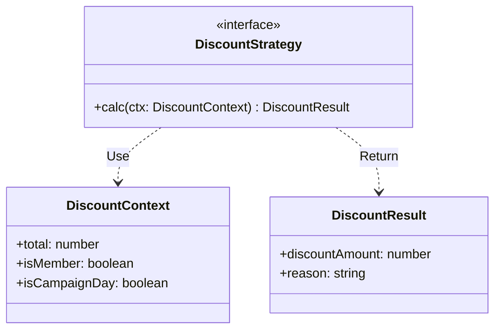

# 第08章：Strategyの設計ポイント✨「どこを差し替え点にする？」🎯🧩

この章は、**Strategyパターンを“動く”だけで終わらせず、あとから増やしても壊れにくい形**にするための「設計のコツ」を身につける回だよ〜🫶✨
（TypeScriptは現行の **5.9系**が最新安定として扱えるよ📌 ([GitHub][1])）

---

## 1) 今日のゴール🎯✨

* 「どこを差し替え点（Strategy）にするべきか」を決められる🧠🔁
* Strategyの`interface`（または関数型）を**ちょうどいい粒度**で作れる🧩
* 追加のStrategyが増えても、呼び出し側（本体）がグチャらないようにできる🧼✨

---

## 2) まず結論：差し替え点は「変わる理由」で切る✂️💡


Strategyって、「やり方だけ入れ替えたい」ための仕組みだよね🔁
だから差し替え点はこれで決めると迷いにくいよ👇

### ✅ 差し替え点を決める3ステップ

1. **変わるのは何？**（送料？割引？並び替え？認証？）🕵️‍♀️
2. **変わらないのは何？**（注文の流れ・入力データ・結果の形）🧱
3. **“入力と出力”を揃える**（同じ形で呼べて、同じ形で返る）📥➡️📤

> ここが揃うと、Strategyは「交換可能な部品」になるよ🧩✨

---

## 3) よくある失敗①：差し替え点が“大きすぎる”🙃💥

「なんでもできるStrategy」を作ると、**呼び出し側がStrategyの都合を知りすぎる**のが事故の元…😇

### 🚫 悪い例：巨大インターフェース（なんでも詰め込み）

```ts
type Order = { total: number; destination: "JP" | "GLOBAL"; isMember: boolean };

interface PricingStrategyTooBig {
  // 値引きも送料も税も、ぜんぶここで…（でかすぎ！）
  calcDiscount(order: Order): number;
  calcShipping(order: Order): number;
  calcTax(order: Order): number;

  // さらにログやメトリクスまで…（責務混線😭）
  log?(msg: string): void;
}
```

**何がつらい？**😵‍💫

* 送料だけ変えたいのに、税のメソッドまで実装が必要になったりする
* Strategyの追加・変更が起きるたびに`interface`が肥大化しやすい
* 結果として **交換しやすいはずが交換しにくい**🙃

✅ **改善の方向性**：
「変わる理由」を1つに絞って、**1メソッド**に寄せよう🧼✨

---

## 4) よくある失敗②：差し替え点が“小さすぎる”😵‍💫🧩

逆に、細かく切りすぎると、Strategyが増えすぎて「部品管理」が地獄になるよ…📦📦📦

例：

* `calcBaseShipping` / `calcFuelSurcharge` / `calcRemoteAreaFee` / `calcHandlingFee` …
  こうなると、「送料」という1つの関心ごとがバラバラになって、結局まとめ役が必要に…😇

✅ **改善の方向性**：
「同じ目的に向かう計算」はまとめて、**粒度を“目的単位”**にする🎯

---

## 5) ちょうどいい形：Strategyは「入力→出力」を1本化する🪄✨

ここが一番きれいになりやすい基本形👇

### 🌟 良い例：送料Strategy（1メソッドに集約）

```ts
type Order = {
  total: number;
  destination: "JP" | "GLOBAL";
  weightKg: number;
};

type ShippingFee = number;

interface ShippingStrategy {
  calc(order: Order): ShippingFee;
}
```

* 「送料を計算する」という**1目的**に集中できる🎯
* 追加の送料ルールが増えても、`calc`を実装するだけ🧩
* 呼び出し側はいつも同じ形で呼べる🔁✨

---

## 6) 設計のコツ：Strategyに渡す“引数”を整理する📦✨

### ✅ コツA：引数が増えだしたら「Contextオブジェクト」にまとめる

`calc(total, destination, weight, isMember, ...)` みたいに引数が増えるのはあるある😅
そんなときは **1つの箱（Context）**にまとめると安定するよ📦✨

```ts
type ShippingContext = {
  orderTotal: number;
  destination: "JP" | "GLOBAL";
  weightKg: number;
  isMember: boolean;
};

interface ShippingStrategy {
  calc(ctx: ShippingContext): number;
}
```

ポイントは、Contextを「そのStrategyの関心」に合わせて作ること🎯
（なんでもかんでも入れる“巨大Context”はまた肥大化の原因🙃）

---

### ✅ コツB：Strategyが“戻すもの”も揃える（戻り値の形を安定させる）

もし将来「料金だけじゃなく理由も返したい」ってなったら、戻り値をオブジェクトにすると強いよ🧾✨

```ts
type ShippingQuote = {
  fee: number;
  label: "STANDARD" | "EXPRESS" | "INTERNATIONAL";
};

interface ShippingStrategy {
  calc(ctx: { destination: "JP" | "GLOBAL"; weightKg: number }): ShippingQuote;
}
```

---

### ✅ コツC：Strategyを“状態あり”にするか決める（classか関数か）🤔

* **状態いらない** → 関数Strategyが軽い🪶（第9章の伏線✨）
* **設定値（例：地域別レート）を持ちたい** → classが楽📘

---

## 7) 呼び出し側（本体）を美しく保つルール💎✨

Strategyを導入したのに、本体がこうなったら危険信号🚨

* 本体が `if (strategy is ...)` みたいに**Strategyの種類を判定**してる
* 本体が「このStrategyにはこの追加引数が必要だから…」と**個別対応**してる

✅ こうならないために：
**本体は“Strategyの中身を知らない”**を守ろう🕶️✨
本体は「呼ぶだけ」📞、ルールはStrategyの中に置く🧩

---

## 8) ミニ実装：差し替え点の決め方（答えが見える例）👀✨

### お題🛒：割引（Discount）をStrategyにしたい

要件：

* 会員は10%OFF
* 合計が10,000円以上なら500円引き
* キャンペーン日は15%OFF（最優先）

### ① 差し替え点はどこ？🎯

「割引の決め方」が変わる理由だよね → **DiscountStrategy** が自然🙆‍♀️

### ② “入力と出力”を揃える📥➡️📤

```ts
type DiscountContext = {
  total: number;
  isMember: boolean;
  isCampaignDay: boolean;
};

type DiscountResult = {
  discountAmount: number;
  reason: string;
};

interface DiscountStrategy {
  calc(ctx: DiscountContext): DiscountResult;
}
```



---

## 9) 演習✍️🧩（あなたが`interface`を決める回！）

### 📝 問題

「送料Strategy」を作りたい。要件はこう👇

* 国内：重さで変わる（〜1kg: 500円、1〜5kg: 800円、5kg〜: 1200円）
* 海外：基本2000円＋重さ×300円
* 将来、**離島料金**が追加されるかも

### ✅ あなたの仕事

1. `ShippingContext`に何を入れる？📦
2. `ShippingStrategy`の`calc`は何を返す？📤
3. “離島料金”が増えても壊れにくい形にするには？🧠✨

---

### 💡 模範解答（例）

```ts
type ShippingContext = {
  destination: "JP" | "GLOBAL";
  weightKg: number;
  isRemoteIsland: boolean; // 将来の差分に備える
};

type ShippingQuote = {
  fee: number;
  breakdown: string[]; // 後から説明を足せる
};

interface ShippingStrategy {
  calc(ctx: ShippingContext): ShippingQuote;
}
```

「離島料金」の追加も、**Contextにフラグがある**＆**戻り値に内訳が持てる**ので、拡張しやすいよ🧩✨

---

## 10) AI（Copilot/Codex）を使うときの“良い頼み方”🤖💬✨

そのままコピペで使えるやつ置いとくね🫶

* 「送料のStrategyを作りたい。要件は〜。`ShippingContext`と戻り値の型も提案して。粒度が大きすぎ/小さすぎにならないように理由も添えて」
* 「この`calc(total, destination, weight, ...)`をContextオブジェクトにまとめて、呼び出し側の変更を最小にして」
* 「Strategyの差し替え点が妥当か、将来の追加要件（離島料金）を想定してレビューして」

レビュー観点はこれだけ覚えておけば強いよ✅👀

* 本体がStrategyの都合を知りすぎてない？
* `interface`が肥大化してない？
* 入力と出力が揃っていて交換可能？

---

## まとめ🎀✨

* 差し替え点は「変わる理由」で決める✂️
* Strategyは「入力→出力」を揃えて1本化すると交換しやすい🔁
* 大きすぎ🙃/小さすぎ😵‍💫 を避けると、増やしても壊れない🧼✨

次の章（第9章）では、これを **TypeScriptらしく“関数Strategy”**でさらに軽くするよ〜🪶🎛️✨（TS 5.9系の流れで書けるよ📌 ([typescriptlang.org][2])）

[1]: https://github.com/microsoft/typescript/releases?utm_source=chatgpt.com "Releases · microsoft/TypeScript"
[2]: https://www.typescriptlang.org/docs/handbook/release-notes/typescript-5-9.html?utm_source=chatgpt.com "Documentation - TypeScript 5.9"
