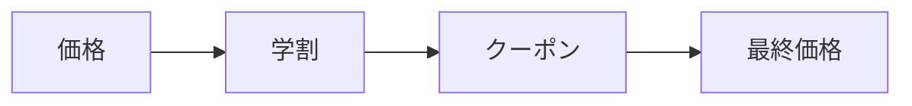

# 第09章：TypeScriptらしい合成① 関数をStrategyにする🎛️✨

## この章でできるようになること🎯💖

* 「割引のやり方だけ変えたい！」みたいな場面で、**関数を差し替えて**サクッと対応できるようになる🪄✨
* `if/else`地獄をやめて、**部品（関数）を合成して組み立てる**感覚がつかめる🧩💕
* 「関数版」と「class版」の違いも体感して、使い分けできるようになる😎👍

---

## 2026年1月の“いま”メモ📝✨（さらっと）

* TypeScriptのnpm最新は **5.9.3**（2026/1/15時点）だよ📌 ([npm][1])
* Nodeは **v24がActive LTS**（安定運用向き）だよ🟢 ([Node.js][2])
* テストは **Vitest 4系**が主流のひとつ（4.0リリース済み）🧪 ([Vitest][3])

（章のコードは、これらに合わせた“今っぽい書き方”でいくね✨）

---

## お題🛒✨「割引を差し替えたい！」

例えばECサイトで…

* 今日は「学割」🎓
* 明日は「誕生日割」🎂
* 週末は「週末セール」🛍️
* クーポンで「500円引き」🎫

…みたいに、**割引だけコロコロ変えたい**こと、あるよね？🤭💡
ここを継承でやるとクラス爆増しがち💥 なのでこの章は **関数でStrategy** いきます🎛️✨

---

## 1. まずは“ありがち地獄”を見よう😇💥

「とりあえずifで…」ってやるとこうなる👇

```ts
type DiscountKind = "none" | "student" | "birthday" | "coupon500";

function calcFinalPrice(price: number, kind: DiscountKind): number {
  if (kind === "none") return price;

  if (kind === "student") return Math.floor(price * 0.9);

  if (kind === "birthday") return Math.floor(price * 0.8);

  if (kind === "coupon500") return Math.max(0, price - 500);

  // 追加が増えるほど、ここが伸びる…😇
  return price;
}
```

これ、最初はいいんだけど…
割引が増えるたびに **1つの関数が太る** → 変更が怖くなる😱💦

---

## 2. Strategyを“関数の型”で定義しちゃう🧩✨


**関数も「立派な部品」だよ🧩✨**

TypeScriptはここが超得意😍

### ✅ Strategy（戦略）を関数型で表す

「価格と状況を受け取って、最終価格を返す」…みたいな約束を型にするよ📜✨

```ts
type DiscountContext = {
  isStudent: boolean;
  isBirthday: boolean;
  hasCoupon: boolean;
};

type Discount = (price: number, ctx: DiscountContext) => number;
```

> ポイント💡：classを作らなくても、**関数1個が“部品”になる**🪶✨

---

## 3. 割引Strategyを“部品として”並べる🎛️🧁

次に、割引の中身（戦略）を関数で用意するよ✨

```ts
const noDiscount: Discount = (price) => price;

const studentDiscount: Discount = (price, ctx) => {
  if (!ctx.isStudent) return price;
  return Math.floor(price * 0.9);
};

const birthdayDiscount: Discount = (price, ctx) => {
  if (!ctx.isBirthday) return price;
  return Math.floor(price * 0.8);
};

const coupon500Discount: Discount = (price, ctx) => {
  if (!ctx.hasCoupon) return price;
  return Math.max(0, price - 500);
};
```

---

## 4. 「差し替え点」はここ！呼び出す側を固定する🔁✨

呼び出す側（アプリ側）は、**“割引関数を受け取って使う”**だけにする👍

```ts
function calcFinalPrice(price: number, ctx: DiscountContext, discount: Discount): number {
  return discount(price, ctx);
}
```

これで、割引を変えたくなったら…

```ts
const ctx: DiscountContext = { isStudent: true, isBirthday: false, hasCoupon: false };

const final1 = calcFinalPrice(3000, ctx, studentDiscount); // 学割🎓
const final2 = calcFinalPrice(3000, ctx, noDiscount);      // 割引なし🙂
```

👆 これが **合成（部品差し替え）** の気持ちよさ😍✨

---

## 5. 実戦っぽく「名前 → 関数」で選べるようにする🗺️✨

画面や設定ファイルから「student」みたいな文字が来た時に便利🧡

```ts
type DiscountKey = "none" | "student" | "birthday" | "coupon500";

const discounts = {
  none: noDiscount,
  student: studentDiscount,
  birthday: birthdayDiscount,
  coupon500: coupon500Discount,
} satisfies Record<DiscountKey, Discount>;
```

使う側はこう👇

```ts
function calcByKey(price: number, ctx: DiscountContext, key: DiscountKey): number {
  return discounts[key](price, ctx);
}
```

`discounts`に追加すればOKだから、**拡張が気持ちいい**🥰🧩

---

## 6. 合成っぽさ爆上がり🔥「割引を重ねがけ」したい🧁🎀


「学割 + クーポン」みたいに、複数を順番に適用したいことあるよね？🤝✨
関数Strategyは、ここが最強💪

```ts
function chainDiscounts(...list: Discount[]): Discount {
  return (price, ctx) => list.reduce((p, d) => d(p, ctx), price);
}

const studentAndCoupon = chainDiscounts(studentDiscount, coupon500Discount);

const ctx: DiscountContext = { isStudent: true, isBirthday: false, hasCoupon: true };
const final = studentAndCoupon(3000, ctx);
```



* `chainDiscounts`が **合成の工場**🏭✨
* “新しい割引セット”が、**関数合成だけで作れる**🎉

---

## 7. 「関数版」と「class版」どっちがいいの？🤔✨

### ✅ 関数版が向くとき🪶

* 状態を持たない（または閉包で十分）
* とにかく軽く差し替えたい
* 合成（重ねがけ）を多用したい🧁

### ✅ class版が向くとき🏛️

* 割引に設定値があり、**インスタンスとして持ちたい**（例：会員ランクごとの料率）
* 初期化・後片付け・ログ設定など、ライフサイクルが欲しい
* インターフェースを中心に設計して、実装を束ねたい

> でもね、迷ったらまず関数でOK🙆‍♀️✨
> “必要になったらclassに昇格”がいちばん安全だよ🫶

---

## 8. テストして「差し替えできてる感」を確かめよう🧪✨（Vitest例）

割引は**純粋関数に近い**ほどテストが楽😍

```ts
import { describe, it, expect } from "vitest";

describe("studentDiscount", () => {
  it("学生なら10%オフ", () => {
    const ctx = { isStudent: true, isBirthday: false, hasCoupon: false };
    expect(studentDiscount(1000, ctx)).toBe(900);
  });

  it("学生じゃないならそのまま", () => {
    const ctx = { isStudent: false, isBirthday: false, hasCoupon: false };
    expect(studentDiscount(1000, ctx)).toBe(1000);
  });
});
```

---

## 9. よくある落とし穴⚠️😵‍💫（ここだけ注意！）

### ❌ Strategyの中で“外部に依存”しすぎる

* `Date.now()`直叩きで「誕生日判定」とかしちゃうとテストがしんどい😇
  → **ctxに必要な情報を渡す**のがコツ🎁✨

### ❌ “割引関数が何でも屋”になる

* DB保存・ログ送信・画面表示…まで入れると事故る💥
  → 割引は「価格を決める」に集中🧠✨（横断はDecorator章の出番🎀）

---

## 演習✍️💕（手を動かすと一気に身につく！）

### 演習1：新しい割引を追加しよう🆕🎉

* 「週末割（15%オフ）」を作って、`DiscountKey`と`discounts`に追加✨
* ctxに `isWeekend: boolean` を増やして対応してね🌈

### 演習2：「重ねがけセット」を3種類作ろう🧁

* 学割＋クーポン
* 誕生日＋クーポン
* 学割＋誕生日（同時に成立したらどうする？ルール決めてね😊）

### 演習3：class版も作って違いを体感🔍

* `interface DiscountStrategy { apply(price, ctx): number }`
* classで2つくらい実装して、関数版と比較してみてね✨

---

## 章末ミニテスト🎓💮（サクッと！）

### Q1：関数Strategyがclassより嬉しい場面を2つ書いてみて📝

### Q2：「割引が増えたら if が伸びる」問題の“本当の怖さ”は何？😱

### Q3：テストしやすくするために、Strategyに渡すべきものは？（ヒント：ctx）🎁

（答えの方向性✅）

* Q1：軽い差し替え・合成しやすい・状態不要なら関数が楽、など
* Q2：変更の影響範囲が広がる／読みづらい／分岐追加で事故る、など
* Q3：外部依存を閉じ込めた“必要情報”をctxで渡す、など

---

## AI拡張の使いどころ🤖✨（お願い例つき）

### いいお願い例🗣️💕

* 「このifだらけの割引処理を、関数Strategyにリファクタして。`DiscountContext`も設計して」
* 「割引の重ねがけができる `chainDiscounts` を作って、ユニットテストも付けて」
* 「`satisfies` を使って、キーと関数の対応が崩れないようにして」

### 人間が見るチェック👀✅

* Strategyが“何でも屋”になってない？
* ctxが巨大すぎない？（必要最低限？）
* 合成（重ねがけ）の順番が仕様として説明できる？🧁
* テストが素直に書ける？🧪✨

---

次の章（Decorator入門🎀➕）に行くと、今回の「割引（縦の関心）」に対して、ログや計測みたいな「横の関心」を“外付け”できるようになるよ😊✨
必要なら、この章の**完成形サンプル（フォルダ構成＋演習の模範解答＋小テスト完全回答）**もセットで出すね💖📦✨

[1]: https://www.npmjs.com/package/typescript?activeTab=versions&utm_source=chatgpt.com "typescript"
[2]: https://nodejs.org/en/about/previous-releases?utm_source=chatgpt.com "Node.js Releases"
[3]: https://vitest.dev/blog/vitest-4?utm_source=chatgpt.com "Vitest 4.0 is out!"
