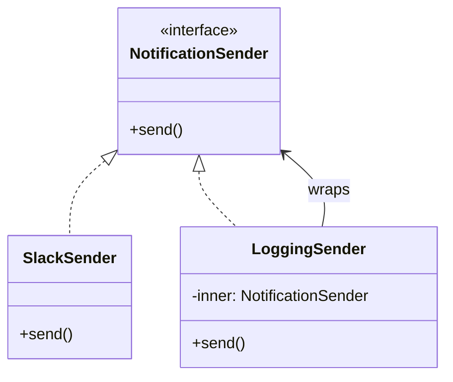

# 第10章：合成の型② Decorator入門🎀➕（まずはログだけ！）📝✨

> 📌 2026/01/15 時点の最新メモ：TypeScript の stable は **5.9.3**（npm）だよ〜🧡 ([npm][1])
> （Node は 24.x が Active LTS、22.x は Maintenance LTS という位置づけだよ📦） ([Node.js][2])

---

## 10.0 この章でできるようになること🎯💖

* ✅ **元の処理（本体）を一切いじらずに**ログを足せるようになる📝✨
* ✅ 「包む（wrapする）」構造がわかる🎀
* ✅ “ログ以外”にも応用できる入口に立てる（次章で計測⏱️やリトライ🔁に行くよ！）

---

## 10.1 Decoratorってなに？🎀🤔

Decorator（デコレーター）パターンは、ひとことで言うと…

* 🎁 **同じ形（interface）を持つ“ラッパー”で、本体を包む**
* 🧩 **本体にお願い（委譲）しつつ、前後にちょい足し**する

イメージはこんな感じ👇✨

* 🧁 本体（ケーキ）
* 🎀 デコ（飾り）を外から追加
* ケーキそのもののレシピは変えない🍰💕

---

## 10.2 今日のお題：ログを“外付け”したい📝🔧

ありがちな事故あるある👇😇

* 本体のクラスの中に `console.log()` が増殖して、見通しが悪い🌀
* 仕様変更で「ログの形式変えて」と言われて地獄😵‍💫
* テストでログが邪魔！うるさい！😫💥

そこで！
💡 **ログは本体じゃなくて、Decoratorで外から足す**のが気持ちいい〜🎀✨

---

## 10.3 まずは“同じ形”を用意しよう📘✨（interface）

今回は「通知を送る」ミニ例にするね📩💕

* 本体：実際に送る（ここではダミー実装）
* Decorator：送る前後にログを出す📝

```ts
// NotificationSender.ts
export interface NotificationSender {
  send(message: string): Promise<void>;
}
```

---

## 10.4 本体（ログなし）を作る🍰✨

```ts
// SlackSender.ts
import type { NotificationSender } from "./NotificationSender";

export class SlackSender implements NotificationSender {
  async send(message: string): Promise<void> {
    // 本当はAPI呼び出しだけど、ここでは「送ったことにする」だけ😊
    await new Promise((r) => setTimeout(r, 50));
    // ここではログを出さない！本体は静かに仕事する🎧✨
  }
}
```

ポイント💡
本体は **「送る」だけ**。ログとかは背負わないのがえらい👏🥹

---

## 10.5 ログDecoratorを作る🎀📝（本体を包む！）

「同じ interface を実装して」「中に本体を持って」「前後にログ」だよ〜✨

```ts
// LoggingSender.ts
import type { NotificationSender } from "./NotificationSender";

export class LoggingSender implements NotificationSender {
  constructor(private readonly inner: NotificationSender) {}

  async send(message: string): Promise<void> {
    console.log("🟦 send start:", { message });

    try {
      await this.inner.send(message); // ← ここが委譲（お願い）🙏
      console.log("🟩 send success!");
    } catch (err) {
      console.log("🟥 send failed:", err);
      throw err; // 失敗は握りつぶさない！大事⚠️
    }
  }
}
```

---

## 10.6 組み立てて使う（合成！）🧩✨

「本体をDecoratorで包む」だけで完成🎉

```ts
// main.ts
import { SlackSender } from "./SlackSender";
import { LoggingSender } from "./LoggingSender";
import type { NotificationSender } from "./NotificationSender";

const sender: NotificationSender = new LoggingSender(new SlackSender());

await sender.send("こんにちは〜！ログ付き通知だよ💌✨");
```

呼び出しの流れはこう👇🎀

* `LoggingSender.send()` が呼ばれる

  * `SlackSender.send()` にお願い🙏
  * 🟩 successログ（または🟥 errorログ）



---

## 10.7 “Decoratorっぽさ”が出るチェックリスト✅🎀

Decoratorになってるか不安になったら、ここ見てね👀✨

* ✅ **本体と同じ interface を実装してる？**
* ✅ **constructor で本体（inner）を受け取ってる？**
* ✅ **本体の処理を呼び出してる？（委譲）**
* ✅ **追加したいのは「前後のちょい足し」になってる？**（ログとか計測とか）

---

## 10.8 つまずきポイント集😵‍💫🩹（先に潰す！）

### ❌ 1) 本体の中にログを入れちゃう

→ それ、Decoratorの出番なのに本体が太るやつ〜！🐷💦

### ❌ 2) 例外を握りつぶす

→ ログだけ出して成功扱いにしないでね⚠️
`throw err;` で上に返すのが基本💡

### ❌ 3) 「ログのために interface を変える」

→ 本体の契約を壊すと、巻き添えが増えるよ〜💥
Decoratorは **契約（interface）を守る**のが命✨

---

## 10.9 ミニ演習✍️🎀（手を動かすと一気にわかる！）

### 演習1：ログ文言をあなた好みにしてみよう📝💖

* start / success / failed の文言を、見やすい形式にしてみてね😊

### 演習2：失敗を再現して、errorログが出るか確認😈🟥

* `SlackSender.send()` の中で `throw new Error("API落ちた")` してみる！

### 演習3：ログの出力先を差し替えられるようにする🔁✨

* `console.log` 直書きじゃなくて、`Logger` interface を作って注入してみよう🧩
  （これやるとテストが超ラクになるよ〜！🧪💕

---

## 10.10 AI拡張（Copilot/Codex）に頼むときのコツ🤖✨

お願いの例👇（そのままコピってOKだよ💌）

* 「この `NotificationSender` を包む `LoggingSender` を TypeScript で書いて。例外時もログを出して rethrow して」
* 「Decoratorパターンでログ追加したい。interfaceは変えずに実装して」

⚠️ でも最後にここだけチェックしてね👀✅

* interface守れてる？
* 例外握りつぶしてない？
* 本体にログ増えてない？

---

## まとめ🎉🎀

Decorator入門はこれだけでOK〜！🧡

* 🎀 **同じ interface のラッパーで包む**
* 🧩 **本体に委譲しつつ、前後に機能を足す**
* 📝 まずはログから始めると理解が速い！

次の章では、この「前後に足す」を使って
⏱️ **処理時間の計測** と 🔁 **リトライ** に広げていくよ〜！わくわく✨

[1]: https://www.npmjs.com/package/typescript?activeTab=versions&utm_source=chatgpt.com "typescript"
[2]: https://nodejs.org/en/about/previous-releases?utm_source=chatgpt.com "Node.js Releases"
