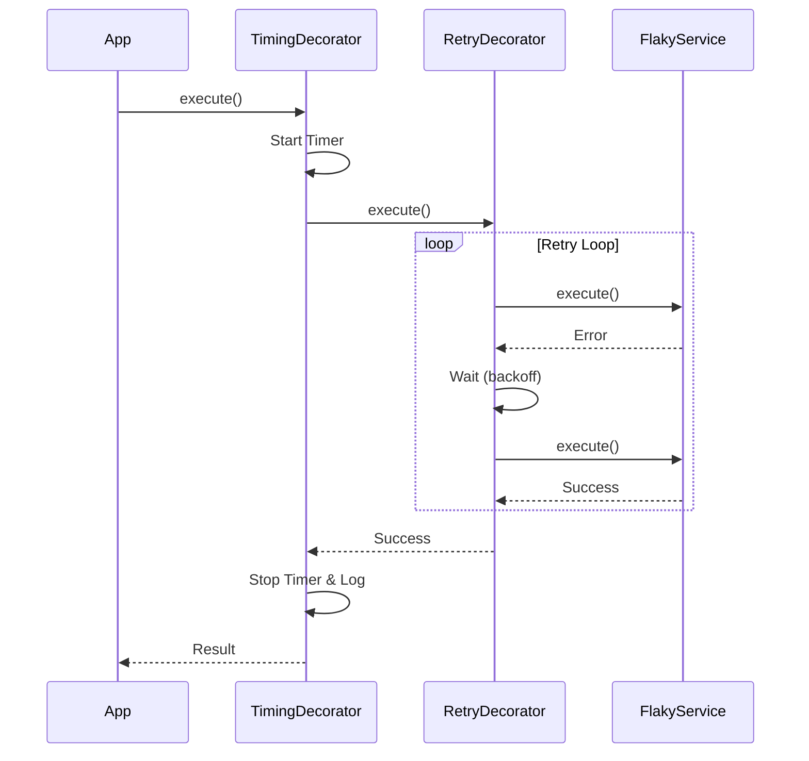

# 第11章：Decorator応用⏱️📈🔁（計測・リトライの“考え方”）

この章はね、「本体コードはなるべく触らずに」**観測（計測）**と**信頼性（リトライ）**を“外付け”できるようになる回だよ〜！🎀✨
つまり **Decoratorで“横断的関心ごと”を外に出す**練習ね🧁🧠

---

## 0) この章のゴール🎯✨

* ✅ 処理時間を測る **Timing（計測）Decorator** が書ける⏱️
* ✅ 失敗したら良い感じに再試行する **Retry（リトライ）Decorator** が書ける🔁
* ✅ **ログ＋計測＋リトライ**を“重ねがけ”しても、ぐちゃぐちゃにならない🧁🎀
* ✅ 「どこまでDecoratorでやるべき？」の判断が少しできるようになる🧭🙂

---

## 1) まず大事：Decoratorパターンと「@デコレータ構文」は別物だよ🙅‍♀️💡

ここで扱うのは **GoFのDecoratorパターン**（ラップして機能を足すやつ）🎀
TypeScriptの `@something` みたいな **構文のdecorator**の話じゃないよ〜！混ざりがちなので注意😉

---

## 2) 計測Decorator⏱️：なにを測る？どこで測る？


### よく測るもの📌

* ⏱️ **処理時間**（API呼び出し、DBアクセス、重い計算…）
* 📈 **回数**（何回呼ばれた？何回失敗した？）
* 😵 **失敗率**（成功/失敗の割合）

まずはこの章では、いちばん分かりやすい **処理時間**をやるよ〜⏱️✨
`performance.now()` は高精度タイマーとしてWeb標準で定義されてるし、Node側にも関連APIがあるよ📏✨ ([MDN Web Docs][1])

---

## 3) 実装してみよ：TimingDecorator（async対応）⏱️🧁

### 今回の“本体”インターフェース（最小）🧩

`execute()` だけを持つサービスとして統一しちゃうと、Decoratorが作りやすいよ✨

```ts
// src/core/Service.ts
export interface Service<Req, Res> {
  execute(req: Req): Promise<Res>;
}
```

### ログ用（最小）📝

```ts
// src/core/Logger.ts
export interface Logger {
  info(message: string): void;
  warn(message: string): void;
  error(message: string): void;
}

export const consoleLogger: Logger = {
  info: (m) => console.log(m),
  warn: (m) => console.warn(m),
  error: (m) => console.error(m),
};
```

### TimingDecorator本体⏱️✨

`try/finally` を使うと、成功でも失敗でも必ず計測ログが出せるよ〜！えらい！👏

```ts
// src/decorators/TimingDecorator.ts
import { performance } from "node:perf_hooks";
import type { Service } from "../core/Service";
import type { Logger } from "../core/Logger";

export class TimingDecorator<Req, Res> implements Service<Req, Res> {
  constructor(
    private readonly inner: Service<Req, Res>,
    private readonly name: string,
    private readonly logger: Logger,
  ) {}

  async execute(req: Req): Promise<Res> {
    const start = performance.now();
    try {
      return await this.inner.execute(req);
    } finally {
      const ms = performance.now() - start;
      this.logger.info(`⏱️ [timing] ${this.name}: ${ms.toFixed(1)}ms`);
    }
  }
}
```

※ `node:perf_hooks` はNodeのパフォーマンス計測API（Web Performance APIの一部）として提供されてるよ📚 ([Node.js][2])

---

## 4) リトライDecorator🔁：強いけど、雑にやると事故る😱


リトライって「失敗したらもう一回！」だけど、ここに落とし穴がいっぱいあるよ〜💥

### 4-1) 無限リトライはダメ🙅‍♀️♾️

* 😱 サーバーが死にかけてるのに殴り続ける
* 💸 API課金が増える
* 🔥 “リトライ嵐”で全体が落ちる（カスケード障害）

なので基本は、

* ✅ **回数上限（maxAttempts）**
* ✅ **待ち時間（delay）**
* ✅ **指数バックオフ（exponential backoff）＋ジッター（jitter）**
  をセットで考えるのが王道✨ ([Amazon Web Services, Inc.][3])

### 4-2) 「どの層でリトライする？」は超重要📌

基本は **スタックのどこか1箇所でリトライ**が推奨されることが多いよ。
あちこちでリトライすると、重複して状況が悪化しがち…😵‍💫 ([Amazon Web Services, Inc.][3])

### 4-3) “安全にリトライできる？”（冪等性の感覚）🧠

* ✅ GET / “読み取り” は比較的リトライしやすい
* ⚠️ POST / “作成や課金” は危険（2回成功したら二重に作られる！💸）

クラウドの公式ガイドでも「**idempotency criteria（冪等性）を満たすものだけ**」を基本にしてるよ📚 ([Google Cloud Documentation][4])

### 4-4) 429（混んでる）なら `Retry-After` を尊重🙏

429とか、混雑時に返ってくる `Retry-After` は「この秒数は待ってね」って意味だよ🕒 ([MDN Web Docs][5])
これ無視して突っ込むと、逆にもっと制限されたりする（例：Microsoftも“尊重しよう”って言ってる）⚠️ ([Microsoft Learn][6])

---

## 5) 実装してみよ：RetryDecorator（指数バックオフ＋ジッター）🔁✨


### ユーティリティ（sleep + backoff）🛌💤

```ts
// src/utils/retryUtils.ts
export function sleep(ms: number, signal?: AbortSignal): Promise<void> {
  return new Promise((resolve, reject) => {
    if (signal?.aborted) return reject(signal.reason ?? new Error("Aborted"));

    const id = setTimeout(() => {
      cleanup();
      resolve();
    }, ms);

    const onAbort = () => {
      cleanup();
      reject(signal.reason ?? new Error("Aborted"));
    };

    const cleanup = () => {
      clearTimeout(id);
      signal?.removeEventListener("abort", onAbort);
    };

    signal?.addEventListener("abort", onAbort, { once: true });
  });
}

// AWSでよく紹介される "Full Jitter" の形：0〜cap のランダムにするやつ🎲
export function calcBackoffMs(
  attempt: number,
  baseDelayMs: number,
  maxDelayMs: number,
  jitter: "full" | "none",
): number {
  const cap = Math.min(maxDelayMs, baseDelayMs * 2 ** (attempt - 1));
  if (jitter === "none") return cap;
  return Math.floor(Math.random() * cap);
}
```

指数バックオフ＋ジッターは、リトライの“群れ”をバラけさせて混雑を悪化させにくい定番テクだよ🎲✨ ([Amazon Web Services, Inc.][3])

### RetryDecorator本体🔁

```ts
// src/decorators/RetryDecorator.ts
import type { Service } from "../core/Service";
import type { Logger } from "../core/Logger";
import { sleep, calcBackoffMs } from "../utils/retryUtils";

export type RetryOn = (error: unknown) => boolean;

export interface RetryOptions {
  maxAttempts: number;       // 例: 3
  baseDelayMs: number;       // 例: 200
  maxDelayMs: number;        // 例: 2000
  jitter: "full" | "none";   // 迷ったら "full" 🎲
  retryOn: RetryOn;          // どのエラーなら再試行する？
  signal?: AbortSignal;      // キャンセルしたい時に使う（任意）
}

export class RetryDecorator<Req, Res> implements Service<Req, Res> {
  constructor(
    private readonly inner: Service<Req, Res>,
    private readonly opt: RetryOptions,
    private readonly logger: Logger,
    private readonly name: string,
  ) {}

  async execute(req: Req): Promise<Res> {
    let attempt = 0;

    while (true) {
      if (this.opt.signal?.aborted) {
        throw this.opt.signal.reason ?? new Error("Aborted");
      }

      attempt++;

      try {
        return await this.inner.execute(req);
      } catch (e) {
        const canRetry = this.opt.retryOn(e);
        const hasNext = attempt < this.opt.maxAttempts;

        if (!canRetry || !hasNext) {
          this.logger.error(`💥 [retry] ${this.name}: give up (attempt ${attempt})`);
          throw e;
        }

        const waitMs = calcBackoffMs(
          attempt,
          this.opt.baseDelayMs,
          this.opt.maxDelayMs,
          this.opt.jitter,
        );

        this.logger.warn(
          `🔁 [retry] ${this.name}: attempt ${attempt}/${this.opt.maxAttempts} failed → wait ${waitMs}ms`,
        );

        await sleep(waitMs, this.opt.signal);
      }
    }
  }
}
```

---

## 6) “重ねがけ”してみる🧁🎀（ログ＋計測＋リトライ）


Decoratorのいいところは **組み合わせ**ができること！✨
ただし **順番で意味が変わる**から、そこだけ注意してね😉

例：

* 外側がTimingなら「リトライ込みの合計時間」を測る⏱️
* 内側がTimingなら「各試行ごとの時間」を測る⏱️⏱️

### 動くデモ（わざと失敗するサービス）😈

```ts
// src/demo/FlakyService.ts
import type { Service } from "../core/Service";

export class FlakyService implements Service<{ id: number }, string> {
  constructor(private failRate = 0.6) {}

  async execute(req: { id: number }): Promise<string> {
    // ちょい待つ
    await new Promise((r) => setTimeout(r, 80));

    if (Math.random() < this.failRate) {
      throw new Error("TransientError: network glitch");
    }

    return `✅ ok: ${req.id}`;
  }
}
```

### 合成（組み立て）して実行🚀

```ts
// src/index.ts
import { consoleLogger } from "./core/Logger";
import { FlakyService } from "./demo/FlakyService";
import { RetryDecorator } from "./decorators/RetryDecorator";
import { TimingDecorator } from "./decorators/TimingDecorator";

const logger = consoleLogger;

const core = new FlakyService(0.7);

const withRetry = new RetryDecorator(
  core,
  {
    maxAttempts: 4,
    baseDelayMs: 200,
    maxDelayMs: 2000,
    jitter: "full",
    retryOn: (e) => e instanceof Error && e.message.startsWith("TransientError"),
  },
  logger,
  "FlakyService",
);

// 外側で合計時間を測る⏱️（リトライ込み）
const app = new TimingDecorator(withRetry, "FlakyService (total)", logger);

  .then((res) => logger.info(`🎉 result: ${res}`))
  .catch((e) => logger.error(`😵 final error: ${(e as Error).message}`));
```



---

## 7) ミニ演習✍️💞（手を動かすやつ！）

### 演習1：Timingの位置で何が変わる？🧪⏱️

* A：`TimingDecorator(RetryDecorator(core))`
* B：`RetryDecorator(TimingDecorator(core))`

どっちが「合計時間」、どっちが「試行ごとの時間」になる？🤔✨

### 演習2：retryOn を賢くする🧠

今は `message.startsWith(...)` だけ。

* ✅ “一時的エラーだけ” をリトライ対象にする条件を増やしてみよ（例：timeoutっぽい文字列）🔍

### 演習3：429のときの待ち方を考えてみる🕒

実装は「将来の課題」でOKだけど、方針として：

* `Retry-After` があればそれを優先する
  …って説明できたら合格💮 ([MDN Web Docs][5])

---

## 8) AI拡張に頼むなら🤖✨（プロンプト例）

コピペで使えるやつ置いとくね🫶

* 「`Service<Req,Res>` を前提に、**処理時間を計測するDecorator**を `try/finally` で作って。ログは `Logger` interfaceに合わせて」
* 「指数バックオフ＋ジッターの `calcBackoffMs` を実装して。**full jitter** の形で」 ([Amazon Web Services, Inc.][7])
* 「このRetryDecorator、無限ループや過剰リトライになってない？**上限・待ち時間・対象エラー**の観点でレビューして」

**AIの出力チェック観点✅**

* 🔁 maxAttempts ある？（無限じゃない？）
* 🕒 backoff ある？（即連打してない？）
* 🎯 retryOn が雑すぎない？（全部リトライしてない？）
* 💸 “課金/作成”系をリトライしてない？（冪等性OK？） ([Google Cloud Documentation][4])

---

## 9) 章末ミニテスト🎓📝（5問）

1. Decoratorパターンの強みを一言で言うと？🎀
2. `try/finally` を使う理由は？⏱️
3. リトライに **上限** が必要な理由は？😱
4. 指数バックオフ＋ジッターの目的は？🎲 ([Amazon Web Services, Inc.][3])
5. 429のとき `Retry-After` を尊重する意味は？🕒 ([MDN Web Docs][5])

---

## 10) おまけ：本日時点の“開発まわり”小ネタ🪄（超短く）

* Node.js は **v24系がActive LTS**、v25系がCurrentとして更新が続いてるよ（更新日も出てる）📦 ([Node.js][8])
* TypeScript のnpm “latest” は **5.9.3** になってるよ🧷 ([npm][9])
* TypeScript 6.0は “橋渡し”として計画されていて、7.0（ネイティブ化）に向けた流れが公式から出てるよ🚀 ([Microsoft for Developers][10])

（でも！この章のDecoratorパターンはTSのバージョンに左右されにくいから安心してね😊）

---

## まとめ🎀✨

* Decoratorは **横断的関心ごと（ログ/計測/リトライ）**を“外付け”するのが得意🧁
* 計測は `try/finally` で「失敗しても測る」⏱️
* リトライは **上限＋バックオフ＋ジッター＋対象エラー**が基本セット🔁🎲 ([Amazon Web Services, Inc.][3])
* そして「安全にリトライできる？」（冪等性）を忘れない💸⚠️ ([Google Cloud Documentation][4])

---

次の第12章は「Decoratorやりすぎ問題🕳️🛑」を潰しにいく回だよ〜！
この章で作った `TimingDecorator` / `RetryDecorator` を、わざと“悪い置き方”してから直すとめっちゃ身につくよ😈➡️😇✨

[1]: https://developer.mozilla.org/en-US/docs/Web/API/Performance/now?utm_source=chatgpt.com "Performance: now() method - Web APIs - MDN Web Docs"
[2]: https://nodejs.org/api/perf_hooks.html?utm_source=chatgpt.com "Performance measurement APIs | Node.js v25.3.0 ..."
[3]: https://aws.amazon.com/builders-library/timeouts-retries-and-backoff-with-jitter/?utm_source=chatgpt.com "Timeouts, retries and backoff with jitter"
[4]: https://docs.cloud.google.com/storage/docs/retry-strategy?utm_source=chatgpt.com "Retry strategy | Cloud Storage"
[5]: https://developer.mozilla.org/en-US/docs/Web/HTTP/Reference/Headers/Retry-After?utm_source=chatgpt.com "Retry-After header - HTTP - MDN Web Docs"
[6]: https://learn.microsoft.com/en-us/sharepoint/dev/general-development/how-to-avoid-getting-throttled-or-blocked-in-sharepoint-online?utm_source=chatgpt.com "Avoid getting throttled or blocked in SharePoint Online"
[7]: https://aws.amazon.com/blogs/architecture/exponential-backoff-and-jitter/?utm_source=chatgpt.com "Exponential Backoff And Jitter | AWS Architecture Blog"
[8]: https://nodejs.org/en/about/previous-releases?utm_source=chatgpt.com "Node.js Releases"
[9]: https://www.npmjs.com/package/typescript?activeTab=versions&utm_source=chatgpt.com "typescript"
[10]: https://devblogs.microsoft.com/typescript/progress-on-typescript-7-december-2025/?utm_source=chatgpt.com "Progress on TypeScript 7 - December 2025"
