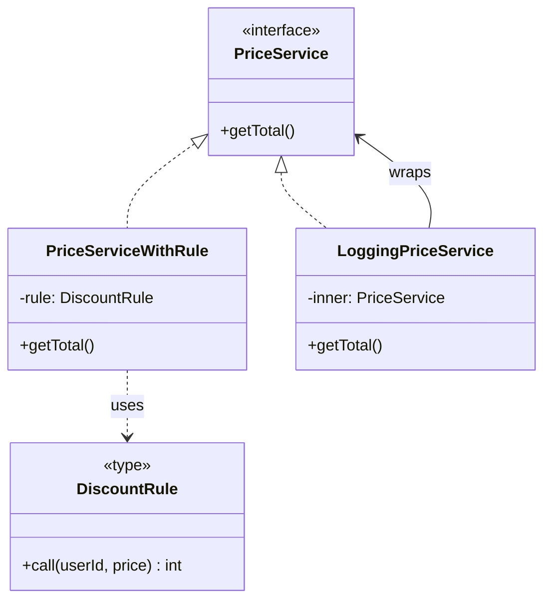

# 第12章：Decorator設計の落とし穴回避🕳️🛑🎀

（＝「外付け機能」を気持ちよく使うための安全運転🚗💨）

---

## 0. この章でできるようになること🎯✨

* Decoratorを**どこまで**使っていいか判断できる🧠✅
* 「やりすぎDecorator地獄😇」を回避できる🚧
* 悪い例を見て「直し方」がわかる🔧✨
* Decoratorを重ねても、**読みやすさ・テストしやすさ**を保てる🧪💕

---

## 1. まず混乱ポイントを1分で整理🧩⌛

ここで扱うDecoratorは **デザインパターン（ラッパーで包むやつ）** 🎀✨
TypeScriptの「@で付けるデコレーター構文」もあるけど、**別物として分けて考える**と事故らないよ〜🙆‍♀️

* TSのデコレーター構文は公式ドキュメントにもある（クラスやメソッド等に付けられる）📘✨ ([TypeScript][1])
* そして **experimentalDecorators** は「TC39標準化より前のデコレーター」だよ、って明言されてる⚠️ ([TypeScript][2])

この章は主に、**ラッパークラス（or ラッパー関数）で包むDecoratorパターン**の設計話だよ🎀🧠

---

## 2. Decoratorパターンの“正しい気持ち”🌿🎀

Decoratorはひとことで言うと…

> **本体のコードは触らずに**、周辺機能（ログ・計測・リトライ等）を**外付け**するやり方✨

ポイントはこれ👇

* 本体（ビジネスの中心）は**静かに純粋に**保つ🧘‍♀️
* Decoratorは**横断的関心ごと**（いろんな場所に同じように付けたくなるやつ）を担当する🧩

---

## 3. まずは「落とし穴あるある」7連発🕳️😱

ここからが本題！「やりがちな失敗」を先に知って、回避しよ〜💪✨

### 3-1. ビジネスルールをDecoratorに入れちゃう🍛🎀❌

**ダメな匂い**：Decoratorの中に「割引」「判定」「ルール」が入ってくる😇

* Decoratorは本来、ログや計測みたいな“外側”担当
* ルールが入ると「どこが本体かわからん」事故が起きる💥

### 3-2. Decoratorの順番で挙動が変わってカオス🧁🎀🎀🎀

ログ→リトライ→計測…みたいに重ねると、**順番でログ回数や計測範囲**が変わるよね😵‍💫

* 「正しい順」が暗黙だと、あとから壊れる😇

### 3-3. “便利だから”で何でもDecorator化して増殖🌳💣

「キャッシュも認可もバリデーションも例外変換も…全部Decoratorで！」
→ そのうち **読めないミルフィーユ**になる🍰😇

### 3-4. Decoratorが例外を握りつぶす🫥❌

* 本体の例外をキャッチしてログだけ出して終了…とか
* 呼び出し側が期待するエラーが消えて、バグが潜む🐛

### 3-5. Decoratorが“戻り値”や“意味”を変えちゃう🔁😵

Decoratorは基本「飾り」🎀

* 戻り値を勝手に丸める
* nullを返す
* 成功扱いにする
  みたいに意味を変えると、もう別物🧨

### 3-6. DIが崩れて「new地獄」が復活する🧟‍♀️

Decoratorの中で勝手に依存をnewすると、差し替え不能になる🙅‍♀️
（第5章の「外から渡す」思想が大事🚚💨）

### 3-7. “横断”のはずが、特定ドメイン専用Decoratorになる🎯❌

* 「VIPだけ特別処理」みたいなドメイン条件がDecoratorに混ざると
  → 横断じゃないよね…？ってなる😇

---

## 4. 使っていいDecoratorか？3秒チェックリスト✅⏱️

DecoratorにしてOKか迷ったら、これを順番に見てね📝✨

### ✅ Decorator向き（だいたいOK）

* いろんなサービスに同じ形で付けたい（横断）🧩
* 本体の結果（成功/失敗）を変えず、**副作用だけ足す**🎀
* 外しても本体の意味が変わらない（ログ外しても業務は同じ）🔁
* テストで「付けても外しても」検証しやすい🧪

例：ログ📝、計測⏱️、メトリクス📈、リトライ🔁、タイムアウト⏳、サーキットブレーカー⚡

### ❌ Decorator不向き（本体に戻して！）

* 割引や料金計算など**業務ルールそのもの**💰
* ルールが頻繁に変わる＆仕様の中心にいる📚
* 「VIPなら〜」「会員ランクなら〜」みたいな条件分岐が主役👑
* Decoratorが戻り値の意味を変える（成功扱い等）🧨

---

## 5. 例題：悪いDecoratorを直して“いい形”にする🔧✨🎀


ここ、いちばん大事！
「悪い例 → 改善」を体験しよう💪😊

### 5-1. お題：注文合計を返すサービス🛒

#### ❌ 悪い例：割引ルールがDecoratorに入ってる

```ts
// 本体
export interface PriceService {
  getTotal(userId: string, basePrice: number): Promise<number>;
}

export class BasicPriceService implements PriceService {
  async getTotal(userId: string, basePrice: number): Promise<number> {
    return basePrice;
  }
}

// 悪いDecorator：横断じゃなく「業務ルール」が主役になってる😇
export class VipDiscountDecorator implements PriceService {
  constructor(private inner: PriceService) {}

  async getTotal(userId: string, basePrice: number): Promise<number> {
    const total = await this.inner.getTotal(userId, basePrice);

    // 💥 ドメインルールが混入（VIPなら10%オフ）
    if (userId.startsWith("VIP_")) {
      return Math.floor(total * 0.9);
    }
    return total;
  }
}
```

**何がダメ？**😵‍💫

* 「VIP判定」も「割引率」も**超・業務の中心**
* これをDecoratorに入れると、

  * 割引の仕様変更が起きるたびにDecoratorが増える🌳
  * どこで価格が変わってるか追跡が難しい🕵️‍♀️

---

### 5-2. ✅ 改善方針：割引はStrategyへ戻す🧠🔁

* 本体は「合計を出す流れ」を持つ
* 割引は差し替え点（Strategy）にする
* Decoratorはログや計測など“外側”だけにする🎀

#### ✅ 改善コード（PriceRule = Strategy）

```ts
export type DiscountRule = (userId: string, price: number) => number;

export const noDiscount: DiscountRule = (_userId, price) => price;

export const vip10PercentOff: DiscountRule = (userId, price) => {
  if (userId.startsWith("VIP_")) return Math.floor(price * 0.9);
  return price;
};

export interface PriceService {
  getTotal(userId: string, basePrice: number): Promise<number>;
}

export class PriceServiceWithRule implements PriceService {
  constructor(
    private rule: DiscountRule
  ) {}

  async getTotal(userId: string, basePrice: number): Promise<number> {
    const afterDiscount = this.rule(userId, basePrice);
    return afterDiscount;
  }
}
```

#### ✅ Decoratorは“外側”に戻す（ログだけ）

```ts
export class LoggingPriceService implements PriceService {
  constructor(private inner: PriceService) {}

  async getTotal(userId: string, basePrice: number): Promise<number> {
    console.log("[Price] start", { userId, basePrice });
    try {
      const total = await this.inner.getTotal(userId, basePrice);
      console.log("[Price] success", { total });
      return total;
    } catch (e) {
      console.log("[Price] error", { message: String(e) });
      throw e; // ✅ 握りつぶさない
    }
  }
}
```

**これで何が嬉しい？**🥰

* 本体はスッキリ✨
* Decoratorは“横断”だけを担当できる🎀



---

## 6. 「Decoratorの順番問題」も潰しておこう🧁🛑

重ねるときのコツはこれ👇

### 6-1. ルール①：順番が意味を持つDecoratorは“まとめて生成”する🏗️

「適当にnewで積む」んじゃなくて、**組み立て関数**を作ると安全😊

```ts
export function buildPriceService(): PriceService {
  const core = new PriceServiceWithRule(vip10PercentOff);

  // ✅ ここで順番を固定する（チームのルール）
  const withLog = new LoggingPriceService(core);

  return withLog;
}
```

### 6-2. ルール②：Decoratorが増えたら“名前で説明”する📛✨

* buildPriceService()
* buildPriceServiceForProduction()
* buildPriceServiceForTest()
  みたいに「何が付いてるか」を名前で表現すると迷子になりにくいよ🧭😊

---

## 7. 演習✍️💪（章のメイン課題）

### お題：このDecorator、どこが危ない？直して！😈➡️😇

次のコードは「例外を握りつぶして成功扱いにする」最悪パターン🫠
**やってはいけない理由**を3つ書いて、修正版を作ってね📝✨

```ts
export interface ReportService {
  generate(userId: string): Promise<string>;
}

export class BasicReportService implements ReportService {
  async generate(userId: string): Promise<string> {
    if (userId === "bad") throw new Error("DB failure");
    return "report";
  }
}

// ❌ 最悪Decorator
export class SwallowErrorDecorator implements ReportService {
  constructor(private inner: ReportService) {}

  async generate(userId: string): Promise<string> {
    try {
      return await this.inner.generate(userId);
    } catch {
      return "report"; // 💥 成功扱いにして返す
    }
  }
}
```

#### ✅ 方向性ヒント🌟

* 例外は基本、握りつぶさず投げ直す
* “どうしても丸めたい”なら「戻り値にエラー情報を含める設計」を本体側で検討（DecoratorでこっそりはNG）

---

## 8. AI（Copilot/Codex等）に頼むときの安全プロンプト🤖✨

DecoratorはAIが“盛りがち”だから、お願いの仕方が超大事だよ〜😆💦

### ✅ 良いお願い例💡

* 「このDecoratorがビジネスルールを持っていないかレビューして。横断的関心ごとだけにして」
* 「例外を握りつぶしていないか確認して。握りつぶしてたら投げ直す形に直して」
* 「Decoratorを重ねる順番が挙動に影響するか説明して。影響するならbuild関数で固定して」

### ✅ AI出力のチェック観点👀✅

* 例外は投げ直してる？
* 戻り値の意味を変えてない？
* newで依存を作ってない？
* ドメイン条件（VIP、会員ランク等）が紛れ込んでない？

---

## 9. 章末ミニテスト🎓📝（サクッと！）

Q1. Decoratorが向いているのはどっち？（1つ選ぶ）
A. 会員ランクで割引率を変える
B. 処理時間を計測してログに出す

Q2. Decoratorがやっちゃダメなことを2つ書いてね✍️
（例：例外を握りつぶす、戻り値の意味を変える、など）

Q3. Decoratorの順番問題を減らす方法は？（1つ）
A. その場で適当にnewして重ねる
B. 組み立て関数で順番を固定する

---

## 10. まとめ📌✨

* Decoratorは「外付け（横断）」が主役🎀
* ビジネスルールが混ざったら黄色信号🚥😇
* 順番が意味を持つなら、組み立て場所で固定🏗️✅
* 例外・戻り値の意味は絶対に壊さない🛑

次の第13章は、外部APIの形を合わせる **Adapter** 🎁🔌 に進むよ〜！

（参考：TSのデコレーター構文やexperimentalDecoratorsの位置づけは公式ドキュメントも確認できるよ📘✨ ([TypeScript][1])）
（なお本日時点のTypeScriptは 5.9.3 が最新として公開されているよ📦✨ ([GitHub][3])）

[1]: https://www.typescriptlang.org/docs/handbook/decorators.html?utm_source=chatgpt.com "Documentation - Decorators"
[2]: https://www.typescriptlang.org/tsconfig/experimentalDecorators.html?utm_source=chatgpt.com "TSConfig Option: experimentalDecorators"
[3]: https://github.com/microsoft/typescript/releases "Releases · microsoft/TypeScript · GitHub"
