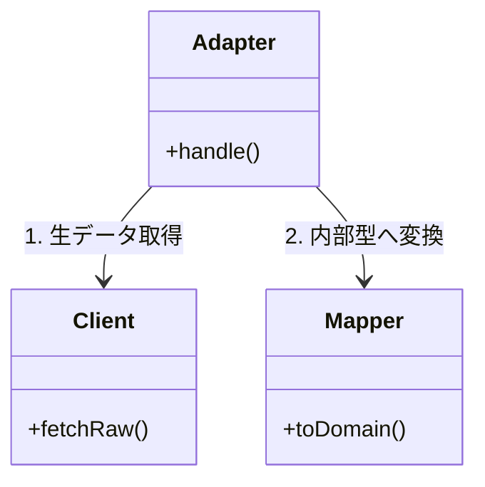

# 第14章：✨ Adapter応用「境界を守る」感覚を育てる🧼🛡️

## この章でできるようになること🎯✨

* 外部APIの“クセ強データ”を、**自分のアプリのキレイな形**に統一できるようになる🧽✨
* 「外の変更」に引きずられないように、**境界（boundary）**を守れるようになる🛡️
* Adapterを **Client / Mapper / Adapter** に分けて、増えても散らからない設計にできる📦🧩
* 変換のテスト（特に mapping）を軽く回して、安心して改修できる🧪💖
* AI（Copilot/Codex）に“いい感じに手伝わせる”お願いの仕方がわかる🤖🪄

---

## 1) まず「境界」ってなに？🏠🌧️

イメージはこれ👇

* **ドメイン（中心）**：あなたのアプリの“家の中”🏠✨（キレイに保ちたい）
* **外部（API/DB/SDK）**：家の外の“雨・泥”🌧️🪵（仕様変更も起きる）
* **Adapter**：玄関マット🧼（外の泥を家に持ち込まない！）

つまり Adapter の目的はこれだけ👇
**「外の事情」を“玄関”で食い止めて、家の中（ドメイン）を守る**🛡️✨

---

## 2) Adapterを「3点セット」に分けると強い🧩🔌🗺️


Adapterって雑に作るとすぐ肥大化するのよ…🥺
そこで **役割分担**しよっ👇

### ✅ 3点セット

* **Client**（通信係）📡

  * fetchして **生のJSON** を取ってくるだけ
* **Mapper**（変換係）🗺️

  * 外部DTO → 内部モデルへ **純粋変換（できれば副作用なし）**
* **Adapter**（接着剤）🔌

  * 「ポート（interface）」を実装して、Client + Mapper を合成して使う

この分け方、増えたときに本当に効くよ〜📦✨



---

## 3) 最新寄りの前提メモ（ちょいだけ）🧠✨

* 2026年1月時点で TypeScript は **5.8.3 が安定版**として出ていて、**5.9 はRC/Pre-release**が動いてる感じだよ📌 ([GitHub][1])
* Node.js は **v24 が Active LTS**で、**v25 は Current**。2026-01-13 にセキュリティ更新も入ってるから、依存更新はこまめにね🔐✨ ([Node.js][2])

※ここから先のコードは「考え方」が主役だから、TSの細かいバージョン差に引きずられない作りにしてあるよ😊🫶

---

## 4) 例題：2つの外部APIを「同じ内部形式」に統一しよう🛒🔁

### お題🎁

* ShopA API：`snake_case` で返ってくる🐍
* ShopB API：フィールド名も構造も違う🤯
* でもアプリ内部では、**統一された `Product`** を使いたい✨

---

### 4.1 内部（家の中）の型はこれだけにしたい🏠✨

```ts
// src/domain/product.ts
export type ProductId = string;

export type Product = {
  id: ProductId;
  name: string;
  priceYen: number;
  inStock: boolean;
  imageUrl?: string;
};
```

---

### 4.2 “欲しい機能”を Port（ポート）として宣言する🚪✨

ドメイン／アプリ層側は「外部が何か」を知らないでOK🙆‍♀️

```ts
// src/application/ports/productSearchPort.ts
import type { Product } from "../../domain/product";

export interface ProductSearchPort {
  search(query: string): Promise<Product[]>;
}
```

---

## 5) 外部データは「unknownで受けて、境界で検査」🧪🧼


外部から来るJSONって、**信用しちゃダメ**🙅‍♀️💦
そこで runtime validation（実行時バリデーション）を使うと事故が減るよ✨

ここでは Zod を例にするね（TypeScript-firstで、schemaから型も推論できるのが強み💪）([Zod][3])

---

### 5.1 ShopA のスキーマ（外部DTO）🐍

```ts
// src/infrastructure/adapters/shopA/shopA.schema.ts
import * as z from "zod";

export const ShopAProductSchema = z.object({
  product_id: z.string(),
  product_name: z.string(),
  price_yen: z.number().int().nonnegative(),
  stock: z.enum(["in_stock", "out_of_stock"]),
  image_url: z.string().url().optional(),
});

export const ShopAResponseSchema = z.object({
  items: z.array(ShopAProductSchema),
});

export type ShopAResponse = z.infer<typeof ShopAResponseSchema>;
export type ShopAProductDTO = z.infer<typeof ShopAProductSchema>;
```

---

### 5.2 ShopB のスキーマ（構造違い）🌀

```ts
// src/infrastructure/adapters/shopB/shopB.schema.ts
import * as z from "zod";

export const ShopBItemSchema = z.object({
  id: z.string(),
  title: z.string(),
  pricing: z.object({
    value: z.number().nonnegative(),
    currency: z.literal("JPY"),
  }),
  availability: z.boolean(), // true = in stock
  images: z.array(z.string().url()).optional(),
});

export const ShopBResponseSchema = z.object({
  results: z.array(ShopBItemSchema),
});

export type ShopBResponse = z.infer<typeof ShopBResponseSchema>;
export type ShopBItemDTO = z.infer<typeof ShopBItemSchema>;
```

---

## 6) Mapper（変換係）は「純粋関数」に寄せる🗺️✨

ここが一番テストしやすいポイントだよ〜🧪💕

### 6.1 ShopA → Product

```ts
// src/infrastructure/adapters/shopA/shopA.mapper.ts
import type { Product } from "../../../domain/product";
import type { ShopAProductDTO } from "./shopA.schema";

export function mapShopAProduct(dto: ShopAProductDTO): Product {
  return {
    id: dto.product_id,
    name: dto.product_name,
    priceYen: dto.price_yen,
    inStock: dto.stock === "in_stock",
    imageUrl: dto.image_url,
  };
}
```

### 6.2 ShopB → Product

```ts
// src/infrastructure/adapters/shopB/shopB.mapper.ts
import type { Product } from "../../../domain/product";
import type { ShopBItemDTO } from "./shopB.schema";

export function mapShopBItem(dto: ShopBItemDTO): Product {
  return {
    id: dto.id,
    name: dto.title,
    priceYen: dto.pricing.value, // currency=JPY 前提で受けてる（schemaで縛ってる）
    inStock: dto.availability,
    imageUrl: dto.images?.[0],
  };
}
```

---

## 7) Client（通信係）は「生JSONを取るだけ」📡✨

```ts
// src/infrastructure/http/httpClient.ts
export type HttpClient = {
  getJson(url: string): Promise<unknown>;
};

export function createFetchHttpClient(): HttpClient {
  return {
    async getJson(url: string) {
      const res = await fetch(url);
      if (!res.ok) throw new Error(`HTTP ${res.status}`);
      return res.json() as Promise<unknown>;
    },
  };
}
```

---

## 8) Adapter（接着剤）が Port を実装する🔌🛡️

### 8.1 ShopA Adapter

```ts
// src/infrastructure/adapters/shopA/shopAProductSearchAdapter.ts
import type { ProductSearchPort } from "../../../application/ports/productSearchPort";
import type { HttpClient } from "../../http/httpClient";
import { ShopAResponseSchema } from "./shopA.schema";
import { mapShopAProduct } from "./shopA.mapper";

export class ShopAProductSearchAdapter implements ProductSearchPort {
  constructor(
    private readonly http: HttpClient,
    private readonly baseUrl: string,
  ) {}

  async search(query: string) {
    const url = `${this.baseUrl}/search?q=${encodeURIComponent(query)}`;
    const raw = await this.http.getJson(url);

    // 境界で検査🧼（外の泥はここで落とす！）
    const parsed = ShopAResponseSchema.parse(raw);

    return parsed.items.map(mapShopAProduct);
  }
}
```

### 8.2 ShopB Adapter

```ts
// src/infrastructure/adapters/shopB/shopBProductSearchAdapter.ts
import type { ProductSearchPort } from "../../../application/ports/productSearchPort";
import type { HttpClient } from "../../http/httpClient";
import { ShopBResponseSchema } from "./shopB.schema";
import { mapShopBItem } from "./shopB.mapper";

export class ShopBProductSearchAdapter implements ProductSearchPort {
  constructor(
    private readonly http: HttpClient,
    private readonly baseUrl: string,
  ) {}

  async search(query: string) {
    const url = `${this.baseUrl}/items?keyword=${encodeURIComponent(query)}`;
    const raw = await this.http.getJson(url);

    const parsed = ShopBResponseSchema.parse(raw);

    return parsed.results.map(mapShopBItem);
  }
}
```

---

## 9) 応用：複数のAdapterを“合成”して統合する🧩🤝


ここが「合成優先」っぽさ全開だよ〜🔥✨
Adapterたちをまとめる Adapter（Composite）もアリ！

```ts
// src/infrastructure/adapters/multi/multiShopProductSearch.ts
import type { ProductSearchPort } from "../../../application/ports/productSearchPort";
import type { Product } from "../../../domain/product";

export class MultiShopProductSearch implements ProductSearchPort {
  constructor(private readonly ports: ProductSearchPort[]) {}

  async search(query: string): Promise<Product[]> {
    const results = await Promise.all(this.ports.map(p => p.search(query)));
    return results.flat();
  }
}
```

✅ これで「Shopが増えた」→ **Adapterを1個足すだけ** になる🎉🛒

---

## 10) “境界で翻訳する”のはデータだけじゃない🧯💬

外部のエラーも、そのまま内側に持ち込むと地獄…😇
例えば、外部が `HTTP 429`（レート制限）を返してきた時に、

* 内側：`TooManyRequests` みたいな **自分の意味のあるエラー**
* 外側：HTTP詳細やレスポンス形式

…を分離して、**Adapterで翻訳**しちゃうのがキレイ✨

（ここは章末演習でやろう✍️💖）

---

## 11) テストは「Mapperから」やると気持ちいい🧪🥰


Mapperが純粋関数なら、テスト超ラク！
最近は Vitest もメジャーで、v4系では Browser Mode 安定化なども進んでるよ🧪✨ ([Vitest][4])

```ts
// src/infrastructure/adapters/shopA/shopA.mapper.test.ts
import { describe, it, expect } from "vitest";
import { mapShopAProduct } from "./shopA.mapper";

describe("mapShopAProduct", () => {
  it("snake_case DTO を Product に変換できる", () => {
    const dto = {
      product_id: "p1",
      product_name: "りんご",
      price_yen: 120,
      stock: "in_stock",
      image_url: "https://example.com/a.png",
    } as const;

    const product = mapShopAProduct(dto);

    expect(product).toEqual({
      id: "p1",
      name: "りんご",
      priceYen: 120,
      inStock: true,
      imageUrl: "https://example.com/a.png",
    });
  });
});
```

💡コツ：**通信を含むAdapterテスト**は重くなりがちだから、まずは

* `schema.parse` が通る/落ちる
* `mapper` が正しく変換する
  を固めるのが最短ルートだよ🚀✨

---

## 12) よくある事故あるある💥（先に潰そ🛑）

### ❌ 事故1：ドメインに外部DTOが侵入😱

* `Product` の中に `product_id` とか混ざってくる
  → 後で絶対つらい😇

✅ 対策：外部DTOは **adapter配下だけ** に閉じ込める🔒✨

---

### ❌ 事故2：`any` で“通しちゃう”😵

* 「とりあえず動く」けど、未来の自分が泣く😭

✅ 対策：境界は `unknown` → schemaで検査🧼
（Zodは “型推論 + validation” が揃って便利だよ）([Zod][3])

---

### ❌ 事故3：Adapterが全部やって太る🐷

* fetchも変換も例外も全部1ファイル…ってなりがち

✅ 対策：**Client / Mapper / Adapter** に分割✂️✨

---

## 13) 演習✍️✨（やるほど“境界感覚”が育つ🧠🌱）

### 演習A：3点セット分割（基本）🧩

1. いまの Adapter を **Client / Mapper / Adapter** に分ける
2. Mapper を純粋関数にする
3. Mapperテストを書く🧪

### 演習B：エラー翻訳（応用）🧯

* 外部が `HTTP 404/429/500` を返す想定で、
  内側には `NotFound / TooManyRequests / ExternalServiceFailure` を返すようにする（型で！）✨

### 演習C：統合Adapter（合成の美味しいところ）🍰

* `MultiShopProductSearch` に「重複IDを除去」機能を足してみよ🔁
  （ヒント：Mapで `id` をキーにするとスッキリ）

---

## 14) AI拡張に頼むときの“勝ちプロンプト”例🤖🪄

### ✅ schema生成を手伝わせる（超おすすめ）

「このJSONサンプルから Zod schema 作って。落とし穴も書いて」
「`unknown` を parse して安全な型にしたい。Zodでお願い」

※Zodは公式でも “schemaでparseして型安全に使う” のが王道だよ✨ ([Zod][3])

### ✅ mapper生成

「ShopA DTO → Product への map 関数を書いて。変換ルールはこれ…」

### ✅ テスト生成

「この mapper の vitest テストを書いて。境界値も入れて」

### 👀 人間が見るチェックリスト

* ドメイン側に外部DTO名が混ざってない？🧼
* `any` が出てきてない？🙅‍♀️
* 変換ルール（通貨/単位/時刻/enum）が明文化されてる？📌
* 変換はテストされてる？🧪

---

## 章末ミニテスト✅🎓

1. Adapterの目的を一言で言うと？🧼
2. Adapterを3点セットに分けると何が嬉しい？📦
3. 外部JSONはなぜ `unknown` で受けたい？🤔
4. Mapperを純粋関数に寄せるメリットは？🧪
5. 「Shopが増えた」を最小変更にするには何を増やす？🛒

---

## まとめ🎀✨

* Adapterは「玄関マット」🧼＝外の泥を内側に入れない🛡️
* **Client / Mapper / Adapter** に分けると、増えても崩れない📦
* 境界は `unknown` → schemaで検査 → 内部モデルへ変換🧪✨
* 複数Adapterも“合成”でまとめられる🧩🤝

次の章で「継承 vs 合成の判断基準」へ行くと、今やった“境界を守る”がさらに効いてくるよ〜🧠💖

[1]: https://github.com/microsoft/typescript/releases?utm_source=chatgpt.com "Releases · microsoft/TypeScript"
[2]: https://nodejs.org/en/about/previous-releases?utm_source=chatgpt.com "Node.js Releases"
[3]: https://zod.dev/?utm_source=chatgpt.com "Zod: Intro"
[4]: https://vitest.dev/blog/vitest-4?utm_source=chatgpt.com "Vitest 4.0 is out!"
