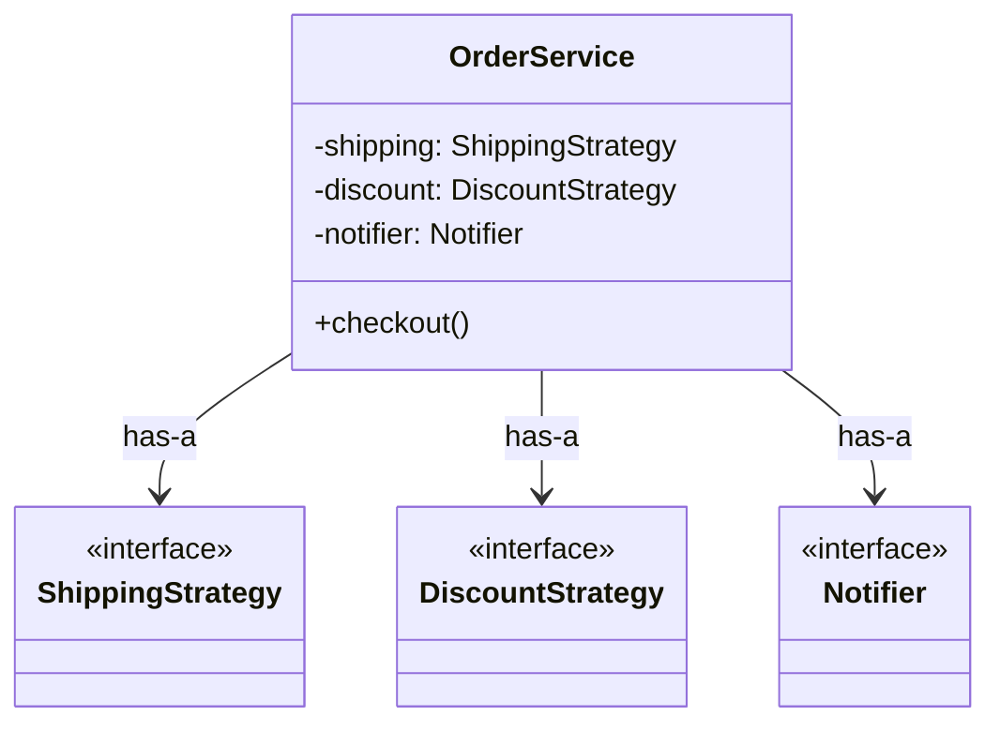

# 第15章：継承 vs 合成：実戦の判断基準🧭🙂✨

この章は「継承がダメ！」じゃなくて、**“いつ継承で、いつ合成か”を迷わず決める力**を作る回だよ〜💪🧩
（ちなみにTypeScriptは現時点で **5.9 系が最新**だよ📌 ([TypeScript][1])）

---

## 0. この章でできるようになること🎯✨

* 目の前のコードを見て「継承が良さそう / 合成が良さそう」を理由付きで言える🗣️💡
* **“クラス爆発”**（派生が増えすぎる事故）を事前に察知できる👀💥
* 迷ったときの**チェック表**と**判断フロー**で即決できる🧾✅
* TypeScriptならではの「継承より合成が効きやすい場面」も分かる🧠✨

---

## 1. まず大前提：継承も合成も「道具」🧰✨

継承（extends）も合成（has-a + 委譲）も、使いどころがあるよ🙂
ただし初心者が事故りやすいのは圧倒的に **「継承で共通化しようとして結びつけ過ぎる」**パターン😇💣

---

## 2. 3秒で決める！超ざっくり結論🧠⚡

### ✅ 継承が向くのはこんな時

* 「**is-a（〜は〜である）**」が自然で、置き換えも自然
* 差分が小さくて、変更点が増えにくい
* 親クラスが安定していて、子を壊しにくい

### ✅ 合成が向くのはこんな時

* 「**やり方を差し替えたい**」「**組み合わせが増える**」気配がある
* テストしやすくしたい（依存を外から渡したい）
* 外部API/ライブラリ/DBなど、境界を守りたい（Adapter したい）

---

## 3. 迷ったらコレ！判断フロー🧭🧩

### ステップ1：変えたいのは “何”？🔍

* **振る舞い（アルゴリズム）**が変わる → 合成（Strategy）に寄りがち🔁
* **追加機能（ログ/計測/リトライ）**を後付けしたい → 合成（Decorator）に寄りがち🎀
* **外部の形が違う** → 合成（Adapter）に寄りがち🎁
* **種類（型）の違い**で扱い方も変わる → 継承 or（TSなら）Unionも候補🧠

### ステップ2：「組み合わせ地獄」になる？🧩🧩🧩

* 変化ポイントが **1軸** → 継承でも耐えることがある
* 変化ポイントが **2軸以上**（例：送料×割引×通知） → **合成が勝つ**ことが多い💪✨

### ステップ3：置き換えても壊れない？（LSPっぽい感覚）🧠

「子を親として扱っても、期待を裏切らない？」

* 裏切りそう → 継承は危険🚧（合成へ）
* 裏切らない → 継承もOK候補✅

---

## 4. “迷ったらここを見る”チェック表📋✅

### ✅ 継承OKチェック（5個中4個以上なら継承候補）

* [ ] is-a が自然（犬は動物、みたいに）🐶➡️🐾
* [ ] 子クラスは親の契約（約束）を守れる🤝
* [ ] 親クラスは安定していて、頻繁に変えない🧊
* [ ] `protected` や内部状態に頼らずに拡張できる🔒
* [ ] 派生が増えても 3〜5個くらいで止まりそう✋

### ✅ 合成推しチェック（1個でも当てはまったら合成寄り）

* [ ] 変化ポイントが複数ある（組み合わせ増える）🧩💥
* [ ] 実行時に差し替えたい（A/Bテスト、設定で切替）🔁
* [ ] テストで差し替えたい（Clock/Logger/HTTPなど）🧪
* [ ] 追加機能を後付けしたい（ログ、計測、リトライ）🎀
* [ ] 外部と接続する（API/DB/SDK）ので境界を作りたい🛡️
* [ ] 継承すると「親変更が子に伝染」しそう😱
* [ ] すでに `if` が増え始めてる（近い未来ヤバい）📈

---

## 5. 例題①：継承でクラス爆発するやつ🌳💣（典型）

### シチュエーション📦

注文処理があって、将来こういう差分が出そう：

* 送料：通常 / 速達 / 海外🚚✈️
* 割引：なし / 会員 / キャンペーン🏷️
* 通知：メール / SMS / Push📩📱🔔

**これ、変化ポイントが3軸**なんだよね🧩🧩🧩

---

### 😇 継承でやるとこうなる（地獄の入口）

「全部入りの派生」を作り始めると…

* `Order_NormalShipping_NoDiscount_Email`
* `Order_ExpressShipping_MemberDiscount_Email`
* `Order_OverseasShipping_CampaignDiscount_Push`
* ………

組み合わせが 3×3×3 = **27種類**💥
将来 “通知が2種類同時” とか来たら…？😇（もう終わり）

---

### 😎 合成でやる（勝ち筋✨）

**それぞれを部品にして組み立てる**！

```ts
// 送料
export interface ShippingStrategy {
  calc(itemsPrice: number): number;
}

// 割引
export interface DiscountStrategy {
  apply(itemsPrice: number): number; // 返すのは割引後の価格、とかでOK
}

// 通知
export interface Notifier {
  notify(message: string): Promise<void>;
}
```

そして Order は「持って委譲」するだけ🧩

```ts
export class OrderService {
  constructor(
    private readonly shipping: ShippingStrategy,
    private readonly discount: DiscountStrategy,
    private readonly notifier: Notifier,
  ) {}

  async checkout(itemsPrice: number): Promise<number> {
    const discounted = this.discount.apply(itemsPrice);
    const shippingFee = this.shipping.calc(discounted);
    const total = discounted + shippingFee;

    await this.notifier.notify(`ご購入ありがとう🎉 合計: ${total}円`);
    return total;
  }
}
```

✅ **組み合わせは “クラス” じゃなくて “設定” になる**
→ クラス爆発しないし、テストで差し替えも簡単🧪✨



---

## 6. 例題②：それでも継承が“素直”なケースもある🙂✅

### シチュエーション🎨

「図形」は種類が違っても “面積を返す” という約束は守れるし、差分も小さめ。

```ts
abstract class Shape {
  abstract area(): number;
}

class Circle extends Shape {
  constructor(private readonly r: number) { super(); }
  override area(): number {
    return Math.PI * this.r * this.r;
  }
}

class Rect extends Shape {
  constructor(private readonly w: number, private readonly h: number) { super(); }
  override area(): number {
    return this.w * this.h;
  }
}
```

ここでのポイントは👇

* どの Shape でも `area()` は「面積」を返す（契約がブレない）✅
* Circle を Shape として扱っても、期待を裏切らない✅
* 変化ポイントが増えにくい✅

こういう “素直な is-a” は継承でも全然OK🙆‍♀️✨

---

## 7. 継承が危険になる「赤信号」🚦😇

### ① `protected` が増えてきたら危ない🔓

子が親の内部に依存し始めて、親をちょっと変えただけで子が壊れる😱
（合成なら “公開されたinterface” だけに依存するから壊れにくい）

### ② 「ちょっと違うだけの子」が増える🌱🌱🌱

派生が増えるほど、仕様の理解が「木の全体読み」になって辛い📚💦

### ③ 親が “万能クラス” に育ち始める👹

共通化のつもりが、親が肥大化して全体が重くなる…あるある😇

---

## 8. TypeScriptならでは：継承以外の選択肢も強い🧠✨

### ① 「データの種類」は Union が気持ちいいことが多い🧩

（オブジェクト指向の継承より “型の分岐” が安全に書ける時がある）

```ts
type Payment =
  | { kind: "card"; last4: string }
  | { kind: "bank"; bankCode: string };

function show(p: Payment) {
  if (p.kind === "card") return `カード: ****${p.last4}`;
  return `銀行: ${p.bankCode}`;
}
```

「状態やデータの種類」は、こういう方が読みやすいことも多いよ🙂✨

### ② “振る舞い” は合成（Strategy）が強い🧠🔁

「計算方法」「並び替え」「送料」みたいな **やり方の差** は合成が相性抜群！

---

## 9. ミニ演習✍️🎮（継承 or 合成クイズ）

### Q1 🧩

「送料計算だけ」3種類。将来増えるかも。実行時に切替したい。
→ 継承？ 合成？

### Q2 🎀

既存サービスに「ログ」と「時間計測」を後付けしたい。
→ 継承？ 合成？

### Q3 🎁

外部APIのレスポンスが `snake_case`。内部は `camelCase` に統一したい。
→ 継承？ 合成？

### Q4 🙂✅

`Animal` → `Dog` → `Poodle` みたいな分類で、メソッドはほぼ増えない。
→ 継承？ 合成？

---

### 解答＆理由✅✨

* **A1：合成（Strategy）**🔁
  「実行時切替」「増えるかも」＝差し替え点だから合成が素直！
* **A2：合成（Decorator）**🎀
  横断的関心ごと（ログ/計測）は外付けが綺麗！
* **A3：合成（Adapter）**🎁
  外部の形を持ち込まない！境界を守る！
* **A4：継承でもOK候補**🙂
  is-a が自然で契約もブレにくいなら継承もアリ！

---

## 10. 仕上げ：迷ったらこの一言🪄✨

* **「変化が1軸で止まりそう」→ 継承も候補🙂**
* **「変化が複数軸 / 差し替えたい / テストしたい」→ 合成が勝つ🧩💪**
* **「外部が絡む」→ Adapter で境界を作る🎁🛡️**
* **「後付け」→ Decorator🎀**
* **「やり方の差」→ Strategy🔁**

---

## ちょい最新コラム📌（今後のTypeScriptの空気感）🌬️

TypeScript は 5.9 系が現時点で最新で、リリースノートも 5.9 が公開されてるよ🧾✨ ([TypeScript][1])
そして将来に向けて、TypeScript 6/7 の計画（ネイティブ化の話）も公式ブログで進捗が出てる〜！🚀 ([Microsoft for Developers][2])
だからこそ今のうちに「継承でガチガチに固めない」「差し替えられる合成」を身につけるの、めちゃ価値あるよ🙂🧩✨

---

## 章末ミニテスト✅📝（10問）

1. 変化ポイントが2軸以上あるとき、継承で起きがちな事故は？
2. 「後付け機能（ログ/計測）」はどの型が向く？
3. is-a が自然でも継承が危ないサインを1つ挙げて！
4. 外部APIの形を内部に持ち込まないための型は？
5. 「実行時に切替」したいときに強いのは？
6. `protected` が増えると何が起きやすい？
7. 合成にするとテストが楽になるのはなぜ？
8. 「データの種類分岐」でTSが強い表現は？
9. クラス爆発が起きる典型は何が増えるとき？
10. 迷ったときの最短ルールを一言で！

（答えは自分で書いてみてから、必要なら私が丸付けするよ〜😊💮）

---

次はこの判断基準を、AI（Copilot/Codex等）で加速する使い方に繋げていけるよ🤖✨

[1]: https://www.typescriptlang.org/download/?utm_source=chatgpt.com "How to set up TypeScript"
[2]: https://devblogs.microsoft.com/typescript/progress-on-typescript-7-december-2025/?utm_source=chatgpt.com "Progress on TypeScript 7 - December 2025"
