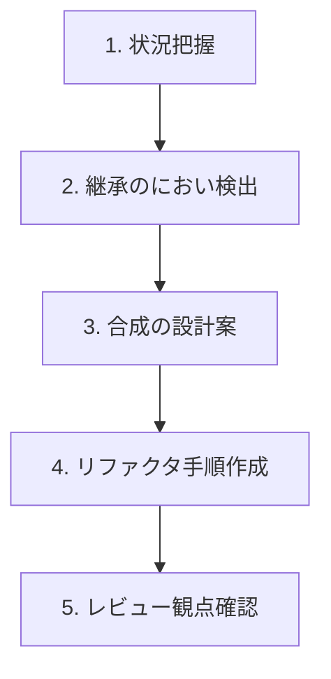

# 第16章：AI拡張を味方にする🤖✨（プロンプト＆レビュー観点）

この章のゴールはこれ👇
**「継承っぽいコードを見た瞬間に、AIと一緒に“合成の部品”へ分解して、安心して直し切れる」**ようになること🧩🔧✨
（第17章の総合課題がめっちゃラクになるよ〜！💪💕

---

## 16-1. AIに頼むと爆速になる作業ベスト5🚀💡

1. **状況把握（読解）**📖👀
   「このクラス何してる？責務いくつ？どこが危ない？」を一瞬で整理してもらう✨

2. **継承の“におい”検出**👃💥
   is-aが苦しいところ、派生爆発しそうなところ、変更が伝染しそうなところを指摘してもらう🕵️‍♀️

3. **合成の設計案（部品割り）**🧩🧠
   Strategy / Decorator / Adapter のどれで分けると気持ちいいか、案を出してもらう🎯

4. **差分の小さいリファクタ手順**🪜✅
   「まずinterface追加→次に置き換え→最後に削除」みたいに安全な段取りを作らせる✨

5. **レビュー観点の網羅**🔍✅
   テスト・依存・命名・責務境界をチェックリスト化してもらう（人間は最終判断だけする）🧑‍⚖️✨



---

## 16-2. 2026っぽい“AI支援の形”をざっくり把握しよ🤝✨

### Copilotまわり（VS Code）🧠💬

* VS Codeでは、**Copilotの機能が「Copilot Chat」側に統合されていく流れ**が進んでいて、**従来の「GitHub Copilot」拡張は early 2026 に非推奨→Marketplaceから外れる予定**って明言されてるよ🧯📦 ([Visual Studio Code][1])
* Copilotは、チャットだけじゃなくて **エージェント的に変更を進めたり**、**コードレビュー**や**PR要約**なども範囲に入ってる（使える範囲はプランや提供状況で変動）🧑‍💻✨ ([GitHub Docs][2])
* VS Codeのチャットは「用途別の入口」が用意されてて、作業スタイルで使い分ける前提になってるよ🧭💬 ([Visual Studio Code][3])

### Codex（VS Code拡張）🧰🤖

* Codex拡張は **コードを読んで・編集して・実行までできる**タイプで、**クラウド側にタスクを投げて進める**みたいな使い方も想定されてるよ☁️🔧 ([OpenAI Developers][4])
* ただし **Windowsは“experimental”扱い**って書かれてるので、環境によっては注意（WSLワークスペース推奨の案内あり）🪟⚠️ ([OpenAI Developers][4])

---

## 16-3. AIにうまく頼む「3点セット」🎁✨（これだけで精度めっちゃ上がる）

AIへのお願いは、だいたいこれで勝つ🏆✨

1. **目的（なにを良くしたい？）**🎯

* 「継承をやめて、合成で差し替え可能にしたい」
* 「ifの分岐をStrategyにしたい」
* 「ログ/計測はDecoratorで外出ししたい」など

2. **制約（やっちゃダメ）**🚧

* 「外部公開API（関数名・戻り値）を変えない」
* 「挙動を変えない（テストで担保）」
* 「新しい依存ライブラリは増やさない」
* 「変更は小さな差分で段階的に」など

3. **完了条件（どうなったらOK？）**✅

* 「派生クラスが消えて、Strategy差し替えで動く」
* 「Decoratorでログ/計測が付け外しできる」
* 「Adapterで外部形式がドメインに漏れてない」
* 「最低限のテストが通る」など

---

## 16-4. コピペで使える！合成優先リファクタ用プロンプト集📌🤖✨

### A) まず現状診断してもらう🩺👀

```text
あなたは設計レビュー担当です。
このコードの「継承が原因で危ない点」を3つ挙げて、根拠（どの行/どの構造が問題か）も説明して。
その上で「合成に寄せるなら、部品は何に分ける？」を候補（Strategy/Decorator/Adapter）付きで提案して。
制約：外部公開APIは変えない。差分は小さく段階的に。
```

### B) “段取り”だけ作らせる🪜✅（いきなり実装させない！）

```text
継承→合成への移行手順を、コミット単位で5ステップに分けて提案して。
各ステップで「安全確認（テスト/動作確認）」も書いて。
```

### C) Strategy化（if分岐の整理）🧠🔁

```text
このif分岐をStrategyに分離して。
(1) interface設計（入力/出力）
(2) 具体Strategy3つ
(3) 呼び出し側の組み立て例
制約：呼び出し側の公開APIは変えない。命名は短く分かりやすく。
```

### D) Decorator化（ログ/計測/リトライ）🎀⏱️

```text
この処理に「ログ」と「処理時間計測」をDecoratorで追加したい。
本体の責務は増やさず、横断的関心ごとだけ外付けにして。
Decoratorを2枚重ねできる形で。
```

### E) Adapter化（外部→内部の形を守る）🎁🛡️

```text
外部APIのレスポンス形式を、ドメイン側に漏らしたくない。
Adapter(またはMapper)を作って、外部DTO→内部の型に変換する方針にして。
変換ルールと、置き場所（フォルダ/命名）の提案もして。
```

---

## 16-5. AIの出力を“人間が勝たせる”レビュー観点👑🔍✨

AIが書いたコードは、ここだけ見れば事故が減るよ〜！🚑💕

### ✅ 1) 責務（このクラス、何担当？）🧠

* 「and」が入る名前になってない？（例：〇〇And〇〇Service）😵
* 本体にログ/計測/変換が混ざってない？（混ざってたら外へ！）🎀🧼

### ✅ 2) 依存（差し替えできる？）🔁

* newが奥に埋まってない？（差し替え点が死ぬ）💀
* interface（または関数型）で受けられてる？📦

### ✅ 3) 境界（外部の形が漏れてない？）🛡️

* snake_caseや外部DTOが、ドメイン中心に侵入してない？🐍💥
* 変換はAdapter/Mapperに隔離できてる？🎁

### ✅ 4) テスト（挙動が守れてる？）🧪

* “変更前と同じ挙動”を押さえるテストがある？
* Strategy差し替えのテストがある？
* Decorator重ねても動く？🧁🎀

### ✅ 5) 差分（デカすぎない？）🧯

* 1コミットで世界を変えてない？（危ない）😇
* ステップ分割できる？🪜

---

## 16-6. ミニ演習✍️：継承のにおい→AIと合成へ救出🧩🚑✨


### お題：派生が増えそうな通知処理📣💥

#### まずは“ありがち継承”コード（これを直す）

```ts
type User = { id: string; email: string; phone?: string };

abstract class Notifier {
  constructor(protected readonly user: User) {}
  abstract send(message: string): Promise<void>;
}

class EmailNotifier extends Notifier {
  async send(message: string) {
    // 本当は外部メール送信API…という想定
    console.log("email to", this.user.email, message);
  }
}

class SmsNotifier extends Notifier {
  async send(message: string) {
    if (!this.user.phone) throw new Error("no phone");
    console.log("sms to", this.user.phone, message);
  }
}

// ここから地獄が始まる想定…
// class EmailWithLoggingNotifier ...
// class SmsWithRetryNotifier ...
// class EmailWithLoggingAndRetryNotifier ...
```

### ステップ1：AIに「部品割り」だけさせる🧠🧩

使うプロンプト例👇

```text
この通知コード、派生爆発しそう。
合成で組み立てたいので、
(1) 送信手段(Email/SMS)はStrategy
(2) ログ/リトライはDecorator
にした設計案を出して。実装はまだ不要。クラス図っぽく説明して。
```

### ステップ2：AIに“最小実装”を作らせる🔧✨

（ここで初めて書かせる！）

```text
上の設計で最小実装を書いて。
要件：
- Notifier相当の公開APIは send(message): Promise<void> のまま
- Email/SMSは差し替え可能（Strategy）
- LoggingDecorator を1枚かけられる
- デモの組み立て例も付けて
```

### ステップ3：人間レビュー（この章のチェック表で確認）🔍✅

* Strategyのinterfaceは「入力/出力」揃ってる？
* Decoratorは“横断”だけ？本体の責務は増えてない？
* 組み立て側で「どの部品を使うか」が見える？👀✨

### ステップ4：テストをAIに作らせる🧪🤖

```text
この合成版Notifierに対して、最低限のテスト案を3つ出して。
特に「Strategy差し替え」と「Decorator重ね」を守りたい。
テストコードも書いて（外部APIはモック/スタブで）。
```

---

## 16-7. よくあるAI事故あるある😇💥（回避ワザ付き）

### 事故①：抽象化しすぎて読めない🌀

**回避**👉「抽象は最小で。interfaceは1つ増やしたら1つ消す」くらいの気持ち🧘‍♀️✨

### 事故②：勝手に挙動を変える🎭

**回避**👉「変更前の挙動テスト→リファクタ→テスト維持」の順番🧪✅

### 事故③：巨大差分で一撃必殺しようとする💣

**回避**👉「コミット5分割の手順だけ先に出して」って頼む🪜🧯

### 事故④：命名がフワフワで役割が不明🫥

**回避**👉「命名規則：名詞+役割（例: EmailSender, RetryDecorator）」って縛る📛✨

---

## 16-8. 第17章へのつなぎ🎓✨（ここまでできたら勝ち！）

次の総合課題では、AIにこう頼むと最強だよ💪🤖🔥

* 「まず危険な継承ポイントを列挙して」👀
* 「Strategy/Decorator/Adapterのどれで分割するか提案して」🧩
* 「コミット単位の移行手順を作って」🪜
* 「各ステップのテストも一緒に」🧪✨
* 「最後にレビュー観点で自己点検して」🔍✅

---


[1]: https://code.visualstudio.com/blogs/2025/11/04/openSourceAIEditorSecondMilestone "Open Source AI Editor: Second Milestone"
[2]: https://docs.github.com/en/copilot/get-started/features "GitHub Copilot features - GitHub Docs"
[3]: https://code.visualstudio.com/docs/copilot/chat/copilot-chat "Get started with chat in VS Code"
[4]: https://developers.openai.com/codex/ide/ "Codex IDE extension"
