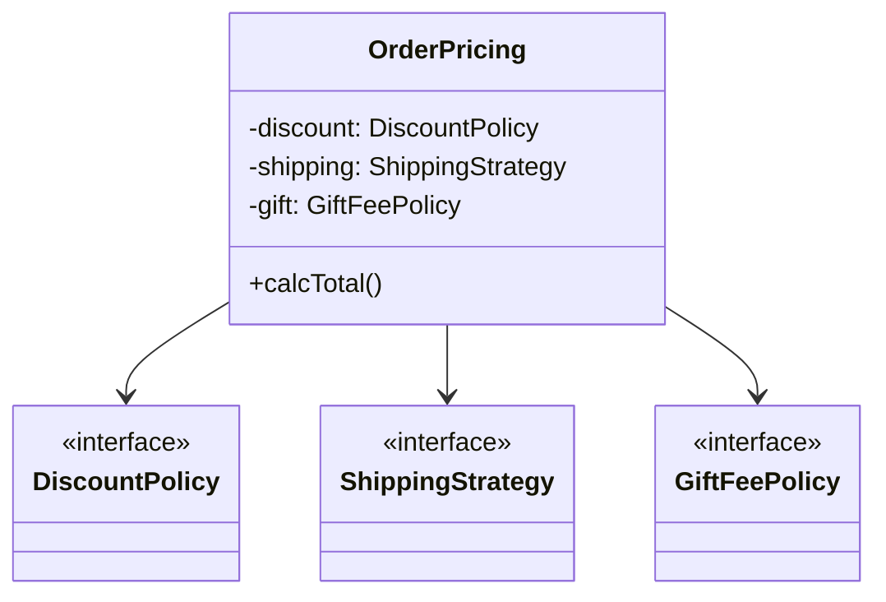

# 第17章：総合課題🎓✨「継承地獄を合成に救出しよう！」🚑🧩

今日は“卒業制作”みたいな回だよ〜！🫶
**増えすぎた継承ツリー🌳💥を、Strategy🔁 + Decorator🎀 + Adapter🔌でスッキリ救出**します✨

（ちなみに最新環境まわりは、TypeScriptの最新が **5.9**、Nodeは **v24がActive LTS**、テストは **Vitest v4系**が主流、そして **CodexのVS Code拡張**も公式で案内されています📌） ([TypeScript][1])

---

## 0. 今日のゴール🎯✨（できたら勝ち！）

最終的にこうなったら合格💮

* ✅ **派生クラス乱立が消える**（継承ツリー伐採🪓🌳）
* ✅ 「送料」「割引」などの**やり方差し替えが簡単**（Strategy🔁）
* ✅ ログ・計測・リトライなどの**横断機能が外付け**（Decorator🎀）
* ✅ 外部APIの形を**内部に漏らさない**（Adapter🛡️）
* ✅ テストがラク🎉（Vitestでサクサク✅） ([Vitest][2])

---

## 1. 課題ストーリー📖💥「派生が増えすぎた注文サービス」

あなたのチームのコードがこんな状態だったとするね😇

* `OrderService`（基底）

  * `DomesticOrderService`
  * `OverseasOrderService`
  * `GiftOrderService`
  * `OverseasGiftOrderService`
  * `OverseasGiftOrderServiceWithCoupon`
  * …増殖止まらん👻

「海外 × ギフト × クーポン × 速達」みたいな**組み合わせ爆発**で、追加のたびに派生が増える💣🧩

> 今日のミッション：この “組み合わせ爆発” を **合成**で解決する🚑✨
>
> 

---

## 2. まずは “継承地獄” のスターター（悪い例）👻🌳

（※わざとツラい構造にするよ！）

```ts
// src/legacy/order-service.ts
export type Order = {
  id: string;
  price: number;
  country: "JP" | "US" | "FR";
  isGift: boolean;
  coupon?: { type: "PERCENT" | "FIXED"; value: number };
  shipping: "NORMAL" | "EXPRESS";
};

export class BaseOrderService {
  calcTotal(order: Order): number {
    let total = order.price;

    // 割引（派生で上書きされがち）
    if (order.coupon) {
      if (order.coupon.type === "PERCENT") total *= (100 - order.coupon.value) / 100;
      if (order.coupon.type === "FIXED") total -= order.coupon.value;
    }

    // 送料（国ごと・配送方法ごとに増殖）
    if (order.country === "JP") total += order.shipping === "EXPRESS" ? 800 : 500;
    if (order.country !== "JP") total += order.shipping === "EXPRESS" ? 3000 : 2000;

    // ギフト手数料
    if (order.isGift) total += 300;

    return Math.max(0, Math.floor(total));
  }
}
```

このまま機能追加すると…

* `if` が増える😵‍💫
* 派生で上書きが増える😱
* テストが書きづらい😭

---

## 3. 救出後の完成図🧩✨（こう直す！）


### 3-1. Strategyで「やり方」を差し替える🔁

* `DiscountPolicy`（割引のやり方）
* `ShippingStrategy`（送料のやり方）
* `GiftFeePolicy`（ギフト手数料のやり方）

### 3-2. Decoratorで「横断」を外付けする🎀

* `LoggingPaymentGateway`
* `RetryPaymentGateway`
* `TimingPaymentGateway`（計測⏱️）

### 3-3. Adapterで外部APIを包む🎁🔌

* 外部 `snake_case` → 内部 `camelCase` へ変換🐍➡️🐫
* 外部のレスポンス型をドメインに漏らさない🛡️

---

## 4. 進め方（超重要）🧭✨：まずテストで “現状の正解” を固定する✅


いきなりリファクタすると「何が正しい挙動か」が迷子になるから、最初に**キャラクタリゼーションテスト**（現状固定テスト）を作るよ🎯

```ts
// test/legacy.spec.ts
import { describe, it, expect } from "vitest";
import { BaseOrderService, type Order } from "../src/legacy/order-service";

describe("legacy behavior lock 🔒", () => {
  it("JP normal no coupon", () => {
    const svc = new BaseOrderService();
    const order: Order = { id: "o1", price: 1000, country: "JP", isGift: false, shipping: "NORMAL" };
    expect(svc.calcTotal(order)).toBe(1500);
  });

  it("US express gift + percent coupon", () => {
    const svc = new BaseOrderService();
    const order: Order = {
      id: "o2",
      price: 10000,
      country: "US",
      isGift: true,
      shipping: "EXPRESS",
      coupon: { type: "PERCENT", value: 10 },
    };
    // 10000 * 0.9 = 9000 + 3000 + 300 = 12300
    expect(svc.calcTotal(order)).toBe(12300);
  });
});
```

Vitestは v4系が進んでるよ〜✅ ([Vitest][2])

---

## 5. リファクタ手順🚑✨（一本道でいくよ！）

### Step A：ドメインの “差し替え点” を3つに分離🧩✂️

「割引」「送料」「ギフト手数料」をそれぞれ部品化する！

```ts
// src/domain/policies.ts
export type Order = {
  id: string;
  price: number;
  country: "JP" | "US" | "FR";
  isGift: boolean;
  coupon?: { type: "PERCENT" | "FIXED"; value: number };
  shipping: "NORMAL" | "EXPRESS";
};

export interface DiscountPolicy {
  apply(price: number, order: Order): number;
}
export interface ShippingStrategy {
  fee(order: Order): number;
}
export interface GiftFeePolicy {
  fee(order: Order): number;
}
```

### Step B：Strategy実装を作る🔁✨（ifを外へ追放！）

```ts
// src/domain/strategies.ts
import type { DiscountPolicy, ShippingStrategy, GiftFeePolicy, Order } from "./policies";

export const noDiscount: DiscountPolicy = {
  apply: (price) => price,
};

export const couponDiscount: DiscountPolicy = {
  apply: (price, order) => {
    const c = order.coupon;
    if (!c) return price;
    if (c.type === "PERCENT") return price * (100 - c.value) / 100;
    return price - c.value;
  },
};

export const shippingByCountry: ShippingStrategy = {
  fee: (order) => {
    const base = order.country === "JP" ? (order.shipping === "EXPRESS" ? 800 : 500)
                                        : (order.shipping === "EXPRESS" ? 3000 : 2000);
    return base;
  },
};

export const giftFeeSimple: GiftFeePolicy = {
  fee: (order) => (order.isGift ? 300 : 0),
};
```

### Step C：合成で組み立てる（中核）🤝✨

```ts
// src/app/order-pricing.ts
import type { DiscountPolicy, ShippingStrategy, GiftFeePolicy, Order } from "../domain/policies";

export class OrderPricing {
  constructor(
    private readonly discount: DiscountPolicy,
    private readonly shipping: ShippingStrategy,
    private readonly gift: GiftFeePolicy,
  ) {}

  calcTotal(order: Order): number {
    let total = order.price;
    total = this.discount.apply(total, order);
    total += this.shipping.fee(order);
    total += this.gift.fee(order);
    return Math.max(0, Math.floor(total));
  }
}

```



### Step D：テストが通ることを確認✅🎉

legacyテストと同じ値になるならOK！
（ここまでで **継承いらない** のが体感できるはず🫶）

---

## 6. Decoratorで「横断機能」を外付け🎀⏱️📝

次は「支払い」を例に、ログ・計測・リトライを外付けするよ✨

```ts
// src/infra/payment.ts
export type PayResult = { ok: true; transactionId: string } | { ok: false; reason: string };

export interface PaymentGateway {
  pay(orderId: string, amount: number): Promise<PayResult>;
}
```

### Logging Decorator📝🎀

```ts
// src/infra/decorators/logging.ts
import type { PaymentGateway, PayResult } from "../payment";

export class LoggingPaymentGateway implements PaymentGateway {
  constructor(private readonly inner: PaymentGateway) {}

  async pay(orderId: string, amount: number): Promise<PayResult> {
    console.log("💳 pay start", { orderId, amount });
    const res = await this.inner.pay(orderId, amount);
    console.log("✅ pay end", { orderId, res });
    return res;
  }
}
```

### Retry Decorator🔁🎀（回数制限つき！）

```ts
// src/infra/decorators/retry.ts
import type { PaymentGateway, PayResult } from "../payment";

export class RetryPaymentGateway implements PaymentGateway {
  constructor(
    private readonly inner: PaymentGateway,
    private readonly maxRetries = 2,
  ) {}

  async pay(orderId: string, amount: number): Promise<PayResult> {
    let last: PayResult = { ok: false, reason: "unknown" };
    for (let i = 0; i <= this.maxRetries; i++) {
      last = await this.inner.pay(orderId, amount);
      if (last.ok) return last;
    }
    return last;
  }
}
```

> ポイント📌：Decoratorは **本体の責務を増やさない** のが正義👑✨
> ビジネスルール（割引とか）を入れ始めたら黄色信号🚥

---

## 7. Adapterで外部APIを包む🎁🔌（snake_case対策🐍➡️🐫）

外部がこんな形式を返すとするね👇

```ts
// src/infra/acme-pay-client.ts（外部っぽい型）
export type AcmePayResponse = {
  ok: boolean;
  transaction_id?: string;
  error_reason?: string;
};

export class AcmePayClient {
  async charge(params: { order_id: string; amount: number }): Promise<AcmePayResponse> {
    // 本当はfetch/SDK…の想定
    return { ok: true, transaction_id: "tx_123" };
  }
}
```

内部は `PaymentGateway` に統一したいから Adapter を作る🎁✨

```ts
// src/infra/acme-pay-adapter.ts
import type { PaymentGateway, PayResult } from "./payment";
import { AcmePayClient } from "./acme-pay-client";

export class AcmePayAdapter implements PaymentGateway {
  constructor(private readonly client: AcmePayClient) {}

  async pay(orderId: string, amount: number): Promise<PayResult> {
    const res = await this.client.charge({ order_id: orderId, amount });
    if (res.ok && res.transaction_id) return { ok: true, transactionId: res.transaction_id };
    return { ok: false, reason: res.error_reason ?? "unknown" };
  }
}
```

---

## 8. 組み立て（Composition Root）🧩🏗️「部品の配置場所」

“組み立てる場所” を最後に1箇所へ✨

```ts
// src/main.ts
import { OrderPricing } from "./app/order-pricing";
import { couponDiscount, shippingByCountry, giftFeeSimple } from "./domain/strategies";
import { AcmePayClient } from "./infra/acme-pay-client";
import { AcmePayAdapter } from "./infra/acme-pay-adapter";
import { LoggingPaymentGateway } from "./infra/decorators/logging";
import { RetryPaymentGateway } from "./infra/decorators/retry";

const pricing = new OrderPricing(couponDiscount, shippingByCountry, giftFeeSimple);

const pay = new RetryPaymentGateway(
  new LoggingPaymentGateway(
    new AcmePayAdapter(new AcmePayClient())
  ),
  2
);

// ここからアプリ的に使う…って感じ✨
console.log("🎉 ready", { pricing, pay });
```

---

## 9. 仕上げのチェックリスト✅✨（提出前に見るやつ）

### 合成になってる？🧩

* ✅ 「やり方」は Strategy に出てる？🔁
* ✅ 本体クラスは “オーケストラ役” に寄ってる？🎻

### Decoratorちゃんと横断？🎀

* ✅ ログ・計測・リトライだけに集中してる？📝⏱️🔁
* ❌ 割引や送料のルールを入れてない？（それはStrategy側！）🙅‍♀️

### Adapterで境界守れてる？🛡️

* ✅ 外部の型（snake_case）がドメインに出てない？🐍
* ✅ 変換責務が1箇所に集まってる？🎁

---

## 10. AI（Copilot/Codex）に頼むと強いプロンプト例🤖✨

CodexのVS Code拡張は公式に案内があるよ📌 ([OpenAI Developers][3])

### そのまま使えるお願いテンプレ🪄

* 「この `if` 群を **Strategy** に分離して、`interface` も定義して」🔁🧩
* 「外部APIの `snake_case` を内部の `camelCase` DTO に変換する **Adapter** を作って」🐍➡️🐫🎁
* 「この `PaymentGateway` に **Logging + Retry** の Decorator を重ねて。責務を混ぜないで」🎀📝🔁
* 「既存挙動を固定する **Vitest** テストを先に作って（キャラクタリゼーションテスト）」✅🔒 ([Vitest][4])

### AI出力レビュー観点👀✅

* 「差し替え点がデカすぎ/細かすぎ」になってない？🎯
* interfaceが“なんでも屋”になってない？😵‍💫
* Adapterが増殖しそうな置き方になってない？📦

---

## 11. ミニテスト🎮✨（理解チェック）

1. 「海外×ギフト×クーポン」のような組み合わせ増殖に強いのは？
   A. 継承　B. 合成（Strategy）

2. ログ・計測・リトライを“本体を変えず”に付けたい！
   A. Strategy　B. Decorator

3. 外部APIの型を内部に漏らしたくない！
   A. Adapter　B. Decorator

**答え👉 1:B / 2:B / 3:A** 🎉💮

---

## 12. 余裕ある人向け🌟（発展）

* ✅ 「Strategyの選択」をルール化（例：国や配送方法でFactory）🏭
* ✅ Decoratorに「計測⏱️」追加（処理時間ログ）
* ✅ “差し替え点”の粒度を見直して、もっと読みやすく📘✨

---

### できたら、次はこれやろ〜😊💕

「この総合課題を、**実際の小さなアプリ構成（CLIでもOK）**にして、入力→計算→支払い→結果表示まで通す」🎮✨
欲しければ、その形の“完成版フォルダ構成＋全部のファイル”も一気に出すよ🧩📦💕

* [The Verge](https://www.theverge.com/news/808032/github-ai-agent-hq-coding-openai-anthropic?utm_source=chatgpt.com)
* [techradar.com](https://www.techradar.com/pro/openai-launches-gpt-5-codex-with-a-74-5-percent-success-rate-on-real-world-coding?utm_source=chatgpt.com)
* [timesofindia.indiatimes.com](https://timesofindia.indiatimes.com/technology/tech-news/openai-unveils-new-codex-with-gpt-5-what-is-it-who-can-use-it-and-other-details/articleshow/123915490.cms?utm_source=chatgpt.com)

[1]: https://www.typescriptlang.org/download/?utm_source=chatgpt.com "How to set up TypeScript"
[2]: https://vitest.dev/blog/vitest-4?utm_source=chatgpt.com "Vitest 4.0 is out!"
[3]: https://developers.openai.com/codex/ide/?utm_source=chatgpt.com "Codex IDE extension"
[4]: https://vitest.dev/guide/?utm_source=chatgpt.com "Getting Started | Guide"
