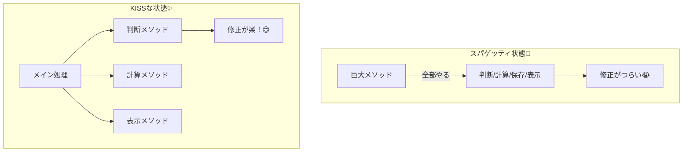

# 第01章：KISSってなに？😺🌸（まず誤解をほどく）

## 0. はじめに（この章の気持ち）🫶✨

KISSは、いきなり“すごい設計テク”を覚える話じゃないよ〜😊
まずは **「シンプルってどういう意味？」** を正しくつかむ章です🌼

この章が終わると…👇

* 「シンプル＝短いコード」って勘違いしなくなる✅
* 「読みやすくて、変えやすい」方向に“直感”が寄るようになる✅
* 自分のコードの「つらいポイント」を言葉にできるようになる✅

---

## 1. KISSの超ざっくり定義🍰

KISSは **「できるだけシンプルにしよう」** っていう設計の合言葉だよ〜📣
元ネタの言い回し（Keep It Simple, Stupid / Silly など）や背景も含めて、広く知られてる原則です📖 ([ウィキペディア][1])

ここで言う「シンプル」は、だいたいこの意味👇

* **理解しやすい**（読んだ瞬間に迷子にならない）🧭
* **変更しやすい**（仕様が増えても壊れにくい）🔧
* **バグが入りにくい**（例外・条件の漏れが減る）🛡️

---

## 2. よくある誤解ベスト3🥺💥（まずこれを外す！）

### 誤解①：「短い＝シンプル」📏❌

短いのに読めないコード、あるあるだよね😂
**“文字数”じゃなくて“脳の負荷”** が少ないのがシンプル✨

### 誤解②：「シンプル＝手抜き」🌀❌

むしろ逆で、KISSは **未来の自分/チームへのやさしさ** だよ🥹💗

* 「あとで直す」がラクになる
* バグ修正が早い
* 読み返しコストが激減する

### 誤解③：「新しい文法で賢く書くほど正義」🧠⚡❌

C#は最新（C# 14 / .NET 10）で便利機能も増えてるけど、**便利＝いつも読みやすい** ではないの🥲
“目的がある時だけ使う”が勝ち💪✨
（C# 14 は .NET 10 / Visual Studio 2026 で試せるよ〜） ([Microsoft Learn][2])

---

## 3. 「シンプル」って結局なに？🍀


### 3-1. 「短い」と「シンプル」は違う🙅‍♀️🚧、こういうの👇

### ✅ シンプル＝「次の一手が見える」👀✨

コードを見た瞬間に
「これ何？」「どこ直せばいい？」
って迷わない状態💡

### ✅ シンプル＝「変更が局所で済む」🏠

仕様が増えたときに

* 1箇所だけ直せばOK
* 影響範囲が小さい
* 他の部分が壊れにくい
  こうなってると最高🥳

---

## 4. “短いけど読みにくい” vs “少し長いけど分かる”💡（C#例）

### 例：短いけど、つらい😂

```csharp
// ぱっと見「何やってる？」ってなりがち😭
var total = order?.Items?
    .Where(x => (x?.Price ?? 0) > 0 && (x?.Quantity ?? 0) > 0)
    .Sum(x => (x!.Price!.Value) * (x.Quantity!.Value)) ?? 0;
```

* `?` と `!!` が混ざって怖い😱
* nullの時どうなるか頭の中でシミュレーション必要🧠💦
* 仕様追加（割引/送料/税）で地獄になりやすい🌀

### 例：少し長いけど、分かる😊

```csharp
if (order is null) return 0;

var items = order.Items ?? [];
var total = 0m;

foreach (var item in items)
{
    if (item is null) continue;

    var price = item.Price ?? 0m;
    var quantity = item.Quantity ?? 0;

    var hasValidPrice = price > 0;
    var hasValidQuantity = quantity > 0;

    if (!hasValidPrice || !hasValidQuantity) continue;

    total += price * quantity;
}

return total;
```

ポイントはここ〜👇✨

* **途中変数で説明してる**（price/quantity/hasValidPrice…）📛
* **null・境界条件の扱いが見える**👀
* 仕様追加の“差し込み位置”が分かる（税や割引をどこに入れる？が考えやすい）🔧

> KISSは「短くする競技」じゃなくて、「読む人の脳みそを助ける競技」だよ〜🫶🧠💗

---

## 5. “シンプルじゃないコード”の特徴チェックリスト🔍😵

Next, let's confirm the difference between messy code and KISS code visually. 👇



次のような特徴があると、だいたい読みにくなりやすいよ〜🌀

* ✅ 1つのメソッドが **判断・計算・保存・表示** まで全部やってる🍱
* ✅ if/switchが増えまくって **読む順番が迷子**🧭
* ✅ 例外/return/null処理が **あちこちに散らばる**🌧️
* ✅ 変数名が弱い（`tmp`, `data`, `result2` みたいな）📛💦
* ✅ 「賢い1行」に情報を詰め込みすぎ（読むのに3分）⏳

---

## 6. KISSの“判断のコツ”3つだけ覚えよ🐣✨


### コツ①：「声に出して読める？」🗣️（音読テスト）

読み上げて「えーっと…」が多いほど危険😂
（第3章で“読む人テスト”として武器にするよ！）

### コツ③：変更シミュレーションしてみる🔧

「ここに割引ルール足して」って言われたら、どこ直す？

* 直す場所がすぐ思い浮かぶ → シンプル寄り😊
* いろんな場所を触りそう → 複雑寄り😵

---

## 7. AIを“KISSの相棒”にするミニ技🤖💗（盛りすぎ防止！）

Visual Studio 2026 まわりはCopilot連携も進化してるので、普段から使える前提でOKだよ〜🖱️✨ ([The GitHub Blog][3])

### ✅ AIに頼むときの「型」🍪

下のテンプレでお願いすると、余計に壮大にされにくいよ🥹

```text
このC#コードをKISSにしてほしいです。
- 挙動は変えない
- 差分は小さく
- 読みやすい命名にする
- null/例外/境界条件の扱いは「入口で分かる」ように
出力は「変更後コード」と「何をどう簡単にしたか3行説明」でお願いします。
```

### ✅ AIの出力をチェックする観点👀✅

* クラス増えてない？（章1では増やしすぎ注意）📦💦
* 分岐増えてない？🌿
* “賢い1行”が増えてない？🧠⚡
* 命名がちゃんと説明になってる？📛✨

---

## 8. ミニ課題📝🌸（この章の宿題！）

自分の過去コード（またはサンプル）から、**読むのがツラい箇所を3つ**探してね😺

### 書き方テンプレ（1個につき1〜2分でOK）✍️

* 📌 どの辺がつらい？（例：ifが多い / 例外が散ってる / 何してるか不明）
* 🧠 何が分からない？（例：どの条件で何が起きるか追えない）
* 🔧 もし直すなら最初の一手は？（例：途中変数で説明 / 入口でガード節）

### できたら最高の追加チャレンジ💪✨

その3つのうち1つをAIに投げて、**“差分小さくKISS化”** させてみよ〜🤖💗
そして「どこが読みやすくなったか」を自分の言葉で3行にしてみてね🫶

---

## 9. 章末まとめ🎀✨

* KISSの「シンプル」は **短さじゃなくて理解のしやすさ**😺
* “読む人の脳の負担”を減らすほど、変更もバグもラクになる🔧🛡️
* まずは **自分のコードの「つらい」を言語化** できれば、もう第一歩クリア🌸

次の第2章からは、「じゃあ何が複雑さを作るの？」を敵観察していくよ〜🧠🌀

[1]: https://en.wikipedia.org/wiki/KISS_principle?utm_source=chatgpt.com "KISS principle"
[2]: https://learn.microsoft.com/en-us/dotnet/csharp/whats-new/csharp-14?utm_source=chatgpt.com "What's new in C# 14"
[3]: https://github.blog/changelog/2025-12-03-github-copilot-in-visual-studio-november-update/?utm_source=chatgpt.com "GitHub Copilot in Visual Studio — November update"
