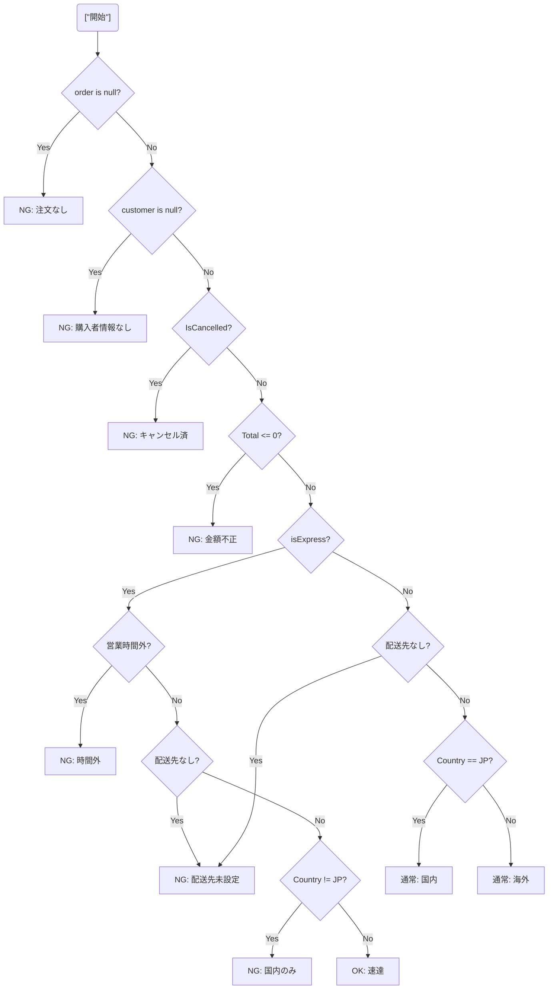

# 第02章：複雑さの正体を知ろう🧠🌀（敵を観察する）

この章は「直し方」より先に、「どこがヤバいのか」を言語化できるようになる回だよ〜😊✨
コードって、モヤモヤの正体が分かるだけで急にラクになるの🥹🌸

---

## この章のゴール🎯✨

最後まで読んだら、こんなことができるようになるよ👇

* 「このコード、なんかつらい…」を **理由つきで説明**できる🗣️💡
* 複雑さが増える **典型パターン** を見つけられる👀✅
* 「必要な複雑さ」と「自分で増やした複雑さ」を分けて考えられる✂️🧁

---

## 2-1. まず結論：複雑さには2種類ある😈👼


### ① 本当に必要な複雑さ（本質）👼✨

* 業務ルールが多い、法律・税・割引が複雑、例外パターンが多い…みたいなやつ
* これはゼロにできないことが多い🥲（でも整理はできる）

### ② 自分で増やした複雑さ（事故）😈💥

* 1メソッドが全部やる🍱
* ifが増殖🌿
* null/例外/境界が散らばる🧨
* 名前が弱くて脳内で補完が必要😵
* これが **KISSで減らせるメインの敵**！

> 「本質は受け入れて、事故は減らす」って感覚が超大事だよ🫶

---

## 2-2. 複雑さが増える“典型パターン”図鑑📚✨（C#あるある）


ここからは「見つける力」を育てるゾーン💪🔥
読みながら「あるある〜😭」ってなったら勝ち😊

---

### パターンA：if/switchが増殖する🌿🌿🌿


#### どうしてツラいの？😵

* 条件の組み合わせが増えると、頭の中で分岐図が必要になる🧠🌀
* テストも増える（分岐＝テストケースの増加）🧪💦

#### 見つけ方👀✅

* ネストが深い（ifの中にifの中にif…）🪆
* `&&` / `||` が長くて読めない😵‍💫
* `switch` の `case` が増え続けてる🎭

#### 目安（測り方）📏

Visual Studioのコードメトリクスで **Cyclomatic Complexity（循環的複雑度）** が見れるよ🧾✨
「分岐が増えると数字が上がる」やつ！
（Visual Studio では *Analyze > Calculate Code Metrics* で確認できるよ） ([Microsoft Learn][1])

---

### パターンB：例外・null・境界条件が散らばる🧨🌧️


#### どうしてツラいの？😵

* “普通の流れ”がどれなのか分からなくなる
* 例外処理があちこちにあると、変更が怖い😱

#### 見つけ方👀✅

* 途中に `throw` が点在🧨
* `?.` や `??` が乱舞してる🌧️
* 「入力チェック」と「業務ルール」と「表示都合」が混ざってる🍲

> ここで覚えておく合言葉：
> **「例外・null・境界は“境界”に寄せる」**（第3章以降で直し方やるよ😉）

---

### パターンC：1つの関数が全部やる🍱（判断・計算・保存・表示まで）


#### どうしてツラいの？😵

* 1箇所変更しただけなのに、別の部分が壊れる😭
* “何が目的の関数なのか”が分からない

#### 見つけ方👀✅

* メソッド名が「Process」「Handle」「DoStuff」系（ふわっと）😶‍🌫️
* `DB保存` / `ログ` / `UI表示` が同じメソッドにいる📦
* ローカル変数が多い（しかも名前が弱い）📛💦

---

### パターンD：名前が弱い（何してるか分からない）😵📛

#### どうしてツラいの？😵

* 読む人の脳みそが “推理ゲーム” をやらされる🕵️‍♀️💦

#### ありがち例😇

* `tmp`, `flag`, `data`, `result2`, `list1` とか…
* `Check()` が何をチェックするのか不明👻

名前が弱いと、それだけで **設計が複雑に見える** よ😭
（直し方は第3章の「名前で説明する📛」でやるよ〜）

---

### パターンE：状態（ミュータブル）が散ってる🧷🌀

#### どうしてツラいの？😵

* “今この変数、何が入ってる？” を追跡する羽目になる
* 並行処理やイベントでさらに地獄👹

#### 見つけ方👀✅

* 途中で何回も代入される変数が多い🔁
* フィールドを書き換えまくる🏷️
* どこで変わったか追えない😇

---

## 2-3. まずは「複雑さを言語化」する型を持とう🗣️✨（観察メモ）


コードを見たら、まずこの5つをメモするだけで急に整理できるよ📝💕

### 観察メモテンプレ📌

* **何を決めてる？（判断）** 🤔
* **何を計算してる？（計算）** 🧮
* **何を守ってる？（入力チェック/境界）** 🚧
* **何を起こしてる？（副作用：保存・送信・表示・ログ）** 📦
* **何に頼ってる？（依存：DB/HTTP/時刻/乱数）** 🔌

> 「判断」「計算」「副作用」が混ざるほど、だいたいツラくなるよ🍱💥

---

## 2-4. 実例：if地獄を“つらさの言葉”にする😵‍💫🌿


以下のコード、直すのはまだ！
まず「どこがつらいか」を言語化してみよ〜🫶

```csharp
public string GetShippingMessage(Order? order, Customer? customer, bool isExpress, DateTime now)
{
    if (order == null)
        return "注文がありません";

    if (customer == null)
        return "購入者情報がありません";

    if (order.IsCancelled)
        return "キャンセル済みです";

    if (order.TotalAmount <= 0)
        return "注文金額が不正です";

    if (isExpress)
    {
        if (now.Hour < 9 || now.Hour >= 17)
            return "速達は営業時間内のみです";

        if (order.Destination == null)
            return "配送先が未設定です";

        if (order.Destination.CountryCode != "JP")
            return "速達は国内のみです";

        return "速達で発送します";
    }
    else
    {
        if (order.Destination == null)
            return "配送先が未設定です";

        if (order.Destination.CountryCode == "JP")
            return "通常発送（国内）です";
        else
            return "通常発送（海外）です";
    }
}
```



### ここでの観察ポイント👀✅

* 条件の種類が混ざってる？（入力チェック/業務ルール/表示文言）🍲
* 同じチェック（配送先null）が重複してる？🔁
* “普通の流れ” がどれか分かりにくい？🌀
* `isExpress` で世界が2つに割れて、さらに中で分岐してる？🪓

---

## 2-5. ミニ課題📝✨（この章のメイン！）

さっきの `GetShippingMessage` を見て、下を埋めてみてね😊💗
（答えは1〜2行でOKだよ！）

### ✅ チェック1：条件が何種類ある？

* 入力チェック（null/金額）：
* 業務ルール（キャンセル/営業時間/国内のみ）：
* 表示都合（メッセージ組み立て）：

### ✅ チェック2：早期return（ガード節）になってる部分はどれ？

* ガード節になってる行：
* まだガード節にできそうな行：

### ✅ チェック3：その条件、どの責務に属してる？

* 入力チェック：
* 配送ルール：
* メッセージ整形：

> この「責務に仕分ける」感覚が、次の章で効いてくるよ〜🎯✨

---

## 2-6. “複雑さ”を測る道具も知っておこう📏🧰

### Visual Studioのコードメトリクス🧾✨

Cyclomatic Complexity などを確認できるよ〜！
分岐（if/switch）が増えると数値が上がるのが分かりやすい👌
（Visual Studio のメニュー例や説明） ([Microsoft Learn][1])

* 目安として「10くらいを出発点に」みたいな考え方も紹介されてるよ（絶対じゃないけど指標になる） ([Microsoft Learn][1])

---

## 2-7. AI（Copilot/Codex系）で“複雑さの言語化”を爆速にする🤖💗


ここ、AIがめっちゃ得意！✨
ただし「直して」じゃなくて、まずは **診断** を頼むのがコツだよ🩺💡

### おすすめプロンプト（診断用）📝

```text
このメソッドが「複雑に見える理由」を3つに分けて説明して。
分類は「分岐の複雑さ」「責務の混在」「例外/境界の散らばり」。
挙動の変更やリファクタ提案はまだ要らない。観察だけして。
```

### 追加で強い一言💪✨

```text
読む人が迷うポイントを「どの変数/どの条件が原因か」まで特定して。
```

---

## まとめ🌈✅（この章で覚える合言葉）

* 複雑さは「本質」と「事故」に分ける👼😈
* まずは直さず、**理由つきで説明**できるようになる🗣️✨
* 典型パターンはこのへん👇

  * 分岐の増殖🌿
  * 例外/null/境界の散らばり🧨
  * 1メソッド全部盛り🍱
  * 弱い命名📛
  * 状態の散乱🌀
* メトリクス（Cyclomatic Complexity）で “分岐の多さ” を数字で見れる📏 ([Microsoft Learn][1])
* AIには「直して」じゃなくて、まず「複雑さの言語化」を頼む🤖💗

---

次の第3章では、ここで見つけた敵に対して「じゃあどう直す？」の武器（KISSテク10選🧰✨）を渡すよ〜！😊🔥

[1]: https://learn.microsoft.com/en-us/visualstudio/code-quality/code-metrics-cyclomatic-complexity?view=visualstudio&utm_source=chatgpt.com "Code metrics - Cyclomatic complexity - Visual Studio ..."
