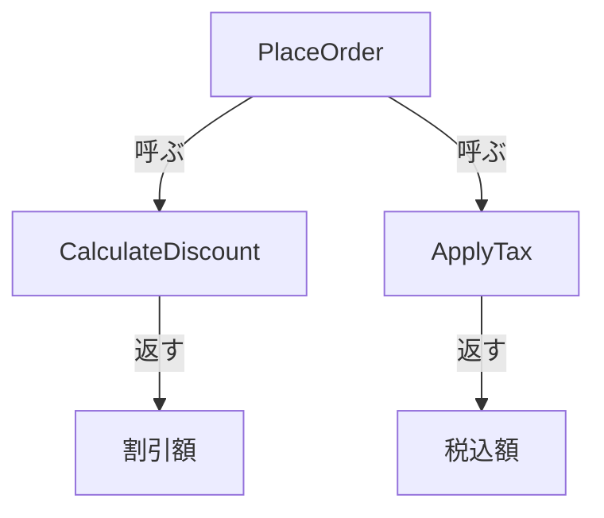
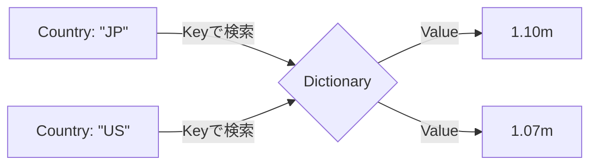

# 第03章：KISSの基本テク10選🧰✨（今日からの武器）

この章は「**複雑さを見つけたあと、どう直す？**」の“手札”を増やす回だよ〜😊💗
1つ1つは小技だけど、組み合わせると一気に読みやすくなる✨

---

## 0. 今日の練習台を用意しよう🎮🧪（1分）

### サンプルを作る（どっちでもOK）🧁

* **Visual Studio**：新規 → 「コンソールアプリ」→ `KissChapter3`
* **VS Code**：ターミナルで

```bash
dotnet new console -n KissChapter3
cd KissChapter3
code .
```

※C# 14 が最新で、.NET 10 上でサポートされてるよ〜🆕✨ ([Microsoft Learn][1])

---

## 1. まずは“わざと”読みにくい例を見る😵‍💫（素材）

下のメソッド、ありがちな「何でも屋」になってる例だよ🍱
（このあと 10テクで少しずつ直していく！）

```csharp
using System.Globalization;

static string PlaceOrder(string? userId, decimal total, string? couponCode, bool isVip, string? country)
{
    if (userId != null)
    {
        if (userId.Length > 0)
        {
            if (total > 0)
            {
                decimal discount = 0;
                if (couponCode != null && couponCode.Length > 0)
                {
                    if (couponCode == "WELCOME10") discount = total * 0.10m;
                    else if (couponCode == "VIP15" && isVip) discount = total * 0.15m;
                    else discount = 0;
                }

                decimal taxed = total - discount;
                if (country == "JP") taxed *= 1.10m;
                else if (country == "US") taxed *= 1.07m;

                var message = "OK:" + userId + ":" + taxed.ToString(CultureInfo.InvariantCulture);
                // 本当はここでDB保存、メール送信、ログ…などが増えがち😇
                return message;
            }
            else
            {
                return "NG:total";
            }
        }
        else
        {
            return "NG:userId";
        }
    }
    else
    {
        return "NG:userId";
    }
}
```

この子のツラさ：

* if が深い🌳
* ルール（割引/税）が散らばる🧩
* 返り値が文字列で状況が分かりにくい😵
* “どこが本筋？”が見えない🙈

---

## 2. KISSの基本テク10選🧰✨（1個ずつ武器にする）


先に「早見表」👇（あとで各テクをじっくりやるよ）

| No | テク               | ねらい            |
| -: | ---------------- | -------------- |
|  1 | ガード節（早期return）🚪 | ネストを消す         |
|  2 | 名前で説明する📛        | コメントより命名       |
|  3 | 1関数1仕事🎯         | 何でも屋を分割        |
|  4 | 条件を“言語化”🗣️      | boolに名前を付ける    |
|  5 | ネストを浅くする🪢       | 分岐の形を整える       |
|  6 | 同じ形の分岐をまとめる🧩    | 重複を減らす         |
|  7 | 例外は境界でまとめる🧯     | 途中で暴れさせない      |
|  8 | データ構造を整える🧺      | if/switch を減らす |
|  9 | 小さく変える🐾         | 挙動を壊さない        |
| 10 | 読む人テスト🎤         | “読める設計”に戻す     |

---

# 1) ガード節（早期return）🚪✨


## いつ使う？👀

* if が深くなって「本筋」が見えない🌳
* エラー条件がたくさんある🧨

## コツ🧠

* **ダメな条件を先に返す**
* そうすると、下に行くほど“本筋”だけが残る✨

## Before → After（PlaceOrderの入口だけ直す）🛠️

```csharp
static string PlaceOrder(string? userId, decimal total, string? couponCode, bool isVip, string? country)
{
    if (string.IsNullOrWhiteSpace(userId)) return "NG:userId";
    if (total <= 0) return "NG:total";

    // ここから先は「注文できる」状態だけになる✨
    // ...
    return "TODO";
}
```

### もっと楽する小技🧁

引数チェックだけなら Guard ヘルパもあるよ（書きやすくする系）🧤 ([Microsoft Learn][2])

## AIに頼むプロンプト例🤖

```text
このC#メソッドのネストを減らしたいです。
挙動は変えず、ガード節（早期return）で入口の不正条件を先に処理してください。
差分は小さく、命名は読みやすく。
```

---

# 2) 名前で説明する（変数/関数/クラス）📛✨

## いつ使う？👀

* `x`, `tmp`, `flag` が多い😇
* 文字列 `"NG:total"` みたいな“謎の合図”が多い🕵️‍♀️

## コツ🧠

* **「何か」じゃなくて「何のため」**が分かる名前にする
* “読むだけで分かる”に近づく📖

## 例：戻り値を“意味ある形”にする🍀

まずは超ミニ改善：文字列をやめて結果型にする✨

```csharp
record PlaceOrderResult(bool IsSuccess, string Message, decimal? FinalTotal);

static PlaceOrderResult PlaceOrder(string? userId, decimal total, string? couponCode, bool isVip, string? country)
{
    if (string.IsNullOrWhiteSpace(userId)) return new(false, "UserId is required", null);
    if (total <= 0) return new(false, "Total must be positive", null);

    return new(true, "OK", total);
}
```

---

# 3) 1関数1仕事（やることを減らす）🎯✨

## いつ使う？👀

* 1メソッドで「判断・計算・整形・保存」全部やってる🍱
* 変更するとき毎回こわい😱

## コツ🧠

* メソッド名を「見出し」にする📚
* “料理の手順書”みたいに分ける🍳

## 例：注文処理を分割する✂️

```csharp
static PlaceOrderResult PlaceOrder(string? userId, decimal total, string? couponCode, bool isVip, string? country)
{
    if (string.IsNullOrWhiteSpace(userId)) return new(false, "UserId is required", null);
    if (total <= 0) return new(false, "Total must be positive", null);

    var discount = CalculateDiscount(total, couponCode, isVip);
    var finalTotal = ApplyTax(total - discount, country);

    return new(true, "OK", finalTotal);
}

static decimal CalculateDiscount(decimal total, string? couponCode, bool isVip)
{
    if (string.IsNullOrWhiteSpace(couponCode)) return 0;

    return couponCode switch
    {
        "WELCOME10" => total * 0.10m,
        "VIP15" when isVip => total * 0.15m,
        _ => 0
    };
}

static decimal ApplyTax(decimal amount, string? country)
{
    return country switch
    {
        "JP" => amount * 1.10m,
        "US" => amount * 1.07m,
        _ => amount
    };
}
```



💡ここで大事なのは「完璧な分割」じゃなくて、**混ざってるものを分ける**ことだよ😊

---

# 4) 条件の“言語化”（bool変数に名前を付ける）🗣️✨

## いつ使う？👀

* `if (a && b && (c || d))` が出てきた😵‍💫
* 条件の意図が読めない🙈

## コツ🧠

* 先に bool を作って **意味を付ける**
* その bool が“文章”みたいに読めると勝ち🏆

```csharp
var hasCoupon = !string.IsNullOrWhiteSpace(couponCode);
var isVipCoupon = couponCode == "VIP15" && isVip;

if (hasCoupon && isVipCoupon)
{
    // ...
}
```

---

# 5) ネストを浅くする（入れ子をほどく）🪢✨

## いつ使う？👀

* `if { if { if { ... }}}` が増殖🌿
* ループの中でさらに if が深い🌀

## コツ🧠

* ガード節で「続行できない条件」を先に処理
* ループなら `continue` も便利🏃‍♀️

```csharp
foreach (var item in items)
{
    if (item is null) continue;
    if (item.Price <= 0) continue;

    AddToTotal(item);
}
```

---

# 6) 同じ形の分岐をまとめる（重複を減らす）🧩✨

## いつ使う？👀

* if の中身がほぼ同じ（1行だけ違う）😇
* コピペ修正でバグりがち🧨

## コツ🧠

* “違うところ”だけを変数にする
* あとは共通処理へ寄せる🎁

```csharp
decimal rate = country switch
{
    "JP" => 1.10m,
    "US" => 1.07m,
    _ => 1.00m
};

var finalTotal = amount * rate;
```

---

# 7) 例外は境界でまとめる（散らさない）🧯✨

## いつ使う？👀

* 例外が途中で投げられて追跡がつらい😵
* try/catch があちこちにある🕸️

## コツ🧠

* “深い中”で握りつぶさない🙅‍♀️
* **境界（入口/出口）でまとめて扱う**
* 例外じゃなく結果型に寄せるのもKISS👍

```csharp
static PlaceOrderResult PlaceOrderSafe(...)
{
    try
    {
        return PlaceOrder(...);
    }
    catch (Exception ex)
    {
        // ログはここ（境界）でまとめるイメージ🧯
        return new(false, "Unexpected error", null);
    }
}
```

---

# 8) データ構造を整える（辞書/リスト等で表現）🧺✨

## いつ使う？👀

* `if (code=="A") ... else if (code=="B") ...` が伸び続ける📏
* ルールが追加されるたびに分岐が増える🌿

## コツ🧠

* “対応表”は辞書にする📚
* “ルール一覧”はリストにする🧾

```csharp
static decimal ApplyTax(decimal amount, string? country)
{
    var rateByCountry = new Dictionary<string, decimal>
    {
        ["JP"] = 1.10m,
        ["US"] = 1.07m
    };

    var rate = (country is not null && rateByCountry.TryGetValue(country, out var r))
        ? r
        : 1.00m;

    return amount * rate;
}
```



---

# 9) 「まず動く」を壊さない小さな変更（差分小さく）🐾✨

## 目的🎯

KISSって「正しさ」より先に **安全に直せる手順**が超大事！🥺💗

## 超実用：KISSリファクタ手順（テンプレ）🧁

1. いま動いてる状態を確認✅（テスト or 手動でOK）
2. 変更は **1回で1テーマ**（例：ネストだけ減らす）
3. 3〜10行ずつ直す🐾
4. すぐ実行▶️（壊れてない？）
5. できれば小さくコミット🗂️

### AIを使うときの安全策🔒

IDE統合AIは便利だけど、研究で「情報漏えい・RCEにつながる可能性」みたいな注意喚起も出てるから、機密コードやトークン扱いは慎重にね⚠️ ([Tom's Hardware][3])

---

# 10) 迷ったら“読む人テスト”（声に出して読める？）🎤✨

## やり方😊

* メソッド名・変数名を **声に出して読む**
* 「文章として意味が通るか？」を確認する📖

### 例：読める命名🍀

```csharp
var isValidUser = !string.IsNullOrWhiteSpace(userId);
var hasValidTotal = total > 0;

if (!isValidUser) return new(false, "User is required", null);
if (!hasValidTotal) return new(false, "Total must be positive", null);
```

読んでみて👇
「ユーザーが有効じゃないなら失敗を返す」
「合計が有効じゃないなら失敗を返す」
→ 文章としてスッと入ってきたら勝ち〜🎉

---

## 3. ミニ課題📝✨（この章のゴール確認）

### 課題：1つの関数を3〜5個に分割して、見出し（名前）を付ける✍️

下のどっちでもOK！

* **A案（おすすめ）**：さっきの `PlaceOrder` を

  * `CalculateDiscount`
  * `ApplyTax`
  * `Validate...`（作ってもOK）
    みたいに分ける✨
* **B案**：自分の過去コードから “100行級メソッド” を1個持ってきて分割🧁

### 提出物（自分用メモでOK）📌

* 分割後のメソッド名リスト（3〜5個）
* 「元のメソッドがやってた仕事」を箇条書き（最低3つ）
* どのテクを使ったか（例：1,3,5）✅

---

## 4. おまけ：Copilot/AIに“ちょうどよく”直させるコツ🤖💗

Visual Studio では Copilot が統合されてきてて、インストールや状態確認もしやすくなってるよ（バージョン要件などはここにまとまってる）🧁 ([Visual Studio][4])

### 章3用：鉄板プロンプト🍓

```text
目的：KISS（読みやすさ優先）にしたい
制約：
- 挙動は変えない
- 差分は小さく（まずはネスト削減だけ、など）
- メソッド/変数名は「読めば分かる」方向に
- 追加クラスは増やしすぎない（必要最小限）
やってほしいこと：
- ガード節でネストを浅く
- 1関数1仕事に分割（3〜5個）
- 条件式はbool変数で言語化
```

---

## この章のまとめ🎀

* KISSは「センス」じゃなくて **型（手順と技）**でできる😊
* まずは **1)ガード節** と **3)1関数1仕事** だけでも劇的に効く🚀
* 直すときは **9)小さく変える** が最強の安全装置🐾

次の章は「C#でやりがちな複雑化」を“あるある”から直すよ〜🍰🔧

[1]: https://learn.microsoft.com/en-us/dotnet/csharp/whats-new/csharp-14 "What's new in C# 14 | Microsoft Learn"
[2]: https://learn.microsoft.com/en-us/dotnet/communitytoolkit/diagnostics/guard?utm_source=chatgpt.com "Guard - Community Toolkits for .NET"
[3]: https://www.tomshardware.com/tech-industry/cyber-security/researchers-uncover-critical-ai-ide-flaws-exposing-developers-to-data-theft-and-rce?utm_source=chatgpt.com "Critical flaws found in AI development tools are dubbed an 'IDEsaster' - data theft and remote code execution possible"
[4]: https://visualstudio.microsoft.com/github-copilot/ "
	Visual Studio With GitHub Copilot - AI Pair Programming"
