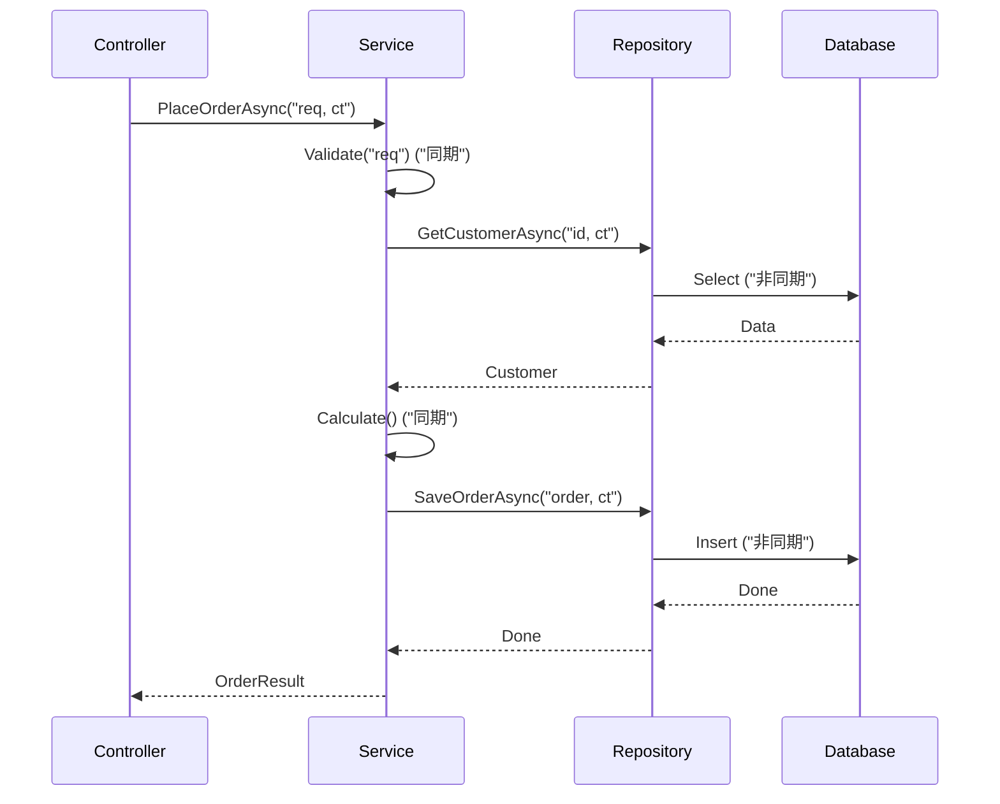

# 第04章：C#でやりがち！KISSリファクタ🍰🔧

（C#あるあるの“難しく見える書き方”を、自然に読みやすく直すよ〜😊✨）

---

## この章のゴール🎯✨

この章が終わったら、こうなれる！💪💗

* 「うっ…読みにくい…😵」って感じるC#コードを、**“自然に読める形”**に直せる
* switch / LINQ / null / 例外 / async の **ややこしさの正体**が分かって、整えられる
* AI（Copilot / Codex系）にお願いしても、**余計に壮大にされず**にKISSで直せる🤖🫶

ちなみに今どきのC#は、.NET 10（LTS）＋C# 14が軸だよ〜くらいの感覚でOK🙆‍♀️✨ ([Microsoft][1])

---

## 4-0 まずは「KISSリファクタの手順」を覚えよう🍰✨（超重要）

リファクタって、センスじゃなくて手順ゲー😺🧠

### 🍓KISSリファクタ 6手（これだけで回せる）

1. **挙動を守る🛡️**（先に小さいテスト or 例入力を用意）
2. **混ざってる責務を発見👀**（入力チェック/業務ルール/表示/保存…が混ざってない？）
3. **境界を決める🚪**（例外はどこで受ける？ nullは入口で止める？）
4. **名前で分ける📛**（まず Extract Method / 変数名で説明）
5. **分岐を整理🎭**（switchが肥大→データ化 or 小メソッド化）
6. **読みやすさを最優先📖**（賢い1行より、分かる3行✨）

---

## 4-1 switch/パターンが増えすぎ問題🎭🌀


switch式やパターンマッチは便利！でも、**“正しさ”と引き換えに読みにくくなりやすい**😇

### 😵あるある：switchが「仕様書」になってしまう

* caseが20個…
* whenがいっぱい…
* 例外も混ざる…
* しかも各caseの中で別の分岐…（地獄2段重ね🍱🔥）

### ✅KISSに直すコツ（優先順）

**(A) 入口でガード節🚪**：入力不正は最初に返す
**(B) caseの中身をメソッド化📛**：caseが見出しになる
**(C) 分岐が“データ”なら辞書化🧺**：if/switchをデータに置き換える
**(D) 行動が“種類ごと”なら小さなStrategy🧩**：ただし増やしすぎ注意⚠️

### 例：switchが重くて読めない → 「見出し化」で一気に楽✨

#### ❌Before（読めない…😵）

```csharp
public decimal CalcFee(User user, Plan plan)
{
    if (user is null) throw new ArgumentNullException(nameof(user));

    return plan switch
    {
        Plan.Free => 0m,
        Plan.Student when user.Age < 20 => 100m,
        Plan.Student when user.Age >= 20 => 200m,
        Plan.Pro when user.IsVip => user.Country switch
        {
            "JP" => 980m,
            "US" => 9.99m,
            _ => 1200m
        },
        Plan.Pro => 1200m,
        _ => throw new NotSupportedException()
    };
}
```

#### ✅After（読む順番が自然📖✨）

```csharp
public decimal CalcFee(User user, Plan plan)
{
    ArgumentNullException.ThrowIfNull(user);

    return plan switch
    {
        Plan.Free    => 0m,
        Plan.Student => CalcStudentFee(user),
        Plan.Pro     => CalcProFee(user),
        _            => throw new NotSupportedException($"Unknown plan: {plan}")
    };
}

private static decimal CalcStudentFee(User user)
    => user.Age < 20 ? 100m : 200m;

private static decimal CalcProFee(User user)
{
    if (user.IsVip) return CalcVipProFee(user.Country);
    return 1200m;
}

private static decimal CalcVipProFee(string country)
    => country switch
    {
        "JP" => 980m,
        "US" => 9.99m,
        _    => 1200m
    };
```

✨ポイント：**switchを“仕様の見出し”にして、中身は小メソッドに逃がす**📛
読む人の脳内が「いま何してる？」で迷子にならないよ〜🫶

---

## 4-2 LINQで“賢くしすぎ”問題🧠⚡


LINQは気持ちいい！でも、**長いチェーンは“謎の呪文”**になりがち😂

### 😵あるある：何をしてるか説明できないLINQ

* Select/Where/GroupByが連結しまくり
* 途中の意図が見えない
* 例外やnullが混ざると最悪🌧️

### ✅KISSに直すコツ

* **途中変数で“説明”する📛**（これだけで8割勝つ😺）
* 「ドメイン語（業務用語）」で命名する🗣️
* 長いクエリは **2〜3段に分ける🍰**

#### ❌Before（呪文🙄）

```csharp
var result = orders
    .Where(o => o.Status == OrderStatus.Paid && o.Items.Any())
    .SelectMany(o => o.Items.Select(i => new { o.CustomerId, i.Price, i.Qty }))
    .GroupBy(x => x.CustomerId)
    .Select(g => new { CustomerId = g.Key, Total = g.Sum(x => x.Price * x.Qty) })
    .OrderByDescending(x => x.Total)
    .Take(10)
    .ToList();
```

#### ✅After（途中変数で“意味”が出る✨）

```csharp
var paidOrders = orders
    .Where(o => o.Status == OrderStatus.Paid && o.Items.Any());

var orderLines = paidOrders
    .SelectMany(o => o.Items.Select(i => new OrderLine(o.CustomerId, i.Price, i.Qty)));

var totalsByCustomer = orderLines
    .GroupBy(x => x.CustomerId)
    .Select(g => new CustomerTotal(g.Key, g.Sum(x => x.Price * x.Qty)));

var top10 = totalsByCustomer
    .OrderByDescending(x => x.Total)
    .Take(10)
    .ToList();
```

✨「賢い1行」より「分かる3段」🍰💗
これがKISS〜！

---

## 4-3 null処理が散る問題🌧️（“入口で止める”が最強）


null対応って、散ると一気に読めなくなる😵

### ✅KISSの基本：nullは“境界”でまとめる🚪

* 受け取った瞬間に `ThrowIfNull`
* あるいは「なければ既定値」に寄せる
* 以降の処理は **nullがない世界**で考える🌈

#### ❌Before（あちこちでnullチェック…😵）

```csharp
if (user != null && user.Profile != null && user.Profile.Address != null)
{
    if (user.Profile.Address.ZipCode != null)
    {
        // ...
    }
}
```

#### ✅After（入口で確定させる✨）

```csharp
ArgumentNullException.ThrowIfNull(user);

var address = user.Profile?.Address
    ?? throw new InvalidOperationException("Address is required.");

var zip = address.ZipCode
    ?? throw new InvalidOperationException("ZipCode is required.");

// ここから下は「nullが無い前提」でスッキリ書ける✨
```

---

## 4-4 例外が飛び回る問題🧨（境界だけで受ける🧯）

例外は便利だけど、コードのどこでも投げ始めると追跡が地獄😭

### ✅KISSルール（おすすめ）

* **“期待される失敗”は例外にしない**（TryParse / Result / bool返す）
* **“想定外”だけ例外**（壊れた状態は早めに爆発💥）
* **catchは境界でまとめる**（UI層/API層/ジョブの入口など）

#### 例：期待される失敗 → Try系に寄せる

```csharp
public bool TryGetDiscountRate(string code, out decimal rate)
{
    if (string.IsNullOrWhiteSpace(code))
    {
        rate = 0m;
        return false;
    }

    // 例：DBや辞書などから取得（ここでは簡略）
    if (code == "OFF10")
    {
        rate = 0.10m;
        return true;
    }

    rate = 0m;
    return false;
}
```

---

## 4-5 asyncが絡むと追跡が大変問題⏳（やることを分けよう）

async/await自体は最高✨
でも「全部asyncで一気にやる！」ってすると、責務が混ざって追えない🥲

### ✅KISSのコツ

* **asyncメソッドは“やることを少なく”**（1関数1仕事🎯）
* **I/O（API/DB）と業務ロジックを分ける**（テストしやすい🧪）
* **CancellationTokenを入口から渡す**（止められる安心感🫶）

#### ✅おすすめ構造（雰囲気）

```csharp
public async Task<OrderResult> PlaceOrderAsync(PlaceOrderRequest req, CancellationToken ct)
{
    Validate(req);

    var customer = await _customerRepo.GetAsync(req.CustomerId, ct);
    var price = _pricingService.Calculate(req.Items, customer); // ここは同期でOKにするのがKISS✨

    await _orderRepo.SaveAsync(customer.Id, req.Items, price, ct);

    return new OrderResult(price);
}
```



---

## 4-6 「新しい文法＝必ず良い」ではない🍵

C# 14は .NET 10 と一緒に使えるよ〜、という“土台”だけ押さえればOK🙆‍♀️✨ ([Microsoft Learn][2])

💡使う基準はシンプル：

* **読む人がラクになる？**（未来の自分も含む😺）
* **デバッグがラクになる？**
* **チーム/自分のルールと合う？**

「新機能だから入れる」は、KISS的には負けやすい🥺

---

## 4-7 ミニ課題📝✨（章のゴールに直結！）

テーマ：「注文金額計算」を **混ぜない** 形に整理する🎀

### 🎯やること（3ステップ）

1. 入力不正（null/空/範囲）を **入口で止める🚪**
2. 業務ルール（割引/税）を **Calculate系に隔離🍰**
3. 表示用フォーマット（通貨/小数/文字列）を **最後にまとめる🪄**

### ✅チェックポイント（自己採点✅）

* [ ] 1メソッドに「チェック」「計算」「表示」が混ざってない？
* [ ] switch/ifが“見出し”として読める？
* [ ] nullチェックが散ってない？
* [ ] 例外を投げる場所が一貫してる？

---

## 4-8 AIに頼むときの“第4章向け”テンプレ🤖💗

第5章ほどガッツリはやらないけど、第4章でもAIは超使えるよ〜🫶

### 🍓コピペ用プロンプト（選択範囲に対して）

* 「**挙動を変えずに**読みやすくKISSにリファクタして」
* 「**差分は小さく**、メソッド分割と命名改善だけで」
* 「switch/LINQ/null/例外/async の **複雑さを減らす**方向で」
* 「変更後に、**何をどう整理したか3行で説明**して」

CopilotはVS側でも統合が進んでて、.NET 10/VS 2026世代ではAI支援がより前提になってるよ〜✨ ([Microsoft for Developers][3])

---

## 章末まとめ🍰✅（今日の持ち帰り）

* switchは「見出し」にして、中身を小メソッドへ📛
* LINQは途中変数で“説明”するだけでKISSになる🧁
* null/例外は“境界でまとめる”と急に読みやすい🚪🧯
* asyncは責務分離＋入口からCancellationTokenが安心⏳🫶

---

次は「第4章のミニ課題」に使う **“わざと汚い注文計算コード”の練習素材**も作れるよ😺🍰
すぐ実践したいなら、あなたの題材（個人プロジェクトでもOK）っぽい例に寄せてサンプルコード出すね✨

[1]: https://dotnet.microsoft.com/en-us/platform/support/policy/dotnet-core?utm_source=chatgpt.com "NET and .NET Core official support policy"
[2]: https://learn.microsoft.com/en-us/dotnet/csharp/whats-new/csharp-14?utm_source=chatgpt.com "What's new in C# 14"
[3]: https://devblogs.microsoft.com/dotnet/dotnet-conf-2025-recap/?utm_source=chatgpt.com "Celebrating .NET 10, Visual Studio 2026, AI, Community, & ..."
