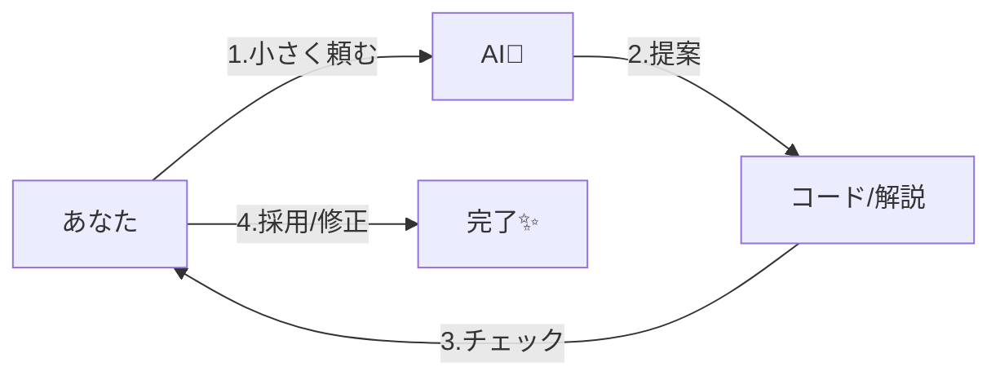

# 第05章：AIとKISS🤖💗（AIに“シンプル化”させるコツ）


この章はひとことで言うと…
**AIを「賢く書きすぎる人」じゃなくて「読みやすく直してくれる相棒」にする章**だよ〜🫶✨

---

## 5-0. まず結論：AIは“便利”だけど、放置すると盛る😇🍰

AIにリファクタ頼むと、たまにこうなる👇

* ✅ 動く
* ❌ クラス増える
* ❌ 抽象化増える
* ❌ パターン増える
* ❌ 「なるほど…読めん😇」

だから、**KISSの勝ち筋**はこれ👇

> **小さく頼む → 小さく直す → 小さく確認する** 🐾✅

---

## 5-1. AIの使い分け3段階（ここが超大事）🥳🎚️


AIって、実は「強さ」が3種類あるよ！

### ① その場の補完（軽い）✍️✨

* 1行〜数行の補完、次の編集の予測とか
* VS Code だとインライン提案が代表例だよ〜（次の変更まで予測してくれる系もある） ([Visual Studio Code][1])

### ② チャットで相談（中くらい）💬🧠

* 「この処理、何してる？」
* 「命名案出して」
* 「この分岐、整理して」
* みたいな “理解＋提案” が得意💡

### ③ エージェントに任せる（強い）🦾🧩

* 複数ファイルにまたがる修正、テスト実行、PR提案…みたいなやつ
* Visual Studio 2026 には GitHub Cloud Agent のプレビューがあって、VS内からタスクを委任できる流れがあるよ ([Microsoft Learn][2])
* OpenAI Codex も「クラウド上で動くソフトウェア開発エージェント」で、コード修正やテスト実行まで回して提案してくるタイプ ([OpenAI][3])
* VS Code 側も “ローカル/バックグラウンド/クラウド/サードパーティ(例: Codex)” みたいにエージェントを扱える設計になってるよ ([Visual Studio Code][4])

**KISS的おすすめ順**は👇
🟩 まず①②で“小さく” → どうしても必要なら③へ！

---

## 5-2. AIに「KISSで頼む」ときの型（テンプレ）🍱✨


AIにお願いするとき、**型**があると暴走しにくいよ〜！🥰

### ✅ KISSプロンプト：最強の5点セット

1. **目的**（何を良くしたい？）
2. **制約**（絶対守ってほしいこと）
3. **範囲**（ここだけ触って！）
4. **出力形式**（差分？コードだけ？説明も？）
5. **確認**（テスト/例外/ログどうする？）



---

## 5-3. コピペで使える！KISSプロンプト集 🧁🤖


### A) “挙動は変えずに”読みやすくして（基本）

* 使いどころ：メソッド整理、if地獄、命名改善

```text
目的：このメソッドを読みやすくしたい（KISS）
制約：
- 外部仕様（戻り値・例外・副作用）を変えない
- 差分は小さく（大改造しない）
- クラスや抽象化を増やさない（必要なら理由を添える）
範囲：このメソッド内だけ（他ファイルは触らない）
出力：変更後コード＋変更点を3行で説明
```

### B) “分岐を増やさず”に整理して（AIが分岐増やしがち対策🌿）

```text
目的：分岐の見通しを良くする
制約：
- if/switch の分岐数を増やさない（むしろ減らす）
- ネストを浅くする（ガード節OK）
- 例外の種類を増やさない
範囲：このメソッドだけ
出力：変更後コード＋分岐がどう減ったか説明
```

### C) “テストで挙動固定してから”やって（超おすすめ✅）

```text
目的：リファクタ前に挙動を固定したい
制約：
- 既存の挙動を変えない前提で「キャラクタリゼーションテスト」を追加
- 例外ケース（null/境界値）も最低3つ入れる
範囲：このクラスに対するテスト追加のみ
出力：テストコード＋追加した観点リスト
```

---

## 5-4. Visual Studio 2026 での “小さくAI” 🖱️✨

### ✅ 右クリックからAI（手軽！）

Visual Studio 2026 は **コンテキストメニューから Copilot Actions** を呼べる流れがあるよ〜！ ([Microsoft for Developers][5])
さらに “Optimize Selection” は **選択したコードに対して、性能/保守性/信頼性/アーキテクチャ面の改善提案**を出す感じ ([Microsoft for Developers][5])

**KISS的な使い方**👇

* まず「直したい範囲」だけをドラッグで選ぶ✂️
* “Optimize Selection” / “Explain” を使って
* **提案をそのまま採用せず**、小さく取り込む🐾

### ✅ Cloud Agent（強いけど、使いどころ注意🧠）

VS 2026 には **Cloud Agent を有効化してタスク委任**できる案内があるよ ([Microsoft Learn][2])
ただしKISS的には、最初は👇くらいの“軽作業”が安全🙆‍♀️

* コメント追加
* ドキュメント整備
* 小さいリファクタ
* UIの軽い調整

---

## 5-5. VS Code での “KISSエージェント運用” 🧑‍💻🌸


VS Code はエージェントを **種類分けして管理**できるよ（ローカル/バックグラウンド/クラウド/サードパーティ） ([Visual Studio Code][4])
セッションも一覧で見れて、変更ファイルや状態が追える設計になってるのがポイント！ ([Visual Studio Code][4])
最近の更新でも Agent Sessions の改善が続いてるよ ([Visual Studio Code][6])

**KISS的おすすめ**👇

* ローカルエージェント：相談・小改修💬
* バックグラウンド：明確な作業だけ（例：命名一括、コメント追加）🧹
* クラウド/サードパーティ：PR前提のまとまった作業だけ🧩

---

## 5-6. 実戦ハンズオン：AIに“挙動そのまま”で簡潔化させる 🍰🔧

### 🧨 Before：ありがちな「全部入りメソッド」

```csharp
public static decimal CalcTotal(Order? order, bool isMember, string? coupon)
{
    if (order == null) throw new ArgumentNullException(nameof(order));
    if (order.Items == null) throw new InvalidOperationException("Items is null");
    if (order.Items.Count == 0) return 0m;

    decimal subtotal = 0m;
    foreach (var item in order.Items)
    {
        if (item == null) continue;
        if (item.Price < 0) throw new ArgumentException("negative price");
        subtotal += item.Price * item.Quantity;
    }

    // member discount
    if (isMember)
    {
        subtotal *= 0.95m;
    }

    // coupon
    if (!string.IsNullOrWhiteSpace(coupon))
    {
        if (coupon == "OFF100") subtotal -= 100m;
        else if (coupon == "OFF10P") subtotal *= 0.9m;
        else throw new ArgumentException("unknown coupon");
    }

    // tax
    var total = subtotal * 1.10m;

    if (total < 0) total = 0m;
    return decimal.Round(total, 0, MidpointRounding.AwayFromZero);
}
```

### 🤖 AIへのお願い（テンプレAをちょい調整）

```text
目的：このメソッドを読みやすくしたい（KISS）
制約：
- 外部仕様（戻り値・例外・副作用）を変えない
- 差分は小さく
- クラス追加・抽象化追加はしない
範囲：このメソッド内だけ
出力：変更後コード＋変更点を3行で説明
```

### ✅ After（目標の形）：読みやすい“段落”にする🌸

AIの答えは毎回違うけど、**こういう方向**なら当たり🎯

* 入口でガード節🚪
* 集計は別ローカル関数で“意味を分ける”🧁
* クーポン判定をひとまとまりに🎫

（※AIが大改造してきたら、差分を小さく戻してOKだよ！😆）

---

## 5-7. AIの出力チェックリスト（KISS監査官モード👮‍♀️✅）


AIの提案を入れる前に、ここだけ見て！👀✨

### ✅ “複雑さ増えてない？”チェック

* 分岐（if/switch）が増えてない？🌿
* 例外の種類・箇所が増えてない？🧨
* クラス/抽象化が増えてない？（必要性の説明ある？）🏗️
* LINQやパターンが“賢いけど読めない”になってない？🌀

### ✅ “挙動変えてない？”チェック

* 境界値（null/空/0/負数）同じ？🧪
* 丸め/税/割引の順番ズレてない？💰
* 例外メッセージ変わってない？（気にするプロダクトなら）📝

---

## 5-8. ミニ課題 📝💗（3つだけ！）

### 課題1：AIに「命名だけ」頼む📛✨

* 対象：読みにくい変数名が多いメソッド
* ルール：**ロジック変更禁止**で命名案だけ出させる

### 課題2：AIに「ガード節化」だけ頼む🚪

* 対象：ネストが深いメソッド
* ルール：**分岐を増やさない**、ネストを浅く

### 課題3：AIに「テスト追加」させてからリファクタ🧪

* 対象：ちょい怖い既存処理
* ルール：テストが通るのを見てから、KISS化する🐾

---

## 5-9. 最後に：AIは“設計者”じゃなくて“作業者”にする🫶🤖

Visual Studio 2026 は AI 統合が強くなっていて、IDE内の導線も増えてるよ ([Microsoft Learn][2])
VS Code もエージェントやセッション管理が育ってて、運用しやすくなってきてる ([Visual Studio Code][4])
Codex みたいな開発エージェントも、タスクを分けて進めたりテストを回したりできる流れがある ([OpenAI][3])

でもね、KISSの主役はあなた😊🌸
AIは **「小さく頼めば、めっちゃ優秀な相棒」** になるよ〜！💗💗💗

---

次は「第6章：KISS運用チェックリスト✅」を、**AI時代の運用**（PRテンプレ、レビュー観点、個人開発の習慣化）まで含めて、ガッツリ作るね🫶✨

[1]: https://code.visualstudio.com/docs/copilot/overview "GitHub Copilot in VS Code"
[2]: https://learn.microsoft.com/ja-jp/visualstudio/releases/2026/release-notes "Visual Studio 2026 リリース ノート | Microsoft Learn"
[3]: https://openai.com/index/introducing-codex/ "Introducing Codex | OpenAI"
[4]: https://code.visualstudio.com/docs/copilot/agents/overview "Using agents in Visual Studio Code"
[5]: https://devblogs.microsoft.com/visualstudio/visual-studio-november-update-visual-studio-2026-cloud-agent-preview-and-more/ "Visual Studio 2026 November 2025 Update"
[6]: https://code.visualstudio.com/updates "December 2025 (version 1.108)"
