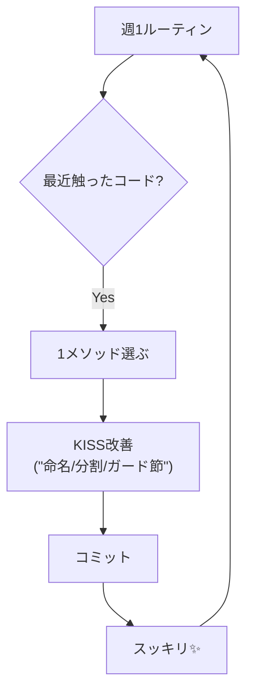

# 第06章：仕上げ：KISS運用チェックリスト✅🌈（続ける仕組み）

この章は「KISSわかった！✨」で終わらずに、**毎日・毎週ちゃんと回る仕組み**にしていく回だよ〜😊🫶
（ここまで来たら、もう勝ち確🎉）

---

## 6-0. まず大事：KISSは「ルール」じゃなくて「習慣」だよ🪴✨


KISSって、覚えた瞬間がピークになりがちなのね🥲
だから、**迷ったときに戻れる“判断の軸”**と、**勝手に続く“運用”**を作るのがゴールだよ✅

ちなみに今どきは、C# 14 / .NET 10 の新機能も増えてるから（便利だけど選択肢が増える＝迷いやすい😵‍💫）、**「使う・使わないの判断」**を支えるチェックリストがめちゃ効くよ〜✨
（C# 14 は Visual Studio 2026 か .NET 10 SDK で試せるよ） ([Microsoft Learn][1])

---

## 6-1. KISSチェックリストは「3段階」にすると続くよ✅🧁


いきなり完璧チェックを目指すと疲れて終わる😂
なので、**30秒 / 3分 / 15分**の3つを用意しよ〜！

---

### ① 30秒KISS（コミット前）⏱️🐾

* この変更、**目的が一言で言える？**🗣️✨
* メソッドが「判断＋計算＋保存＋表示」みたいに**弁当🍱になってない？**
* `if` が増えたなら、**ガード節（早期return）で浅くできない？**🚪
* 変数名が `tmp`, `flag`, `data1` とかで、**読んで分からない感じになってない？**📛😵
* 「賢いけど読めない」コードを増やしてない？🧠⚡（特にLINQやパターン）

> ✅ここで1個でも引っかかったら「3分KISS」へGO🏃‍♀️💨

---

### ② 3分KISS（PR前・レビュー前）🕒🔍

* **1メソッド1仕事**になってる？（名前が仕事を説明してる？）🎯📛
* 条件分岐は「何が違うのか」が**名前で説明されてる？**（`isOverLimit` みたいに）🗣️✨
* 例外 / null / 境界条件が、**あちこちに散ってない？**🧨🌧️
* 変更点が**小さく追える？**（差分が“読める”）🐾👀
* 同じ形の処理がコピペで増えてない？🧩（DRYとのバランス⚖️）

---

### ③ 15分KISS（迷ったときの“設計チェック”）🧭🛠️

* 「これ、半年後の自分が読んで理解できる？」📖🧑‍🚀
* “変更が来そうなところ”が、**閉じ込められてる？**（1箇所で直せる？）🔧✨
* 例外の方針（どこで投げる/握る/ログる）が**一貫**してる？🧯✅
* **新しい仕組み（抽象化・クラス増やす）**を入れる価値がある？（今じゃない病）🌀
* ここで初めて「小さなADR」候補📝✨（後述）

---

## 6-2. 迷ったときの“判断の軸”テンプレ🧭💗


迷いって、だいたいこの3パターンに落ちるよ😊

### A) 「短くしたい」vs「読みやすくしたい」📏📖

* ✅ **読みやすさ優先**でOK！
* 途中変数で説明したほうが読みやすいなら、むしろ“KISS”✨

### B) 「共通化したい」vs「重複を残したい」🧩⚖️

* ✅ **“同じ理由で一緒に変わる”なら共通化**
* ❌ “たまたま似てるだけ”なら共通化しない（未来で地獄👹）

### C) 「新しい機能を使いたい」vs「素直に書きたい」🆕🍵

* ✅ 新機能は便利だけど、**読者が迷うなら負け**
* “何のために使うか”が言えないなら、今日は使わない🙆‍♀️
  （C# 14 も機能が増えてるから、選ぶ力が大事だよ〜） ([Microsoft Learn][1])

---

## 6-3. “KISSのやりすぎ”防止🚧🧯（ここ超大事！）


KISSを頑張りすぎると、別の地獄に行くことある🤣

### 🚨やりすぎサイン3つ

1. **メソッドが細切れすぎて**、追うのが大変😵‍💫
2. **抽象化しなさすぎて**、同じ修正を3箇所に入れる羽目😇
3. “名前だけ立派”なメソッドが増えて、逆に分からない😶‍🌫️

### ✅止める合言葉

* 「読む人がスムーズに追える？」🎤📖
* 「変更が来たとき、どこ直す？」🔧👀
* 「この分割、説明のため？責務のため？」🧠✨

---

## 6-4. 1分で書く“小さなADR”📝✨（未来の自分を助けるやつ）


### ADRってなに？🤔

**「なぜこの形にしたか」**を短く残すメモだよ📝
代替案（やめた案）も書くと、あとで迷わない！✨
Microsoftのガイドでも、ADRは“重要な意思決定と却下した代替案”を残すのが大事って書かれてるよ ([Microsoft Learn][2])
元ネタとして有名なのは Cognitect の記事（2011）だね ([Cognitect.com][3])

### ✅置き場所おすすめ

* リポジトリ内：`docs/adr/` とか📁
  （コードと一緒に管理できるのが強い💪）

### ADRテンプレ（超ミニ）🧁

```text
# ADR-0001: 例外は「境界」でまとめる

## 状況 / 背景
- 例外があちこちで投げられて追跡がつらい😵

## 決定
- ドメイン層では Result 型（成功/失敗）で返す
- API/画面側の境界で例外に変換してログする🧯

## 代替案（やめた案）
- どこでも例外を投げる（追跡が難しいので却下）

## 影響
- 失敗パターンが呼び出し側で明示的に扱える✅
```

> “1分で書ける大きさ”がコツだよ😊🫶
> 大論文にしない！絶対しない！😂

---

## 6-5. KISSを“勝手に続く”形にする運用セット🗓️💗


### ✅ルーティン①：週1「ここ1つだけKISS改善」🧼✨

* 毎週1回だけでOK（多いと死ぬ）😇
* 対象は「最近触ったところ」から選ぶのが一番ラク🐾



例：

* 40行メソッドを 2〜3個に分ける
* 変数名を直す
* ifネストを1段浅くする
* 例外/ログの位置を揃える

### ✅ルーティン②：PRに“チェック欄”を埋め込む📌✅

GitHubでPR使うなら、テンプレにこれを貼ると強いよ〜！

```text
## KISSチェック✅
- [ ] 変更目的が一言で言える
- [ ] メソッドが弁当🍱になってない
- [ ] 条件が名前で説明されてる（bool名など）
- [ ] 例外/ログの置き場所が一貫してる
- [ ] “賢いけど読めない”が増えてない
```

---

## 6-6. AIを“KISS番犬”にする🐶🤖✨（暴走させないコツ）


最近の Visual Studio 2026 は Copilot が深く統合されてて、IDEの中で会話しながら直しやすい方向に進んでるよ ([Microsoft Learn][4])
GitHubの案内でも、Visual Studio 上で Copilot を使う前提や対応バージョンがまとまってるよ ([GitHub Docs][5])

### ✅AIに頼むときの“鉄板プロンプト”🍞✨

（コピペして使ってOK！）

```text
次のC#コードをKISSにしてください。

条件:
- 挙動は絶対に変えない
- 差分は小さく
- 例外や分岐を増やしすぎない
- 変数名・メソッド名は「読むだけで分かる」名前に
- 変更点の理由を3行で説明して
```

### ✅AIの出力をチェックする観点👀✅

* クラス増えすぎてない？（急に大工事🏗️してない？）
* 例外や分岐が増えてない？🧨
* 逆に“賢さ”で読めなくなってない？🧠⚡
* **差分が説明できる？**（説明できない変更は事故りやすい）🚑

---

## 6-7. ミニ課題📝🎀（自分プロジェクトにKISS導入！）

ゴールはこれ👇✨
**「迷ったらこれ見る」セットを、プロジェクト内に置く**📌

### 課題セット✅

1. `KISS-CHECKLIST.md` を作って、**30秒KISS**を貼る🧾
2. `docs/adr/` を作って、**ADRを1本だけ**書く📝
3. PRテンプレ（または自分用メモ）に、KISSチェック欄を追加📌
4. AIに上の鉄板プロンプトで1メソッドだけ直させて、
   **変更理由を3行で説明**してみる💪✨

---

## 6-8. 章末まとめ🌸🎓（これで“自走”できる！）

* KISSは「知識」より「習慣」🪴
* チェックリストは **30秒/3分/15分** の3段階で続く⏱️
* “やりすぎ”も地獄なので、サインを見て止まる🚧
* ADRは **1分で書けるサイズ**が正義📝✨
* AIは便利だけど、**「挙動維持・差分小さく」**で縛る🤖🐾

---

必要なら、あなたのプロジェクトに合わせて

* どんなKISSチェック項目にするか✅
* ADRの書く題材（例外方針？命名？レイヤ？）📝
* PRテンプレやREADMEの文面📌
  まで、丸ごと一緒に作るよ〜😊💗

[1]: https://learn.microsoft.com/ja-jp/dotnet/csharp/whats-new/csharp-14?utm_source=chatgpt.com "C# 14 の新機能"
[2]: https://learn.microsoft.com/en-us/azure/well-architected/architect-role/architecture-decision-record?utm_source=chatgpt.com "Maintain an architecture decision record (ADR)"
[3]: https://www.cognitect.com/blog/2011/11/15/documenting-architecture-decisions?utm_source=chatgpt.com "Documenting Architecture Decisions - Cognitect.com"
[4]: https://learn.microsoft.com/en-us/visualstudio/releases/2026/release-notes?utm_source=chatgpt.com "Visual Studio 2026 Release Notes"
[5]: https://docs.github.com/copilot/get-started/quickstart?utm_source=chatgpt.com "Quickstart for GitHub Copilot"
