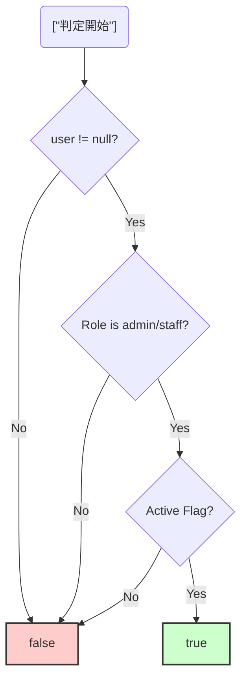

# 第01章：KISSってなに？🐣💡（まず誤解をほどく）

## 0. この章のゴール🎯✨

この章でいちばん大事なのはこれだけ〜！🥰

* 「シンプル＝短い」じゃなくて、**“理解しやすい・変更しやすい”** がシンプルなんだ〜って感覚をつかむ📖✨
* KISSの意味と、**なんでそんなに効くのか**を腹落ちさせる💗
* 自分のコードを見て「うわ、ここ読みにくい…」を**理由つきで言える**ようになる🗣️📝

---

## 1. KISSってなに？🐣💡（ひとことで）


KISSは「**シンプルにしよう**」っていう設計の合言葉だよ〜✨
元の言い回しは “Keep it simple, stupid” で、**「複雑にしないで、単純に保とう」** っていう考え方だよ😊 ([ウィキペディア][1])

そして有名なエピソードがあって…✈️🔧
「現場の整備士が、限られた工具だけで直せるように設計しろ！」みたいな発想が、KISSの芯になってるの。
つまり、**“壊れたとき・直すときの現実”に耐える設計が強い**ってことだね💪✨ ([ウィキペディア][1])

---

## 2. ありがちな誤解をほどくよ🧠🌀（ここ超重要！）

### 誤解A：「シンプル＝短いコード」✂️❌


短いのに読めないコードって、普通にあるある😂
たとえば「1行に全部詰め込んだ職人芸」とかね…🥹

**シンプルの正体はコレ👇**

* 読むのがラク👀✨（理解にかかる時間が短い）
* 直すのがラク🛠️✨（影響範囲が見える）
* ミスりにくい🧯✨（意図が明確）

---

### 誤解B：「賢いコード＝良いコード」🧙‍♂️❌


TypeScriptって、型も書けるし表現力も高いから、つい“賢く”したくなるのね🧩✨
でもKISS的には、**賢さよりも「読めること」が勝ち🏆**（未来の自分が泣かない…！😭）

---

## 3. KISSが強い理由（未来の自分が助かる📖✨）


KISSは「今の気持ちよさ」より、**未来の変更コスト**を下げてくれるのが強いよ〜🫶

* 仕様変更が来ても、直す場所がすぐ分かる🔎✨
* バグ修正が早い🧯⚡（追いやすい）
* 途中参加の人が理解しやすい👩‍💻👀
* そして実は…AIにも伝わりやすい🤖💗
  → “読める構造”だと、AIの提案もブレにくくなるよ〜！

ちなみに今のTypeScript界隈、コンパイラや言語サービスの大きな変化も話題になってて（速度・体験が変わっていく流れ）、「コード自体の分かりやすさ」はますます価値が上がる感じだよ📈✨ ([InfoWorld][2])

---

## 4. 「シンプル」ってどう測るの？📏✨（KISSのものさし）


迷ったら、この3つで判定してOKだよ😊💗

### ✅ ものさし①：5分で説明できる？⏱️🗣️

「この関数、何してるの？」って聞かれて
**5分で説明できないなら、たぶん複雑**🥹

### ✅ ものさし②：変更点が“1か所”に寄る？📌

仕様変更が来たときに
**あちこち直すなら複雑**になってるサイン🚨

### ✅ ものさし③：読む順番が素直？📚➡️

上から読んで自然に理解できる？
途中でジャンプしたり、脳内メモが増えるなら要注意🌀🧠

---

## 5. TypeScriptで「賢いけど読みにくい」あるある例😵‍💫🧩


（第2章で本格的にやるけど、ここでちょい体験しよ〜💕）

### 例1：1行に詰め込みすぎ🍱💥

```ts
// ぱっと見で“何をしたいか”が見えにくい例
const canLogin =
  user != null &&
  user.roles?.some(r => r === "admin" || r === "staff") &&
  (user.flags?.includes("active") ?? false);
```

**読みにくいポイント👀**

* 条件が折り重なって、脳内で括弧を組み立てがち🧠🌀
* 「結局、何が条件なの？」が一瞬で言えない🥹



---

### 例2：型が“説明”じゃなくて“パズル”になる🧩🌀

```ts
type Result<T> = T extends Promise<infer U>
  ? U extends { data: infer D } ? D : never
  : never;
```

**この章の結論💡**
こういうのが悪いわけじゃないけど、
**チームの読解コストが上がるなら、KISS的には要再考**だよ〜🫶✨

---

## 6. 今日のミニ課題📝💕（10〜20分）


やることはカンタン✨

### ✅ ミニ課題：「読むのがツラい箇所」3つ探す👀🗒️

自分のTypeScriptコード（なければ過去のサンプルでもOK！）から、
「読むのがツラい…」ところを3つ見つけて、**理由を一言でメモ**してね💕

メモの型（これでOK！）👇

* ① どのファイル/関数？：`xxx.ts` の `foo()`
  理由：条件が多くて追えない🌀
* ② …
* ③ …

**理由の例（使ってOK）✨**

* ネストが深い🪢
* 1つの関数が何個も仕事してる🍱
* 変数名が何を表すか分からない😵
* エラー処理が散ってる🧯
* 型が長すぎて意味が見えない🧩

---

## 7. AIで“読みにくさ診断”してみよう🤖💗（超おすすめ）

いまの開発環境って、チャットで「理解」「改善」「差分レビュー」までできるのが強いよ〜✨
たとえばVS Codeのチャットは、質問・計画・自動編集みたいに役割を切り替えられる感じ🧠🛠️ ([Visual Studio Code][3])
Copilot側も、チャットやエージェント機能が用意されてるよ〜！ ([GitHub Docs][4])

### ✅ プロンプト①：読みにくい理由を言語化してもらう👀📝

```text
この関数が「読みにくい理由」を3つに分解して説明して。
前提：挙動は正しいものとする。改善案はまだ出さなくてOK。
```

### ✅ プロンプト②：KISSに寄せた改善案を“控えめに”出してもらう✂️✨

```text
このコードをKISS寄りにリファクタして。
条件：
- 挙動は変えない
- 差分は小さく（必要最低限）
- ネスト削減、命名改善を優先
- 型を“読みやすく”する（型体操はしない）
出力は「変更方針→差分→なぜ読みやすくなったか」の順で。
```

### ✅ プロンプト③：変更点のセルフレビュー（ここが最強💪）

```text
この差分で「読みやすさが上がった点」と「逆にリスクになりそうな点」をそれぞれ3つ挙げて。
```

---

## 8. まとめ🌈✨（この章で覚える言葉）

* KISS = **複雑にしない**（シンプルは“手抜き”じゃない） ([ウィキペディア][1])
* シンプル = **理解しやすい・変更しやすい**🫶
* “賢い”より“読める”が勝つ🏆
* まずは「読みにくい理由を言語化」できたら第一歩💗

---

## 9. 追加ミニおまけ🎁✨（やると伸びる！）

最後にこれだけ💡
今日見つけた「読むのがツラい箇所」3つのうち、どれか1つを選んで

* **「この関数の目的を1文で」** 書いてみてね📝✨
  書けないなら、その時点で“責務が混ざってる”可能性大だよ〜🍱🌀

---

次は第2章で、TSで複雑になりがちな「3大ポイント」を、めっちゃ分かりやすく“敵の正体”として整理していくよ〜🌀🧠💗

[1]: https://en.wikipedia.org/wiki/KISS_principle?utm_source=chatgpt.com "KISS principle"
[2]: https://www.infoworld.com/article/4100582/microsoft-steers-native-port-of-typescript-to-early-2026-release.html?utm_source=chatgpt.com "Microsoft steers native port of TypeScript to early 2026 ..."
[3]: https://code.visualstudio.com/docs/copilot/chat/copilot-chat "Get started with chat in VS Code"
[4]: https://docs.github.com/en/copilot/get-started/features "GitHub Copilot features - GitHub Docs"
