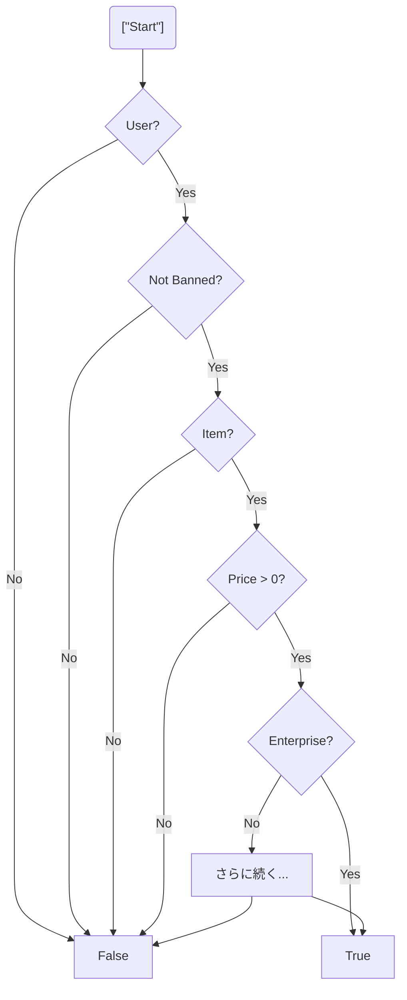
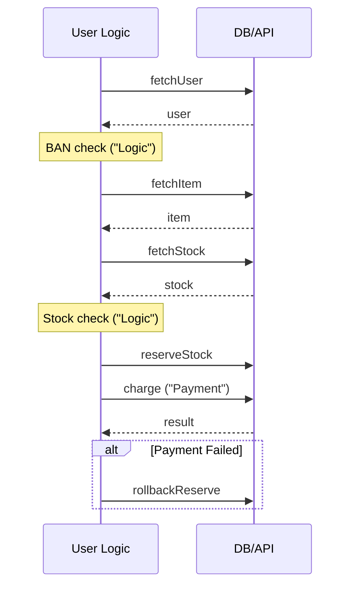

# 第02章：TSで複雑になりがちな3大ポイント🌀🧠（敵を知ろう）

## この章のゴール🎯

「なんかゴチャゴチャしてる…😵」を、ちゃんと **原因つきで説明**できるようになること！✨
直し方は次章以降でやるので、この章は **観察力を育てる回**だよ〜👀💕

---

## まず「複雑さ」って何？🤔💭


ざっくり言うと、複雑さはこの3つを増やす子です👇

* **読む時間が増える**（理解に脳みそが溶ける🧠🔥）
* **変更が怖くなる**（どこに影響するか分からない😱）
* **バグが入りやすくなる**（想定外ルートが増える🕳️）

そしてTSで増えがちな複雑さの“発生源”が、この3つ👇

1. **if地獄**（分岐＆ネスト）🌿
2. **async地獄**（時間の流れ＆エラー経路）⏳💥
3. **型地獄**（型が説明じゃなく“暗号”になる）🧩😵

---

## 1) if地獄🌿：分岐が増えてネストが深い

### ありがちな症状チェック✅

* `if` の中に `if` の中に `if`…（インデントが右に右に👉👉👉）
* `else if` が長い（条件が増殖🐛）
* 条件式が長い（`&&` と `||` がぐちゃぐちゃ🧶）
* “例外ケース”が途中に混ざって、話が飛ぶ🌀

### 例：読みにくい if 地獄（観察用）👀

```ts
type User = { id: string; isBanned: boolean; plan: "free" | "pro" | "enterprise" };
type Item = { id: string; price: number; isDigital: boolean };

export function canPurchase(user: User | null, item: Item | null, coupon?: string) {
  if (user) {
    if (!user.isBanned) {
      if (item) {
        if (item.price > 0) {
          if (user.plan === "enterprise") {
            return true;
          } else {
            if (coupon) {
              if (coupon.startsWith("VIP-")) {
                return true;
              } else {
                return item.isDigital ? true : false;
              }
            } else {
              return item.isDigital ? true : false;
            }
          }
        } else {
          return false;
        }
      } else {
        return false;
      }
    } else {
      return false;
    }
  } else {
    return false;
  }
}
```

### 「何がツラいの？」を言語化するテンプレ🗣️✨

この手のコードを見たら、こう言えたら勝ち🏆

* 「**否定条件が奥に溜まってて**、結論まで遠い〜😵」
* 「**例外（ban/ null/ price=0）** が散らばってて、道が多い🛣️」
* 「**同じ結論（false）が何回も出る**＝構造が重複してる📦」



### 観察ポイント（メモの観点）📝

* ネストの深さ（3段超えたら黄色信号🟡）
* 条件が **“人間の言葉”** になってる？（なってないと事故る💥）
* `true/false` の返しが散らばってない？（出口が多い🚪🚪🚪）

---

## 2) async地獄⏳💥：async/await + 例外 + 早期return が混ざって追えない

### ありがちな症状チェック✅

* `await` がたくさんあって、**どの順で何が起きるか**追えない😵‍💫
* `try/catch` が途中に出てきて、**失敗時の流れ**が見えない🧯
* 途中で `return` が出る（ルート分岐が増える🛣️）
* DB/API/ログ/整形/権限…が1関数に全部いる🍱💦

### 例：async地獄（観察用）👀

```ts
export async function checkout(userId: string, itemId: string) {
  try {
    const user = await fetchUser(userId);
    if (!user) return { ok: false, reason: "NO_USER" as const };

    const item = await fetchItem(itemId);
    if (!item) return { ok: false, reason: "NO_ITEM" as const };

    if (user.isBanned) return { ok: false, reason: "BANNED" as const };

    const stock = await fetchStock(itemId);
    if (stock <= 0) return { ok: false, reason: "NO_STOCK" as const };

    await reserveStock(itemId);

    try {
      const payment = await charge(user, item.price);
      if (!payment.ok) return { ok: false, reason: "PAYMENT_FAILED" as const };

      await saveOrder(userId, itemId, payment.id);
      return { ok: true as const };
    } catch (e) {
      await rollbackReserve(itemId);
      return { ok: false, reason: "CHARGE_EXCEPTION" as const };
    }
  } catch (e) {
    return { ok: false, reason: "UNKNOWN" as const };
  }
}
```

### 「何がツラいの？」を言語化するテンプレ🗣️✨

* 「**成功ルート**と **失敗ルート**が交互に出てきて、ストーリーが途切れる📖💦」
* 「`try/catch` が二重で、**どの失敗がどこに落ちるか**分かりにくい🧯🧯」
* 「I/O（fetch/charge/save）と判断（ban/stock）が混ざって、頭のモード切替が多い🧠🔁」



### 観察ポイント（メモの観点）📝

* `await` の数（多いほど“時間の物語”が長い⏳）
* エラー出口（`catch` が増散してる？）
* “途中状態”があるか（reserve したのに失敗…みたいな中間状態🧊）

> ちなみに最近のTS/周辺ツールは、巨大プロジェクトでも快適にするために **コンパイラや言語サービスの高速化（ネイティブ化プレビュー）** も進んでるよ〜⚡️
> でも！日々の開発では、まず **コード側の複雑さを減らす**のがいちばん効く💪✨ ([Microsoft for Developers][1])

---

## 3) 型地獄🧩😵：型が強すぎて読めない（巨大union/ジェネリクス入れ子/型体操）

### ありがちな症状チェック✅

* hover すると型が長すぎて画面が埋まる📜😇
* `T extends ... ? ... : ...`（条件型）だらけで暗号🧪
* `Pick/Omit/Extract/Exclude` が入れ子🪆
* “型で全部表現したい欲”が暴走🚀

### 例：型が“説明”じゃなくなってる（観察用）👀

```ts
type ApiResponse<T> =
  | { ok: true; data: T; meta: { requestId: string } }
  | { ok: false; error: { code: string; message: string; detail?: unknown } };

type Normalize<T> =
  T extends readonly (infer U)[] ? Normalize<U>[] :
  T extends object ? { [K in keyof T]: Normalize<T[K]> } :
  T;

type Result<T> = ApiResponse<Normalize<T>>;

export type SuperComplicated =
  Result<{ users: Array<{ id: string; tags?: string[] | null }>; flags: Record<string, boolean> }>;
```

### 「何がツラいの？」を言語化するテンプレ🗣️✨

* 「型が**“読むための説明”**じゃなくて、**“計算装置”**になってる🧠⚙️」
* 「変更したい時に、影響範囲が型レベルで広がって怖い😱」
* 「hover で追える前提が崩れて、理解が止まる🧊」

### 観察ポイント（メモの観点）📝

* その型は「**人に説明するため**」？それとも「**全部を型で縛るため**」？
* 型が長い理由は「データ構造が複雑」？それとも「型体操しすぎ」？
* “境界”（API入力・外部データ）以外でも `unknown` や巨大 union が暴れてない？

> TypeScript 5.9 では、hover を見やすくする改善（展開できる hover、長さ上限の調整など）も入ってるよ🪄
> 「型地獄の観察」がしやすくなってるのは嬉しいポイント！ ([Microsoft for Developers][2])

---

## VS Codeで「地獄を観察」する小ワザ🧰👀

観察が速い人、成長も速い✨（マジで！）

* アウトライン（関数一覧）で「長い関数」を即発見🔎
* 折りたたみで「ネストの深さ」を体感📦
* hover で「型の長さ」を確認（長い＝型地獄の匂い👃）
* Chatで「この関数、何が複雑？」って聞いて観察メモを作る🤖📝（説明・要約が得意） ([Visual Studio Code][3])

---

## 章末ミニ課題📝✨（if/async/型を1つずつ“観察”）

自分のコード or 適当なリポジトリでOKだよ〜💕

### 観察ログ（コピペ用）📋💗

* 地獄の種類：if🌿 / async⏳ / 型🧩
* どこがツラい？（3行）✍️
* “発生源”は何？（例：例外ケース増殖、I/O混在、型体操…）🧠
* 影響（何が起きそう？）：バグりそう/変更怖い/読むの無理😇
* 次章で直すなら、どこから触る？（1行で）🐾

---

## おまけ：AIに投げる「観察プロンプト」テンプレ🤖💬

この章は“直さない”けど、観察の質を上げるために使ってOK✨

* 「この関数の複雑さの原因を、**if/async/型**の観点で分類して、箇条書きで教えて」
* 「読み手が迷うポイントを **3つ** 指摘して。理由もつけて」
* 「挙動は変えずに直すとしたら、まず **どこを分離**すると良さそう？（まだコードは出さなくてOK）」

---

## この章で“できるようになったら勝ち”チェック✅🌈

* if地獄を見て「ネストと出口の多さが原因」って言える🌿
* async地獄を見て「時間の流れとエラー経路が混ざってる」って言える⏳
* 型地獄を見て「型が説明じゃなく計算になってる」って言える🧩

---


[1]: https://devblogs.microsoft.com/typescript/typescript-native-port/?utm_source=chatgpt.com "A 10x Faster TypeScript"
[2]: https://devblogs.microsoft.com/typescript/announcing-typescript-5-9/ "Announcing TypeScript 5.9 - TypeScript"
[3]: https://code.visualstudio.com/docs/copilot/chat/copilot-chat "Get started with chat in VS Code"
