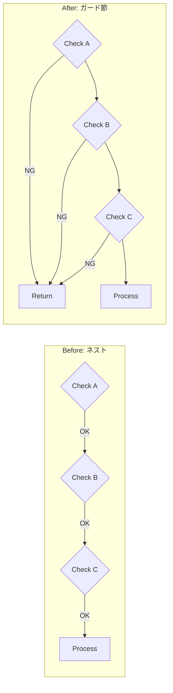
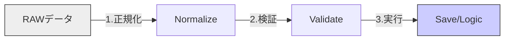

# 第03章：KISSの基本ワザ10選🧰✨（今日から使えるやつ）

### この章のゴール🎯

「うわ、ややこしい…😵」ってコードに出会ったときに、**すぐ使える“単純化の型”が10個**パッと出てくるようになることだよ〜！💪💗
（＝迷って手が止まる時間を減らす✨）

---

## まず最初に：KISSで直す“いつもの手順”🧭✨


いきなり大改造しないで、これで安全にいこ〜！🐾

1. **動きを守るもの**を用意する🛟

* 既存のテストがあれば最高✅
* なければ「関数呼んで戻り値見る」レベルでもOK👍

2. **入口と出口**を見つける🚪

* 入力（引数）→ 出力（return / DB保存 / 画面表示）
* まずはここだけメモ📝

3. **“一番しんどいところ”を1つだけ選ぶ**🎯

* ネスト地獄？型地獄？例外地獄？
* まず1個だけ✨

4. **差分は小さく**🐾

* 1回の変更で「直した理由」が一言で言える範囲にする💡

5. 最後に **読む人テスト**🎤

* 声に出して読んで「説明できる？」をチェック👀✨

---

## KISSの基本ワザ10選🧰✨（テンプレ集）


下の10個は、**“困ったらここに戻る”**っていう定番セットだよ〜🍀
（それぞれ「いつ使う？」「どう直す？」「ミニ練習」つき！）

---

# 1) ガード節（早期return）🚪✨


### いつ使う？🤔

* `if` が深くなって、**「結局どこが本体？」**ってなるとき😵

### どう直す？🛠️

* **先にダメな条件をはじく** → 本体がスッと見える✨

**Before（ネストが増える）**

```ts
function canPurchase(user: User | null, cart: Cart) {
  if (user) {
    if (!user.isBanned) {
      if (cart.items.length > 0) {
        return true;
      }
    }
  }
  return false;
}
```

**After（入口でさばく）**

```ts
function canPurchase(user: User | null, cart: Cart) {
  if (!user) return false;
  if (user.isBanned) return false;
  if (cart.items.length === 0) return false;
  return true;
}
```

### ミニ練習📝

* ネストが2段以上ある関数を1つ見つけて、**ガード節に置き換え**してみよ〜🚪✨



---

# 2) ネストを浅くする🪢✨（「階層」を減らす）


### いつ使う？🤔

* `if` の中に `if` の中に `if`…みたいな時🌿🌿🌿

### どう直す？🛠️

* ガード節
* 条件を反転して `return` / `continue`
* 早めに分岐を終わらせる

**ループでも超効くよ〜！**

```ts
for (const item of items) {
  if (!item.enabled) continue;
  if (item.price <= 0) continue;

  // ここが本体✨
  total += item.price;
}
```

### ミニ練習📝

* ループ内の `if` ネストを **`continue` で浅く**してみよ〜🎵

---

# 3) 変数名で条件をしゃべらせる（is〜/has〜）🗣️💕


### いつ使う？🤔

* こういうの見たとき👇😵
  `if (a && (b || c) && !d && e > 3)`

### どう直す？🛠️

* **条件式を“文章のパーツ”に分解**して名前をつける📛✨

```ts
const hasPaidPlan = user.plan === "paid";
const isEmailVerified = user.emailVerified;
const canUseFeature = hasPaidPlan && isEmailVerified;

if (!canUseFeature) return;
```

### ミニ練習📝

* 条件が長い `if` を1つ選んで、**3つ以上の説明変数**に分ける📛✨

---

# 4) 1関数1仕事（長い関数を分割）✂️✨


### いつ使う？🤔

* 60〜100行くらいあって、スクロールがつらいとき😵‍💫

### どう直す？🛠️

* まずは“見出し”で切る📌
  例：`validate...` → `build...` → `save...` → `format...`

**分割のコツ🍀**

* 「入力の整形」
* 「判定・計算（本体）」
* 「出力の整形」
  この3つに分けると、だいたい成功する💮

### ミニ練習📝

* 長めの関数を選んで、**3〜5個に分割**＋見出しっぽい命名📛✨

---

# 5) 変換・検証・保存を混ぜない🍱✨（責務を分ける）


### いつ使う？🤔

* 1つの関数で
  「入力チェック」→「変換」→「DB保存」→「ログ」
  まで全部やってる時😵

### どう直す？🛠️

* 「純粋な処理（計算だけ）」と「外部（保存/通信）」を分離する🌈

```ts
function normalizeEmail(raw: string) {
  return raw.trim().toLowerCase();
}

function validateEmail(email: string) {
  if (!email.includes("@")) throw new Error("Invalid email");
}

async function registerUser(rawEmail: string) {
  const email = normalizeEmail(rawEmail);
  validateEmail(email);
  return await saveUserToDb({ email });
}
```



---

# 6) “似た形”を揃える🎵✨（読みのリズムを作る）

### いつ使う？🤔

* 似た処理なのに、書き方が毎回バラバラで読みにくいとき😵

### どう直す？🛠️

* 形を統一する（順番・命名・戻り値の型など）
* 例：すべて `parse → validate → build → save` の並びにする

**小技💡**

* 似た関数は「引数の並び」も揃えると一気に読みやすい✨

---

# 7) 例外の出入口を決める🧯✨（散らさない）

### いつ使う？🤔

* `try/catch` があちこちにあって、何が起きるか追えない時💥

### どう直す？🛠️

* **境界（入口/出口）だけでまとめて扱う**
* 中のロジックはスッキリさせる

```ts
async function handleRequest(req: Request) {
  try {
    const input = parseRequest(req);
    const result = await executeUseCase(input);
    return toResponse(result);
  } catch (err) {
    return toErrorResponse(err);
  }
}
```

---

# 8) データ構造で表現する🧺✨（ifの代わりにMap/辞書）


### いつ使う？🤔

* `if/switch` が「種類の分だけ増殖」してる時😵
* 追加要件が来るたびに分岐が増えるパターン💥

### どう直す？🛠️

* “分岐”を“表（辞書）”にする📚✨
* しかも TypeScript だと、キー漏れを型で防げるのが強い💪

```ts
type Status = "draft" | "published" | "archived";

const labelByStatus = {
  draft: "下書き📝",
  published: "公開中🌈",
  archived: "保管📦",
} satisfies Record<Status, string>;

function getStatusLabel(status: Status) {
  return labelByStatus[status];
}
```

---

# 9) “小さい差分”で直す🐾✨（安全に進む）

### いつ使う？🤔

* 「直したいけど壊しそうで怖い…🥺」って時

### どう直す？🛠️

* 1回の変更は **1つの意図だけ**

  * 例：今日は「命名だけ」
  * 次に「ガード節だけ」
  * 次に「関数分割だけ」

**超実戦ルール✅**

* 変更理由を一言で言えない差分は、だいたいデカすぎる😇

---

# 10) 読む人テスト🎤✨（声に出して読める？）

### いつ使う？🤔

* 仕上げチェック全部これでOK✅
* 「理解できる」かどうかは、読むとバレる😳

### どうやる？🛠️

* 変数名・関数名を声に出して読む
* **つまった場所＝改善ポイント**👀

**最近のエディタ周りの“読みやすさ強化”も味方にしてね✨**

* たとえば TypeScript 5.9 ではホバー表示が読みやすくなる改善が入ってたり、ホバーの最大長を設定できたりするよ〜📌 ([typescriptlang.org][1])
* さらに最近の VS Code も “エージェント系の作業導線” が増えてて、リファクタの細切れ反復と相性いい感じ💗（リリースノートにまとまってるよ）([Visual Studio Code][2])

---

## まとめ：10ワザは「直し方の辞書」📚✨

困ったらこの順で当てはめると早いよ〜！💨
1️⃣ ガード節 → 2️⃣ ネスト削減 → 3️⃣ 命名 → 4️⃣ 分割 → 5️⃣ 責務分離 → 8️⃣ 辞書化 → 最後に🔟読む人テスト🎤

---

## 章末ミニ課題📝✨（メイン課題）

### お題🎯

**60〜100行くらいの関数**を1つ選んで、次をやるよ〜💪💕

### やること✅（3ステップ）

1. **3〜5個に分割**✂️
2. そのうち1箇所を **ガード節 + ネスト削減**🚪🪢
3. 条件式を **説明変数**にして「しゃべるコード」に📛🗣️

### 提出物（自分用でOK）📦

* Before/After のコード
* 「何をしたか」を **3行で説明**📝
* 最後に **読む人テスト**の結果を一言🎤✨

---

## おまけ：AIに頼むときの“事故防止”プロンプト🧯🤖💗

そのままコピペで使えるやつ置いとくね👇✨

```text
次のTypeScriptコードを、挙動を変えずにKISS（読みやすさ最優先）でリファクタしてください。

制約:
- 変更は小さく分割して提案（1ステップずつ）
- ネスト削減（ガード節/continue）を優先
- 条件式は説明変数に分解して命名
- 1関数1仕事で3〜5個に分割
- 型は増やしすぎない（型体操禁止）
- 出力は「変更理由」と「差分コード」をセットで
```

※ GitHub Copilot でも「編集モード/エージェントモード」みたいに段階に応じて使い分けできる仕様がまとまってるよ（必要なら参照）([GitHub Docs][3])

---

次は、もし希望があれば…✨
あなたの“よくある地獄コード例”っぽいサンプル（if地獄・async地獄・型地獄）を私が用意して、**この10ワザを順番に当てて「Before→After」完全デモ**も作れるよ〜😆🧡

[1]: https://www.typescriptlang.org/docs/handbook/release-notes/typescript-5-9.html?utm_source=chatgpt.com "Documentation - TypeScript 5.9"
[2]: https://code.visualstudio.com/updates "December 2025 (version 1.108)"
[3]: https://docs.github.com/en/copilot/get-started/features "GitHub Copilot features - GitHub Docs"
