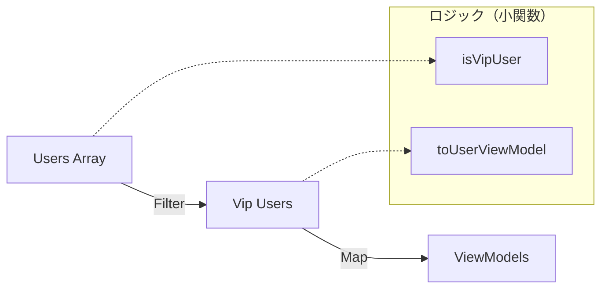

# 第04章：TypeScriptのKISS：型とコードのバランス⚖️🧩

（「型で賢くしすぎて読めない事故」を防ぐ回だよ〜！😊✨）

---

## この章のゴール🎯💗

* 「型は強いほど良い」じゃなくて、**“読める範囲で強い”** を選べるようになる✨
* TSでありがちな **型の付けすぎ・型体操・ジェネリクス地獄** を回避できる🌀
* **境界（入力）では厳しく、内部（ロジック）ではシンプルに**できるようになる💪🌈

---

## まず大事な感覚🍀📌：「型は“説明書”」

型ってね、目的はこれ👇

* ✅ **読む人（未来の自分含む）の理解を助ける**
* ✅ **間違いを早めに見つける**
* ✅ **補完やリネーム等の編集体験を良くする**

逆に…

* ❌ “型でパズル”を始める
* ❌ “読めないけど正しいっぽい”を増やす
* ❌ 「型が本体」になって、コードが見えない

…ってなると、KISSから離れちゃうよ〜🥲🧯

最近は、型が長くなりがちな問題に対して、VS Code上のホバーを段階的に展開できる仕組み（Expandable Hovers）がプレビューで入ったりしてるけど、**だからこそ「型を巨大化させても何とかなる」方向に流れやすい**ので要注意だよ⚠️😵‍💫
（TypeScript 5.9 の機能として紹介されてるよ） ([Microsoft for Developers][1])

---

## “型の付けすぎ”あるある診断🩺🧠（3つ当てはまったら危険💥）

### ① ホバーが長すぎて読めない👀📜

* 型が表示されても「…で、結局なに？」ってなる
* 型エイリアスを辿っても辿っても終わらない🌀

### ② ジェネリクスが3個以上並びがち🧬🧬🧬

* `T, K, V, R, S...` が増えるほど、読み手の脳みそが溶ける🫠

### ③ conditional type / mapped type が“説明”じゃなく“暗号”🔐

* 書いた本人以外が理解できない（そして本人も1ヶ月後に忘れる）😂

---

## KISSな「型とコードのバランス」6原則🧁✨

### 原則1：**型は“短く読める”を優先**📏


* 長い型は、**分割して名前を付ける**（これだけで救われる🙏）

### 原則2：**「入力」は厳しく、「中身」はシンプル**🚪➡️🏠


* 外から来るデータ（API/Storage/Query/フォーム）は信用しない
* 入口で整形して、内部は“前提が成立してる世界”にする🌈

### 原則3：**union が増えるなら discriminated union に寄せる🎭**


TSは分岐（if/switch）で型を絞るのが得意だよ〜（control flow analysis） ([typescriptlang.org][2])
だから「種類」を表すなら👇が強い💪

```ts
type Payment =
  | { kind: "card"; last4: string }
  | { kind: "bank"; bankName: string }
  | { kind: "cash" };

function label(p: Payment) {
  switch (p.kind) {
    case "card": return `カード(${p.last4})`;
    case "bank": return `銀行(${p.bankName})`;
    case "cash": return "現金";
  }
}
```

### 原則4：ジェネリクスは「必要な場所だけ」🎯

* “再利用したい気持ち”は分かるけど、まずは **1個の具体型**で書いてOK😊
* 本当に困ってから一般化で大丈夫🌱

### 原則5：`as` は最後の手段、まず「嘘をつかない」🙅‍♀️

* `as SomeType` は、型チェックをごまかせちゃう
* 入口で検証（type guard）してから中に入れるのがKISS✨

### 原則6：`satisfies` を使うと「強制しすぎ」になりにくい🪄

`satisfies` は「この形を満たしてるか検査するけど、推論結果は潰さない」っていう便利アイテムだよ✨ ([typescriptlang.org][3])

```ts
type Routes = Record<string, { path: string; auth?: boolean }>;

const routes = {
  home: { path: "/" },
  admin: { path: "/admin", auth: true },
} satisfies Routes;

// routes.admin.auth は true のまま推論されやすくて、使い心地がいい💗
```

---

## 「型が長い」をKISSにする3手🧰✨

### 手1：中間typeに名前をつける📛

```ts
type UserId = string;

type User = {
  id: UserId;
  name: string;
  email?: string;
};

type UserMap = Map<UserId, User>;
```

### 手2：型エイリアスは「意味のまとまり」単位で切る🍱

* 住所
* 料金
* 表示用
  みたいに、読み手が“見出し”として理解できる分割にする✨

### 手3：複雑な型より「小さな関数」で説明する🧁

* 型で全部表そうとすると巨大化しがち
* それなら **小さな変換関数**で段階的にして、変換点を名前で語る🗣️💕

---

## `map/filter/reduce` を“賢くしすぎ”問題🧠⚡ → 途中変数でKISS🫶

### ❌ あるある（読めない）

```ts
const result = users
  .filter(u => u.profile?.tags?.some(t => t.startsWith("vip")) ?? false)
  .map(u => ({
    id: u.id,
    label: `${u.name} (${u.profile!.age ?? "?"})`,
  }));
```

### ✅ KISS（段階に名前をつける）

```ts
const vipUsers = users.filter(isVipUser);
const viewModels = vipUsers.map(toUserViewModel);

function isVipUser(u: User): boolean {
  const tags = u.profile?.tags ?? [];
  return tags.some(t => t.startsWith("vip"));
}

function toUserViewModel(u: User) {
  const age = u.profile?.age ?? "?";
  return { id: u.id, label: `${u.name} (${age})` };
}
```

読める！直せる！テストしやすい！🎉💗



---

## `null/undefined` を散らさないコツ🌧️➡️☀️

### KISSルール：**入口で整形して、内部では前提をシンプルにする**

* 内部ロジックで `?.` と `??` を連打し始めたら黄信号🚥
* 「空の配列にする」「必須にする」「未知は unknown にする」など、入口で決めちゃう✨

TSの設定でも「未チェックアクセス」を厳しくして事故を減らせる（例：`noUncheckedIndexedAccess`）よ ([typescriptlang.org][4])
（ただし厳しくすると修正も増えるから、段階的にね😊）

---

## VS Codeで“型を読みやすくする”小ワザ🪄👀

型の学習って、**見える化**すると早いよ〜！✨

* **Inlay Hints**：引数名や推論型がうっすら表示されて理解が速くなる🫶 ([Visual Studio Code][5])
* **Expandable Hovers（TypeScript 5.9 プレビュー）**：ホバーの型を`+/-`で段階的に展開できる📜✨ ([Microsoft for Developers][1])

そして、型が巨大化しない設計にしておくと、そもそもホバーに頼らなくて済む👍💗

---

## 実戦ミニ教材🎀：APIデータを「入口→ロジック→出口」で分ける

ここ、TypeScriptのKISSが一番効くところだよ〜！🔥

### ① 入力（信用しない）🚪

```ts
type ApiUser = {
  id?: unknown;
  name?: unknown;
  age?: unknown;
};

function toDomainUser(input: ApiUser): DomainUser | null {
  if (typeof input.id !== "string") return null;
  if (typeof input.name !== "string") return null;

  const age =
    typeof input.age === "number" && Number.isFinite(input.age)
      ? input.age
      : null;

  return { id: input.id, name: input.name, age };
}
```

### ② 内部ロジック（前提がシンプル）🏠

```ts
type DomainUser = {
  id: string;
  name: string;
  age: number | null;
};

function isAdult(u: DomainUser): boolean {
  return u.age !== null && u.age >= 18;
}
```

### ③ 出力（表示用に整形）🎁

```ts
type UserView = { id: string; label: string; badge?: "ADULT" };

function toView(u: DomainUser): UserView {
  const ageText = u.age === null ? "?" : String(u.age);
  return {
    id: u.id,
    label: `${u.name} (${ageText})`,
    badge: isAdult(u) ? "ADULT" : undefined,
  };
}
```

👉 こうすると、型もコードも「読む順番」が自然になるよ😊🌈

---

## ミニ課題📝✨（この章のやつ）

### 課題A：union/ジェネリクスを“読みやすく整理”🎭

1. 自分のコードで **unionが大きい箇所**を1つ探す👀
2. `kind`（または`type`）を足して **discriminated union**に寄せる
3. `switch`で分岐して、読みやすさが上がったか確認💗

### 課題B：型が長いところを「中間type」に分割📛

* 1個でいいから「型エイリアスに名前を付けて分割」してみる✨
* “見出し”として読める名前になってるかチェック🎤

### 課題C：入口整形で `?.` を減らす🚪

* API/Storage/フォーム入力のどれかで、
  **入口で整形 → 内部で前提を単純化** を1回やってみよう🌈

---

## 章末チェックリスト✅💗（提出前に30秒でOK）

* 型は「読む人の説明書」になってる？📖
* 1つの型が長すぎない？（分割できない？）📛
* unionは “種類” を表せてる？（discriminated unionにできる？）🎭
* ジェネリクスを盛りすぎてない？🧬
* `as` でごまかしてない？（入口で検証できる？）🙅‍♀️
* `map/filter/reduce` が暗号になってない？（段階に分けられる？）🧁

---

## おまけ：AIに頼むときの“小さい合言葉”🤖💗

（第5章で本格的にやるけど、ここでもちょい使えるよ✨）

* 「型体操は禁止」
* 「型は“短く読める”方向へ」
* 「discriminated union で整理して」
* 「差分は小さく、挙動は変えない」

GitHub Copilot などの支援機能も「説明・提案・修正」に強いよ ([Visual Studio Code][6])

---

## ここまでのまとめ🍓✨

* **型は強さより“読みやすさ”がKISSの軸**
* **入口で整形 / 内部を単純化**が最強パターン
* unionは **discriminated union**、長い型は **分割＋命名**
* `satisfies` は「推論を殺さずに検査できる」から便利🪄 ([typescriptlang.org][3])

---

次の第5章は、AIに「ややこしくしないリファクタ」をやらせる回だよ🤖💗


[1]: https://devblogs.microsoft.com/typescript/announcing-typescript-5-9/?utm_source=chatgpt.com "Announcing TypeScript 5.9"
[2]: https://www.typescriptlang.org/docs/handbook/2/narrowing.html?utm_source=chatgpt.com "Documentation - Narrowing"
[3]: https://www.typescriptlang.org/docs/handbook/release-notes/typescript-4-9.html?utm_source=chatgpt.com "Documentation - TypeScript 4.9"
[4]: https://www.typescriptlang.org/tsconfig/?utm_source=chatgpt.com "TSConfig Reference - Docs on every TSConfig option"
[5]: https://code.visualstudio.com/docs/typescript/typescript-editing?utm_source=chatgpt.com "Editing TypeScript"
[6]: https://code.visualstudio.com/docs/copilot/overview?utm_source=chatgpt.com "GitHub Copilot in VS Code"
