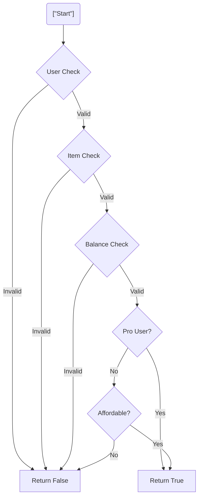

# 第05章：AIとKISS：お願いテンプレ＆レビュー術🤖💗

（AIに“ややこしくしないリファクタ”をやらせる章だよ〜✨）

---

## 5-1. まず大事な前提：AIは放っておくと「賢くしがち」😇➡️😵‍💫


AIって、良かれと思って…

* クラス増やす📦📦📦
* 抽象化レイヤー増やす🧱🧱
* 型体操はじめる🧩🤸‍♂️
  …みたいに、**読みやすさより“美しさ”を優先**しがちなの🥺

だからこの章は、AIに対して👇を徹底するよ✨
**「目的：KISS（理解しやすさ最優先）」をブレさせない！**💗

---

## 5-2. AIの使い分け：Ask / Edit / Agent をざっくり理解しよ🧠✨


最近のAIコーディング支援は、だいたいこの3つに分かれるよ〜🪄
（名前はツールで多少違うけど、考え方は同じ！）

| モード                  | 何が得意？                | KISS的おすすめ用途            |
| -------------------- | -------------------- | ---------------------- |
| Ask（質問）💬            | 説明・方針・原因調査           | 「この関数、何が読みにくい？」を言語化    |
| Edit（編集）✍️           | 複数ファイル含めて“提案→差分レビュー” | 「挙動維持でネスト減らして」みたいな小改修  |
| Agent（エージェント）🧑‍💻🤖 | ある程度“自走”してタスク遂行      | テスト追加→リファクタ→PR案、みたいな流れ |

GitHub側も **Ask / Edit / Agent の使い分け**を公式に整理してるよ〜🧁 ([The GitHub Blog][1])
VS Code側でも、複数ファイルをまとめて直して差分をレビューできる「Copilot Edits」系が用意されてるよ🪄 ([Visual Studio Code][2])
さらにエージェント連携も拡張されてきてる（エージェントセッション的な統合）よ〜🤖✨ ([Visual Studio Code][3])

---

## 5-3. 失敗しない“お願い”の基本形（KISS 4点セット）✅✨


AIに投げる文のコアはこれだけでいいよ🥰

### ✅ KISS 4点セット

1. **挙動は変えない**（外から見える結果・例外・戻り値）🧷
2. **差分は小さく**（1回で大改造しない）🐾
3. **読みやすさ最優先**（ネスト削減・命名改善・責務分離）📖
4. **型体操しない**（型は短く、説明的に）🧩🚫

---

## 5-4. コピペOK🍓「お願いテンプレ」集（KISS専用）🤖💗


ここからはそのまま使えるテンプレだよ〜！
（必要に応じて `[]` の中だけ差し替えてね✨）

---

### テンプレA：KISSリファクタ（挙動維持・差分小）🧼✨

```text
次のTypeScriptコードを、挙動を変えずにKISS寄りにリファクタして。

制約：
- 変更は最小限（大規模な設計変更・新規クラス追加・過剰な抽象化は禁止）
- ネストを浅く（ガード節、早期return、条件の命名）
- 型は読みやすく（型体操・入れ子ジェネリクス増加は禁止）
- 既存の依存関係は増やさない
- 変更理由を「読みやすさ」の観点で箇条書きで説明して

対象コード：
[ここに貼る]
```

---

### テンプレB：if地獄だけ直して（スコープ狭め）🌿✂️

```text
この関数の「ネストの深さ」だけを下げたい。
挙動は維持して、ガード節（早期return）と条件の命名で読みやすくして。

制約：
- 1ファイル内で完結
- 変数名・関数名は説明的に（is/has/should など）
- 大改造は禁止（20行以上の追加は禁止）

コード：
[ここに貼る]
```

---

### テンプレC：命名だけ改善（最も安全）📛✨

```text
挙動は一切変えずに「命名」だけ改善して。
目的は“読んだ瞬間に意味がわかる”こと。

制約：
- ロジックは変えない（式の順番も基本そのまま）
- is/has/can/should を活用
- 変更した命名と理由を表にして

コード：
[ここに貼る]
```

---

### テンプレD：型をKISSに（短く、説明的に）🧩✨

```text
この型定義、読みにくいからKISSにしたい。
「型を短く」「名前で意図を説明」「必要なら中間typeに分割」でお願い。

制約：
- 型体操は禁止（複雑なconditional typeを増やさない）
- 既存のランタイム挙動は変えない（型だけ整理OK）
- 変更後、型の読み方を3行で説明して

型/コード：
[ここに貼る]
```

---

### テンプレE：AIに“レビュー担当”をやらせる🕵️‍♀️✅

```text
以下の差分（diff）をレビューして。
観点はKISS（読みやすさ・保守性）と安全性（挙動変更リスク）。

出力してほしいもの：
1) 変更の要約（3行）
2) リスクが高い点（あれば）
3) 読みにくくなった箇所（あれば代案）
4) 追加すべきテストケース案（箇条書き）

diff：
[ここに貼る]
```

> Edit系のUI（Copilot Edits / Edit mode）だと、**複数ファイルにまたがる変更を提案→ファイルごとに適用/破棄**みたいに“レビュー前提”で回せるのが強いよ🪄 ([Visual Studio Code][2])

---

## 5-5. VS Codeでの「KISSリファクタ」おすすめ手順🧭✨


やり方はこれが鉄板だよ〜！🍞💗

### 手順①：まず“守り”を作る🛡️

* 変更前に、動作確認の手順をメモ🗒️
* できれば軽いテスト（1〜2個）追加🧪✨
* 「入力→出力」を1つログで残すのもアリ📸

### 手順②：AIへの依頼は“細切れ”にする🍙

一気に「全部綺麗にして！」は危ない😵‍💫
代わりに👇みたいに切るのがKISSだよ💗

* ネスト削減だけ
* 命名だけ
* 関数分割だけ（2〜3個まで）
* 型の中間type命名だけ

### 手順③：差分レビューは“人間が主役”👀✨

* 変更点を「声に出して読めるか」チェック🎤
* 意味が説明できない抽象化が増えてたら戻す🔙
* 1回の差分がデカいなら、依頼を分割し直す🪓

### 手順④：AIに“説明させる”と事故が減る🧁

AIの出力を採用する前に、これを聞くと強いよ👇

* 「この変更で挙動が変わらない理由は？」
* 「境界値（空配列/undefined/例外）はどうなる？」
* 「読みやすさが上がったポイントを3つ」

---

## 5-6. ありがちな事故パターンと、止め方🚧😵‍💫➡️✅


### 事故①：クラスや抽象化が増殖📦📦📦

✅ 対策：お願い文にこれを追加

* 「新規クラス追加禁止」
* 「ファイル追加禁止」
* 「既存の関数分割のみで」

### 事故②：型が芸術作品になる🧩🎨

✅ 対策：

* 「conditional type禁止」
* 「ジェネリクスは増やさない」
* 「中間typeに分割して名前で説明」

### 事故③：差分がデカすぎてレビュー不能🌊

✅ 対策：

* 「最大差分は○行まで」
* 「まずはネスト削減だけ」
* Edit系の画面で、ファイルごとに適用/破棄で刻む🪄 ([GitHub Docs][4])

---

## 5-7. 実演ミニサンプル：if地獄➡️KISS（ガード節＋命名）🌿➡️🌈


### Before（読みにくい例）😵‍💫

```ts
type User = { id: string; isBanned?: boolean; plan?: "free" | "pro" };
type Item = { id: string; price: number; isArchived?: boolean };

export function canBuy(user: User | undefined, item: Item | undefined, balance: number) {
  if (user) {
    if (!user.isBanned) {
      if (item) {
        if (!item.isArchived) {
          if (balance >= item.price) {
            if (user.plan === "pro") {
              return true;
            } else {
              if (item.price <= 1000) return true;
              return false;
            }
          } else {
            return false;
          }
        }
      }
    }
  }
  return false;
}
```

### After（KISS寄り）😊✨

```ts
type User = { id: string; isBanned?: boolean; plan?: "free" | "pro" };
type Item = { id: string; price: number; isArchived?: boolean };

const isProUser = (user: User) => user.plan === "pro";
const isAffordableForFreeUser = (item: Item) => item.price <= 1000;

export function canBuy(user: User | undefined, item: Item | undefined, balance: number) {
  if (!user) return false;
  if (user.isBanned) return false;

  if (!item) return false;
  if (item.isArchived) return false;

  const hasEnoughBalance = balance >= item.price;
  if (!hasEnoughBalance) return false;

  if (isProUser(user)) return true;
  return isAffordableForFreeUser(item);
}
```

ポイントは👇だよ💗

* 「失敗条件」を先に返して、ネストを消す🚪✨
* 条件に名前を付けて、意図を文章化📛
* 分岐の意図が見えるから、変更もしやすい🛠️



---

## 5-8. ミニ課題📝💪✨（この章のゴールを体に入れる）


### 課題🎀

自分のプロジェクトから「読みにくい関数」を1つ選んで、AIにお願いしてKISS化してね🤖💗
（目安：30〜120行くらい）

### 手順🧭

1. 関数をコピーして、まずテンプレAで依頼🍓
2. 変更が大きかったら「テンプレB（ネストだけ）」に切り替え🍙
3. 差分を見て、AIにテンプレEでレビューさせる🕵️‍♀️
4. 最後に、自分の言葉で「変更点3行まとめ」を書く✍️✨

### セルフ採点（合格ライン）✅🌈

* [ ] ネストが浅くなった（見た目で分かる）🪢➡️✨
* [ ] 変更理由を“読みやすさ”で説明できる📖
* [ ] 型が長くなってない（むしろ短い/分割されてる）🧩
* [ ] 1回の差分が大きすぎない（レビューできる）👀

---

## 5-9. まとめ🎁✨

この章で覚えるのは、たったこれだけだよ〜💗

* AIには **KISS 4点セット**で縛りを入れる✅
* 依頼は **細切れ**にして安全に進める🍙
* 採用前に **説明させる＆diffレビュー**する👀
* Edit/Agent系の流れ（複数ファイル編集→レビュー）を使うと強い🪄 ([Visual Studio Code][2])

次の章（運用ルール＆チェックリスト✅🌈）に行くと、**このAI活用が“習慣化”できる形**になるよ〜！🗓️💗

[1]: https://github.blog/ai-and-ml/github-copilot/copilot-ask-edit-and-agent-modes-what-they-do-and-when-to-use-them/?utm_source=chatgpt.com "Copilot ask, edit, and agent modes: What they do and ..."
[2]: https://code.visualstudio.com/blogs/2024/11/12/introducing-copilot-edits?utm_source=chatgpt.com "Introducing Copilot Edits (preview)"
[3]: https://code.visualstudio.com/updates/v1_106?utm_source=chatgpt.com "October 2025 (version 1.106)"
[4]: https://docs.github.com/en/copilot/get-started/features?utm_source=chatgpt.com "GitHub Copilot features"
