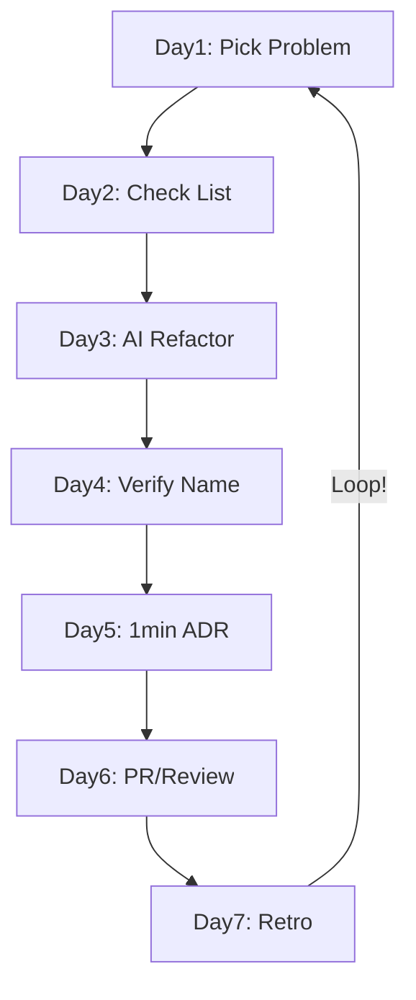

# 第06章：仕上げ：KISS運用ルール＆チェックリスト✅🌈

（ここから先は「一生ラクするための仕組み化」だよ〜🫶✨）

---

## この章のゴール🎯💗


KISSって、1回やって終わりじゃなくて **“習慣化して勝つ”** ものなのね😊✨
この章が終わったら…👇

* 迷ったら戻れる **マイルール（運用ルール）** が作れる📌
* PR前に30秒でできる **KISSチェック** が回せる✅
* AI（Copilot / Codex）に頼んでも **ややこしくされない縛り方** ができる🤖🪢
* 「KISSしすぎ事故」も避けられる🚧💦

---

## 0) まず大前提：KISSは“ルール化”すると強い📏✨

人間の意思って、疲れるとブレるのよ😭（テスト前日みたいに…）
だから **判断をルールにして脳みそを節約** するのがKISSの完成形💪💕

---

## 1) KISS運用ルール（自分用）を作る🧸📜


おすすめは「**5行のミニ憲法**」にすること！短くて見返せるのが最強✨

### ✅ KISSミニ憲法（コピペOK）

```text
1. 目的：読む人が迷わないこと（短さより理解）
2. 1関数は「1つの仕事」だけにする
3. ネストは深くしない（深くなるなら早期return or 分割）
4. 型は“説明”のために付ける（型体操は禁止）
5. 迷ったら「一番素直な形」に戻す
```

💡ポイント：これを `docs/kiss.md` とかに置いて、いつでも見れる場所にする📌✨

---

## 2) KISSチェックリスト（PR前30秒）✅👀


ここが本章のメイン！
**チェックリストは“質問”じゃなくて“判定”** にするとラクになるよ😊✨

### ✅ A. 関数・責務チェック🍱


* [ ] 1関数に「変換・検証・保存・通知」みたいに**複数の役割が混ざってない？**
* [ ] 関数名が「何をするか」言えてる？（`process()` はだいたい怪しい😇）
* [ ] 30〜50行を超えてきたら、**見出しになる小関数に分割**できる？✂️

### ✅ B. 条件分岐チェック🌀

* [ ] ネストが深くない？（`if` の中に `if` の中に `if`…は危険信号🚨）
* [ ] “否定の条件”が続いて読みにくくない？（`!` が増えるほどつらい😵）
* [ ] 条件式が長いなら、**条件に名前を付けた変数**にできる？📛

### ✅ C. エラー・例外チェック🧯

* [ ] エラーの出口が散ってない？（あちこちで `throw` / `return` 乱舞してない？）
* [ ] 「どこで握りつぶすか」が決まってる？（握る場所は少ないほどKISS✨）

### ✅ D. TypeScriptの“型”チェック🧩

* [ ] 型が長すぎて読めないなら、**中間typeに分けて名前を付ける**？📚
* [ ] ジェネリクス入れ子・巨大union… **気持ちよさ優先で型体操してない？**😇
* [ ] 型が複雑でIDEが重い/表示が地獄→ そもそも設計が複雑寄りかも😵
  （TypeScript 5.9は型表示の体験改善や最適化が入ってるけど、だからこそ“盛りすぎ”しやすいのも注意だよ👀✨）([typescriptlang.org][1])

---

## 3) “KISSしすぎ事故”を防ぐ🚧😇

KISSって、やりすぎると逆に読めなくなることあるの💦
よくある事故パターン👇

### 🚨事故1：短縮しすぎて意味が消える


❌ `a`, `b`, `x` とか `doIt()` で世界を救おうとする
✅ “読み手が何か”がわかる名前にする（短くてもOK、意味が大事）

### 🚨事故2：共通化しすぎて抽象地獄

❌ 2回しか出ないのに共通化→ 呼び先を追うだけで疲れる
✅ **ルール：3回出たら共通化を検討**（目安でOK👌）

### 🚨事故3：関数を割りすぎて逆に迷子

❌ 3行関数が大量発生 → ジャンプ祭り🏃‍♀️💨
✅ “見出しになる単位”で割る（読む流れが自然かどうか）🎵

---

## 4) AIをKISS運用に組み込む🤖💗（ここ大事！）

AIって放っておくと、**抽象化・一般化・パターン化**で盛りがちなの😭
だから最初から「縛り」を入れる✨

### ✅ 4-1. Copilot Editsで“複数ファイル整理”を安全にやる🧼


Copilot Editsは、**1つの指示から複数ファイルをまとめて編集**できて便利✨
しかも「Edit mode / Agent mode」みたいに、どこまで自由にさせるか選べるよ😊([GitHub Docs][2])

使い分けのコツ👇

* **Edit mode**：差分小さめで、自分が主導したい時✋
* **Agent mode**：作業は任せたいけど、最後は必ず自分がレビューする時👀

### ✅ 4-2. Codex（IDE拡張）に“レビュー係”をやらせる🕵️‍♀️✨

Codexは「読んで・直して・実行まで」できるコーディングエージェントで、IDE横で使えたり、作業をクラウドに投げたりできるよ🚀([OpenAI Developers][3])
※Windowsはサポートが“実験的”扱いの案内もあるから、挙動が不安ならWSLワークスペース運用が安定寄り👌([OpenAI Developers][3])

### ✅ 4-3. AIお願いテンプレ（KISS運用版）📨💞


```text
次のコードを「挙動は一切変えず」にKISSリファクタしてね。

制約：
- 差分は小さく（大改造禁止）
- クラス増殖・抽象化の追加は禁止
- ネスト削減、命名改善、責務分離（軽め）だけOK
- 型は読みやすさ優先（型体操しない）
- 変更後に「KISSチェックリスト」でどこを改善したか3点説明して
```

### ✅ 4-4. AIに“PR要約＆レビュー観点”を作らせる📌

Copilotには **PRの変更内容・影響ファイル・レビュー観点の要約** みたいな機能もあるので、
「自分のレビュー漏れ防止」にめっちゃ使えるよ〜😊([GitHub Docs][2])

---

## 5) 1分ADR（ミニ設計メモ）📝⏱️


ADRって聞くと重いけど、この章では **1分で書くやつ** にするよ😊💗
「あとで悩まない」ためのメモ！

### ✅ 1分ADRテンプレ（コピペOK）

```text
# ADR: ○○をこうした理由

- 背景：何が困ってた？
- 決めたこと：どうする？
- 理由：KISS的に何がシンプル？
- 影響：どこが変わる？（1行）
- やらないこと：今回は何をしない？
```

📌これがあると、AIに聞く時も強い！
「このADRに沿ってリファクタして」って言えるからね🫶✨

---

## 6) ミニ課題：1週間で“簡潔化1回”を回す🗓️🌟


「継続できる」がこの章のゴールだから、**小さく回す練習**をするよ💪

### ✅ 1週間ルーティン（軽め）

* **Day1**：気になる関数を1個選ぶ（“読むのがツラい”やつ😇）
* **Day2**：KISSチェックリストで「×が多い場所」を3つ印つける✅
* **Day3**：AIにお願いテンプレで「差分小でKISS化」してもらう🤖
* **Day4**：自分で読み直して、命名だけ手で整える📛
* **Day5**：1分ADRを書く📝
* **Day6**：PR（またはローカルレビュー）でチェックリスト貼る📌
* **Day7**：振り返り：「次も効くルール」を1行だけ足す✨



---

## 7) おまけ：KISSと“未来のTS変化”の付き合い方🔮🧩

今の安定版はTypeScript 5.9系（npm上は 5.9.3 が案内）で、ツール体験の改善が進んでるよ✨([npm][4])
さらに **TypeScript 6.0（橋渡し）→ 7.0（ネイティブ移行）** みたいな大きい流れも進行中で、6.0は「最後のJSベース」って説明も出てるのね。([Microsoft for Developers][5])

だからこそ大事なのが👇

* ツールが賢くなっても、**コードを読むのは人間**
* だから **KISSチェックリストみたいな“人間用のルール”** がずっと効く🫶✨

---

## まとめ🎀✅

この章でやったことはこれ！

* **KISSミニ憲法**で判断の軸を固定📜
* **PR前30秒チェック**でブレない✅
* AIには **縛りテンプレ**を渡して、盛らせない🤖🪢
* **1分ADR**で未来の自分を助ける📝
* 週1回の“小さな簡潔化”で習慣にする🗓️✨

---

* [The Verge](https://www.theverge.com/news/808032/github-ai-agent-hq-coding-openai-anthropic?utm_source=chatgpt.com)
* [The Verge](https://www.theverge.com/news/669339/github-ai-coding-agent-fix-bugs?utm_source=chatgpt.com)
* [TechRadar](https://www.techradar.com/pro/openai-launches-gpt-5-codex-with-a-74-5-percent-success-rate-on-real-world-coding?utm_source=chatgpt.com)
* [businessinsider.com](https://www.businessinsider.com/microsoft-github-reshuffle-ai-coding-agents-2026-1?utm_source=chatgpt.com)

[1]: https://www.typescriptlang.org/docs/handbook/release-notes/typescript-5-9.html "TypeScript: Documentation - TypeScript 5.9"
[2]: https://docs.github.com/en/copilot/get-started/features "GitHub Copilot features - GitHub Docs"
[3]: https://developers.openai.com/codex/ide/ "Codex IDE extension"
[4]: https://www.npmjs.com/package/typescript?utm_source=chatgpt.com "TypeScript"
[5]: https://devblogs.microsoft.com/typescript/progress-on-typescript-7-december-2025/ "Progress on TypeScript 7 - December 2025 - TypeScript"
