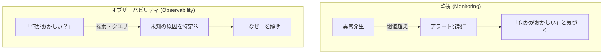
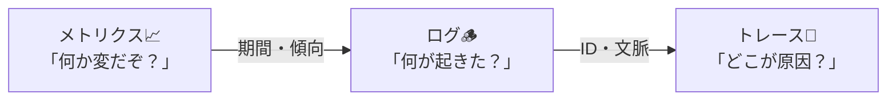

# 第01章：オブザーバビリティって何？👀✨（監視との違い）

## この章でできるようになること 🎯✨

この章を終えると…

* **「オブザーバビリティ」を自分の言葉で1文**にできます📝✨
* **「監視（モニタリング）」との違い**を、例で説明できます🔍💡
* Logs / Metrics / Traces が、**なぜ“後付けしんどい”のか**が腹落ちします😇💥

---

## まず結論！オブザーバビリティを1文で言うと…🧠✨


**「システムが出しているデータ（ログ・メトリクス・トレース）から、内部で何が起きてるかを“あとから推理できる力”」**です🕵️‍♀️🔎✨
もともとの言葉の由来は「外から見える出力から、内部状態がどれだけ分かるか」っていう考え方です📚✨ ([Honeycomb][1])

---

## “監視”と“オブザーバビリティ”の違いって何？👀⚖️

### ざっくりイメージ図 🧁✨


* **監視（Monitoring）**：
  「異常が起きたか？」を**決め打ちで検知**する🚨（アラート中心）
* **オブザーバビリティ（Observability）**：
  「なぜ起きた？」を**探索して辿り着ける**🔍（調査・推理中心）

「データは似てても、目的が違う」って説明が分かりやすいです📌 ([Honeycomb][2])



---

## たとえ話で理解しよ！🏥✨（女子大生向け💐）


### 監視 = 体温計 🌡️

「熱がある！」は分かる。
でも、**風邪？インフル？寝不足？**までは分からない😵‍💫

### オブザーバビリティ = 病院の検査フルセット 🧪🩺

体温＋血液検査＋レントゲン…みたいに、
**“原因に辿り着く材料”がそろってる**から、理由が分かる✨

---

## Logs / Metrics / Traces は何者？（この章は“雰囲気”でOK）🪵📈🧵


OpenTelemetry の整理がすごく分かりやすいので、その定義を借ります👇 ([OpenTelemetry][3])

* **Logs（ログ）🪵**：イベントの記録（「いつ」「何が起きた」）
* **Metrics（メトリクス）📈**：数値の測定（「どれくらい」「傾向」）
* **Traces（トレース）🧵**：リクエストの通り道（「どこで遅い？」「どこで落ちた？」）

そして、これらをまとめて扱う “共通言語” として **OpenTelemetry** が広く使われています🌍✨ ([Microsoft Learn][4])

> ちなみに最近は「3本柱＋プロファイリングを4本目」って言い方も見かけます👀（でもまずは3本柱を押さえればOKだよ〜！） ([Elastic][5])

---

## 「後付けがしんどい理由」ってなに？😇💦

### 理由1：あとから必要な情報が“存在しない”😱


たとえば障害が起きたあとに…
「どのユーザーの」「どの注文IDで」「どの外部APIが遅くて」みたいな情報が必要になっても、
**ログに出してなければ永遠に分からない**ことがあります🫠🕳️

### 理由2：設計の“通り道”に埋め込む必要がある🚧


ログ・メトリクス・トレースって、
**入口（HTTP）→業務処理→DB/外部API**みたいな「通り道」に沿って入れると強いんだけど、
この通り道は設計そのものなので、後から直すと改修が増えがちです🔧💥

### 理由3：チームの言葉がバラける🌀


「成功って何？」「失敗って何？」「遅延ってどこから？」が人によって違うと、
**見ても判断できないダッシュボード**が爆誕します📊😇

---

## 「原因に辿り着ける」ってどういう状態？🧭✨

### ゴールはこれ！🎯


障害が起きたときに、こう動ける状態👇

1. **メトリクス**で「増えた・遅くなった・落ちた」を掴む📈
2. **ログ**で「どの条件で起きた？」を絞る🔍🪵
3. **トレース**で「どこが犯人？」を指差す🧵👉

この“辿れる感じ”が、オブザーバビリティの勝ち筋です🏆✨



---

## .NET（C#）目線：いまどきの“観測”はどう作られてる？🧠🔧

.NET は、ログ・メトリクス・トレース（Activity）のための仕組みを標準で持っていて、OpenTelemetry はそれらを活用する形になっています💡 ([Microsoft Learn][6])

それと、いまの .NET は **毎年11月にメジャー版が出る**運用になっています📅✨ ([Microsoft][7])
そして **2026-01-17 時点**では、最新の LTS は **.NET 10（2025-11-11 リリース）**で、最新パッチも出ています🆕✨ ([Microsoft][8])

---

## ミニ演習：自分の言葉で“1文定義”を書こう📝💖

### ステップ1：穴埋めでOK！🧩✨

まずはこれを埋めてみて👇

* 「オブザーバビリティとは、（　　　　　）から（　　　　　）を推理できる力」👀
  例：
* 「オブザーバビリティとは、**ログ・メトリクス・トレース**から、**障害の原因**を推理できる力」🕵️‍♀️✨

### ステップ2：自分のアプリ想定で“具体語”を入れる🎮📦

たとえば Web API なら：

* 「オブザーバビリティとは、**APIが出すデータ**から、**遅い理由や失敗理由**を辿れる状態」🚀🐢

---

## AI活用：定義の添削＆短文化🤖✂️✨

### そのまま投げられるプロンプト例（コピペOK）🧁

```text
あなたはソフトウェア設計の先生です。
次の「オブザーバビリティの定義」を
(1) もっと分かりやすく
(2) できれば30文字〜60文字くらいに短く
(3) 意味がズレないように
添削してください。

定義：
「（ここに自分の1文を貼る）」

加えて、
・監視（モニタリング）との違いを1文で
・Logs/Metrics/Tracesを各1行で
も付けてください。
```

---

## まとめ：この章のチェックリスト✅✨

* [ ] 「オブザーバビリティ」を**1文で言えた**📝
* [ ] 「監視＝異常検知」「観測＝原因に辿れる」が**区別できた**👀
* [ ] Logs/Metrics/Traces を“雰囲気”で説明できた🪵📈🧵
* [ ] 「後付けがしんどい理由」が**納得できた**😇🔧

---

## 次章の予告📣✨

次は **「3本柱の“得意技”」**を、もっとハッキリ掴みにいきます🪵📈🧵
「同じ障害を3視点で説明する」ミニ演習が楽しいよ〜🎭💖

[1]: https://www.honeycomb.io/blog/observability-whats-in-a-name?utm_source=chatgpt.com "Is observability just monitoring with another name?"
[2]: https://www.honeycomb.io/blog/difference-between-observability-monitoring?utm_source=chatgpt.com "So, What's the Difference Between Observability and ..."
[3]: https://opentelemetry.io/docs/concepts/signals/?utm_source=chatgpt.com "Signals"
[4]: https://learn.microsoft.com/ja-jp/dotnet/core/diagnostics/observability-with-otel?utm_source=chatgpt.com "OpenTelemetry を使用した .NET の監視"
[5]: https://www.elastic.co/blog/3-pillars-of-observability?utm_source=chatgpt.com "The 3 pillars of observability: Unified logs, metrics, and traces"
[6]: https://learn.microsoft.com/en-us/dotnet/core/diagnostics/observability-with-otel?utm_source=chatgpt.com ".NET Observability with OpenTelemetry"
[7]: https://dotnet.microsoft.com/en-us/platform/support/policy/dotnet-core?utm_source=chatgpt.com "NET and .NET Core official support policy"
[8]: https://dotnet.microsoft.com/ja-jp/platform/support/policy/dotnet-core?utm_source=chatgpt.com ".NET および .NET Core の公式サポート ポリシー"
