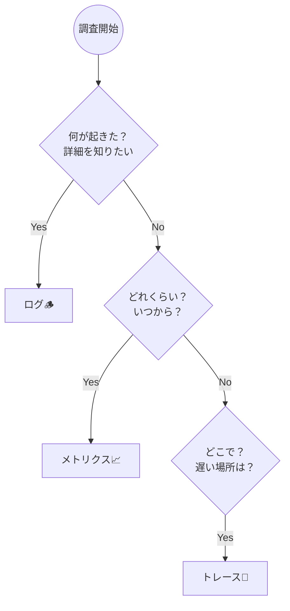

# 第02章：3本柱の“得意技”を掴む🪵📈🧵

（ログ＝調査🕵️‍♀️／メトリクス＝健康診断🩺／トレース＝旅の地図🗺️）

---

## この章のゴール🎯✨

読み終わったら、こんな状態になってます👇

* 「いま困ってること、ログで見る？メトリクス？トレース？」をパッと選べる💡
* 同じ障害でも、**3つの視点で説明**できる🎭
* “3本柱はセットで強い”が腹落ちする🧩🔗

---

## 1) まずは1枚絵でイメージ👀✨


## 3本柱は、役割がぜんぶ違う！

* **ログ（Logs）🪵**：事件のメモ📝「何が起きた？」を詳しく
* **メトリクス（Metrics）📈**：体温・脈拍みたいな数字🩺「どれくらい？いつから？」を速く
* **トレース（Traces）🧵**：リクエストの旅の記録🗺️「どこで時間食ってる？どこで失敗した？」を追跡

OpenTelemetryでも、この3つ（logs/metrics/traces）が“観測の基本シグナル”として整理されてます。([OpenTelemetry][1])

---

## 2) 得意技をしっかり掴もう💪✨

## A. ログ（Logs）🪵＝「調査のための証言」🕵️‍♀️

**ログが得意なこと**👇

* 例外が起きた瞬間の状況（入力値・分岐・エラー内容）を残せる🧾
* “そのとき何が起きたか”を文章＋項目（キー/値）で説明できる🧱
* 後から検索して、同じパターンの事故を集められる🔎

.NETは `ILogger` で**構造化ログ**（高性能＆検索しやすいログ）を前提に設計されています。([Microsoft Learn][2])

**ログが苦手なこと**😵‍💫

* 「全体の健康状態」を一目で見るのは苦手（量が多すぎる…）📚💥
* アラート（通知）には向かないことが多い（ノイズ地獄になりがち）🚨😇

---

## B. メトリクス（Metrics）📈＝「健康診断の数値」🩺

**メトリクスが得意なこと**👇

* 失敗率や遅延が“増えてる”をすぐ見つけられる👀
* グラフで傾向が分かる（いつから悪化？どれくらい？）📊
* しきい値でアラートにしやすい🚨✨

.NETには `System.Diagnostics.Metrics` があり、メトリクスを“数字として記録する”ための公式APIになってます。OpenTelemetryのエコシステムと統合しやすいことも明記されています。([Microsoft Learn][3])

**メトリクスが苦手なこと**😵‍♀️

* “なぜ”までは分からない（「増えてる」は分かるけど、原因は別で探す）🌀
* ラベル（タグ）を雑に付けると爆発して破綻しやすい💣（これは後の章で丁寧に！）

---

## C. トレース（Traces）🧵＝「リクエストの旅の地図」🗺️

**トレースが得意なこと**👇

* 1リクエストが、どこを通って、どこで遅く/失敗したか分かる🐢💥
* “この処理が遅い”を**Span**単位で指差せる👉
* サービスが分かれてても、つながって見える（分散トレース）🌐

.NETでは `System.Diagnostics.Activity` を使って分散トレースを作れます。さらに `System.Net` 系のライブラリにもトレースの仕組みが入っています。([Microsoft Learn][4])

**トレースが苦手なこと**😵‍💫

* “つながらない”と地獄（コンテキスト伝播が切れると迷子）🧩❌
* 設計なしに増やすと、見づらくなる（スパン切りすぎ問題）✂️📚

---

## 3) 迷ったらこの3つの質問で決める❓✨

困ったら、まずこの順で考えるのが超おすすめ👇

1. **何が起きた？** → ログ🪵
2. **どれくらい起きてる？いつから？** → メトリクス📈
3. **どこで起きてる？どこが遅い？** → トレース🧵



そして現場あるあるの“調査導線”はこんな感じになりやすいよ👇
**メトリクスで異常検知 → ログで状況確認 → トレースで原因箇所特定** 🧭✨

---

## 4) ミニ演習：同じ障害を3視点で説明してみる🎭✨

## お題（あるある障害）😈

ECサイトの `/checkout` が、ときどき失敗（500）する💥
しかも“遅い”という声もある🐢💦
原因はまだ不明！

あなたの仕事は👇

* **ログ視点🪵**：「何が起きた？」を説明
* **メトリクス視点📈**：「どれくらい？いつから？」を説明
* **トレース視点🧵**：「どこで？」を説明

---

## 5) 模範解答（こう書けたら勝ち🏆✨）

## 🪵 ログでの説明（調査メモ）

* checkout開始、入力の要点（PIIは伏せる）
* 外部の決済API呼び出し開始/結果
* 失敗なら **例外種別** と **ステータス** と **リトライ回数**
* できれば同一リクエストを追うID（相関ID）も！

例（雰囲気）👇

* “決済APIがタイムアウトした”
* “そのとき注文IDはこれ、外部APIのHTTP 504、リトライ2回”

---

## 📈 メトリクスでの説明（健康診断）

* checkoutの **リクエスト数**（Rate）
* **エラー率**（Errors）
* **処理時間**（Duration：特にp95/p99）

例（雰囲気）👇

* “12:10頃からエラー率が0.2%→3%に上がった”📈
* “同時にp95が300ms→4,000msへ悪化した”🐢💥

---

## 🧵 トレースでの説明（旅の地図）

checkoutの旅をスパンで見ると…

* `HTTP POST /checkout`（親）

  * `DB: Insert Order`
  * `HTTP: Call Payment API` ← ここが遅い/失敗してる！💥
  * `DB: Update Status`

例（雰囲気）👇

* “遅延の8割が Payment API 呼び出しのSpanに集中してる”🎯
* “失敗してるトレースの多くが外部APIのタイムアウトで終わってる”⏱️💣

---

## 6) 3本柱を“つなげる”と最強になる🔗✨（ちょい先取り）

ここ、超大事ポイント👇

* ログ単体だと「このログ、どのリクエストの話？」になりがち
* トレース単体だと「この遅いトレース、どんな入力だった？」になりがち

だから、**同じIDで串刺し**にするのが強い🧷✨
OpenTelemetryのコンテキスト伝播では、SDKがログに `TraceId` / `SpanId` を注入して、ログとトレースを相関できることが説明されています。([OpenTelemetry][5])

---

## 7) “雰囲気だけ掴む”ミニコード👩‍💻✨（読むだけでOK）

## 🪵 ログ（構造化ログのイメージ）

```csharp
logger.LogInformation(
  "Checkout started. orderId={OrderId} userSegment={UserSegment}",
  orderId, userSegment);
```

`.NET の ILogger は構造化ログを前提にしてるよ` という根拠はここ。([Microsoft Learn][2])

## 📈 メトリクス（カウンタのイメージ）

```csharp
using System.Diagnostics.Metrics;

var meter = new Meter("Shop.Api");
var checkoutCounter = meter.CreateCounter<long>("checkout_total");

checkoutCounter.Add(1);
```

`System.Diagnostics.Metrics` が公式の入口だよ、という話はここ。([Microsoft Learn][6])

## 🧵 トレース（Activity＝Spanのイメージ）

```csharp
using System.Diagnostics;

using var activity = MyActivitySource.StartActivity("Checkout");
// …処理…
```

`.NET は Activity API で分散トレースを作れる` の根拠はここ。([Microsoft Learn][4])

---

## 8) よくある勘違いあるある😇💥

* 「ログさえ出してればOK」→ **異常検知が遅れる**（まずメトリクスが強い）📈
* 「メトリクス見れば原因まで分かる」→ **原因はログ/トレースで掘る**🪵🧵
* 「トレース入れたのに繋がらない」→ **コンテキスト伝播が切れてる**可能性大🔗❌ ([OpenTelemetry][5])

---

## 9) まとめ🌟（この章の1行結論）

**ログ＝何が起きた🪵／メトリクス＝どれくらい📈／トレース＝どこで🧵**
そして、**3本柱は“連携して完成”**🧩🔗

次の第3章では、「じゃあメトリクスって何から測るの？」を迷わないための定番（ゴールデンシグナル）に入っていくよ🌟📊

---

## おまけ：AI活用ミニ🤖✨（秒で質が上がるやつ）

* 「この障害（概要）を、ログ/メトリクス/トレースの3視点で、初心者向けに3行ずつで説明して」🎭
* 「checkoutのメトリクス名を、読みやすい命名で10個案出して（単位も）」🏷️📏
* 「Spanの切り方（親子関係）の案を出して。細かすぎ/粗すぎを避けたい」🧵✂️

必要なら、この章の演習お題をもう1本（DB遅延版🗄️🐢／外部API障害版🌐💥）も作るよ〜😊✨

[1]: https://opentelemetry.io/docs/concepts/signals/?utm_source=chatgpt.com "Signals"
[2]: https://learn.microsoft.com/en-us/dotnet/core/extensions/logging?utm_source=chatgpt.com "Logging in C# - .NET"
[3]: https://learn.microsoft.com/en-us/dotnet/api/system.diagnostics.metrics?view=net-10.0&utm_source=chatgpt.com "System.Diagnostics.Metrics Namespace"
[4]: https://learn.microsoft.com/en-us/dotnet/core/diagnostics/distributed-tracing-instrumentation-walkthroughs?utm_source=chatgpt.com "Add distributed tracing instrumentation - .NET"
[5]: https://opentelemetry.io/docs/concepts/context-propagation/?utm_source=chatgpt.com "Context propagation"
[6]: https://learn.microsoft.com/en-us/dotnet/core/diagnostics/metrics-instrumentation?utm_source=chatgpt.com "Creating Metrics - .NET"
