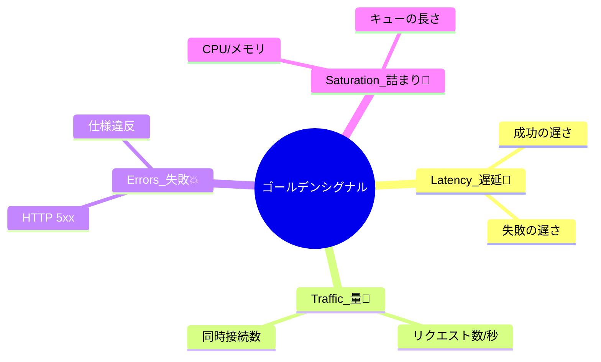

# 第03章：何を測るべき？ゴールデンシグナル入門🌟📏

## この章でできるようになること🎓✨

* 「何を測ればいいの!?」で迷ったときに、**4つの指標カテゴリ**でスッと整理できる🙆‍♀️🧠
* 4つ（Latency / Traffic / Errors / Saturation）を、**自分のWeb APIっぽい題材**に落とし込める🚀
* その中から **“最重要3指標”** を選んで、理由まで言える🎯🗣️

---

## 1) まず結論：迷ったら「4つ」に戻ろう🧭✨

オブザーバビリティって、やろうと思えば無限に測れちゃうんだよね😵‍💫💦
だから最初に「道しるべ」が必要！

その道しるべが **ゴールデンシグナル（Four Golden Signals）** 🌟
ユーザー向けサービスを監視・観測するとき、まずはこの4つに集中すると良いよ、という考え方だよ〜！ ([Google SRE][1])

---

## 2) ゴールデンシグナル4つ🌟🌟🌟🌟




## A. Latency（レイテンシ：遅さ）🐢⏱️


**「返事が返ってくるまで、どれくらい時間かかった？」**

* 例：APIの応答時間（ms）
* よく見る：p50 / p95 / p99（平均より“遅い人”が見える！）📈✨

⚠️ 超重要ポイント：

* **成功の遅さ** と **失敗の遅さ** は分けて見るのが基本！
  失敗（例：HTTP 500）が「すぐ返る」こともあるから、混ぜると誤解するよ〜😱
  でも「遅い失敗」はもっと最悪なので、失敗の遅さもちゃんと追うのが大事！ ([Google SRE][1])

**初心者あるある😇➡️😱**

* 平均だけ見て「OKじゃん」と思ったら、裏でp99が爆死してた💥
  平均は“ごまかし”が効くので注意！ ([Google SRE][1])

---

## B. Traffic（トラフィック：量）🚗🚗🚗📬


**「どれくらいのリクエスト（需要）が来てる？」**

* 例：Requests/sec（RPS）
* 例：同時接続数、処理件数/分、メッセージ消費量…など

ここで大事なのは、**システムに合った“高レベルの量”**で測ること🙆‍♀️
Webならだいたい **HTTPリクエスト/秒** が王道だよ〜 ([Google SRE][1])

---

## C. Errors（エラー：失敗）💥🚨


**「どれくらい失敗してる？」**

* 例：5xx率、例外率、依存先API失敗率
* さらに踏み込むと：

  * 明らかな失敗（HTTP 500）
  * “見た目成功”だけど中身が間違い（HTTP 200だけど内容が不正）
  * “ルール違反”も失敗扱い（例：1秒以内の約束なのに2秒かかった）

プロトコルのステータスコードだけでは拾えない失敗もあるので、**アプリ内の判定**が必要になることもあるよ〜 ([Google SRE][1])

---

## D. Saturation（サチュレーション：詰まり具合）🍱🧯


**「どれくらい“満タン”で、これ以上ムリそう？」**

* 例：CPU使用率、メモリ使用率、スレッド枯渇、DBコネクション枯渇、キュー長…

ポイントは「100%になる前に、性能が落ちはじめる」ことが多いってこと⚠️
だから **“危険ライン（ターゲット）”** を決めておくのが大事！ ([Google SRE][1])

さらに、**Latencyの悪化がSaturationの早期サイン**になりやすいよ〜（遅くなったら混み始めてる合図） ([Google SRE][1])

---

## 3) 題材アプリ（Web API）に当てはめるとこう🎮➡️🌐

ここでは「Web APIがある」想定で、超ざっくり対応表いくよ〜🧩✨

| ゴールデンシグナル  | まずの1個目（おすすめ）            | 次点の候補              | ありがちな罠😵‍💫    |
| ---------- | ----------------------- | ------------------ | -------------- |
| Latency    | p95 応答時間（成功）            | p95 応答時間（失敗） / p99 | 平均だけ見る         |
| Traffic    | RPS（/work など主要ルート）      | 同時実行数              | “全部のルート別”に分けすぎ |
| Errors     | 5xx率（＋失敗判定）             | 依存先失敗率             | 「200なら成功」で思考停止 |
| Saturation | CPU or メモリ（どっちがボトルネック？） | スレッド/DBコネクション/キュー長 | 100%まで放置       |

---

## 4) “測るもの迷子”にならない決め方🎯✨（超大事）


次の順で決めると、ほぼ迷子にならないよ〜🧠🪄

## ステップ①：ユーザーにとっての「成功」を1行で書く📝

例）「/work が 〇ms 以内で返って、正しい結果が返る」

## ステップ②：失敗（Errors）の定義を決める🚨

* HTTP 5xx は失敗
* “返ったけど内容がダメ”も失敗（必要なら）
* “遅すぎ”も失敗扱いにする？（SLOの考え方） ([Google SRE][1])

## ステップ③：遅さ（Latency）は「成功/失敗」で分ける🐢💥

* 成功のp95
* 失敗のp95（遅い失敗があると地獄） ([Google SRE][1])

## ステップ④：混み具合（Saturation）は“ボトルネック候補”を1つ選ぶ🍱

最初から全部追わない！

* まずは CPU or メモリ みたいに「主役を一旦決める」
* 次に必要なら、スレッド・DB・キューへ広げる✨

---

## 5) ミニ演習：題材アプリの“最重要3指標”を決める🎯🧩


**お題：** 「/work（重めの処理）」「/health（死活）」「/fail（わざと失敗）」があるとするね😈

## (1) まず埋めるシート📄✨

* いちばん大事な操作（ユーザーが困る操作）は？：＿＿＿＿＿＿
* その操作の“成功”って？：＿＿＿＿＿＿
* その操作の“失敗”って？：＿＿＿＿＿＿
* では、最重要3指標（理由も一言！）👇

  1. ＿＿＿＿＿＿（理由：＿＿＿＿＿＿）
  2. ＿＿＿＿＿＿（理由：＿＿＿＿＿＿）
  3. ＿＿＿＿＿＿（理由：＿＿＿＿＿＿）

## (2) 例：模範解答（ひとつの例だよ）🌟

1. **/work 成功のp95応答時間**（遅いと体験が終わる😵‍💫）
2. **/work のエラー率（5xx＋失敗判定）**（壊れてたら即わかる🚨）
3. **CPU使用率（またはメモリ）**（混み始めを早めに掴む🍱）

> コツ：3つ選ぶなら「遅さ」「失敗」「混み」のどれかが欠けないようにするとバランス良いよ〜🫶✨

---

## 6) AI活用：指標候補→優先順位づけ🤖🥇

AIに丸投げするときは、**前提の情報が命**だよ〜！

## 良い投げ方テンプレ🧠✨

* 主要ルート（例：/work）
* だいたいの負荷（例：ピークRPS）
* “失敗”の定義（例：5xx、タイムアウト、内容不正）
* 目標（例：p95 300ms）
* 制約（例：最初は3指標だけ）

例プロンプト（コピペOK）👇

```text
ASP.NET CoreのWeb API（/work が主要）で、最初に観測する指標を3つに絞りたいです。
ゴールは「ユーザー体験の劣化を最短で検知して原因調査に入れること」。
Golden Signals（Latency/Traffic/Errors/Saturation）に沿って、候補を10個出してから、
「優先度トップ3」とその理由、そして“次に追加するなら”の順番も提案してください。
失敗の定義は：HTTP 5xx、タイムアウト、処理結果が空（仕様違反）です。
```

## AIの答えを採用する前のチェック✅✨

* それが悪化したら「ユーザーが困る」？😢
* 悪化したとき「次の一手」がある？（対処できる）🧯
* ラベル増えすぎない？（爆発しない）💣
* いまの段階で計れる？（実装が重すぎない）🪶

---

## 7) まとめ🎁✨（この章のゴール！）

* 迷ったら **Latency / Traffic / Errors / Saturation** の4つに戻る🧭 ([Google SRE][1])
* **成功と失敗のLatencyは分ける**（でも失敗の遅さも追う）💥⏱️ ([Google SRE][1])
* まずは **最重要3指標** に絞って、運用できる形にする🎯

---

## 次につながる「ちいさな宿題」🧠📝

* 自分の題材アプリで、最重要3指標を決めてみてね🎯
* できたら、その3つを「なぜそれが最初？」って1行で説明してみよ〜🗣️✨

（次章は「どこで測る？」の境界づくりだよ🚧🗺️）

[1]: https://sre.google/sre-book/monitoring-distributed-systems/ "Google SRE monitoring ditributed system - sre golden signals"
