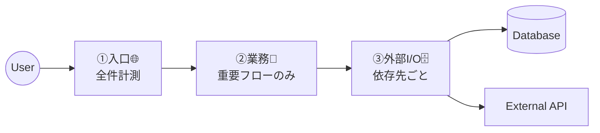

# 第04章：観測の“境界”を作ろう🚧✨（どこで測る？）

この章のゴールはシンプルだよ👇
**「どこで計測するか」を“設計として”決められるようになること**🧠🗺️
（ログ/メトリクス/トレースは、あとから足すとだいたいツラいので…！🥲）

---

## 0. まず結論：測る場所は「境界（Boundary）」で決める🧩✨

観測で一番効くのは、コードの“中身”を全部見ることじゃなくて、
**コンポーネント同士がやり取りする“境目”**を押さえることだよ🙌

この章では、境界を3つに分けて考えるよ👇

1. **入口（HTTP）**🌐➡️
2. **業務（ユースケース/ドメイン）**🧠➡️
3. **外部I/O（DB・外部API・Queue・Cache）**🗄️🔌

この3つは、OpenTelemetry みたいな標準的な仕組みでも“狙いどころ”として超王道だよ🧵✨ ([OpenTelemetry][1])

---

## 1. 「境界」ってなに？ざっくりイメージ🍩👀

アプリの処理って、だいたいこう👇

* リクエストが来る（入口）
* 何か判断して処理する（業務）
* DBや外部サービスと話す（外部I/O）
* 結果を返す（入口に戻る）

つまり、境界は「矢印のところ」🏹✨
**矢印＝失敗しやすい・遅くなりやすい・原因が分かれやすい**から、そこを測ると当たりやすいの🕵️‍♀️🔍

---

## 2. 3つの境界で「何を残すか」早見ガイド📌✨


### ① 入口（HTTP）🌐🚪


ここは **“受付票”** だよ🧾✨
最低限これがあると、調査が超ラクになる！

* ✅ **ログ**：どのURL？結果は？何ms？（失敗なら理由カテゴリも）
* ✅ **メトリクス**：リクエスト数 / エラー率 / レイテンシ（分布）
* ✅ **トレース**：1リクエスト=1トレースの“親”になる

> コツ：入口は「全リクエストで必ず観測」しやすい場所だよ🙆‍♀️

---

### ② 業務（ユースケース/ドメイン）🧠🧩


ここは **“何をしてる処理なのか”の意味付け**💡✨
入口だけ測っても「遅いのは分かった、で、どの業務？」ってなるからね🥲

* ✅ **ログ**：業務イベント（例：`注文作成開始/完了`）を「少数・高価値」で
* ✅ **メトリクス**：成功/失敗カウント、失敗理由カテゴリ（例：在庫なし/不正入力）
* ✅ **トレース**：ユースケースを表す Span（例：`UseCase.CreateOrder`）

> コツ：業務境界は「全部やらない」⚠️
> **“重要な業務フローだけ”**に絞ると、ノイズが減って気持ちいい✨

---

### ③ 外部I/O（DB・外部API）🗄️🌍


ここは **“遅延の本丸”** になりがち🐢💥
そして「自分のコード外」だから、観測で見える化しないと迷子になりやすいよ🧭

* ✅ **ログ**：外部呼び出しの結果（成功/失敗/タイムアウト/リトライ回数など）
* ✅ **メトリクス**：依存先ごとのレイテンシ、失敗率
* ✅ **トレース**：DBクエリやHTTP呼び出しの Span（依存先が分かる属性つき）

.NETの世界だと、ASP.NET Core / HttpClient / SQLClient あたりは “自動計測” の土台が強い（ベンダー配布のディストリでもここが含まれることが多い）よ🧰✨ ([Microsoft Learn][2])

---

## 3. 境界を決める手順（設計としてやる！）🗺️🖊️

ここからが“設計”パートだよ🙌✨
おすすめはこの順番👇



### Step 1：まず「対象の箱」を決める📦

* 今回の“観測対象”はどこまで？

  * 例：このWeb APIサービスだけ？
  * それとも外部API先も含めて追いたい？

> ここが曖昧だと、あとで「どこまで追えばいいの…」ってなる🥲

---

### Step 2：処理の道を1本書く🧵🗺️

例：`POST /work` の1リクエストで👇

* 入口：`/work` に入る
* 業務：`WorkUseCase.Execute()`
* 外部I/O：DB、外部API、キャッシュ…
* 入口：レスポンス返す

---

### Step 3：境界に「観測の三点セット」を置く🎯✨


各境界に、こう置くイメージ👇

* 入口：**必ず置く**（全件の健康診断）🩺
* 業務：**重要フローだけ**（意味づけ）🧠
* 外部I/O：**依存先は基本置く**（ボトルネック源泉）🗄️

---

### Step 4：「最小セット（MVP観測）」を決める🪶✅

最初から盛ると絶対に破綻するので😇💥
まずはこれだけでOK：

* 入口：

  * requestの**数**・**失敗率**・**レイテンシ分布**
* 外部I/O：

  * 依存先ごとの**レイテンシ分布**・**失敗率**
* 業務：

  * 重要ユースケースの**成功/失敗**（理由カテゴリ付き）

---

## 4. “つながる”前提：相関IDとトレースコンテキスト🔗🧵


複数サービスや外部I/Oを追うには、**同じリクエストの印**が必要だよね✨
今の標準は、HTTPヘッダーでトレースをつなぐ方式（`traceparent` など）だよ📨
これは W3C の仕様として標準化されてるよ🧾✨ ([W3C][3])

> なので設計では「入口で受け取って、外に出すときも渡す」って発想が超大事💡

---

## 5. .NETで「境界」を置きやすい場所（イメージ）🧰✨

細かい実装は後の章でガッツリやるとして、
この章では「置き場所の型」だけ掴もう🙌

* 入口（HTTP）🌐

  * Middleware / Minimal API の前後
* 外部I/O（外に出る）🔌

  * `HttpClient`（DelegatingHandler）
  * DBアクセス（EF Core の Interceptor など）
* 業務（意味のある単位）🧠

  * UseCase / Service の“入口メソッド”

OpenTelemetry は .NET でもトレース/メトリクスの始め方がまとまってるので、後で手を動かす時に地図として使えるよ🗺️✨ ([OpenTelemetry][1])
あと、現時点では .NET 10 がLTSとして提供されていて、最新の前提にしやすいよ📦✨ ([Microsoft for Developers][4])

---

## 6. よくある落とし穴（先に踏み抜きを回避😇⚠️）

### ❌ 罠1：境界じゃなく「行数」で測り始める

「このifの中も…このforの中も…」ってやると、
ログもトレースもメトリクスも爆発する💣📈

✅ 対策：まずは **入口・外部I/O・重要業務** の3点だけ！

---

### ❌ 罠2：業務境界を盛りすぎる

業務ログを全部のメソッドに入れると、読めない日記になる📚😇

✅ 対策：**ユースケース単位**で「少数・高価値」だけ残す✨

---

### ❌ 罠3：外部I/Oの“名前”が分からない

「外部呼び出し遅い！」は分かっても
「どの依存先？」が分からないと詰む🥲

✅ 対策：依存先は、**名前（サービス名/DB名）**が分かる形で観測する🏷️✨

---

## 7. ミニ演習：計測ポイント地図を描こう🗺️🖊️✨


紙でもメモ帳でもOKだよ🙆‍♀️💕

### お題：題材アプリに `/health` と `/work` があるとして…

`/work` がやること（例）👇

* DBからデータ読む
* 外部API叩く
* 結果を加工して返す

### 手順

1. 真ん中に「/work」を書く✍️
2. 右に「DB」「外部API」を箱で書く📦
3. 矢印でつなぐ🏹
4. 境界ごとにアイコンを置く👇

   * 入口：🪵📈🧵
   * 業務：🪵（必要なら📈🧵も）
   * 外部I/O：🪵📈🧵

### チェック質問（答えを書いてね📝）

* 入口で「最低限」知りたいのは何？（例：結果/時間/失敗カテゴリ）
* 外部I/Oで「依存先ごと」に知りたいのは何？（例：API別の遅さ）
* 業務で「意味がある」単位は何？（例：`WorkUseCase` が1単位）

---

## 8. AI活用（Copilot / Codex等）🤖✨：今日から使えるプロンプト集

そのままコピペでOKだよ🙌

```text
あなたはオブザーバビリティ設計の先生です。
次の処理フロー（/work: DB→外部API→加工→返却）に対して、
「入口」「業務」「外部I/O」の3境界それぞれで入れるべき
ログ/メトリクス/トレースの候補を、最小セットで提案して。
理由も1行ずつ添えて。
```

```text
次の“観測項目案”に、カードinalityが爆発しそうなラベル/属性がないかレビューして。
危険度（高/中/低）と、代替案も出して。
```

```text
C#のWeb APIで、入口（HTTP）境界に観測を置くなら、
どの層（Middleware / Endpoint / Filter）に置くのがよい？
初心者向けにメリット/デメリットを比較して。
```

---

## まとめ🎀✨

* 観測は「どこで測るか」が命！💖
* 迷ったら **入口 / 業務 / 外部I/O** の3境界で考える🚧✨
* 最初は **最小セット**でOK（盛るのは後で！）🪶✅
* “つながる”ために **トレースコンテキスト（traceparent）**の発想が大事🔗🧵 ([W3C][3])

次の章（第5章）では、題材アプリを用意して「境界に観測を置く土台」を作るよ🧱💻✨

[1]: https://opentelemetry.io/docs/languages/dotnet/getting-started/?utm_source=chatgpt.com "Getting Started"
[2]: https://learn.microsoft.com/ja-jp/azure/azure-monitor/app/opentelemetry-dotnet-migrate?utm_source=chatgpt.com "Application Insights .NET SDK から Azure Monitor ..."
[3]: https://www.w3.org/TR/trace-context/?utm_source=chatgpt.com "Trace Context"
[4]: https://devblogs.microsoft.com/dotnet/announcing-dotnet-10/?utm_source=chatgpt.com "Announcing .NET 10"
