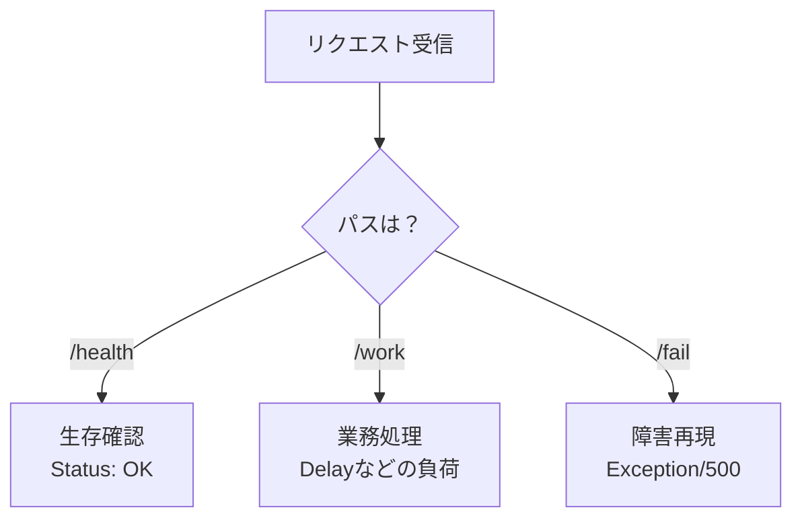

# 第05章：題材アプリ準備（Windows + Visual Studio）🧱💻

この章は「観測する対象（＝題材アプリ）」をサクッと作る回だよ〜！👀✨
次の章から **ログ/メトリクス/トレース** を入れていくので、まずは **壊れてもOKな小さなWeb API** を用意しようね🧪💕

---

## 0) 今日のゴール🎯✨


できあがりはこんな感じ👇

* `GET /health`：生存確認（必ず成功）💚
* `GET /work`：それっぽい仕事をする（成功/遅延を作れる）⚙️
* `GET /fail`：わざと失敗（例外で500）😈💥

「成功」「遅い」「失敗」が揃うと、観測の練習が一気にやりやすくなるよ〜！🧩✨

---

## 1) 2026年の“今どき”前提（ざっくり把握）🧠✨

* **.NET 10 は 2025/11/11 リリースの LTS** で、2026/01/13 時点の最新パッチは **10.0.2** だよ📦✨ ([Microsoft][1])
* **Visual Studio 2026** がGAで、リリースノート上は **18.1.1（2025/12/16）** が出てるよ🧰✨ ([Microsoft Learn][2])
* ASP.NET Core は **Minimal API（最小API）** で作るのがシンプルでおすすめ🧵✨（公式チュートリアルも ASP.NET Core 10.0 を前提に更新されてるよ） ([Microsoft Learn][3])

---

## 2) Visual Studio 2026でプロジェクト作成🛠️✨

### 2-1) 新規作成の手順🧩


1. Visual Studio を開く
2. **Create a new project**
3. 検索で **“Web API”**
4. **ASP.NET Core Web API** を選ぶ

次の画面（Additional information）でここがポイント👇

* Framework：**.NET 10**（選べるならこれ） ([Microsoft][1])
* ✅ **Enable OpenAPI support**（ON）
* ⬜ **Use controllers**（**OFF** にする！＝Minimal APIになる） ([Microsoft Learn][4])

> 「Use controllers（オフでMinimal API）」は公式手順にも明記されてるよ✅ ([Microsoft Learn][4])

---

## 3) エンドポイントを作る（/health /work /fail）🧱✨


作成できたら `Program.cs` を開いて、いったん **これに置き換え** ちゃおう🧠✨

```csharp
using System.Diagnostics;

var builder = WebApplication.CreateBuilder(args);

// OpenAPI（ドキュメント生成）をONにする（UIは別途）
builder.Services.AddOpenApi(); // .NET 9+ のビルトインOpenAPI路線

var app = builder.Build();

if (app.Environment.IsDevelopment())
{
    // OpenAPI JSON: /openapi/v1.json
    app.MapOpenApi();
}

// 1) 生存確認 💚
app.MapGet("/health", () =>
{
    return Results.Ok(new
    {
        status = "ok",
        utc = DateTimeOffset.UtcNow
    });
});

// 2) それっぽい処理 ⚙️
// 例：/work?delayMs=200 でわざと遅くできる
app.MapGet("/work", async (int? delayMs) =>
{
    var sw = Stopwatch.StartNew();

    var delay = delayMs is null ? 0 : Math.Clamp(delayMs.Value, 0, 10_000);
    if (delay > 0)
    {
        await Task.Delay(delay);
    }

    // “仕事した感”のある結果（後でログ/トレースに乗せる材料になるよ）
    var result = new
    {
        message = "work done!",
        delayMs = delay,
        elapsedMs = sw.ElapsedMilliseconds,
        server = Environment.MachineName
    };

    return Results.Ok(result);
});

// 3) わざと失敗 😈💥（例外→500）
app.MapGet("/fail", () =>
{
    throw new InvalidOperationException("Boom! This is an intentional failure route.");
});

app.Run();
```

ポイントはこれだけ覚えよ〜！🧠💡

* Minimal API は **`app.MapGet()`** でルートを生やすだけ🌱
* “遅延”は `Task.Delay()` で簡単に作れる⏱️
* “失敗”は例外を投げるだけでOK😈

---

## 4) 動かして確認🧪👀

### 4-1) まずはF5（デバッグ実行）▶️✨


起動したらブラウザで👇を開くよ（ポート番号は環境で変わるよ〜）

* `https://localhost:<port>/health` → `status: ok` が返る💚
* `https://localhost:<port>/work` → すぐ返る⚙️
* `https://localhost:<port>/work?delayMs=500` → 0.5秒くらい遅く返る🐢
* `https://localhost:<port>/fail` → 500 で落ちる😈💥



### 4-2) OpenAPI（JSON）が出るかも確認📄✨

* `https://localhost:<port>/openapi/v1.json`

**注意：.NETの標準OpenAPIは“JSON生成だけ”** で、Swagger UIみたいな画面は **最初から入ってない** よ〜！ ([Microsoft Learn][5])

---

## 5) おまけ：Swagger UI / Scalar を付けたい人へ（超おすすめ）🧁✨


OpenAPIはJSONだけだと味気ないので、**ローカル確認用にUIを付ける** と幸せ🥰
公式ドキュメントに「Swagger UI と Scalar の付け方」が載ってるよ📚✨ ([Microsoft Learn][6])

### 5-1) Swagger UI を付ける（/swagger）🟩

* NuGet で `Swashbuckle.AspNetCore.SwaggerUi` を追加
* Development のときだけ有効にするのがセキュアだよ🔒 ([Microsoft Learn][6])

### 5-2) Scalar を付ける（/scalar）🟦✨

* NuGet で `Scalar.AspNetCore` を追加
* `app.MapScalarApiReference();` を足すだけでOK（Development限定推奨） ([Microsoft Learn][6])

> どっちも「**OpenAPI UIは開発環境だけ**」がベストプラクティスだよ〜🔒✨ ([Microsoft Learn][6])

---

## 6) ミニ演習（5〜10分）📝✨

### 演習A：失敗ルートを“それっぽく”する😈🧾


`/fail` の例外メッセージを、次のどれかに変えてみて👇

* `"DB timeout"`
* `"External API returned 503"`
* `"Validation failed: name is required"`

（後でログ設計の題材にするためだよ〜！🪵✨）

### 演習B：/work を3パターンにする🎭✨


* `delayMs=0`：成功🟢
* `delayMs=800`：遅延🟡
* `delayMs=3000`：めっちゃ遅い🔴

“同じ処理だけど違う状態”が作れると、観測が一気に理解しやすいよ🧠✨

---

## 7) AI活用コーナー🤖✨（Copilot / Codex 使いどころ）

すぐ使えるプロンプト例👇（コピペOK！）

* 「Minimal APIで `/health` `/work` `/fail` を追加して。`/work` は `delayMs` クエリで遅延できるようにして」🤖🧩
* 「`/work` のレスポンスに `elapsedMs` と `server` を入れて、あとで観測しやすい形に整えて」🤖✨
* 「`/fail` は例外を投げる版と、`Results.Problem()` で返す版の両方を書いて比較して」🤖⚖️

---

## 8) 次の章につながる“仕込み”🧵✨

この章で作ったアプリは、次からこうやって育つよ🌱

* 第6章：ローカルで「出てる？」を確認🧪👀
* 第8章〜：ログを“捜査ログ”にしていく🕵️‍♀️🪵
* 第16章〜：メトリクスで健康診断📈
* 第23章〜：トレースで旅の地図🧵🗺️

---

必要なら、この題材アプリを **もう一段だけ“観測しやすい形”**（例：`/io` を足して外部I/Oっぽくする、`/work` を route group 化する、など）に整えて、第6章へスムーズに繋げる版も作るよ〜🧩✨

[1]: https://dotnet.microsoft.com/en-us/platform/support/policy/dotnet-core?utm_source=chatgpt.com "NET and .NET Core official support policy"
[2]: https://learn.microsoft.com/en-us/visualstudio/releases/2026/release-notes?utm_source=chatgpt.com "Visual Studio 2026 Release Notes"
[3]: https://learn.microsoft.com/en-us/aspnet/core/tutorials/min-web-api?view=aspnetcore-10.0&utm_source=chatgpt.com "Tutorial: Create a Minimal API with ASP.NET Core"
[4]: https://learn.microsoft.com/en-us/aspnet/core/tutorials/first-web-api?view=aspnetcore-10.0&utm_source=chatgpt.com "Create a controller-based web API with ASP.NET Core"
[5]: https://learn.microsoft.com/en-us/aspnet/core/fundamentals/openapi/aspnetcore-openapi?view=aspnetcore-10.0 "Generate OpenAPI documents | Microsoft Learn"
[6]: https://learn.microsoft.com/en-us/aspnet/core/fundamentals/openapi/using-openapi-documents?view=aspnetcore-10.0 "Use the generated OpenAPI documents | Microsoft Learn"
