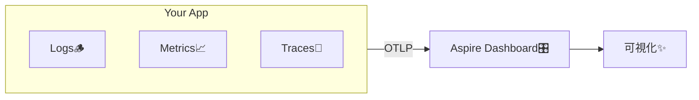

# 第06章：開発での確認方法（まずはローカル）🧪👀

**ねらい：** ローカルで「ログ🪵・メトリクス📈・トレース🧵」が **ちゃんと出てる**か、自分で確認できるようになる✨
（= “計測したつもり” を卒業！🎓）

---

## 0. 今日やること（ゴール）🎯✨

この章のゴールは超シンプル👇

* ✅ **成功**（200 OK）
* ✅ **失敗**（例外💥）
* ✅ **遅延**（わざと遅い🐢）

この3パターンを起こして、ローカルで👇を見て「出てる！」と言えるようにします🧡

* 🪵 ログ：何が起きた？
* 📈 メトリクス：どれくらい？（回数・時間）
* 🧵 トレース：どこで時間食ってる？

> “ローカルで見える” は、設計の安心感に直結します👀✨

---

## 1. 最短で「3本柱」を一気見する方法👑✨（Aspire Dashboard）


ローカル検証でいちばん楽なのが **Aspire Dashboard（単体）** です🎛️✨
**OTLP** を受け取って、**ログ・メトリクス・トレースをまとめて可視化**してくれます。しかも **Aspire本体がなくても**使えます🙆‍♀️ ([Microsoft Learn][1])



さらに、Prometheus/Grafana/Jaegerみたいな構成より **セットアップが軽い**（ただし **開発者向けで本番用ではない**）という位置づけです🧪 ([Microsoft Learn][1])

---

## 1-1. ダッシュボードを起動する（Docker）🐳✨

PowerShellで👇（そのまま貼ってOK）

```powershell
docker run --rm -it `
  -p 18888:18888 `
  -p 4317:18889 `
  --name aspire-dashboard `
  mcr.microsoft.com/dotnet/aspire-dashboard:latest
```

* ブラウザで `http://localhost:18888` へ🌐
* 起動ログに **ログイン用トークン**が出ます🔑
  トークンつきURLで入る方式です（毎回変わるよ） ([Microsoft Learn][1])

---

## 2. アプリ側：ローカルで“見える化”する最低限セット🧰✨

.NETでは、観測の基本APIが最初から揃ってます👇

* 🪵 `ILogger`（ログ）
* 📈 `Meter`（メトリクス）
* 🧵 `ActivitySource`（トレース） ([Microsoft Learn][2])

で、OpenTelemetryはそれらを集めて、OTLPなどで外に流してくれます🚰 ([Microsoft Learn][2])

---

## 2-1. NuGet（必要最小限）📦✨

章5のWeb APIに追加してね👇（例：csproj）

```xml
<ItemGroup>
  <PackageReference Include="OpenTelemetry.Extensions.Hosting" Version="1.*" />
  <PackageReference Include="OpenTelemetry.Exporter.OpenTelemetryProtocol" Version="1.*" />
  <PackageReference Include="OpenTelemetry.Instrumentation.AspNetCore" Version="1.*" />
  <PackageReference Include="OpenTelemetry.Instrumentation.Http" Version="1.*" />
</ItemGroup>
```

※ Microsoft Learnの例でも、この組み合わせで **Logs/Metrics/Traces** をOTLPで送ってます ([Microsoft Learn][1])
（Versionは `1.*` にしておいて、実際はNuGetの最新に揃える感じでOK👌）

---

## 2-2. Program.cs（“見える化”の骨組み）🦴✨

章5の題材（/health, /work, /fail, /slow みたいな）に、最小でこうするのが分かりやすいです👇
（※ すでに似た実装があるなら、差分だけでOK🙆‍♀️）

```csharp
using System.Diagnostics;
using System.Diagnostics.Metrics;
using OpenTelemetry.Metrics;
using OpenTelemetry.Trace;
using OpenTelemetry.Logs;

var builder = WebApplication.CreateBuilder(args);

// 🧵📈 自分のアプリ用 “観測の発生源” を用意
var appMeter = new Meter("SampleApp", "1.0.0");
var requestCounter = appMeter.CreateCounter<long>("app.request.count", description: "Total requests");
var latencyMs = appMeter.CreateHistogram<double>("app.request.latency.ms", unit: "ms", description: "Request latency");

var activitySource = new ActivitySource("SampleApp");

// 🪵 OpenTelemetry ログ（ILogger のログを集める）
builder.Logging.AddOpenTelemetry(o =>
{
    o.IncludeFormattedMessage = true;
    o.IncludeScopes = true;
});

// 📈🧵 OpenTelemetry（メトリクス・トレース）設定
var otel = builder.Services.AddOpenTelemetry();

// Metrics
otel.WithMetrics(m =>
{
    m.AddAspNetCoreInstrumentation();
    m.AddMeter(appMeter.Name);

    // ASP.NET Coreが持つメトリクスも一緒に（例で使われてる） :contentReference[oaicite:6]{index=6}
    m.AddMeter("Microsoft.AspNetCore.Hosting");
    m.AddMeter("Microsoft.AspNetCore.Server.Kestrel");
});

// Traces
otel.WithTracing(t =>
{
    t.AddAspNetCoreInstrumentation();
    t.AddHttpClientInstrumentation();
    t.AddSource(activitySource.Name);
});

// OTLP Export（Aspire Dashboard の受け口へ）
if (builder.Configuration["OTEL_EXPORTER_OTLP_ENDPOINT"] is not null)
{
    otel.UseOtlpExporter(); // env設定で動く例が公式にある :contentReference[oaicite:7]{index=7}
}

var app = builder.Build();

// ✅ 成功
app.MapGet("/work", async () =>
{
    using var act = activitySource.StartActivity("Work");
    requestCounter.Add(1);

    var sw = Stopwatch.StartNew();
    await Task.Delay(120);
    sw.Stop();

    latencyMs.Record(sw.Elapsed.TotalMilliseconds);
    app.Logger.LogInformation("work ok ✅ elapsedMs={ElapsedMs}", sw.Elapsed.TotalMilliseconds);

    return Results.Ok(new { ok = true, elapsedMs = sw.Elapsed.TotalMilliseconds });
});

// 💥 失敗
app.MapGet("/fail", () =>
{
    using var act = activitySource.StartActivity("Fail");
    requestCounter.Add(1);

    try
    {
        throw new InvalidOperationException("boom 💥");
    }
    catch (Exception ex)
    {
        app.Logger.LogError(ex, "work failed ❌");
        throw;
    }
});

// 🐢 遅延（クエリで調整）
app.MapGet("/slow", async (int ms = 1200) =>
{
    using var act = activitySource.StartActivity("Slow");
    requestCounter.Add(1);

    var sw = Stopwatch.StartNew();
    await Task.Delay(ms);
    sw.Stop();

    latencyMs.Record(sw.Elapsed.TotalMilliseconds);
    app.Logger.LogWarning("slow 🐢 elapsedMs={ElapsedMs}", sw.Elapsed.TotalMilliseconds);

    return Results.Ok(new { ok = true, elapsedMs = sw.Elapsed.TotalMilliseconds });
});

app.Run();
```

---

## 2-3. AppSettings.Development.json（OTLPの行き先）📮✨

```json
{
  "OTEL_EXPORTER_OTLP_ENDPOINT": "http://localhost:4317",
  "OTEL_SERVICE_NAME": "SampleApp"
}
```

⚠️ Visual StudioでF5すると、**AppSettings.Development.json** が優先されるので、そこに書くのが安全です（公式にも “混同しがち” と注意あり） ([Microsoft Learn][1])

---

## 3. “出てるか確認” のやり方（見る場所が大事）👀✨

## 3-1. ログ🪵：まず「イベントが出たか」

Aspire DashboardのLogsで見ると、**構造化ログ（フィールド付き）**で見えるのが嬉しいポイント✨
「elapsedMs」が列で絞り込みできる感じです🧡 ([Microsoft Learn][1])

**チェック✅**

* `/work` を叩く → `work ok` が出る
* `/fail` を叩く → `work failed` が **例外付き**で出る💥
* `/slow` を叩く → `slow` がWarnで出る🐢

---

## 3-2. メトリクス📈：数字が“動く”のを確認

Aspire DashboardのMetricsは、**受け取ったメトリクスが自動で並ぶ**タイプです✨ ([Microsoft Learn][1])

しかもヒストグラム系は **P50/P90/P99** をグラフで出してくれます📊
（遅いリクエストを混ぜると、グラフが「うわっ伸びた！」ってなる） ([Microsoft Learn][1])

**チェック✅**

* `/work` を何回か叩く → `app.request.count` が増える📈
* `/slow?ms=2000` を数回 → `app.request.latency.ms` の分布が伸びる🐢➡️📊

---

## 3-3. トレース🧵：遅い場所が“一目で分かる”

Tracing画面では、**traceIdで1リクエストの一連がまとまって**見えます🧵
Spanの親子がツリーで見えるので、「どこで時間食ってるか」が超分かりやすいです⏱️ ([Microsoft Learn][1])

**チェック✅**

* `/work` → `Work` のSpanが見える
* `/fail` → “失敗したリクエスト” が追える💥
* `/slow` → Spanが長い（=遅い）🐢

---

## 4. ミニ演習（成功/失敗/遅延の3点セット）⏱️💥

やることはこれだけ👇✨

1. `/work` を10回叩く✅
2. `/fail` を2回叩く💥
3. `/slow?ms=1500` を3回叩く🐢

そしてメモ📝

* 🪵 ログ：どのキーで絞り込めた？（elapsedMs とか）
* 📈 メト：countは増えた？ latencyは伸びた？
* 🧵 トレ：一番長いSpanはどれ？（名前も）

---

## 5. よくある「出ない」事故と即チェック✅⚠️

* ❌ ダッシュボード起動してない / ポート違い
  → `docker run` の `-p 4317:18889` が効いてる？ ([Microsoft Learn][1])
* ❌ `OTEL_EXPORTER_OTLP_ENDPOINT` が読まれてない
  → Development.json に書いた？（F5はこっち優先） ([Microsoft Learn][1])
* ❌ ログは出るのに、メト/トレが空
  → `AddAspNetCoreInstrumentation()` と `AddSource()` / `AddMeter()` 入ってる？ ([Microsoft Learn][1])
* ❌ “ログインできない”
  → 起動ログのトークンURLで入る（毎回変わる） ([Microsoft Learn][1])

---

## 6. AI活用（ローカル検証が爆速になる🤖💨）

Copilot / Codex にこう聞くと超ラク👇✨

* 「このトレースで一番時間が長いSpanを要約して、原因候補を3つ出して🧵⏱️」
* 「このログの構造化キー、検索しやすい設計になってる？改善案ちょうだい🪵🔍」
* 「メトリクス `app.request.latency.ms` をアラート向けにするなら、どんな集計が良い？📈🚨」

---

## まとめ🎀✨

この章で一番大事なのはこれ👇

**“計測した” じゃなくて、
“ローカルで見えてる” を確認する🧪👀✨**

ここが固まると、次の章（ルール化📏✨）がめちゃくちゃ作りやすくなります🧡

[1]: https://learn.microsoft.com/en-us/dotnet/core/diagnostics/observability-otlp-example "Example: Use OpenTelemetry with OTLP and the standalone Aspire Dashboard - .NET | Microsoft Learn"
[2]: https://learn.microsoft.com/ja-jp/dotnet/core/diagnostics/observability-with-otel "OpenTelemetry を使用した .NET の監視 - .NET | Microsoft Learn"
