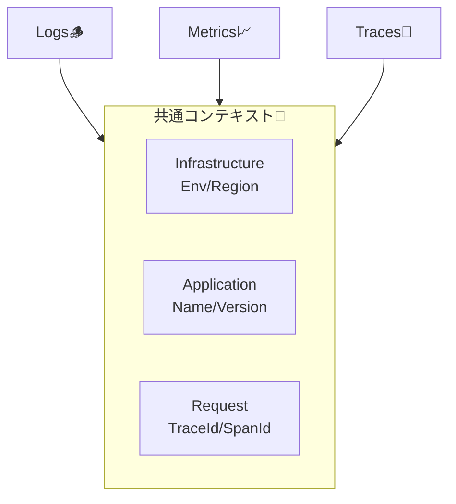

# 第07章：観測設計の“ルール化”📏✨（チームに説明できる形）

ここまでで「どこで測る？」「何を測る？」が見えてきたよね👀
この章は **“後からブレないための約束ごと”** を作る回だよ〜！🫶✨
（観測は後付けすると地獄になりがちなので…今ここで“型”にしちゃうのが勝ち🥳）

---

## 7-1. ルールがないと何が起きる？😵‍💫🌀


**ルール無し＝みんな自由にログ/メト/トレを出す** になるから…

* ログが「文章日記」になって検索できない📚➡️🔎❌
* メトリクス名がバラバラでダッシュボードが組めない📈🧩❌
* トレースが途切れて「旅の地図」が完成しない🧵🗺️❌
* 個人情報が混ざって最悪の事故💣🔒（これは絶対避けたい）

なので、ここで作るのは **“正しさの共通ルール”** だよ✅✨
しかも OpenTelemetry では **logs / metrics / traces の3本柱**を前提に体系が整ってるから、それに寄せると将来がラクになるよ〜🧠🪄 ([OpenTelemetry][1])

---

## 7-2. まず決めるべきは「共通コンテキスト」🔗✨


観測でいちばん強いのは **“つながること”**！
ログ・メトリクス・トレースが同じ文脈（サービス名・環境・traceId…）を持つと、障害調査が一気に簡単になるよ🕵️‍♀️✨

OpenTelemetry でも **service.name / service.version / deployment.environment.name** みたいな “Resource属性” を揃えるのが基本だよ📛🌍 ([OpenTelemetry][2])



---

## 7-3. 「観測ポリシーA4（1枚）」テンプレ📄✨（コピペして使えるやつ）

> 目標：**この1枚を見れば、チーム全員が同じ出し方をできる**🎯

---

## ✅ 観測ポリシー v0.1（A4 1枚）📄✨


### 1) 目的🎯

* 障害時に「原因候補」へ最短で辿り着く（メト→ログ→トレの導線を作る）🧭✨

### 2) 3本柱の役割分担🪵📈🧵

* **Logs**：何が起きた？（調査・証拠）🪵🔎
* **Metrics**：どれくらい？（健康診断・アラート向き）📈🚨
* **Traces**：どこで？（遅い場所・依存関係）🧵🗺️

### 3) 共通で必ず付ける“タグ（文脈）”🔗✅


最低限これだけは揃える（ログ/メト/トレ共通の発想）：

* `service.name`（例：`hatco.api`）📛 ([OpenTelemetry][3])
* `service.version`（例：`1.2.3`）🏷️ ([OpenTelemetry][3])
* `deployment.environment.name`（例：`prod`/`stg`/`dev`）🌍 ([OpenTelemetry][4])
* `trace_id` / `span_id`（追跡の背骨）🧵

  * HTTP では W3C Trace Context（`traceparent`）で繋ぐ前提📨🔗 ([W3C][5])
* `operation`（例：`GET /work` や `Order.Place`）🧭
* `result`（`ok`/`fail`）✅💥
* `duration_ms`（遅延調査に必須）⏱️

### 4) Logs（ログ）ルール🪵📝


* **構造化ログ**（文字列連結しない、プロパティで残す）🧱✨ ([Microsoft Learn][6])
* ログメッセージはテンプレ形式（`"User {UserId}..."` みたいに）🧩 ([Microsoft Learn][7])
* **Scope**を使って共通項目を“自動で付与”する（1リクエスト中ずっと効く）🔁✨ ([Microsoft Learn][7])
* 高頻度ログは **コンパイル時ログ（LoggerMessageAttribute）** を推奨（速い＆ムダが減る）🚀 ([Microsoft Learn][8])

（ログの出す/出さない、レベルは8〜15章で細かく固める予定！ここでは“型”だけ決めるよ）

### 5) Metrics（メトリクス）ルール📈📏


* 命名は **小文字 + 区切り（`.` or `_`）**、連続区切り禁止、などの規約に従う🏷️ ([OpenTelemetry][9])
* 単位は **UCUM** を意識（例：`ms` だけじゃなく、規約上の考え方を揃える）📏✨ ([OpenTelemetry][10])
* ラベル（タグ）は **cardinality を増やさない**（ユーザーID等は入れない）⚠️🏷️
* .NET は `Meter`/`Counter`/`Histogram` が基本（詳細は16章以降）🧰 ([Microsoft Learn][11])

### 6) Traces（トレース）ルール🧵🧭

* HTTP 越しは **W3C Trace Context** で伝播する前提（`traceparent`/`tracestate`）📨🔗 ([W3C][5])
* Span名は **“何をしたか” が分かる動詞寄り**（例：`GET /orders`、`db.query`）🧠🏷️
* 属性（タグ）は **意味のある最小限**（むやみに増やさない）🎒✨
* できるだけセマンティック規約（Resource属性など）に寄せる📚✨ ([OpenTelemetry][2])

### 7) セキュリティ（絶対ルール）🔒🚫

* 個人情報・秘密情報は **原則ログに出さない**
* 必要なら **マスク/ハッシュ**（“許可リスト方式” が安全）🛡️✨

### 8) 変更手順（運用）🔁🧑‍🤝‍🧑


* 新しいメトリクス/ログ項目を足すときは

  1. 命名規約チェック✅
  2. ラベル爆発チェック⚠️
  3. 秘密情報チェック🔒
  4. ポリシー1枚を更新📄
* PRテンプレにチェック欄を置く（強制力💪）

---

## 7-4. C#で「共通文脈を付ける」ミニ例🧪✨（Scopeの雰囲気）


ポイントはこれ👇
**“trace_id とか operation とかを、毎回手で書かない”** こと！
Scope を使うと「この範囲のログ全部」に自動で付くよ〜🔁✨ ([Microsoft Learn][7])

```csharp
using System.Diagnostics;
using Microsoft.Extensions.Logging;

public static class ObservabilityScope
{
    public static IDisposable BeginRequestScope(ILogger logger, string operation)
    {
        var traceId = Activity.Current?.TraceId.ToString();
        var spanId  = Activity.Current?.SpanId.ToString();

        // message template形式（プロパティが構造化されやすい）
        return logger.BeginScope("operation={Operation} trace_id={TraceId} span_id={SpanId}",
            operation, traceId, spanId);
    }
}
```

使う側👇

```csharp
using (ObservabilityScope.BeginRequestScope(_logger, "GET /work"))
{
    _logger.LogInformation("start");
    // ...処理...
    _logger.LogInformation("done");
}
```

> これだけで「同じ処理のログ」が trace_id で束ねやすくなるよ🧵✨
> （W3Cの `traceparent` で繋がっていく世界観とも相性◎） ([W3C][5])

---

## 7-5. ミニ演習：あなたの「A4 1枚」を完成させよう📄🖊️✨

## Step 1：まずは“必須フィールド”だけ決める✅

* service.name / version / env / trace_id / operation / result / duration
  この7つだけでも、調査が超ラクになるよ🧠✨ ([OpenTelemetry][3])

## Step 2：“出す/出さない”の境界線を引く🚧

* 出す：エラー原因に直結する情報（失敗理由、外部I/Oの要約）✅
* 出さない：個人情報、秘密、全文レスポンス、巨大payload🚫

## Step 3：命名テンプレを1個作る🏷️

* メトリクス：`<domain>.<area>.<what>`（例：`hatco.http.server.duration`）みたいに統一
* 規約は OTel の命名ルールを目安にすると事故が減るよ📚✨ ([OpenTelemetry][9])

---

## 7-6. AI活用（コピペ用プロンプト）🤖🧹✨

※そのまま貼ってOKなやつ用意したよ🫶

* **A4 1枚に整形**

  * 「次の箇条書きを“A4 1枚の観測ポリシー”にしてください。見出しは『目的/共通タグ/Logs/Metrics/Traces/セキュリティ/変更手順』。読みやすい短文で、チーム向けの口調で。」

* **曖昧なルールを具体化**

  * 「“必要なときだけログを出す”を、初心者でも迷わない判定基準（Yes/No）にして。例も3つ付けて。」

* **NGワード検出**

  * 「このログ項目一覧に、個人情報や秘密情報が混ざる危険がないかレビューして。危ないものは理由と代案も。」

---

## 7-7. 章末まとめ🎀✨（ここが完成すると強い！）

この章で作った「1枚ルール」があると👇

* 新メンバーが来ても観測がブレない👭✨
* ダッシュボードや検索が“育つ”🌱📈
* 障害対応が「勘」じゃなく「手順」になる🧭🕵️‍♀️
* そして事故（秘密情報ログ）を防げる🔒🚫

次の章（ログ編）からは、このルールを土台にして
「良いログ/ダメログ」「レベル」「構造化」「相関ID」みたいな“実戦の型”をどんどん固めていくよ〜🪵🔥

---

必要なら、この「A4 1枚」を **あなたの題材アプリ（/health、/work、わざと失敗ルート）** に合わせて、完全版テンプレ（そのまま社内Wikiに貼れるやつ）にもしてあげるよ📄✨

[1]: https://opentelemetry.io/docs/languages/dotnet/?utm_source=chatgpt.com "NET"
[2]: https://opentelemetry.io/docs/specs/semconv/resource/?utm_source=chatgpt.com "Resource semantic conventions"
[3]: https://opentelemetry.io/ja/docs/languages/dotnet/resources/?utm_source=chatgpt.com "Resources in OpenTelemetry .NET"
[4]: https://opentelemetry.io/docs/specs/semconv/resource/deployment-environment/?utm_source=chatgpt.com "Deployment"
[5]: https://www.w3.org/TR/trace-context/?utm_source=chatgpt.com "Trace Context"
[6]: https://learn.microsoft.com/en-us/dotnet/core/extensions/logging?utm_source=chatgpt.com "Logging in C# - .NET"
[7]: https://learn.microsoft.com/ja-jp/dotnet/api/microsoft.extensions.logging.loggerextensions.beginscope?view=net-9.0-pp&utm_source=chatgpt.com "LoggerExtensions.BeginScope(ILogger, String, Object[]) ..."
[8]: https://learn.microsoft.com/en-us/dotnet/core/extensions/logger-message-generator?utm_source=chatgpt.com "Compile-time logging source generation - .NET"
[9]: https://opentelemetry.io/docs/specs/semconv/general/naming/?utm_source=chatgpt.com "Naming"
[10]: https://opentelemetry.io/docs/specs/semconv/general/metrics/?utm_source=chatgpt.com "Metrics semantic conventions"
[11]: https://learn.microsoft.com/en-us/dotnet/core/diagnostics/metrics-instrumentation?utm_source=chatgpt.com "Creating Metrics - .NET"
