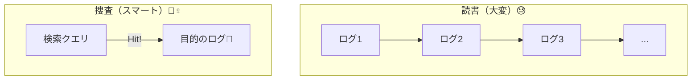
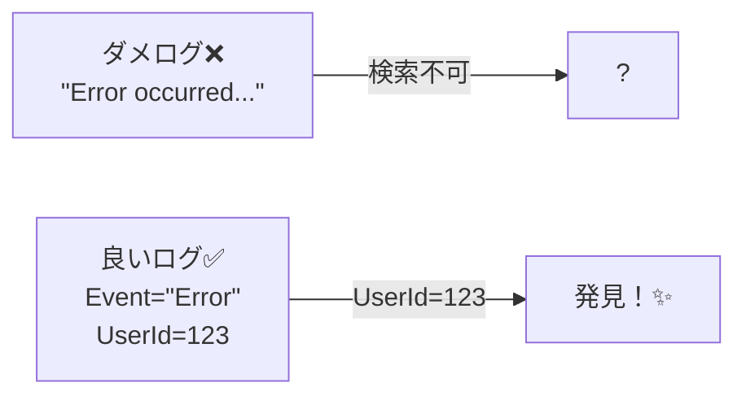

# 第08章：良いログ/ダメログ😇😱（ログは“検索するため”）

## この章のゴール🎯✨

* 「ログ＝あとで検索して捜査するもの🕵️‍♀️🔍」って感覚がつく
* ダメログを見抜けて、良いログに直せる✍️✨
* “何を書けば調査が進むか”を、型で説明できる📐🧠

---

## まず結論：ログは“読書”じゃなく“捜査”📚❌→🕵️‍♀️✅


ログって、**キレイな文章を残すため**じゃないんだよね😇
**障害・不具合・遅延が起きたときに、検索して原因へ近づくため**の“証拠”✨

.NET の `ILogger` も、まさに **高性能＆構造化（=あとで絞り込める）**前提の設計になってるよ。 ([Microsoft Learn][1])



---

## 良いログの条件：この5つだけ覚えておけば強い💪✨


### ① 探せる（検索性）🔍

* **毎回ゆらがない“キーワード（キー）”**がある
* 後から **絞り込み**できる（例：`orderId` / `userId` / `route` / `statusCode` / `elapsedMs`）

> “文章の中に埋め込む”より、**キーと値**で残すほうが検索で勝つ🧱🪵
> （ここは第10章の「構造化ログ」でさらに強くなるよ！）

### ② つながる（追跡できる）🧵

* 「同じ処理のログがひとまとまり」になる手がかりがある

  * 例：`requestId` / `traceId` / `correlationId`（第11章で本格的にやるよ🔗✨）

### ③ 行動できる（次の一手が出る）🧯

* “何が起きた”だけじゃなく、**原因に近い情報**がある
* 例：外部APIの結果、DBの影響範囲、リトライしたか、入力の妥当性など（ただし秘密情報は入れない🔒）

### ④ 安全（出しちゃダメを避ける）🔒🫣

* パスワード・トークン・個人情報・機密を出さない
  （第13章で“マスキング設計”としてガッツリやるよ🚫✨）

### ⑤ 安い（コスト・性能）💸⚡

* 1リクエストでログが多すぎると、**お金も性能も飛ぶ**😇
* 重い文字列組み立て・巨大オブジェクトのシリアライズは要注意
* .NET には高性能ロギングの仕組みもある（後半で紹介） ([Microsoft Learn][2])

---

## ダメログあるある博物館🏛️😱（そして何がダメか）




### ダメ①：感想文ログ📖😭

* 「処理を開始しました」「終わりました」「来ました」系
  → **検索しても何も分からない**し、ノイズになりがち💥

### ダメ②：情報が“足りない”ログ🍚❌

* 例：`"エラーが発生しました"`
  → どの機能？どの入力？どの外部API？**手がかりゼロ**😇

### ダメ③：情報が“多すぎる”ログ🍚💣

* 例：リクエスト/レスポンス全文・巨大JSON丸ごと
  → 検索が地獄＆コスト爆発＆漏えいリスク🔒😱

### ダメ④：毎回文章が違う（揺れログ）🌊

* 例：同じ事象なのにメッセージが毎回変わる
  → 集計も検索もできない（“同じ事件”として扱えない）😇

### ダメ⑤：文字列連結・補間で埋め込みまくり🔗😵

* 例：`$"user={user.Id} ..."` で文章に埋める
  → “キー”で絞れない（第10章で解決するやつ！）

---

## 良いログの“型”📐✨：5W1H + Next をミニで


全部を書く必要はないよ😊
でも困ったときはこの順で考えると強い！

* **When**：いつ（タイムスタンプは大抵自動で付く🕒）
* **Where**：どこ（機能名/ルート/コンポーネント）
* **What**：何が起きた（イベント名っぽく）
* **How much**：どれくらい（`elapsedMs`、件数、サイズ）
* **Impact**：影響（失敗/部分成功/リトライ）
* **Next**：次に何を見ればいい（関連IDや外部呼び出し結果）

---

## 演習：ダメログを良いログにリライト✍️✨（超重要🔥）

### ルール🧠

* メッセージは短め、**“イベント名”っぽく固定**
* 変動する値は **キーとして別に持つ**イメージ
* 「調査で欲しい3点セット」を入れる：
  **(A) 対象ID / (B) 結果 / (C) 時間** ⏱️✅

---

### 例1：情報不足ログ → 手がかりを足す🔍

**ダメ😱**

* 「注文処理で失敗しました」

**良い😇✨（イメージ）**

* 「OrderProcessFailed（注文処理失敗）」

  * `orderId`
  * `reason`（分類できる短い理由）
  * `elapsedMs`
  * `dependency`（外部I/Oなら：どこで失敗？）

---

### 例2：揺れログ → “固定メッセージ + キー”へ🧱

**ダメ😱**

* 「ユーザー 123 の支払いが失敗」
* 「支払いNG user=123」
* 「決済エラー 123」

**良い😇✨**

* 「PaymentFailed」

  * `userId=123`
  * `paymentProvider=...`
  * `errorCode=...`

→ こうすると **“PaymentFailed だけ検索”**で一発集合できる🙌

---

### 例3：長文ログ → “短く+要点”へ✂️

**ダメ😱**

* 「外部APIにアクセスしてレスポンスがこれこれで……（長文）」

**良い😇✨**

* 「ExternalApiCallCompleted」

  * `target=ShippingApi`
  * `statusCode=502`
  * `elapsedMs=1200`
  * `retryCount=2`

---

### 例4：補間で埋め込み → テンプレ（プレースホルダ）へ🧩


`ILogger` は **メッセージテンプレ**で値を渡すのが基本の流れだよ（後で第10章に繋がる！） ([Microsoft Learn][3])

```csharp
// 😱 ダメ：文章に埋め込み（検索しづらい＆揺れやすい）
logger.LogInformation($"User {userId} created order {orderId} in {elapsedMs}ms");

// 😇 良い：テンプレ + 値（あとで orderId で絞りやすい）
logger.LogInformation(
    "OrderCreated userId={UserId} orderId={OrderId} elapsedMs={ElapsedMs}",
    userId, orderId, elapsedMs);
```

（※ ここでは“雰囲気”を優先して書いてるよ。第10章で「プロパティとして扱える形」に整えるよ🧱✨）

---

### 例5：ノイズログ → “節目だけ”残す🍚✨

**ダメ😱**

* 「Aに入りました」
* 「Bに入りました」
* 「Cに入りました」
  （1リクエストで100行…😇）

**良い😇✨**

* 入口（リクエスト受けた）
* 外部I/O（DB/外部API）
* 重要分岐（バリデーション失敗、リトライ、フォールバック）
* 結果（成功/失敗 + 時間）

---

## “検索する前提”のログ設計：まずは検索クエリを想像しよ🧠🔍


ログ設計でいちばん強いのはこれ👇

> **「障害が起きたとき、自分は何で検索する？」を先に決める**✨

たとえば、こんな検索をしたくなるよね👇

* 「この `orderId` の処理だけ見たい」
* 「`statusCode=500` が増えた時刻のログを集めたい」
* 「遅いリクエスト（`elapsedMs > 1000`）だけ見たい」
* 「外部API `ShippingApi` の失敗だけ見たい」

だから **ログに入れるべきキー**が見えてくるよ🧩✨

* `orderId` / `userId` / `route` / `statusCode` / `elapsedMs` / `dependency` / `errorCode` …

---

## ちょい上級：性能の地雷を踏まない⚡🧨


「ログレベルでフィルタするから大丈夫でしょ？」って思いがちなんだけど、
**重い文字列づくり**や **高コストな処理**をログのためにやると、無駄が出ることがあるよ😇

.NET には **高性能ロギング（`LoggerMessage` など）**の考え方が用意されてる。 ([Microsoft Learn][2])

今の章では合言葉だけ👇

* ✅ **“ログのための重い計算”は避ける**
* ✅ どうしても必要なら、後で第9章（ログレベル）とセットで設計する🎚️✨

---

## ミニ課題🎒✨（5分でOK）

次の「ダメログ」を、**“固定メッセージ + キー3つ以上”**で直してみてね✍️

1. 「失敗した」
2. 「DBが遅い」
3. 「外部APIがエラー」
4. 「ユーザー登録できませんでした」
5. 「決済がやばい」

ヒント🎯：

* 対象ID（`userId` など）
* 結果（`statusCode` / `errorCode`）
* 時間（`elapsedMs`）
* どこ（`route` / `dependency`）

---

## AI活用🤖✨（Copilot / Codex 想定）

そのままコピって投げてOKなやつ置いとくね🪄

* 「このログ文、**検索しやすい固定イベント名**にして、必要なキー候補を5つ出して」
* 「このメッセージ、**揺れが出ないテンプレ**に直して。変動値はキーに分けて」
* 「障害調査で使う想定で、**最低限入れるべき3キー**を提案して」
* 「このログ、**ノイズになりそうか**判定して。節目だけに減らす案を出して」

---

## まとめ🧁✨

* ログは“文章”じゃなくて、**検索して原因へ近づくための証拠**🕵️‍♀️🔍
* 良いログは **探せる・つながる・行動できる・安全・安い** の5つで判断😇✅
* 今日できる最強の一歩はこれ👇

  * **「自分が何で検索するか」を先に決めて、キーを足す**🧩✨

---

次の第9章では、このログを「出しすぎ地獄🔥」にしないために **ログレベル設計🎚️**をやるよ〜！😊✨

[1]: https://learn.microsoft.com/en-us/dotnet/core/extensions/logging?utm_source=chatgpt.com "Logging in C# - .NET"
[2]: https://learn.microsoft.com/en-us/dotnet/core/extensions/high-performance-logging?utm_source=chatgpt.com "High-performance logging - .NET"
[3]: https://learn.microsoft.com/en-us/aspnet/core/fundamentals/logging/?view=aspnetcore-10.0&utm_source=chatgpt.com "Logging in .NET and ASP.NET Core"
