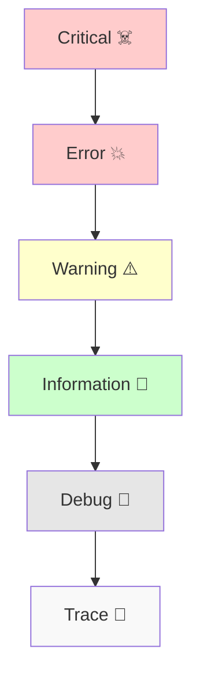

# 第09章：ログレベル設計🎚️（Trace/Debug/Info/Warn/Error）

〜本番で「出しすぎ地獄😵‍💫」を回避して、必要なときだけスッと調査できるログにする〜

---

## 0. この章でできるようになること✅✨

* 「この出来事は **Info？Warning？Error？**」を迷わず決められるようになる🙆‍♀️
* 本番でログが増えすぎて **お金・性能・調査効率**が崩壊するのを防げる💸🔥
* チームでブレない「レベルの基準表📋」を作れるようになる

---

## 1) まず大事：ログレベルは“温度計”じゃなく“優先度のラベル”🏷️🎚️

ログレベルは「細かさ」じゃなくて、基本は **“対応の優先度（緊急度）”** を示すものだよ〜📣✨
もちろん細かいログは低レベルに寄りがちだけど、設計の中心は **運用での扱い**！

* **誰が読む？** 👀

  * 開発者（デバッグ）
  * 運用（アラート・障害対応）
  * CS/サポート（問い合わせ調査）
* **いつ読む？** ⏰

  * 平常時（監視・傾向）
  * 障害時（原因追跡）

---

## 2) .NET のログレベル一覧（公式の意味つき）📚✨


ASP.NET Core / .NET の `LogLevel` はこの7段階（0〜6）だよ〜🎛️
`Trace, Debug, Information, Warning, Error, Critical, None` の順で重くなるよ。([Microsoft Learn][1])



> 重要ポイント：`Trace` は超詳細で、機密が混ざりやすいので **既定で無効**、そして **本番で有効にすべきではない** という注意が公式にあるよ⚠️([Microsoft Learn][2])

---

## 3) 迷わないための「判断の軸」3つ🧭✨

ログレベルを決めるときは、次の3つだけ見よう🥳

## 軸A：正常？異常？（期待してた？）🙂😖


* 仕様どおりに起きる → `Information`
* 仕様上あり得るけど「気持ち悪い」→ `Warning`
* 失敗した（機能としてアウト）→ `Error`
* システム継続が危ない → `Critical`

## 軸B：誰が今すぐ動く？🚨👩‍💻


* すぐ対応が必要（オンコール叩く）→ `Critical / Error`
* すぐじゃないけど放置はNG → `Warning`
* 調査用・記録用 → `Information / Debug / Trace`

## 軸C：そのログが“本番で常時出てOK？”💸🧯


* 常時出てもいい（量が少ない・価値が高い）→ `Information`
* 常時だと多すぎる（詳細すぎ）→ `Debug / Trace`

---

## 4) レベル別「こういう時に使う」早見表📋✨


## Trace 🧬（超詳細・原則 本番OFF）

* 例：細かい分岐、ループ内部、シリアライズ前後の細部…
* ⚠️機微情報が混ざりやすい＆量が爆増しやすいので注意（公式も本番で有効にしない想定）([Microsoft Learn][2])

## Debug 🧩（開発・一時調査用）

* 例：外部APIへ投げたリクエストの“要点”（全部じゃない）、重要な計算の中間値（機密は除く）
* 本番では「必要時だけ」カテゴリ限定でONにする運用が多い💡

## Information 📰（通常運用で常時出してよい“重要イベント”）

* 例：リクエストの開始/終了（要点だけ）、業務イベント（注文確定、決済完了、バッチ完走）
* 「平常時の行動ログ」＝監視や調査の起点になれるもの✨

## Warning ⚠️（想定内だけど“黄色信号”）

* 例：リトライが発生、タイムアウト寸前、入力が変だけど補正して続行、外部が遅いけど耐えた
* ここが多いと「そのうち事故る」匂いがするやつ🫠

## Error 💥（失敗：その処理はできなかった）

* 例：注文作成が失敗、DB書き込み失敗、外部API失敗で処理中断
* 原則「何がダメで、次に何を見ればいいか」まで出す（詳細は12章でガッツリ🧯）

## Critical ☠️（システム継続が危険）

* 例：設定が壊れて起動できない、DB完全断で主要機能が死んだ、データ破損が疑われる
* “今すぐ人を起こす”レベル😴📞

## None 🚫（出さない）

* 特定カテゴリを完全に黙らせたい時に使う（ノイズ対策）

---

## 5) 実戦：レベル設計の「定番ルール」🍱✨

## ルール1：Infoは「多すぎない」ことが正義🧹

Infoを出しすぎると、**Warning/Errorが埋もれる**😱
→ Infoは「調査の起点になる“節目”」だけに絞る🎯

**Infoにしがちな罠**

* “どのメソッド通った”を全部Info → ❌（それはDebug/Trace寄り）

## ルール2：Warningは「放置すると痛い」だけにする⚠️


Warningが多いと **狼少年🐺** になるよ〜

* 例：一時的な外部遅延を「数回まで耐えた」はWarning
* でも、毎リクエストで必ず出るWarningは設計ミス😇

## ルール3：Errorは「例外＝全部Error」じゃない🙅‍♀️

例外を投げても、**上で握りつぶして正常扱い**なら Error じゃないこともある（Warning/Infoの場合も）。
逆に、例外じゃなくても **結果として失敗**なら Error。

---

## 6) “本番で出しすぎ地獄”を防ぐ：基本の設定イメージ⚙️😇


ASP.NET Core では `appsettings.json` の `Logging:LogLevel` で「最低レベル」をカテゴリごとに決められるよ([Microsoft Learn][1])

例（イメージ）👇

```json
{
  "Logging": {
    "LogLevel": {
      "Default": "Information",
      "Microsoft": "Warning",
      "Microsoft.AspNetCore": "Warning"
    }
  }
}
```

* アプリ（自分たちのコード）は `Information` から
* フレームワーク系（Microsoft〜）はノイズになりやすいので `Warning` から
  …みたいに **分ける**のがコツ🪄

---

## 7) コード例：同じ出来事をレベルで分けてみる🎮📝

`ILogger<T>` を使う基本形（メッセージテンプレ形式）👇
※第10章で「構造化ログ🧱」をもっと深掘りするけど、ここでは雰囲気だけ🍀

```csharp
public class CheckoutService(ILogger<CheckoutService> logger)
{
    public async Task PlaceOrderAsync(string orderId, CancellationToken ct)
    {
        logger.LogInformation("PlaceOrder started. orderId={OrderId}", orderId);

        try
        {
            // 例：外部API呼び出し（詳細はDebug寄り）
            logger.LogDebug("Calling Payment API. orderId={OrderId}", orderId);

            var ok = await CallPaymentApiAsync(orderId, ct);

            if (!ok)
            {
                // 失敗（機能としてアウト）
                logger.LogError("Payment failed. orderId={OrderId}", orderId);
                return;
            }

            logger.LogInformation("PlaceOrder succeeded. orderId={OrderId}", orderId);
        }
        catch (OperationCanceledException)
        {
            // タイムアウトやキャンセル。状況次第で Warning も多いよ
            logger.LogWarning("PlaceOrder canceled or timed out. orderId={OrderId}", orderId);
            throw;
        }
        catch (Exception ex)
        {
            // 想定外エラー（ここはError）
            logger.LogError(ex, "Unexpected error in PlaceOrder. orderId={OrderId}", orderId);
            throw;
        }
    }
}
```

---

## 8) ちょい背伸び（でも効く）：ホットパスは“高速ロギング”も検討🏎️✨


「超頻繁に呼ばれる場所」でログを出すと、レベルが低くてもコストが出ることがあるよ〜💸
.NET には `LoggerMessageAttribute`（ソース生成）で高性能ロギングする仕組みが公式にあるよ([Microsoft Learn][3])
（※ここは“余裕が出たら”でOK！）

---

## 9) ミニ演習：あなたのアプリ用「レベル表」を作ろう📋✨

## お題：次の出来事、どのレベルにする？🎚️

1. リクエスト開始（重要なAPIだけ）
2. 入力が変だけど補正して続行（例：上限を超えた値を丸めた）
3. DB更新に失敗して処理中断
4. 外部APIが遅くて、リトライして成功
5. 起動時に必須設定が欠けていて起動できない

## 期待する回答の方向性（例）🧠✨

* 1 → `Information`（節目）
* 2 → `Warning`（黄色信号）
* 3 → `Error`（失敗）
* 4 → `Warning`（リトライ発生は匂い）※ただし頻発するなら設計見直し
* 5 → `Critical`（継続不能）

---

## 10) AI活用🤖✨（Copilot / Codex想定）

## ① レベル基準表を作るプロンプト例

「次のイベント一覧を、LogLevel（Trace/Debug/Info/Warn/Error/Critical）に分類して。
分類理由も一言で添えて。前提：本番ログは多すぎないことが重要。イベント一覧：…」

## ② “Warningが多すぎ問題”の棚卸し

「このログ一覧を見て、Warningがノイズになっている可能性があるものを指摘して。
‘本当にWarningである条件’ を提案して。」

---

## まとめ🎀✨

* ログレベルは「詳細さ」より **運用の優先度**で決める🎚️
* `Info` は節目だけ、`Warning` は黄色信号だけ、`Error` は失敗だけ💥
* `Trace` は超詳細で危険＆爆増しやすいので扱い注意（公式も本番で有効にしない想定）⚠️([Microsoft Learn][2])
* カテゴリごとの最小レベル設定で「本番の出しすぎ地獄」を避ける😇([Microsoft Learn][1])

次の第10章（構造化ログ🧱🪵）に行くと、ここで決めたレベル設計がさらに活きてくるよ〜！✨

[1]: https://learn.microsoft.com/en-us/aspnet/core/fundamentals/logging/?view=aspnetcore-10.0&utm_source=chatgpt.com "Logging in .NET and ASP.NET Core"
[2]: https://learn.microsoft.com/en-us/dotnet/api/microsoft.extensions.logging.loglevel?view=net-10.0-pp&utm_source=chatgpt.com "LogLevel Enum (Microsoft.Extensions.Logging)"
[3]: https://learn.microsoft.com/en-us/dotnet/core/extensions/logger-message-generator?utm_source=chatgpt.com "Compile-time logging source generation - .NET"
