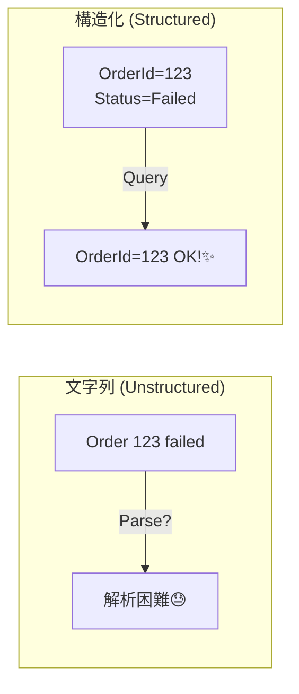

# 第10章：構造化ログ入門🧱🪵（キーと値で残す）

## この章でできるようになること🎯✨

* 「構造化ログって何？」を、自分の言葉で1文で言える👄💡
* 文字列連結ログを、**キーと値（プロパティ）**を持つログに書き換えられる✍️🧱
* “あとで絞り込める”ログのために、**入れるキー候補**を整理できる🏷️📋

---

## 1) 構造化ログってなに？（1文で）🧱✨


**構造化ログ = 「文章」だけじゃなくて、検索・集計できる“項目（フィールド）”を一緒に残すログ**だよ🪵🔎

たとえば「注文失敗😱」って文章だけだと、後で「どの注文？」「どのユーザー？」「どのAPI？」って絞り込みがしんどい…
そこで、`OrderId=123` みたいな **キーと値** をログに一緒に持たせると、検索が一気にラクになるの🥳

※ ちなみに「JSONで出してる＝完全に構造化！」とは限らないよ（スキーマが安定してるかが大事）。JSONは“見た目として扱いやすい器”って感じ🧺✨ ([OpenTelemetry][1])

---

## 2) 文字列ログ vs 構造化ログ：同じ出来事で比べよ🆚👀




## ❌ ありがちな“文字列連結ログ”😇➡️😱

```csharp
logger.LogInformation("Order failed. orderId=" + orderId + ", userId=" + userId);
```

* 人間は読める👀
* でも、ツール側が「orderIdって項目」として扱いにくい（ただの文字列の一部）🥲

## ✅ “構造化ログ”（プロパティ付き）🧱✨

```csharp
logger.LogInformation("Order failed. OrderId={OrderId} UserId={UserId}", orderId, userId);
```

* `OrderId` や `UserId` が **プロパティ（フィールド）**として残る
* 後で「OrderId=123だけ出して！」ができる🔎✨

---

## 3) .NETの `ILogger` は最初から“構造化ログ対応”だよ✨🪵


`.NET / ASP.NET Core` のロギングは、`ILogger` を中心に **メッセージテンプレート（Message Template）**で書くのが基本で、`{Name}` みたいなプレースホルダが **フィールド名**になるよ〜！ ([Microsoft Learn][2])

さらに、プレースホルダ名は **PascalCase推奨**（`{firstName}`より`{FirstName}`）みたいなルールも、公式の解析ルールとして出てるよ📏✨ ([Microsoft Learn][3])

---

## 4) ハンズオン🧪💻：JSONで出して「キーと値」を目で見る👀✨


ここでは「本当にキーと値が出てる！」を体感するために、コンソール出力を JSON 形式にするよ🧱🪵
`.NET` には `AddJsonConsole()` が用意されてるよ📦✨ ([Microsoft Learn][4])

## 4-1) `Program.cs`（最小API例）🧩

```csharp
using Microsoft.AspNetCore.Builder;
using Microsoft.Extensions.DependencyInjection;
using Microsoft.Extensions.Hosting;
using Microsoft.Extensions.Logging;

var builder = WebApplication.CreateBuilder(args);

// ログ設定：JSONで見やすくする
builder.Logging.ClearProviders();
builder.Logging.AddJsonConsole(options =>
{
    // ざっくり整形したい場合はインデントなどを好みで
    options.IncludeScopes = true;
    options.UseUtcTimestamp = false;
});

var app = builder.Build();

app.MapGet("/work/{orderId:int}", (int orderId, ILoggerFactory loggerFactory) =>
{
    var logger = loggerFactory.CreateLogger("Work");

    // ✅ 構造化ログ：OrderId と Result がフィールドとして残る
    logger.LogInformation("Work started. OrderId={OrderId}", orderId);

    try
    {
        if (orderId % 5 == 0) throw new InvalidOperationException("Simulated failure!");

        logger.LogInformation("Work finished. OrderId={OrderId} Result={Result}", orderId, "OK");
        return Results.Ok(new { orderId, result = "OK" });
    }
    catch (Exception ex)
    {
        logger.LogError(ex, "Work failed. OrderId={OrderId} Result={Result}", orderId, "NG");
        return Results.Problem("failed");
    }
});

app.Run();
```

## 4-2) ここがポイント👀🏷️

* `"Work failed. ..."` という文章だけじゃなくて
  **`OrderId` と `Result` が “項目” として出る**のが大事✨
* この “項目” があるから、後で「Result=NGだけ」みたいな検索ができる🔎🪄

---

## 5) 設計のコツ💡：キー（フィールド名）は“あとで探す軸”にする🏷️🔎


「何をキーにする？」って迷うけど、まずはこの考え方でOKだよ😊✨

## キー選びの基本ルール📏

* **安定した意味のある名前**にする（`OrderId`, `StatusCode`, `DurationMs` みたいに）🏷️
* **検索したくなるもの**を入れる（失敗原因、対象ID、処理結果など）🔍
* **デカすぎるもの**は入れない（丸ごとリクエスト本文、巨大オブジェクト）💥

---

## 6) 演習📝✨：「ログに入れるキー候補」を列挙しよう🏷️🏷️🏷️

## ステップ1：まず候補を20個くらい書く🖊️

例（よく使うやつ）👇

* `EventName`（何の出来事？）
* `OrderId` / `UserId`（※個人情報は次章以降で注意！）
* `HttpMethod`, `Path`
* `StatusCode`
* `DurationMs`
* `Result`（OK/NG）
* `RetryCount`
* `DependencyName`（DB/外部API名）
* `ErrorType`（例外分類）

## ステップ2：3つに仕分け🗂️✨

* ✅ **必須**：障害調査で絶対ほしい（例：`Result`, `StatusCode`, `DurationMs`）
* 🌟 **あると便利**：深掘りに効く（例：`RetryCount`, `DependencyName`）
* 🚫 **入れない**：危険 or 重い or ノイズ（例：生のパスワード、トークン、巨大本文）

---

## 7) よくあるNG集😱（初心者がハマりやすい）

## NG1：文字列補間で“項目”が消える🥲


```csharp
logger.LogInformation($"Order failed. OrderId={orderId}");
```

これだと、`OrderId` が「ただの文章」になりやすい💦
→ ✅ テンプレで渡す！

```csharp
logger.LogInformation("Order failed. OrderId={OrderId}", orderId);
```

## NG2：プレースホルダ名がバラバラ🌀


`{id}` `{ID}` `{order_id}` が混ざると、検索が地獄😇🔥
→ ✅ PascalCaseで揃えるのが無難（公式ルールにも寄ってる）📏✨ ([Microsoft Learn][3])

## NG3：「JSON出してるから完璧！」と思い込む😌➡️😱

JSONでも、毎回フィールドが変わったり型がブレると分析しにくいよ〜
「安定したフィールド設計」が大事🧱✨ ([OpenTelemetry][1])

---

## 8) AI活用🤖✨（Copilot / Codexでラクする）

使えるプロンプト例だよ〜💬🪄

* 「この処理（注文確定）の調査で使う構造化ログのキー候補を20個出して。PII注意も添えて」
* 「このログ（文字列連結）を `ILogger` のメッセージテンプレート形式に直して。キー名はPascalCaseで統一して」
* 「このAPIの失敗調査がしやすいように、必須ログ（入口/出口/外部I/O）を提案して」

---

## まとめ🎀✨

* 構造化ログは **“あとで絞れるログ”** にするための技術🧱🔎
* `.NET` の `ILogger` は **メッセージテンプレート**で最初から構造化できるよ✨ ([Microsoft Learn][2])
* まずは **キー（フィールド）を安定させる設計**が超重要🏷️✨

次章は「相関ID（Correlation ID）🔗」で、**同じリクエストのログを1本の糸で追う**やつに入るよ〜！🧵✨

[1]: https://opentelemetry.io/docs/concepts/signals/logs/?utm_source=chatgpt.com "OpenTelemetry logs"
[2]: https://learn.microsoft.com/en-us/dotnet/core/extensions/logging?utm_source=chatgpt.com "Logging in C# - .NET"
[3]: https://learn.microsoft.com/en-us/dotnet/fundamentals/code-analysis/quality-rules/ca1727?utm_source=chatgpt.com "CA1727: Use PascalCase for named placeholders"
[4]: https://learn.microsoft.com/ja-jp/dotnet/api/microsoft.extensions.logging.consoleloggerextensions.addjsonconsole?view=net-9.0-pp&viewFallbackFrom=net-8.0&utm_source=chatgpt.com "ConsoleLoggerExtensions.AddJsonConsole Method"
