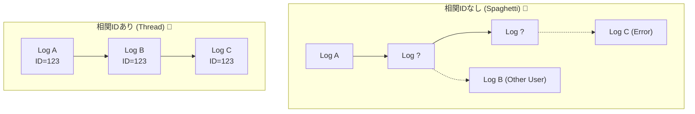

# 第11章：相関ID（Correlation ID）🔗✨（同じ処理を追える）

## この章でできるようになること 🎯

* 1リクエストに紐づくログを“1本の糸”で追えるようにする 🧵👀
* 迷子にならないための「IDの種類」と「設計ルール」を決められる 🧠✅
* C#（ASP.NET Core）の“いま主流”なやり方（Trace Context / Activity）で、ログにIDを自動で入れられる 🧰✨ ([W3C][1])

---

## 1. そもそも相関IDって何？🤔🔗


障害調査で一番つらいのがこれ👇

* 「同じユーザーの操作っぽいけど、どのログが同じ処理の仲間なの…？😵‍💫」
* 「Aのログ見つけた！…で、その続きはどこ！？😇」

相関IDは、**“同じ処理の仲間”をまとめるための共通ID**だよ🔗✨
ログにこのIDが入っていれば、検索で一発👊（`correlationId=...` みたいに絞り込める）



---

## 2. “相関ID”には2系統あるよ🧭✨（ここが超大事）

初心者が混乱しやすいので、最初に整理するね🧠💡

## A) 「人が読む/問い合わせ対応」向けの相関ID 🧑‍💻📩

* 例：`X-Correlation-ID: 9f3a...` みたいな独自ヘッダ
* 目的：ユーザーが「このIDです！」って伝えられるようにする📞✨

## B) 「分散トレース標準」向けのID 🧵🌍（いま主流）

* **W3C Trace Context**：`traceparent` / `tracestate` という標準ヘッダで伝播するよ📦✨ ([W3C][1])
* .NET では `Activity`（トレースの器）に **TraceId / SpanId** が入るよ🧩 ([Microsoft Learn][2])
* ASP.NET Core は、**リクエストを受けたときに TraceId を割り当て（なければ作る）**し、サービス間はHTTPヘッダでつながるよ🔗 ([Microsoft Learn][3])

---

## 3. 用語を“超ざっくり”でOKにする🧠✨

* **TraceId**：1つの処理全体（サービス跨ぎ）のID（＝「大きい糸」🧵）
* **SpanId**：処理の一部分のID（＝「糸の節」🪢）
* **HttpContext.TraceIdentifier**：ASP.NET Core が持つ「このリクエストのユニークID」（ログでの追跡用）🔖 ([Microsoft Learn][4])

> 迷ったら：
> **“ログで追う主軸”は TraceId**（あとでトレースにも飛べる）
> “問い合わせ用”が欲しければ別で CorrelationId を用意、が分かりやすいよ😊✨

---

## 4. 設計ルール（これを決めればブレない）📏✅

## 4.1 受け取る？自分で作る？🔁

おすすめの基本ルール👇

1. リクエストに **既に ID が来てたら採用**（ただしバリデーション！）
2. なければ **自分で生成**
3. 生成/採用したIDは **レスポンスヘッダでも返す**（問い合わせで助かる）📩✨

W3Cの `traceparent` は標準なので、.NET の仕組みに乗ると自然に伝播しやすいよ🌍 ([W3C][1])

## 4.2 ログに“必ず入れる”共通フィールドを決めよう🏷️✅

最小でこれだけ入ってれば、調査が爆速になるよ🚀

* `traceId`（主役）
* `spanId`（あると嬉しい）
* `correlationId`（問い合わせ用に採用するなら）
* `path` / `method` / `statusCode`（入口情報）
* `elapsedMs`（遅い/普通の判断）

OpenTelemetry 的にも、ログとトレースを結びつける「公式のキー」は **TraceId/SpanId** だよ🔗 ([OpenTelemetry][5])

---

## 5. 実装：ASP.NET Coreで“自動で入る”形にする🧰✨

## 5.1 まずは「TraceId/SpanId」をログに出せるようにする🧵📝

ASP.NET Core のログは **Scope** を使うと「このリクエスト中のログ全部に共通項目を付与」しやすいよ📌
（ログ基盤側でも、Scope を含める設定ができるよ） ([Microsoft Learn][6])

## ✅ ミドルウェア例：CorrelationIdを受け取り/生成し、Scopeに入れて返す

```csharp
using System.Diagnostics;

public sealed class CorrelationIdMiddleware
{
    private const string HeaderName = "X-Correlation-ID";
    private readonly RequestDelegate _next;
    private readonly ILogger<CorrelationIdMiddleware> _logger;

    public CorrelationIdMiddleware(RequestDelegate next, ILogger<CorrelationIdMiddleware> logger)
    {
        _next = next;
        _logger = logger;
    }

    public async Task Invoke(HttpContext context)
    {
        // 1) 既存のCorrelationIdを受け取る（なければ生成）
        var correlationId = context.Request.Headers[HeaderName].FirstOrDefault();
        if (string.IsNullOrWhiteSpace(correlationId))
        {
            correlationId = Guid.NewGuid().ToString("N"); // 32桁で扱いやすい✨
        }

        // 2) TraceId / SpanId（W3C traceparent 由来）を取得
        var activity = Activity.Current;
        var traceId = activity?.TraceId.ToString();
        var spanId  = activity?.SpanId.ToString();

        // 3) ログに共通付与（Scope）
        using (_logger.BeginScope(new Dictionary<string, object?>
        {
            ["correlationId"] = correlationId,
            ["traceId"] = traceId,
            ["spanId"] = spanId,
        }))
        {
            // 4) レスポンスヘッダにも返す（問い合わせで神になる📩）
            context.Response.Headers[HeaderName] = correlationId;

            await _next(context);
        }
    }
}
```

登録（`Program.cs`）👇

```csharp
app.UseMiddleware<CorrelationIdMiddleware>();
```

> ポイント💡
>
> * **問い合わせ用：`X-Correlation-ID`**（あなたがコントロールできる）
> * **技術的なつながり：`traceparent` → Activity → TraceId/SpanId**（標準） ([W3C][1])

---

## 5.2 外部HTTP呼び出しでも“同じ糸”をつなぐ🌬️🔗

良いニュース📣✨
.NET の世界では、`Activity` が動いていると **HttpClient が traceparent を付けて伝播する**流れが基本にあるよ（分散トレースがつながりやすい） ([Microsoft for Developers][7])

つまり、あなたがやることはだいたいこれ👇

* 「リクエスト中に Activity が生きてる状態」を壊さない
* 変なところでIDを自作して“別の糸”を生まない😇🧵

---

## 5.3 非同期・バックグラウンドに渡るときの注意⚠️🧠

* 同じプロセス内の async は `Activity.Current` が流れやすい（仕組み的に）けど、
* **キュー / ジョブ / 別プロセス**に飛ぶと「糸が切れる」✂️😇

この場合の設計はシンプルでOK👇

* **メッセージに traceparent（または traceId）を一緒に載せる**
* 処理開始時にそれを“親”として Activity を開始する

> ここは第25章（コンテキスト伝播）で強化するから、今は「別世界に渡るときは運搬が必要」だけ覚えればOKだよ😊🧳✨

---

## 6. ミニ演習：必須の共通フィールドを決める✅🧾

あなたの題材アプリ用に、まずはこの表を埋めてみてね📝✨

## ✅ 共通フィールド案（最小セット）

* `traceId`：必須
* `correlationId`：問い合わせ用に使うなら必須
* `path`：必須
* `statusCode`：必須
* `elapsedMs`：必須
* `spanId`：出せるなら出す（嬉しい）

## ✅ “入れない”候補（事故防止）🫣🚫

* ユーザーの生ID（ユーザーID、メール、電話など）をそのまま入れる
* トークンや秘密情報を入れる

---

## 7. よくある失敗あるある😱➡️対策✅

## 失敗1：ログ行ごとにIDが違う（地獄）🔥

**対策**：Scopeでまとめる（この章のミドルウェア方式）✅✨

## 失敗2：相関IDを自作しすぎて、TraceIdと二重管理😇

**対策**：

* “技術の主軸”は TraceId
* “問い合わせ用”だけ CorrelationId
  に役割分担する🧠✨ ([OpenTelemetry][5])

## 失敗3：サービス間でつながらない🧵✂️

**対策**：

* まずは `traceparent` でつながる前提に乗る（W3C標準） ([W3C][1])
* つながらない時のチェック表は第25章で作るよ🔍✨

---

## 8. AI活用（時短で勝つ🤖⚡）

* 「このミドルウェアをプロジェクトに合わせて整えて」って頼む（ヘッダ名、フィールド名、例外時のログ追加など）🤖🛠️
* 「ログ出力の共通フィールド案をレビューして。漏れ/多すぎを指摘して」🤖👀
* 「想定障害シナリオ（遅延・例外）を3つ作って、相関IDで追う手順も書いて」🤖🧪

---

## まとめ🎀✨

* 相関IDは「同じ処理を追うための糸」🧵🔗
* いまの主流は **W3C Trace Context（traceparent）→ Activity → TraceId/SpanId** 🌍✨ ([W3C][1])
* 問い合わせ用に `X-Correlation-ID` を返すのも超便利📩✨
* Scope に入れて「全部のログに共通で付く」状態にすると、調査が一気にラクになるよ🚀🕵️‍♀️

次の章（第12章）では、**例外ログ**を「スタックトレースだけ」から卒業して、障害時に“次の一手”が分かる形にしていくよ💥🧯✨

[1]: https://www.w3.org/TR/trace-context-2/?utm_source=chatgpt.com "Trace Context Level 2"
[2]: https://learn.microsoft.com/en-us/dotnet/core/diagnostics/distributed-tracing-instrumentation-walkthroughs?utm_source=chatgpt.com "Add distributed tracing instrumentation - .NET"
[3]: https://learn.microsoft.com/en-us/dotnet/core/diagnostics/observability-prgrja-example?utm_source=chatgpt.com "Use OpenTelemetry with Prometheus, Grafana, and Jaeger"
[4]: https://learn.microsoft.com/en-us/dotnet/api/microsoft.aspnetcore.http.httpcontext.traceidentifier?view=aspnetcore-10.0&utm_source=chatgpt.com "HttpContext.TraceIdentifier Property"
[5]: https://opentelemetry.io/docs/languages/dotnet/logs/correlation/?utm_source=chatgpt.com "Log correlation"
[6]: https://learn.microsoft.com/en-us/aspnet/core/fundamentals/logging/?view=aspnetcore-10.0&utm_source=chatgpt.com "Logging in .NET and ASP.NET Core"
[7]: https://devblogs.microsoft.com/dotnet/improvements-in-net-core-3-0-for-troubleshooting-and-monitoring-distributed-apps/?utm_source=chatgpt.com "Improvements in .NET Core 3.0 for troubleshooting and ..."
