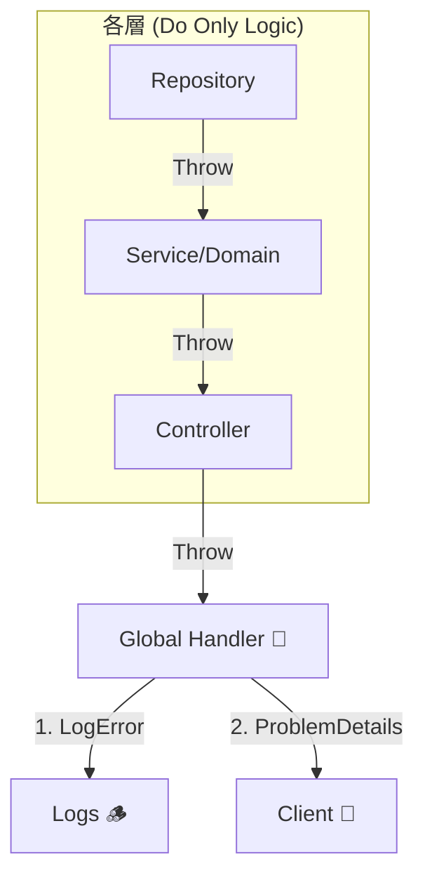
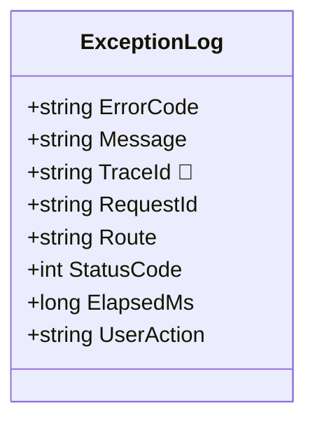

# 第12章：例外ログ設計💥🧯（スタックトレースだけにしない）

> この章のゴール🎯：**障害が起きた瞬間に「次の一手」が分かる例外ログ**を、迷わず設計＆実装できるようになること✨
> ※ .NET の `ILogger` は**構造化ログ**（プロパティ付きログ）を前提にした設計ができます。 ([Microsoft Learn][1])

---

## 1) まず大前提：スタックトレースは“地図”だけど、住所がない🗺️🏠

例外ログでありがちな失敗👇😇💦

* ❌ 「`NullReferenceException` 出た！スタックトレース貼った！」で終わり
  → **どのユーザーの、どの操作で、どの入力で**起きたのか不明😵
* ❌ 例外を**あちこちで catch して全部 LogError**
  → 同じ例外が**3回出て**、ノイズ地獄🌪️
* ❌ メッセージが毎回違う（文字列連結）
  → 検索も集計もできなくて泣く😭

この章では、こうします👇✨
✅ **「1回だけ、適切な場所で」**ログを残す
✅ **メッセージは短く、情報はプロパティで**（構造化）
✅ **“調査に必要な文脈”を必須項目として固定**

---

## 2) 例外を2種類に分けよう（ここ超重要）✂️✨

例外って全部同じじゃないよ〜！分類すると楽になるよ〜！🧸💡

### A. 期待される例外（想定内）🙂

* バリデーション失敗（入力が変）
* 見つからない（404 的なやつ）
* 業務ルール違反（「残高不足」など）

👉 **アプリの“仕様”で起こり得る**
👉 毎回 `Error` にするとアラートが鳴りっぱなし🚨💥

### B. 期待されない例外（想定外）😱

* バグ（null、範囲外、未対応）
* 外部障害の波及（タイムアウト連発）
* 設定ミス、壊れたデータ、など

👉 **本気で調査・対応が必要**
👉 `Error`（場合により `Critical`）でOK🔥

---

## 3) 「どこでログる？」は原則ひとつ：入口で1回だけ🚪🧯


おすすめの基本戦略👇

* ✅ **HTTP API の“入口付近”で例外をまとめて捕まえる**（グローバル例外ハンドリング）
* ✅ そこで **1回だけ** `LogError(ex, "...")`
* ✅ それ以外の層（業務ロジック、Repository）では
  **例外を握りつぶさず投げる**（必要なら“意味のある例外”に変換して投げる）🎯

ASP.NET Core は例外ハンドリング用の仕組みが用意されていて、`UseExceptionHandler` や `IExceptionHandler` で一元化できます。 ([Microsoft Learn][2])
さらに `IExceptionHandler` は DI で複数登録でき、登録順に呼ばれます。 ([Microsoft Learn][2])



---

## 4) 例外ログの「必須項目テンプレ」🧾✨（これ作れば勝ち）


### ✅ 最低限これだけは固定（必須）✅

* `errorCode`：自分たちのエラーコード（例：`PAYMENT_INSUFFICIENT_FUNDS`）
* `exceptionType`：例外型名（例：`TimeoutException`）
* `message`：短い要約（1行）
* `traceId` / `spanId`：トレースとつなぐ鍵🔑（後の章で効いてくる）
* `requestId`：HTTPのリクエスト識別子
* `route` / `path` / `method`：どのAPI？
* `statusCode`：返したHTTPステータス
* `userAction`：ユーザーがやってた操作名（例：`Checkout`）
* `elapsedMs`：どれくらい時間かかった？

### 👍 あると調査が爆速（おすすめ）🚀

* `tenantId`（マルチテナントなら）
* `orderId` / `paymentId` などの**業務キー**（PIIじゃない範囲で）
* 外部I/O情報：`dependency`（例：`Stripe` / `Redis` / `SQL`）
* リトライ回数：`retryCount`

### 🚫 入れちゃダメ寄り（次章で詳しく！）🔒

* パスワード、トークン、Cookie、生の個人情報など
  （「マスク設計」は次の章でガッツリやるよ🫶）



---

## 5) ログレベル設計：例外 × “想定内/外”で決める🎚️✨

ざっくり指針👇（チームで表にして固定すると強い💪）

* 想定内（入力ミス等） → `Information` か `Warning`（頻度が高いなら `Info` 寄り）
* 想定内（業務ルール違反が多発） → `Warning`（仕様外の使われ方の兆候）
* 想定外（バグ/環境/外部障害） → `Error`
* サービスが落ちる級 → `Critical`

---

## 6) 実装：ProblemDetails + グローバル例外ハンドラ（王道）👑🧩

ASP.NET Core は API のエラー応答を **ProblemDetails（RFC 7807ベース）**で返せます。 ([Microsoft Learn][3])
`AddProblemDetails()` で一貫したエラー応答に寄せるのが流れです。 ([Microsoft Learn][4])

### 6-1) Program.cs（例：Minimal API）🧱

```csharp
using Microsoft.AspNetCore.Diagnostics;
using Microsoft.AspNetCore.Mvc;

var builder = WebApplication.CreateBuilder(args);

builder.Services.AddProblemDetails();
builder.Services.AddExceptionHandler<GlobalExceptionHandler>();

var app = builder.Build();

app.UseExceptionHandler(); // 例外をまとめて受ける（ProblemDetails にも変換）

app.MapGet("/work", () =>
{
    // わざと例外
    throw new InvalidOperationException("Boom!");
});

app.Run();
```

`IExceptionHandler` は **シングルトン**で動くので、状態を持たない（またはスレッドセーフ）にするのがコツだよ🧠✨ ([Microsoft Learn][2])

### 6-2) 例外ハンドラ本体（ログ＋返却）🧯

```csharp
using System.Diagnostics;
using Microsoft.AspNetCore.Diagnostics;
using Microsoft.AspNetCore.Mvc;

public sealed class GlobalExceptionHandler : IExceptionHandler
{
    private readonly ILogger<GlobalExceptionHandler> _logger;

    public GlobalExceptionHandler(ILogger<GlobalExceptionHandler> logger)
        => _logger = logger;

    public async ValueTask<bool> TryHandleAsync(
        HttpContext httpContext,
        Exception exception,
        CancellationToken cancellationToken)
    {
        // ここで “想定内/外” を判定（今回は例として全部想定外扱い）
        var traceId = Activity.Current?.TraceId.ToString() ?? httpContext.TraceIdentifier;
        var spanId  = Activity.Current?.SpanId.ToString();

        var errorCode = "UNEXPECTED_ERROR";

        _logger.LogError(exception,
            "Request failed {ErrorCode} {Method} {Path} {StatusCode} traceId={TraceId}",
            errorCode,
            httpContext.Request.Method,
            httpContext.Request.Path.Value,
            StatusCodes.Status500InternalServerError,
            traceId);

        httpContext.Response.StatusCode = StatusCodes.Status500InternalServerError;

        // クライアントには “安全な” 情報だけ返す（詳細はサーバ側ログへ）
        var problem = new ProblemDetails
        {
            Status = StatusCodes.Status500InternalServerError,
            Title = "サーバー側でエラーが発生しました🙇‍♀️",
            Detail = "しばらくしてからもう一度お試しください。",
            Type = "https://example.com/errors/unexpected",
            Instance = httpContext.Request.Path
        };

        // 連絡用のキーを返すと、問い合わせが爆速になる✨
        problem.Extensions["errorCode"] = errorCode;
        problem.Extensions["traceId"] = traceId;
        if (spanId is not null) problem.Extensions["spanId"] = spanId;

        await httpContext.Response.WriteAsJsonAsync(problem, cancellationToken);
        return true; // ここで処理完了（後続に渡さない）
    }
}
```

---

## 7) “二重ログ”を防ぐテク🎯（超大事）

* ✅ **グローバルで LogError するなら、下位層で LogError しない**
* ✅ 下位層では

  * 例外をそのまま投げる
  * もしくは **意味のある例外（ドメイン例外）に変換して投げる**
* ✅ どうしても下位層でログるなら
  `LogDebug` までにして、**最終的な Error は入口で1回**にする

---

## 8) トレースとつなげる：例外は“記録”できる🧵💥

OpenTelemetry では、スパンに例外を「記録」する（record）やり方が整理されています。 ([OpenTelemetry][5])
ログに `traceId` を入れておけば、**ログ→トレース**の行き来が超ラクになるよ🧭✨

---

## 9) ちょい最新トピック：.NET 10 の例外ハンドリング診断制御🆕🎛️

.NET 10 では、例外ハンドリングミドルウェアが「処理済み例外」に対して診断出力するかを、`ExceptionHandlerOptions.SuppressDiagnosticsCallback` で制御できるようになっています。 ([Microsoft Learn][2])
（“想定内例外が多いAPI”だと、ここでノイズ対策がしやすくなるイメージ✨）

---

## 10) ミニ演習①：例外ログテンプレを作ろう🧾🖊️

次のフォーマットで、あなたの題材アプリ版を埋めてみてね👇✨

* **メッセージ（固定文）**：
  `Request failed {ErrorCode} {Operation} {Method} {Path} {StatusCode}`
* **必須プロパティ**：
  `errorCode, operation, method, path, statusCode, traceId, requestId, elapsedMs`
* **状況別プロパティ**：

  * DBなら `dbStatementName`（クエリ文字列そのものは避けがち）
  * 外部APIなら `dependency, timeoutMs, retryCount`

できたら「検索するときのキーは何？」を考えると完成度UPだよ🔍✨

---

## 11) ミニ演習②：3パターンの例外を作ってログ比較👀🧪

1. 入力ミス（想定内）🙂
2. 外部APIタイムアウト（想定外寄り）😵
3. バグ（想定外）😱

それぞれで👇を比べてみてね✨

* ログレベルは適切？
* `errorCode` で集計できる？
* `traceId` で追える？
* 1リクエストにつき Error が1回だけ？

---

## 12) AI活用🤖✨（Copilot/AI拡張に投げると強いプロンプト）

* 「このAPIの例外を *想定内/想定外* に分類して、**ログレベル**と**errorCode**案を表にして」📋✨
* 「この `IExceptionHandler` のログに、**調査に必要なプロパティ**が足りてるかレビューして。足りない項目を提案して」🔍
* 「“ログは構造化”前提で、メッセージ固定＋プロパティ案を作って」🧱

※ ただし「個人情報や秘密情報をログに入れない」方向でレビューさせてね🔒（次章で完全武装するよ🛡️）

---

## まとめ：第12章のチェックリスト✅✨

* [ ] 例外を **想定内/想定外** に分類できた🙂😱
* [ ] **入口で1回だけ**例外ログを出す設計になった🚪🧯
* [ ] `errorCode` と `traceId` が必須になった🔑
* [ ] ログが **構造化**（プロパティ）になった🧱
* [ ] クライアント返却は **ProblemDetails** で統一できた📦 ([Microsoft Learn][4])
* [ ] “次の一手”が分かるログになった🕵️‍♀️✨

---

必要なら、この章の内容を題材アプリ（/health, /work, わざと失敗ルート）に合わせて、**「想定内例外クラス（Validation/NotFound/BusinessRule）を作って、ログとProblemDetailsを出し分ける」**ところまで、完成形のサンプル一式にして出すよ〜🧩💖

[1]: https://learn.microsoft.com/en-us/dotnet/core/extensions/logging?utm_source=chatgpt.com "Logging in C# - .NET"
[2]: https://learn.microsoft.com/en-us/aspnet/core/fundamentals/error-handling?view=aspnetcore-10.0&utm_source=chatgpt.com "Handle errors in ASP.NET Core"
[3]: https://learn.microsoft.com/en-us/aspnet/core/web-api/?view=aspnetcore-10.0&utm_source=chatgpt.com "Create web APIs with ASP.NET Core"
[4]: https://learn.microsoft.com/en-us/aspnet/core/fundamentals/error-handling-api?view=aspnetcore-10.0&utm_source=chatgpt.com "Handle errors in ASP.NET Core APIs"
[5]: https://opentelemetry.io/docs/languages/dotnet/traces/reporting-exceptions/?utm_source=chatgpt.com "Reporting exceptions - Traces"
