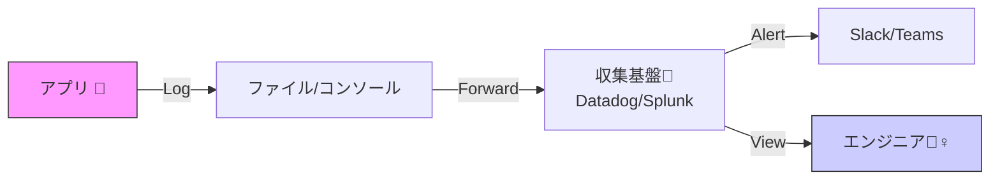

# 第13章：個人情報・秘密情報の扱い🔒🫣（マスキング設計）

## 今回のゴール🎯✨

この章を終えると…👇

* 「ログに**出しちゃダメ**」を自分で判断できる🚫
* **NG一覧（禁止リスト）**と**マスクルール**をチームに説明できる📄✨
* .NET 10 / C# 14 で「**仕組みで漏れにくくする**」設定ができる🛡️（C# 14 は .NET 10 対応の最新リリースだよ🧡） ([Microsoft Learn][1])

---

## 1) なんでこんなに大事？😱💥（ログは“コピーされる前提”）


ログって便利だけど、同時に**流通しやすい情報**でもあるよね📦💨

* 収集基盤に送られる📡
* 誰かが検索して貼る🔍📋
* チケットに添付される🎫
* 外部委託先に渡ることもある🤝

だから「一度出たら戻せない」前提で、**最初から安全に設計**しよ〜！🛡️✨



---

## 2) まず作る！NG一覧（出しちゃダメ表）🚫🧾

OWASP も「ログには直接入れず、削除/マスク/ハッシュ/暗号化を検討してね」ってはっきり言ってるよ👇 ([OWASPチートシートシリーズ][2])

特に危険なのはこれ👇（最優先でNGに入れよう🔥）

* 🔑 **パスワード**
* 🎟️ **アクセストークン** / セッションID
* 🔌 **DB接続文字列（接続情報）**
* 🗝️ **暗号鍵・秘密鍵・その他の主要シークレット**
* 💳 **カード/銀行口座など決済系**
* 🩺 **センシティブ個人情報（健康・政府IDなど）** ([OWASPチートシートシリーズ][2])

### NG一覧を3色にすると超わかりやすい🌈✨

* 🔴 **絶対ログ禁止**：パスワード / トークン / 鍵 / 接続文字列 / 決済情報
* 🟡 **原則出さない（必要なら加工）**：メール、電話、住所、氏名、IP、ファイルパス
* 🟢 **出してOK（でも最小限）**：内部ID（連番IDなど）、処理名、結果、時間、ステータス

---

## 3) マスキング設計の基本4パターン🧰✨（どれを選ぶ？）

「隠す」っていっても方法はいろいろ。目的で使い分けようね🧠💡

### A. そもそも“出さない”🧹✅（最強）

* 例：`Authorization` ヘッダー、Cookie、passwordフィールド
* **おすすめ度：★★★★★**（迷ったらこれ！）

### B. “一部だけ残す”✂️👀（末尾だけ、ドメインだけ）

* 例：カード番号 → 下4桁だけ `**** **** **** 1234`
* 例：メール → `k***@example.com`（ユーザー部だけ隠す）

### C. “ハッシュ化”🍳🔁（同一人物を追いたい時に便利）

* 例：ユーザー識別子を `SHA-256 + salt` でハッシュ化
* ✅ 「同じ人かどうか」だけ追える
* ⚠️ salt なしハッシュは推測されやすいので注意！

### D. “別名（トークン化）”🎭✨（復元できる仕組み）

* 例：ログには `user_ref=U-9F3A...` だけ、元データは別の安全な保管場所
* セキュリティ要求が高い時に採用されやすい🛡️

---

## 4) 漏れポイントあるある😵‍💫（ここが事故りやすい！）

### ① HTTPの“全部ログ”📮💥

HTTPログは便利だけど、**PIIが入りやすい**ので注意って Microsoft も警告してるよ⚠️ ([Microsoft Learn][3])
特に危ない：

* クエリ文字列（`?email=...` とか）
* ヘッダー（Authorization / Cookie / X-Api-Key）
* ボディ（住所・氏名・パスワードが入ってること多い）

### ② 例外ログ💥🧯

* 例外メッセージに入力値が混ざる
* 外部APIのレスポンスを丸ごと吐いちゃう
* “デバッグ用に全部Dump” がそのまま本番へ😇➡️😱

### ③ 構造化ログで「オブジェクト丸ごと」📦🪵

* `logger.LogInformation("user={User}", user)` みたいにすると
  userの中にメール/電話/住所が入ってて**まとめて流出**しがち🥲

---

## 5) .NET 10で“仕組み”にする🛡️✨（おすすめ2本立て）

### 5-1) HTTPログは「許可したヘッダーだけ表示」方式にする✅

ASP.NET Core の HTTP logging は、**指定したヘッダー名だけ値をログに出して、それ以外は [Redacted] にする**設計になってるよ👍✨ ([Microsoft Learn][3])
つまり、方針はこれ👇

* ✅ ログに出していいヘッダーだけ `RequestHeaders` / `ResponseHeaders` に追加
* 🚫 それ以外（Authorization など）は基本 `[Redacted]` のまま

※ HTTP Logging は PII をログに含む可能性があるから注意、って明記されてるよ⚠️ ([Microsoft Learn][3])

サンプル（必要最低限の考え方）👇

```csharp
using Microsoft.AspNetCore.HttpLogging;

var builder = WebApplication.CreateBuilder(args);

builder.Services.AddHttpLogging(o =>
{
    // 「全部ログ」は事故りやすいので、最小から始めるのがおすすめ
    o.LoggingFields = HttpLoggingFields.RequestPropertiesAndHeaders
                    | HttpLoggingFields.ResponsePropertiesAndHeaders;

    // “安全だと判断したヘッダー名だけ” 値を出す（許可リスト方式）
    o.RequestHeaders.Add("User-Agent");
    o.RequestHeaders.Add("X-Request-Id"); // 自分で付けてる相関IDなど
    // o.RequestHeaders.Add("Authorization"); // ←これは絶対NG❌

    o.ResponseHeaders.Add("Content-Type");
});

var app = builder.Build();
app.UseHttpLogging();
app.MapGet("/", () => "ok");
app.Run();
```

### 5-2) 「ログに出す前に自動マスク」もできる🔧✨（Redaction）

.NET には **データ編集（Redaction）**の仕組みが用意されてて、
ログに機密情報が混ざるのを減らせるよ🧤✨ ([Microsoft Learn][4])

Microsoft のドキュメントでも
「個人データ・資格情報・財務情報はプレーンテキストでログに書くべきじゃない」
ってはっきり書いてあるよ⚠️ ([Microsoft Learn][4])

ざっくり流れ👇（考え方が超大事🧠✨）

1. Redaction のパッケージ導入（`Microsoft.Extensions.Compliance.Redaction`） ([Microsoft Learn][4])
2. ログパイプラインに Redaction を有効化（例：`EnableRedaction()`） ([Microsoft Learn][4])
3. 「どれが機密か」を分類してマークする ([Microsoft Learn][4])

---

## 6) 演習✍️✨（ここが“身につく”ポイント！）

### 演習1：NG一覧＆マスクルールを作る🚫🧾

あなたの題材アプリで、次を埋めてね👇

* 🔴 絶対禁止（ログに出したら即アウト）
* 🟡 加工すればOK（どう加工？）
* 🟢 OK（でも最小限）

例（テンプレ）📝

* Email：🟡 `k***@example.com` にする
* UserId：🟢 内部IDはOK（ただし連番は漏洩時に推測されやすい→必要ならハッシュ🍳）
* Token：🔴 絶対禁止（長さや先頭数文字も原則出さない）

### 演習2：ダメログをリライト✍️😱➡️😇

次のログ、どこが危ない？どう直す？（3つ見つけたら勝ち🏆）

```csharp
logger.LogInformation("login ok email={Email} password={Password}", email, password);
logger.LogError(ex, "failed: token={Token}", token);
logger.LogInformation("request body={Body}", requestBody);
```

ヒント💡：OWASPの「Data to exclude」にほぼ載ってるやつが混ざってるよ🔥 ([OWASPチートシートシリーズ][2])

### 演習3：事故を“テストで止める”🧪🛑

* ✅ ログ出力をテストで捕まえる（テスト用Logger/シンクを使う）
* ✅ 「`password=` が含まれたら落ちる」みたいなルールテストを1本入れる
* ✅ さらに `rg`（ripgrep）で `password|token|authorization` と `Log` をセット検索して棚卸し🔍✨（CIでやると最強）

---

## 7) OpenTelemetryでも同じ発想🧵⚠️（“明示的に許可したものだけ”）

OpenTelemetry のHTTPセマンティック規約でも、
**ヘッダーを全部取るのはセキュリティリスク**だから「どのヘッダーを取るかは明示設定を要求すべき」って書いてあるよ📌 ([OpenTelemetry][5])

つまり、ログもトレース属性も同じで👇

* ✅ 取っていいものだけ許可（Allowlist）
* 🚫 それ以外は取らない/赤塗り（Redact）

---

## 8) AI活用コーナー🤖✨（Copilot/Codex向けプロンプト例）

そのままコピペでOKだよ〜🧡

* 🔍 **ログ棚卸し**
  「このリポジトリの `LogInformation/LogError` を全部列挙して、PII/Secretsが混ざる可能性がある箇所を危険度つきで指摘して。代替のログ項目案も出して」

* 🧾 **NG一覧ドラフト作成**
  「このアプリの入力項目（DTO）一覧から、ログに出してよい/だめ/加工すればよい、を分類して表にして」

* 🧪 **テスト生成**
  「ログ出力に `password` `token` `connection string` が含まれないことを検証するユニットテストを提案して（xUnit想定）」

---

## まとめ🎉✨（この章の“持ち帰り”）

* ログは「便利」だけど「漏れる前提」📦💨
* **NG一覧（禁止）＋マスクルール（加工）**が設計の中心🧠✨
* .NET 側も「PIIを含む可能性がある」って警告してるので、HTTPログは特に慎重に⚠️ ([Microsoft Learn][3])
* Allowlist（許可リスト）で守るのがいちばん強い🛡️
* OpenTelemetryでも「ヘッダー全部キャプ採りは危険」思想は同じだよ⚠️ ([OpenTelemetry][5])

---

次の第14章（ログの“粒度”設計🍚✨）では、
「安全」だけじゃなくて「**調査に足りるのに、ノイズは少ない**」ちょうどいい量に整えていくよ〜🕵️‍♀️🔍✨

[1]: https://learn.microsoft.com/en-us/dotnet/csharp/whats-new/csharp-14?utm_source=chatgpt.com "What's new in C# 14"
[2]: https://cheatsheetseries.owasp.org/cheatsheets/Logging_Cheat_Sheet.html "Logging - OWASP Cheat Sheet Series"
[3]: https://learn.microsoft.com/en-us/aspnet/core/fundamentals/http-logging/?view=aspnetcore-10.0 "HTTP logging in .NET and ASP.NET Core | Microsoft Learn"
[4]: https://learn.microsoft.com/ja-jp/dotnet/core/extensions/data-redaction ".NET でのデータの編集 - .NET | Microsoft Learn"
[5]: https://opentelemetry.io/docs/specs/semconv/http/http-spans/ "Semantic conventions for HTTP spans | OpenTelemetry"
